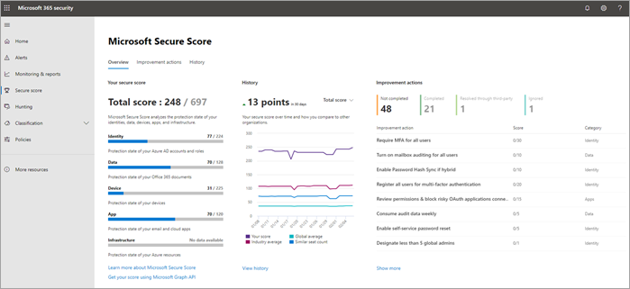
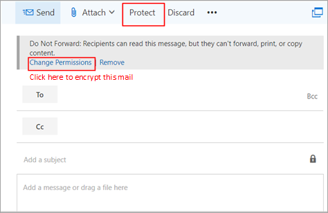

# As 10 maneiras principais de proteger os planos do Microsoft 365 for BusinessTop 10 ways to secure Microsoft 365 for business plans

::: moniker range="o365-21vianet"

> [!NOTE]
> O centro de administração está mudando.The admin center is changing. Se a sua experiência não corresponder aos detalhes apresentados aqui, consulte [Sobre o novo centro de administração do Microsoft 365](https://docs.microsoft.com/microsoft-365/admin/microsoft-365-admin-center-preview?view=o365-21vianet).If your experience doesn't match the details presented here, see [About the new Microsoft 365 admin center](https://docs.microsoft.com/microsoft-365/admin/microsoft-365-admin-center-preview?view=o365-21vianet).

::: moniker-end

Se você é uma organização pequena ou média, usando um dos planos de negócios da Microsoft e seu tipo de organização é direcionado a criminosos virtuais e hackers, use as orientações deste artigo para aumentar a segurança da sua organização.If you are a small or medium-size organization using one of Microsoft's business plans and your type of organization is targeted by cyber criminals and hackers, use the guidance in this article to increase the security of your organization. Esta orientação ajuda sua organização a atingir as metas descritas no manual de [campanha do cybersecurity da](https://go.microsoft.com/fwlink/?linkid=2015598&amp;clcid=0x409)faculdade do Harvard Kennedy.This guidance helps your organization achieve the goals described in the Harvard Kennedy School [Cybersecurity Campaign Handbook](https://go.microsoft.com/fwlink/?linkid=2015598&amp;clcid=0x409).
  
A Microsoft recomenda que você conclua as tarefas listadas na tabela a seguir que se aplicam ao seu plano de serviço.Microsoft recommends that you complete the tasks listed in the following table that apply to your service plan. 
  
||**Tarefa****Task**|**Microsoft 365 Business Standard****Microsoft 365 Business Standard**|**Microsoft 365 Business Premium****Microsoft 365 Business Premium**|
|:-----|:-----|:-----|:-----|
|1 1    |[Configurar autenticação multifatorialSet up multi-factor authentication](secure-your-business-data.md#setup)   |             |             |
|duas2    |[Treinar os usuáriosTrain your users](secure-your-business-data.md#train)   |             |             |
|3D3    |[Usar contas de administrador dedicadasUse dedicated admin accounts](secure-your-business-data.md#admin)   |             |             |
|4 4    |[Aumentar o nível de proteção contra malware no emailRaise the level of protection against malware in mail](secure-your-business-data.md#malware)   |             |             |
|5 5    |[Proteção contra ransomwareProtect against ransomware](secure-your-business-data.md#ransomware)   |             |             |
|6 6    |[Parar o encaminhamento automático para emailStop auto-forwarding for email](secure-your-business-data.md#forwarding)   |             |             |
|7 7    |[Usar a criptografia de mensagem do OfficeUse Office Message Encryption](secure-your-business-data.md#encryption)   ||             |
|8 8    |[Proteger seu email contra ataques de phishingProtect your email from phishing attacks](secure-your-business-data.md#phishing)   ||             |
|9 9    |[Proteger contra anexos e arquivos mal-intencionados com anexos seguros de ATPProtect against malicious attachments and files with ATP Safe Attachments](secure-your-business-data.md#atp)   ||             |
|10 10    |[Proteger contra ataques de phishing com links seguros de ATPProtect against phishing attacks with ATP Safe Links](secure-your-business-data.md#phishingatp)   ||             |
   
Antes de começar, verifique sua pontuação de segurança do [microsoft 365](https://docs.microsoft.com/microsoft-365/security/mtp/microsoft-secure-score) na central de segurança do Microsoft 365.Before you begin, check your [Microsoft 365 Secure Score](https://docs.microsoft.com/microsoft-365/security/mtp/microsoft-secure-score) in the Microsoft 365 security center. A partir de um painel centralizado, você pode monitorar e aprimorar a segurança de suas identidades, dados, aplicativos, dispositivos e infraestrutura do Microsoft 365.From a centralized dashboard, you can monitor and improve the security for your Microsoft 365 identities, data, apps, devices, and infrastructure. Você receberá pontos para configurar os recursos de segurança recomendados, executar tarefas relacionadas à segurança (como exibir relatórios) ou endereçar recomendações com aplicativos ou software de terceiros.You are given points for configuring recommended security features, performing security-related tasks (such as viewing reports), or addressing recommendations with a third-party application or software. Com informações adicionais e mais visibilidade de um conjunto mais amplo de produtos e serviços da Microsoft, você pode se sentir com o relatório de confiança sobre a integridade de segurança da sua organização.With additional insights and more visibility into a broader set of Microsoft products and services, you can feel confident reporting about your organization's security health.
  

  
## 1: configurar a autenticação multifator1: Set up multi-factor authentication

O uso da autenticação multifator é uma das maneiras mais fáceis e eficazes de aumentar a segurança da sua organização.Using multi-factor authentication is one of the easiest and most effective ways to increase the security of your organization. É mais fácil do que parece, quando você faz logon, a autenticação multifator significa que você digitará um código de seu telefone para obter acesso ao Microsoft 365.It's easier than it sounds - when you log in, multi-factor authentication means you'll type a code from your phone to get access to Microsoft 365. Isso pode impedir que hackers assumam o controle se souberem sua senha.This can prevent hackers from taking over if they know your password. A autenticação multifator também é chamada de verificação em duas etapas.Multi-factor authentication is also called 2-step verification. As pessoas podem adicionar a verificação em duas etapas à maioria das contas com facilidade, por exemplo, às contas do Google ou do Microsoft.Individuals can add 2-step verification to most accounts easily, for example, to their Google or Microsoft accounts. Confira aqui como [Adicionar a verificação em duas etapas à sua conta pessoal da Microsoft](https://go.microsoft.com/fwlink/?linkid=2016403&amp;clcid=0x409).Here's how to [add two-step verification to your personal Microsoft account](https://go.microsoft.com/fwlink/?linkid=2016403&amp;clcid=0x409).
  
Para empresas que usam o Microsoft 365, adicione uma configuração que exija que os usuários façam logon usando a autenticação multifator.For businesses using Microsoft 365, add a setting that requires your users to log in using multi-factor authentication. Quando você fizer essa alteração, os usuários serão solicitados a configurar seu telefone para a autenticação de dois fatores na próxima vez em que fizerem logon.When you make this change, users will be prompted to set up their phone for two-factor authentication next time they log in.
Para ver um vídeo de treinamento sobre como configurar a MFA e como os usuários concluem a configuração, consulte [set up MFA](https://support.office.com/article/e12187b8-216a-4490-9e3b-df34a06fb787) and [User set up](https://support.office.com/article/a32541df-079c-420d-9395-9d59354f7225).To see a training video for how to set up MFA and how users complete the set up, see [set up MFA](https://support.office.com/article/e12187b8-216a-4490-9e3b-df34a06fb787) and [user set up](https://support.office.com/article/a32541df-079c-420d-9395-9d59354f7225).
  
Para configurar a autenticação multifator:To set up multi-factor authentication:

1. No [centro de administração](https://go.microsoft.com/fwlink/p/?linkid=834822), selecione usuários ativos do **usuário**  >  **Active Users**.In the [admin center](https://go.microsoft.com/fwlink/p/?linkid=834822), select **Users** > **Active Users**.

2. Na seção **usuários ativos** , selecione **autenticação multifator**.In the **Active Users** section, select  **Multi-Factor Authentication**.

3. Na página **autenticação multifator** , selecione **usuário** se estiver habilitando-o para um usuário ou se você puder executar uma **atualização em massa**.On the **Multi-Factor Authentication** page, select **User** if you are enabling this for one user Or you can perform a **Bulk Update**.

4. Selecione **habilitar** em **etapas rápidas**.Select **Enable** under **Quick Steps**.

5. Na janela pop-up, escolha **habilitar autenticação multifator**.In the pop-up window, choose **Enable Multi-Factor Authentication**.

Após configurar a autenticação multifator da sua organização, os usuários precisarão configurar a verificação em duas etapas em seus dispositivos.After you set up multi-factor authentication for your organization, your users will be required to set up two-step verification on their devices. Para obter mais informações, consulte [Configurar a verificação em duas etapas para o Microsoft 365](https://support.office.com/article/ace1d096-61e5-449b-a875-58eb3d74de14).For more information, see [Set up 2-step verification for Microsoft 365](https://support.office.com/article/ace1d096-61e5-449b-a875-58eb3d74de14).
  
Para obter detalhes completos e recomendações completas, consulte [Configurar a autenticação multifator para usuários](set-up-multi-factor-authentication.md).For full details and complete recommendations, see [Set up multi-factor authentication for users](set-up-multi-factor-authentication.md).
  
## 2: treinar os usuários2: Train your users

O [manual de campanha](https://go.microsoft.com/fwlink/?linkid=2015598&amp;clcid=0x409) da Harvard Kennedy School cybersecurity fornece orientações excelentes sobre o estabelecimento de uma grande cultura de reconhecimento de segurança em sua organização, incluindo o treinamento de usuários para identificar ataques de phishing.The Harvard Kennedy School [Cybersecurity Campaign Handbook](https://go.microsoft.com/fwlink/?linkid=2015598&amp;clcid=0x409) provides excellent guidance on establishing a strong culture of security awareness within your organization, including training users to identify phishing attacks. 
  
Além desta orientação, a Microsoft recomenda que os usuários executem as ações descritas neste artigo: [proteja sua conta e seus dispositivos contra hackers e malware](https://support.office.com/article/066d6216-a56b-4f90-9af3-b3a1e9a327d6.aspx).In addition to this guidance, Microsoft recommends that your users take the actions described in this article: [Protect your account and devices from hackers and malware](https://support.office.com/article/066d6216-a56b-4f90-9af3-b3a1e9a327d6.aspx). Essas ações incluem:These actions include:
  
- Usando senhas fortesUsing strong passwords
    
- Protegendo dispositivosProtecting devices
    
- Habilitar recursos de segurança nos PCs com Windows 10 e MacEnabling security features on Windows 10 and Mac PCs
    
A Microsoft também recomenda que os usuários protejam suas contas de email pessoais executando as ações recomendadas nos seguintes artigos:Microsoft also recommends that users protect their personal email accounts by taking the actions recommended in the following articles:
  
- [Ajudar a proteger sua conta de email do Outlook.comHelp protect your Outlook.com email account](https://support.microsoft.com/en-us/office/help-protect-your-outlook-com-email-account-a4f20fc5-4307-4ece-8231-6d4d4bd8a9ba)
    
- [Proteger sua conta do Gmail com a verificação em duas etapasProtect your Gmail account with 2-step verification](https://go.microsoft.com/fwlink/?linkid=2015688&amp;clcid=0x409)
    
## 3: usar contas de administrador dedicadas3: Use dedicated admin accounts

As contas administrativas que você usa para administrar seu ambiente do Microsoft 365 incluem privilégios elevados.The administrative accounts you use to administer your Microsoft 365 environment include elevated privileges. Estes são alvos valiosos para hackers e criminosos virtuais.These are valuable targets for hackers and cyber criminals. Use contas de administrador somente para administração.Use admin accounts only for administration. Os administradores devem ter uma conta de usuário separada para uso regular e não administrativo e só usarem a conta administrativa, quando necessário, para concluir uma tarefa associada à função de trabalho.Admins should have a separate user account for regular, non-administrative use and only use their administrative account when necessary to complete a task associated with their job function. Recomendações adicionais:Additional recommendations:
  
- Certifique-se de que as contas de administrador também estão definidas para a autenticação multifator.Be sure admin accounts are also set up for multi-factor authentication. 
    
- Antes de usar contas de administrador, feche todas as sessões de navegador não relacionadas e aplicativos, incluindo contas de email pessoais.Before using admin accounts, close out all unrelated browser sessions and apps, including personal email accounts.
    
- Após concluir as tarefas de administração, não deixe de fazer logout da sessão do navegador.After completing admin tasks, be sure to log out of the browser session.
    
## 4: elevar o nível de proteção contra malware no email4: Raise the level of protection against malware in mail

Seu ambiente do Microsoft 365 inclui proteção contra malware, mas você pode aumentar essa proteção, bloqueando anexos com tipos de arquivo comumente usados para malware.Your Microsoft 365 environment includes protection against malware, but you can increase this protection by blocking attachments with file types that are commonly used for malware. Para resumir a proteção contra malware em email, veja um [pequeno vídeo de treinamento](https://support.office.com/article/02b5783a-eea0-42e8-8856-62440718c3f0)ou conclua as seguintes etapas:To bump up malware protection in email, view a [short training video](https://support.office.com/article/02b5783a-eea0-42e8-8856-62440718c3f0), or complete the following steps:
  
1. Acesse [https://protection.office.com](https://protection.office.com) e entre com suas credenciais de conta de administrador.Go to [https://protection.office.com](https://protection.office.com) and sign in with your admin account credentials. 
    
2. No centro de &amp; conformidade de segurança, no painel de navegação esquerdo, em **Gerenciamento de ameaças**, escolha **política** \> **anti-malware**.In the Security &amp; Compliance Center, in the left navigation pane, under **Threat management**, choose **Policy** \> **Anti-Malware**.
    
3. Clique duas vezes na política padrão para editar a política em toda a empresa.Double-click the default policy to edit this company-wide policy.
    
4. Selecione **Configurações**.Select **Settings**.
    
5. Em **filtro tipos de anexo comuns**, selecione **ativado**.Under **Common Attachment Types Filter**, select **On**. Os tipos de arquivo bloqueados são listados na janela diretamente abaixo desse controle.The file types that are blocked are listed in the window directly below this control. Você pode adicionar ou excluir tipos de arquivo posteriormente, se necessário.You can add or delete file types later, if needed.
    
6. Selecione **salvar.**Select **Save.**
    
Para obter mais informações, consulte [proteção Antimalware](https://go.microsoft.com/fwlink/?linkid=2015692&amp;clcid=0x409).For more information, see [Anti-malware protection](https://go.microsoft.com/fwlink/?linkid=2015692&amp;clcid=0x409).
  
## 5: proteger contra o ransomware5: Protect against ransomware

O ransomware restringe o acesso aos dados criptografando arquivos ou bloqueando telas de computador.Ransomware restricts access to data by encrypting files or locking computer screens. Em seguida, tenta extort dinheiro de vítimas solicitando "resgate", geralmente na forma de cryptocurrencies como Bitcoin, no Exchange para acessar os dados.It then attempts to extort money from victims by asking for "ransom," usually in form of cryptocurrencies like Bitcoin, in exchange for access to data. 
  
Você pode se proteger contra o ransomware criando uma ou mais regras de fluxo de emails para bloquear extensões de arquivo comumente usadas para ransomware ou avisar os usuários que recebem esses anexos por email.You can protect against ransomware by creating one or more mail flow rules to block file extensions that are commonly used for ransomware, or to warn users who receive these attachments in email. Um bom ponto de partida é criar duas regras:A good starting point is to create two rules:
  
- Avisar os usuários antes de abrir os anexos de arquivo do Office que incluem macros.Warn users before opening Office file attachments that include macros. O ransomware pode ser oculto dentro de macros, portanto, avisaremos os usuários para não abrir esses arquivos de pessoas que eles não conhecem.Ransomware can be hidden inside macros, so we'll warn users to not open these files from people they do not know. 
    
- Bloquear tipos de arquivo que podem conter ransomware ou outro código mal-intencionado.Block file types that could contain ransomware or other malicious code. Começaremos com uma lista comum de executáveis (listados na tabela abaixo).We'll start with a common list of executables (listed in the table below). Se sua organização usa qualquer um desses tipos de executáveis e você espera que eles sejam enviados por email, adicione-os à regra anterior (avisar os usuários).If your organization uses any of these executable types and you expect these to be sent in email, add these to the previous rule (warn users).
    
Para criar uma regra de transporte de email, exiba um [vídeo de treinamento curto](https://support.office.com/article/a9ecca03-42a6-4867-b9fd-38e3f6bb06ad)ou conclua as seguintes etapas:To create a mail transport rule, view a [short training video](https://support.office.com/article/a9ecca03-42a6-4867-b9fd-38e3f6bb06ad), or complete the following steps:
  
1. Vá até o <a href="https://go.microsoft.com/fwlink/p/?linkid=2059104" target="_blank">Centro de administração do Exchange</a>.Go to the <a href="https://go.microsoft.com/fwlink/p/?linkid=2059104" target="_blank">Exchange admin center</a>.

2. Na categoria **fluxo de emails** , selecione **regras**.In the **mail flow** category, select **rules**.
    
3. Selecione **+** e, em seguida, **crie uma nova regra**.Select **+**, and then **Create a new rule**.
    
4. Selecione \* \* \* \* na parte inferior da caixa de diálogo para ver o conjunto completo de opções.Select \*\*\*\* at the bottom of the dialog box to see the full set of options. 
    
5. Aplicar as configurações na tabela a seguir para cada regra.Apply the settings in the following table for each rule. Deixe o restante das configurações no padrão, a menos que você queira alterá-las.Leave the rest of the settings at the default, unless you want to change these.
    
6. Selecione **Salvar**.Select **Save**.
    
|**Configuração****Setting**|**Avisar os usuários antes de abrir anexos de arquivos do Office****Warn users before opening attachments of Office files**|**Bloquear tipos de arquivo que podem conter ransomware ou outro código mal-intencionado****Block file types that could contain ransomware or other malicious code**|
|:-----|:-----|:-----|
|NomeName    |Regra anti-ransomware: avisar os usuáriosAnti-ransomware rule: warn users    |Regra anti-ransomware: bloquear tipos de arquivoAnti-ransomware rule: block file types    |
|Aplicar esta regra se.Apply this rule if . .. ..    |Qualquer anexo.Any attachment . .. .. correspondências de extensão de arquivo.file extension matches . .. ..    |Qualquer anexo.Any attachment . .. .. correspondências de extensão de arquivo.file extension matches . .. ..    |
|Especificar palavras ou frasesSpecify words or phrases    |Adicione estes tipos de arquivos:Add these file types:    dotm, docm, xlsm, sltm, xla, xlam, XLL, pptm, potm, ppam, ppsm, sldmdotm, docm, xlsm, sltm, xla, xlam, xll, pptm, potm, ppam, ppsm, sldm    |Adicione estes tipos de arquivos:Add these file types:    Ade, ADP, Ani, Bas, bat, CHM, cmd, com, CPL, CRT, HLP, HT, HTA, inf, ins, ISP, Job, js, jse, lnk, o mdb, o MDE, o registro, o MSC, o (a) msp, o. exe, o, o, o VB, vbe, vbs,ade, adp, ani, bas, bat, chm, cmd, com, cpl, crt, hlp, ht, hta, inf, ins, isp, job, js, jse, lnk, mda, mdb, mde, mdz, msc, msi, msp, mst, pcd, reg, scr, sct, shs, url, vb, vbe, vbs, wsc, wsf, wsh, exe, pif    |
|Faça o seguinte.Do the following . .. ..    |Notificar o destinatário com uma mensagemNotify the recipient with a message    |Bloquear a mensagem.Block the message . .. .. rejeitar a mensagem e incluir uma explicaçãoreject the message and include an explanation    |
|Fornecer texto da mensagemProvide message text    |Não abra esses tipos de arquivos, a menos que você esteja esperando eles — porque os arquivos podem conter código mal-intencionado e saber que o remetente não é uma garantia de segurança.Do not open these types of files—unless you were expecting them—because the files may contain malicious code and knowing the sender isn't a guarantee of safety.    ||
   
> [!TIP]
> Você também pode adicionar os arquivos que deseja bloquear à lista Antimalware na [etapa 4](#4-raise-the-level-of-protection-against-malware-in-mail).You can also add the files you want to block to the Anti-malware list in [step 4](#4-raise-the-level-of-protection-against-malware-in-mail).

Para saber mais, confira:For more information, see:
  
- [Como lidar com o ransomwareHow to deal with ransomware](https://go.microsoft.com/fwlink/?linkid=2016501&amp;clcid=0x409)
    
- [Restaurar o OneDriveRestore your OneDrive](https://support.office.com/article/fa231298-759d-41cf-bcd0-25ac53eb8a15.aspx)
    
## 6: parar o encaminhamento automático para email6: Stop auto-forwarding for email

Hackers que obtêm acesso à caixa de correio de um usuário podem Exfiltrate emails Configurando a caixa de correio para encaminhar emails automaticamente.Hackers who gain access to a user's mailbox can exfiltrate mail by configuring the mailbox to automatically forward email. Isso pode acontecer mesmo sem a conscientização do usuário.This can happen even without the user's awareness. Você pode evitar que isso aconteça Configurando uma regra de fluxo de emails.You can prevent this from happening by configuring a mail flow rule. 
  
Para criar uma regra de transporte de emails:To create a mail transport rule:
  
1. Vá até o <a href="https://go.microsoft.com/fwlink/p/?linkid=2059104" target="_blank">Centro de administração do Exchange</a>.Go to the <a href="https://go.microsoft.com/fwlink/p/?linkid=2059104" target="_blank">Exchange admin center</a>.

2. Na categoria **fluxo de emails** , selecione **regras**.In the **mail flow** category, select **rules**.
    
3. Selecione **+** e, em seguida, **crie uma nova regra**.Select **+**, and then **Create a new rule**.
    
4. Selecione **mais opções** na parte inferior da caixa de diálogo para ver o conjunto completo de opções.Select **More options** at the bottom of the dialog box to see the full set of options. 
    
5. Aplicar as configurações na tabela a seguir.Apply the settings in the following table. Deixe o restante das configurações no padrão, a menos que você queira alterá-las.Leave the rest of the settings at the default, unless you want to change these.
    
6. Selecione **Salvar**.Select **Save**.
    
|**Configuração****Setting**|**Rejeitar emails de encaminhamento automático para domínios externos****Reject Auto-Forward emails to external domains**|
|:-----|:-----|
|NomeName    |Impedir o encaminhamento automático de emails para domínios externosPrevent auto forwarding of email to external domains    |
|Aplicar esta regra se...Apply this rule if ...    |O remetente.The sender . .. .. é externo/interno.is external/internal . .. .. Dentro da organizaçãoInside the organization    |
|Adicionar condiçãoAdd condition    |O destinatário.The recipient . .. .. é externo/interno.is external/internal . .. .. Fora da organizaçãoOutside the organization    |
|Adicionar condiçãoAdd condition    |As propriedades da mensagem.The message properties . .. .. inclua o tipo de mensagem.include the message type . .. .. Avanço automáticoAuto-forward    |
|Faça o seguinte...Do the following ...    |Bloquear a mensagem.Block the message . .. .. rejeitar a mensagem e incluir uma explicação.reject the message and include an explanation.    |
|Fornecer texto da mensagemProvide message text    |O encaminhamento automático de emails fora dessa organização é impedido por motivos de segurança.Auto-forwarding email outside this organization is prevented for security reasons.    |
   
## 7: usar a criptografia de mensagem do Office7: Use Office Message Encryption

A criptografia de mensagem do Office está incluída no Microsoft 365.Office Message Encryption is included with Microsoft 365. Já está configurada.It's already set up. Com a criptografia de mensagem do Office, sua organização pode enviar e receber mensagens de email criptografadas entre pessoas dentro e fora da sua organização.With Office Message Encryption, your organization can send and receive encrypted email messages between people inside and outside your organization. A criptografia de mensagem do Office 365 funciona com o Outlook.com, Yahoo!, Gmail e outros serviços de email.Office 365 Message Encryption works with Outlook.com, Yahoo!, Gmail, and other email services. A criptografia de mensagens de email ajuda a garantir que somente os destinatários pretendidos possam exibir o conteúdo da mensagem.Email message encryption helps ensure that only intended recipients can view message content.
  
A criptografia de mensagem do Office fornece duas opções de proteção ao enviar emails:Office Message Encryption provides two protection options when sending mail:
  
- Não encaminharDo not forward
    
- EFSEncrypt
    
Sua organização pode ter configurado opções adicionais que aplicam um rótulo a emails, como confidenciais.Your organization might have configured additional options that apply a label to email, such as Confidential.
  
### Para enviar email protegidoTo send protected email

No Outlook para computador, selecione **Opções** no email e, em seguida, escolha **permissões**.In Outlook for PC, select **Options** in the email, and then choose **Permissions**. 
  

  
No Outlook.com, selecione **proteger** no email.In Outlook.com, select **Protect** in the email. A proteção padrão **não é encaminhada**.The default protection is **Do not forward**. Para alterar isso para criptografar, selecione **alterar permissões** \> **criptografar**.To change this to encrypt, select **Change Permissions** \> **Encrypt**. 
  

  
### Para receber emails criptografadosTo receive encrypted email

Se o destinatário tiver o Outlook 2013 ou o Outlook 2016 e uma conta de email da Microsoft, verá um alerta sobre as permissões restritas do item no painel de leitura.If the recipient has Outlook 2013 or Outlook 2016 and a Microsoft email account, they'll see an alert about the item's restricted permissions in the Reading pane. Após abrir a mensagem, o destinatário pode exibir a mensagem como qualquer outra.After opening the message, the recipient can view the message just like any other.
  
Se o destinatário estiver usando outro cliente de email ou conta de email, como o Gmail ou o Yahoo, ele verá um link que permite que eles entrem em ler a mensagem de email ou solicitar uma senha de uso único para exibir a mensagem em um navegador da Web.If the recipient is using another email client or email account, such as Gmail or Yahoo, they'll see a link that lets them either sign in to read the email message or request a one-time passcode to view the message in a web browser. Se os usuários não estiverem recebendo o email, peça que eles confiram a pasta spam ou lixo eletrônico.If users aren't receiving the email, have them check their Spam or Junk folder. 
  
Para obter mais informações, consulte [enviar, exibir e responder a mensagens criptografadas no Outlook para PC](https://support.microsoft.com/en-us/office/send-view-and-reply-to-encrypted-messages-in-outlook-for-pc-eaa43495-9bbb-4fca-922a-df90dee51980).For more information, see [Send, view, and reply to encrypted messages in Outlook for PC](https://support.microsoft.com/en-us/office/send-view-and-reply-to-encrypted-messages-in-outlook-for-pc-eaa43495-9bbb-4fca-922a-df90dee51980).
  
## 8. proteger seu email contra ataques de phishing8. Protect your email from phishing attacks

Se você configurou um ou mais domínios personalizados para seu ambiente do Microsoft 365, é possível configurar a proteção antiphishing dirigida.If you've configured one or more custom domains for your Microsoft 365 environment, you can configure targeted anti-phishing protection. A proteção antiphishing da ATP, parte da proteção avançada contra ameaças do Office 365, pode ajudar a proteger sua organização contra ataques de phishing baseados em representação mal-intencionada e outros ataques de phishing.ATP anti-phishing protection, part of Office 365 Advanced Threat Protection, can help protect your organization from malicious impersonation-based phishing attacks and other phishing attacks. Se você não configurou um domínio personalizado, não é necessário fazer isso.If you haven't configured a custom domain, you do not need to do this.
  
Recomendamos que você comece a usar essa proteção criando uma política para proteger seus usuários mais importantes e seu domínio personalizado.We recommend that you get started with this protection by creating a policy to protect your most important users and your custom domain. 
  

  
Para criar uma política anti-phishing do ATP, exiba um [vídeo de treinamento curto](https://support.office.com/article/86c425e1-1686-430a-9151-f7176cce4f2c)ou conclua as seguintes etapas:To create an ATP anti-phishing policy, view a [short training video](https://support.office.com/article/86c425e1-1686-430a-9151-f7176cce4f2c), or complete the following steps:
  
1. Acesse [https://protection.office.com](https://protection.office.com).Go to [https://protection.office.com](https://protection.office.com). 
    
2. No centro de &amp; conformidade de segurança, no painel de navegação esquerdo, em **Gerenciamento de ameaças**, selecione **política**.In the Security &amp; Compliance Center, in the left navigation pane, under **Threat management**, select **Policy**.
    
3. Na página política, selecione a **ATP anti-phishing**.On the Policy page, select **ATP anti-phishing**.
    
4. Na página anti-phishing, selecione **+ criar**.On the Anti-phishing page, select **+ Create**. Um assistente é iniciado que orienta você na definição da política anti-phishing.A wizard launches that steps you through defining your anti-phishing policy.
    
5. Especifique o nome, a descrição e as configurações da política, conforme recomendado na tabela abaixo.Specify the name, description, and settings for your policy as recommended in the chart below. Consulte [saiba mais sobre as opções de política de anti-phishing do ATP](https://go.microsoft.com/fwlink/?linkid=2016505&amp;clcid=0x409) para obter mais detalhes.See [Learn about ATP anti-phishing policy options](https://go.microsoft.com/fwlink/?linkid=2016505&amp;clcid=0x409) for more details. 
    
6. Depois de revisar suas configurações, selecione **criar esta política** ou **salvar**, conforme apropriado.After you have reviewed your settings, select **Create this policy** or **Save**, as appropriate.

|**Configuração ou opção****Setting or option**|**Configuração recomendada****Recommended setting**  |
|:-----|:-----|
|NomeName    |O domínio e a equipe de campanha mais valiosaDomain and most valuable campaign staff    |
|DescriçãoDescription    |Garantir que a equipe mais importante e nosso domínio não estão sendo representados.Ensure most important staff and our domain are not being impersonated.    |
|Adicionar usuários a protegerAdd users to protect    |Selecione **+ Adicionar uma condição, o destinatário é**.Select **+ Add a condition, The recipient is**. Digite nomes de usuário ou insira o endereço de email do candidato, o gerente de campanha e outros membros importantes da equipe.Type user names or enter the email address of the candidate, campaign manager, and other important staff members. Você pode adicionar até 20 endereços internos e externos que você deseja proteger da representação.You can add up to 20 internal and external addresses that you want to protect from impersonation.    |
|Adicionar domínios para protegerAdd domains to protect    |Selecione **+ Adicionar uma condição, o domínio do destinatário é**.Select **+ Add a condition, The recipient domain is**. Insira o domínio personalizado associado à sua assinatura do Microsoft 365, se você tiver definido um.Enter the custom domain associated with your Microsoft 365 subscription, if you defined one. Você pode inserir mais de um domínio.You can enter more than one domain.    |
|Escolher açõesChoose actions    |Se o email for enviado por um usuário representado: selecione **redirecionar mensagem para outro endereço de email**e digite o endereço de email do administrador de segurança; por exemplo, securityadmin@contoso.com.If email is sent by an impersonated user: select **Redirect message to another email address**, and then type the email address of the security administrator; for example, securityadmin@contoso.com.          Se o email for enviado por um domínio representado: selecione **mensagem de quarentena**.If email is sent by an impersonated domain: select **Quarantine message**.    |
|Inteligência da caixa de correioMailbox intelligence    |Por padrão, a caixa de correio é selecionada quando você cria uma nova política anti-phishing.By default, mailbox intelligence is selected when you create a new anti-phishing policy. Deixe essa configuração **Ativada** para obter melhores resultados.Leave this setting **On** for best results.    |
|Adicionar remetentes e domínios confiáveisAdd trusted senders and domains    |Neste exemplo, não defina nenhuma substituição.For this example, don't define any overrides.    |
|Aplicado aApplied to    |Selecione **O domínio do destinatário é**.Select **The recipient domain is**. Em **Qualquer um desses**, selecione **Escolher**.Under **Any of these**, select **Choose**. Selecione **+ Adicionar**.Select **+ Add**. Marque a caixa de seleção ao lado do nome do domínio, por exemplo, contoso.com, na lista e selecione **Adicionar**.Select the check box next to the name of the domain, for example, contoso.com, in the list, and then select **Add**. Selecione **Concluído**.Select **Done**.    |
|
   
Para obter mais informações, consulte [set up Office 365 ATP anti-phishing Policies](https://go.microsoft.com/fwlink/?linkid=2016505&amp;clcid=0x409).For more information, see [Set up Office 365 ATP anti-phishing policies](https://go.microsoft.com/fwlink/?linkid=2016505&amp;clcid=0x409).
  
## 9: proteger contra anexos e arquivos mal-intencionados com anexos seguros de ATP9: Protect against malicious attachments and files with ATP Safe Attachments

Pessoas costumam enviar, receber e compartilhar anexos, como documentos, apresentações, planilhas e muito mais.People regularly send, receive, and share attachments, such as documents, presentations, spreadsheets, and more. Nem sempre é fácil dizer se um anexo é seguro ou mal-intencionado apenas olhando uma mensagem de email.It's not always easy to tell whether an attachment is safe or malicious just by looking at an email message. O Office 365 proteção avançada contra ameaças inclui proteção de anexo seguro de ATP, mas essa proteção não é ativada por padrão.Office 365 Advanced Threat Protection includes ATP Safe Attachment protection, but this protection is not turned on by default. Recomendamos que você crie uma nova regra para começar a usar essa proteção.We recommend that you create a new rule to begin using this protection. Esta proteção estende-se aos arquivos no SharePoint, no OneDrive e no Microsoft Teams.This protection extends to files in SharePoint, OneDrive, and Microsoft Teams.
  
Para criar uma política de anexo seguro de ATP, veja um [breve vídeo de treinamento](https://support.office.com/article/e7e68934-23dc-4b9c-b714-e82e27a8f8a5)ou Complete as seguintes etapas:To create an ATP safe attachment policy, view a [short training video](https://support.office.com/article/e7e68934-23dc-4b9c-b714-e82e27a8f8a5), or complete the following steps:
  
1. Acesse [https://protection.office.com](https://protection.office.com) e entre com sua conta de administrador.Go to [https://protection.office.com](https://protection.office.com) and sign in with your admin account. 
    
2. No centro de &amp; conformidade de segurança, no painel de navegação esquerdo, em **Gerenciamento de ameaças**, selecione **política**.In the Security &amp; Compliance Center, in the left navigation pane, under **Threat management**, select **Policy**.
    
3. Na página política, selecione **anexos seguros de ATP**.On the Policy page, select **ATP safe attachments**.
    
4. Na página de anexos seguros, aplique essa proteção amplamente marcando a caixa de seleção **ativar a ATP para SharePoint, onedrive e Microsoft Teams** .On the Safe attachments page, apply this protection broadly by selecting the **Turn on ATP for SharePoint, OneDrive, and Microsoft Teams** check box. 
    
5. Selecione **+** para criar uma nova política.Select **+** to create a new policy. 
    
6. Aplicar as configurações na tabela a seguir.Apply the settings in the following table. 
    
7. Depois de revisar suas configurações, selecione **criar esta política** ou **salvar**, conforme apropriado.After you have reviewed your settings, select **Create this policy** or **Save**, as appropriate.
    

|**Configuração ou opção****Setting or option**|**Configuração recomendada****Recommended setting**  |
|:-----|:-----|
|NomeName    |Bloquear emails atuais e futuros com malware detectado.Block current and future emails with detected malware.    |
|DescriçãoDescription    |Bloquear emails e anexos atuais e futuros com malware detectado.Block current and future emails and attachments with detected malware.    |
|Salvar anexos resposta desconhecida de malwareSave attachments unknown malware response    |Selecione **Bloquear – bloquear emails e anexos atuais e futuros com malware detectado**.Select **Block - Block the current and future emails and attachments with detected malware**.    |
|Redirecionar o anexo na detecçãoRedirect attachment on detection    |Habilitar o redirecionamento (Selecione esta caixa) Insira a conta de administrador ou uma configuração de caixa de correio para quarentena.Enable redirection (select this box)          Enter the admin account or a mailbox setup for quarantine.          Aplica a seleção acima se a verificação de malware por anexos expira ou quando ocorre um erro (Selecione esta caixa).Apply the above selection if malware scanning for attachments times out or error occurs (select this box).    |
|Aplicado aApplied to    |O domínio do destinatário é.The recipient domain is . .. .. Selecione seu domínio.select your domain.    |
|
   
Para obter mais informações, consulte [set up Office 365 ATP anti-phishing Policies](https://go.microsoft.com/fwlink/?linkid=2016505&amp;clcid=0x409).For more information, see [Set up Office 365 ATP anti-phishing policies](https://go.microsoft.com/fwlink/?linkid=2016505&amp;clcid=0x409).
  
## 10: proteger contra ataques de phishing com links seguros de ATP10: Protect against phishing attacks with ATP Safe Links

Os hackers às vezes ocultam sites mal-intencionados em links em email ou outros arquivos.Hackers sometimes hide malicious websites in links in email or other files. Os links seguros de ATP do Office 365 (links seguros de ATP), parte da proteção avançada contra ameaças do Office 365, podem ajudar a proteger sua organização fornecendo a verificação de tempo de clique de endereços Web (URLs) em mensagens de email e documentos do Office.Office 365 ATP Safe Links (ATP Safe Links), part of Office 365 Advanced Threat Protection, can help protect your organization by providing time-of-click verification of web addresses (URLs) in email messages and Office documents. A proteção é definida por meio das políticas de links seguros de ATP.Protection is defined through ATP Safe Links policies.
  
Recomendamos que você faça o seguinte:We recommend that you do the following:
  
- Modificar a política padrão para aumentar a proteção.Modify the default policy to increase protection.
    
- Adicione uma nova política direcionada a todos os destinatários em seu domínio.Add a new policy targeted to all recipients in your domain.
    
Para obter links seguros de ATP, exiba um [vídeo de treinamento curto](https://support.office.com/article/61492713-53c2-47da-a6e7-fa97479e97fa)ou conclua as seguintes etapas:To get to ATP Safe Links, view a [short training video](https://support.office.com/article/61492713-53c2-47da-a6e7-fa97479e97fa), or complete the following steps:
  
1. Acesse [https://protection.office.com](https://protection.office.com) e entre com sua conta de administrador.Go to [https://protection.office.com](https://protection.office.com) and sign in with your admin account. 
    
2. No centro de &amp; conformidade de segurança, no painel de navegação esquerdo, em **Gerenciamento de ameaças**, selecione **política**.In the Security &amp; Compliance Center, in the left navigation pane, under **Threat management**, select **Policy**.
    
3. Na página política, selecione **links seguros de ATP**.On the Policy page, select **ATP Safe Links**.
    
Para modificar a política padrão:To modify the default policy:
  
1. Na página de links seguros, em **políticas que se aplicam a toda a organização**, selecione a política **padrão** .On the Safe links page, under **Policies that apply to the entire organization**, select the **Default** policy. 
    
2. Em **configurações que se aplicam ao conteúdo exceto email**, selecione **Microsoft 365 aplicativos para empresas, Office para IOS e Android**.Under **Settings that apply to content except email**, select **Microsoft 365 Apps for enterprise, Office for iOS and Android**.
    
3. Selecione **Salvar**.Select **Save**. 
    
Para criar uma nova política direcionada para todos os destinatários em seu domínio:To create a new policy targeted to all recipients in your domain:
  
1. Na página de links seguros, em **políticas que se aplicam a toda a organização**, selecione **+** para criar uma nova política.On the Safe links page, under **Policies that apply to the entire organization**, select **+** to create a new policy. 
    
2. Aplicar as configurações listadas na tabela a seguir.Apply the settings listed in the following table.
    
3. Selecione **Salvar**.Select **Save**. 
    
|**Configuração ou opção****Setting or option**|**Configuração recomendada****Recommended setting**  |
|:-----|:-----|
|NomeName    |Política de links seguros para todos os destinatários no domínioSafe links policy for all recipients in the domain    |
|Selecione a ação para URLs possivelmente mal-intencionadas desconhecidas em mensagensSelect the action for unknown potentially malicious URLs in messages    |Selecione as **URLs que serão reconfiguradas e verificadas em relação a uma lista de links mal-intencionados conhecidos quando o usuário clicar no link**.Select **On - URLs will be rewritten and checked against a list of known malicious links when user clicks on the link**.    |
|Usar anexos seguros para examinar Conteúdo baixávelUse Safe Attachments to scan downloadable content    |Selecione essa caixa.Select this box.    |
|Aplicado aApplied to    |O domínio do destinatário é.The recipient domain is . .. .. Selecione seu domínio.select your domain.    |
|
   
Para obter mais informações, consulte [Office 365 ATP Safe links](https://go.microsoft.com/fwlink/?linkid=2016138&amp;clcid=0x409).For more information, see [Office 365 ATP safe links](https://go.microsoft.com/fwlink/?linkid=2016138&amp;clcid=0x409).
