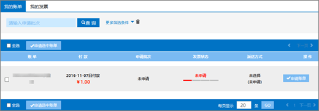

# Aplicar um Fapiao para o Office 365 operado pela 21Vianet

Você pode enviar sua solicitação fapiao para o sistema de gerenciamento do 21Vianet Fapiao cerca de três dias após o pagamento. Depois de enviar sua solicitação fapiao, ela será processada em dois dias.
  

  
## Etapa 1: Aplicar para um Fapiao

Há duas maneiras de aplicar-se a um Fapiao:
  
1. Depois de fazer um pagamento no site do Office 365 operado pela 21Vianet, você receberá um email de confirmação de pedido que contém seu número de pedido e um link para o sistema de gerenciamento do Fapiao. Você pode usar o link no email para criar uma conta no sistema de gerenciamento de informações <a href="https://go.microsoft.com/fwlink/p/?linkid=837466" target="_blank">do 21Vianet Fapiao.</a>

    Ou

2. Você pode aplicar um Fapiao no centro <a href="https://go.microsoft.com/fwlink/p/?linkid=850627" target="_blank">de administração</a>.

    
  
## Etapa 2: Registrar-se com o sistema de gerenciamento do 21Vianet Fapiao

> [!NOTE]
> Você pode usar o mesmo nome de email e senha que sua conta do Office 365 ou pode usar algo diferente.
  
1. Vá para o sistema de gerenciamento de <a href="https://go.microsoft.com/fwlink/p/?linkid=837466" target="_blank">informações do 21Vianet Fapiao.</a>

2. No formulário de registro, insira seu número de pedido, endereço de email e senha e selecione **Registro**.

    
  
3. Depois que seu registro for concluído, o sistema enviará uma mensagem de email de ativação para seu endereço de email. Abra a mensagem de email e selecione o link para ativar sua conta.

## Etapa 3: Enviar sua conta para um Fapiao

1. Faça logoff no <a href="https://go.microsoft.com/fwlink/p/?linkid=837465" target="_blank">sistema de gerenciamento fapiao.</a>

2. Selecione o registro de cobrança e selecione **Aplicar projeto de lei**.

    > [!NOTE]
    > O sistema de pagamento está em uma plataforma de terceiros e leva três dias para sincronizar o pedido e o registro de pagamento.
  
    
  
3. Selecione o tipo Fapiao, insira as informações necessárias e selecione **Next**.

    
  
    > [!NOTE]
    > - Para um Fapiao de IVA normal, você só precisa inserir o nome do comprador.
    > - Se necessário, você pode aplicar um Fapiao com um título diferente. No entanto, você só pode aplicar um título de Fapiao para uma fatura no sistema. Se você quiser dividir o Fapiao em valores ou títulos diferentes, envie sua solicitação <a href="https://portal.partner.microsoftonline.cn/Support/SupportOverview.aspx" target="_blank">no centro de administração</a>.
    > - Na próxima vez que você se aplicar a um Fapiao, o sistema apresentará automaticamente as informações anteriores de Fapiao.
    > - Se você precisar de um certificado de compra ou um reembolso, o nome do pagador e o título de Fapiao devem corresponder.

4. Selecione um método de envio e insira as informações de email. Você pode escolher Yunda ou SF (coleta de frete). Você também pode ir até a filial de Xangai da 21Vianet para obter o Fapiao. selecione **Próximo**.

    
  
    **21Vianet Endereço da filial de Xangai:**

    Shanghai, Pudong New Area Keyuan Road No. 88, Centro Alemão, edifício 3, 657

    **Informações de contato:**

    Zhu qin qin 021-28986102

5. Verifique se as informações estão corretas e selecione **Confirmar**.

    
  
## Etapa 4: Verificar o andamento do aplicativo

Seu aplicativo é transmitido automaticamente para o Centro de Serviços da 21Vianet e será concluído em dois dias úteis.
  
Depois de enviar o aplicativo, você pode verificar o progresso a qualquer momento. Atualizaremos o status do seu aplicativo com comentários como **Emitido** ou **Enviado.**
  

  
Quando Fapiao estiver fora de uso, o sistema exibirá um aviso e indicará o tempo esperado para emitir o Fapiao.
  

  
## Perguntas Frequentes

### Quais serviços posso obter com o suporte online?

Você pode verificar o andamento da sua solicitação fapiao e descobrir por que não recebeu o Fapiao.
  
Se você quiser alterar o título de Fapiao, envie o Fapiao de volta para nós e reeditaremos o Fapiao. Você pode enviar a solicitação por meio <a href="https://portal.partner.microsoftonline.cn/Support/SupportOverview.aspx" target="_blank">do centro de administração</a>.
  

  
### Como alterar meu endereço de email de logon e senha?

1. Faça logoff no sistema <a href="https://go.microsoft.com/fwlink/p/?linkid=837465" target="_blank">de gerenciamento fapiao</a>e selecione **Alterar endereço de email**.

    
  
2. Se você esqueceu sua senha de logon, poderá usar seu endereço de email de logon para redefinir a senha. O sistema de gerenciamento fapiao enviará uma nova senha para seu endereço de email. Você pode usar a nova senha para fazer logon.

    
  
3. Se você esqueceu seu endereço de email de logon, entre em contato com o serviço de atendimento ao cliente da 21Vianet em (86) 400-089-0365.

### Como encontro minha ID de pedido?

1. No centro [de administração,](https://go.microsoft.com/fwlink/p/?linkid=850627)vá para a página **Contas de** Cobrança \> **& pagamentos.**

2. Encontre a fatura que você deseja, selecione para exibir ou escolha baixar o PDF.

### E se eu inserir o endereço de email errado ao registrar?

Se você inserir o endereço de email errado ao se registrar, não receberá o email de ativação. O link de registro no email expirará automaticamente após 24 horas. Você pode retornar à página <a href="https://go.microsoft.com/fwlink/p/?linkid=837466" target="_blank">de registro e</a> registrar-se novamente com o endereço de email correto.
  
### E se eu não receber um email de ativação?

Se você não receber um email de ativação de conta dentro de 24 horas após o registro, vá para o sistema de gerenciamento de informações do <a href="https://go.microsoft.com/fwlink/p/?linkid=837466" target="_blank">21Vianet Fapiao</a>, insira seu endereço de email e selecione **Resend o** email de ativação . O sistema enviará o email de ativação da conta para seu endereço de email registrado.
  

  
Se você ainda não receber um email de ativação, entre em contato com o serviço de atendimento ao cliente da 21Vianet em (86) 400-089-0365.