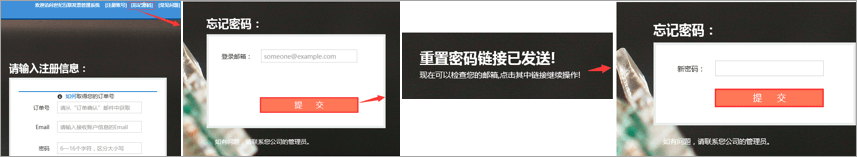

# Aplicar um Fapiao para o Office 365 operado pela 21VianetApply for a Fapiao for Office 365 operated by 21Vianet

> [!NOTE]
> O centro de administração está mudando.The admin center is changing. Se a sua experiência não corresponder aos detalhes apresentados aqui, consulte [Sobre o novo centro de administração do Microsoft 365](../microsoft-365-admin-center-preview.md?preserve-view=true&view=o365-21vianet).If your experience doesn't match the details presented here, see [About the new Microsoft 365 admin center](../microsoft-365-admin-center-preview.md?preserve-view=true&view=o365-21vianet).

Você pode enviar sua solicitação fapiao para o sistema de gerenciamento do 21Vianet Fapiao cerca de três dias após o pagamento.You can submit your Fapiao request to the 21Vianet Fapiao management system about three days after you have paid. Depois de enviar sua solicitação fapiao, ela será processada em dois dias.After you submit your Fapiao request, it will be processed in two days.
  

  
## Etapa 1: Aplicar para um FapiaoStep 1: Apply for a Fapiao

Há duas maneiras de aplicar-se a um Fapiao:There are two ways to apply for a Fapiao:
  
1. Depois de fazer um pagamento no site do Office 365 operado pela 21Vianet, você receberá um email de confirmação de pedido que contém seu número de pedido e um link para o sistema de gerenciamento do Fapiao.After making a payment in the Office 365 operated by 21Vianet website, you'll receive an order confirmation email that contains your order number and a link to the Fapiao management system. Você pode usar o link no email para criar uma conta no sistema de gerenciamento de informações <a href="https://go.microsoft.com/fwlink/p/?linkid=837466" target="_blank">do 21Vianet Fapiao.</a>You can use the link in the email to create an account in the <a href="https://go.microsoft.com/fwlink/p/?linkid=837466" target="_blank">21Vianet Fapiao information management system</a>.

    OuOr

2. Você pode aplicar um Fapiao no centro <a href="https://go.microsoft.com/fwlink/p/?linkid=850627" target="_blank">de administração</a>.You can apply for a Fapiao from the <a href="https://go.microsoft.com/fwlink/p/?linkid=850627" target="_blank">admin center</a>.

    
  
## Etapa 2: Registrar-se com o sistema de gerenciamento do 21Vianet FapiaoStep 2: Register with the 21Vianet Fapiao management system

> [!NOTE]
> Você pode usar o mesmo nome de email e senha que sua conta do Office 365 ou pode usar algo diferente.You can use the same email name and password as your Office 365 account, or you can use something different.
  
1. Vá para o sistema de gerenciamento de <a href="https://go.microsoft.com/fwlink/p/?linkid=837466" target="_blank">informações do 21Vianet Fapiao.</a>Go to the <a href="https://go.microsoft.com/fwlink/p/?linkid=837466" target="_blank">21Vianet Fapiao information management system</a>.

2. No formulário de registro, insira seu número de pedido, endereço de email e senha e selecione **Registro**.In the registration form, enter your order number, email address, and password, then select **Registration**.

    
  
3. Depois que seu registro for concluído, o sistema enviará uma mensagem de email de ativação para seu endereço de email.After your registration is complete, the system will send an activation email message to your email address. Abra a mensagem de email e selecione o link para ativar sua conta.Open the email message and select the link to activate your account.

## Etapa 3: Enviar sua conta para um FapiaoStep 3: Submit your bill for a Fapiao

1. Faça logoff no <a href="https://go.microsoft.com/fwlink/p/?linkid=837465" target="_blank">sistema de gerenciamento fapiao.</a>Log in to the <a href="https://go.microsoft.com/fwlink/p/?linkid=837465" target="_blank">Fapiao management system</a>.

2. Selecione o registro de cobrança e selecione **Aplicar projeto de lei**.Select the billing record, then select **Apply bill**.

    > [!NOTE]
    > O sistema de pagamento está em uma plataforma de terceiros e leva três dias para sincronizar o pedido e o registro de pagamento.The payment system is on a third-party platform and takes three days to synchronize the order and payment record.
  
    
  
3. Selecione o tipo Fapiao, insira as informações necessárias e selecione **Next**.Select the Fapiao type, enter the required information, then select **Next**.

    
  
    > [!NOTE]
    > - Para um Fapiao de IVA normal, você só precisa inserir o nome do comprador.For a normal VAT Fapiao, you only need to enter the buyer's name.
    > - Se necessário, você pode aplicar um Fapiao com um título diferente.If necessary, you can apply for a Fapiao with different a title. No entanto, você só pode aplicar um título de Fapiao para uma fatura no sistema.However, you can only apply one Fapiao title for one bill in the system. Se você quiser dividir o Fapiao em valores ou títulos diferentes, envie sua solicitação <a href="https://portal.partner.microsoftonline.cn/Support/SupportOverview.aspx" target="_blank">no centro de administração</a>.If you want to split the Fapiao into different amounts or titles, please <a href="https://portal.partner.microsoftonline.cn/Support/SupportOverview.aspx" target="_blank">submit your request in the admin center</a>.
    > - Na próxima vez que você se aplicar a um Fapiao, o sistema apresentará automaticamente as informações anteriores de Fapiao.The next time you apply for a Fapiao, the system automatically presents the previous Fapiao information.
    > - Se você precisar de um certificado de compra ou um reembolso, o nome do pagador e o título de Fapiao devem corresponder.If you need a purchase certificate or a refund, the payer name and the Fapiao title must match.

4. Selecione um método de envio e insira as informações de email.Select a shipping method and enter the mailing information. Você pode escolher Yunda ou SF (coleta de frete).You can choose Yunda or SF (freight collect). Você também pode ir até a filial de Xangai da 21Vianet para obter o Fapiao.You can also go to the 21Vianet Shanghai branch to get the Fapiao. selecione **Próximo**.select **Next**.

    
  
    **21Vianet Endereço da filial de Xangai:****21Vianet Shanghai branch company address:**

    Shanghai, Pudong New Area Keyuan Road No.Shanghai, Pudong New Area Keyuan Road No. 88, Centro Alemão, edifício 3, 65788, German Center, building 3, 657

    **Informações de contato:****Contact information:**

    Zhu qin qin 021-28986102Zhu qin qin 021-28986102

5. Verifique se as informações estão corretas e selecione **Confirmar**.Verify that the information is correct, then select **Confirm**.

    
  
## Etapa 4: Verificar o andamento do aplicativoStep 4: Check application progress

Seu aplicativo é transmitido automaticamente para o Centro de Serviços da 21Vianet e será concluído em dois dias úteis.Your application is automatically transmitted to the 21Vianet Service Center, and will be completed in two working days.
  
Depois de enviar o aplicativo, você pode verificar o progresso a qualquer momento.After you submit the application, you can check the progress at any time. Atualizaremos o status do seu aplicativo com comentários como **Emitido** ou **Enviado.**We will update the status of your application with remarks like **Issued** or **Mailed out**.
  

  
Quando Fapiao estiver fora de uso, o sistema exibirá um aviso e indicará o tempo esperado para emitir o Fapiao.When Fapiao is out of use, the system will display a notice, and will indicate the expected time to issue the Fapiao.
  

  
## Perguntas frequentesFAQs

### Quais serviços posso obter com o suporte online?What services can I get from online support?

Você pode verificar o andamento da sua solicitação fapiao e descobrir por que não recebeu o Fapiao.You can check the progress of your Fapiao request, and find out why you haven't received the Fapiao.
  
Se você quiser alterar o título de Fapiao, envie o Fapiao de volta para nós e reeditaremos o Fapiao.If you want to change the Fapiao title, please send the Fapiao back to us and we will reissue the Fapiao. Você pode enviar a solicitação por meio <a href="https://portal.partner.microsoftonline.cn/Support/SupportOverview.aspx" target="_blank">do centro de administração</a>.You can submit the request through the <a href="https://portal.partner.microsoftonline.cn/Support/SupportOverview.aspx" target="_blank">admin center</a>.
  

  
### Como alterar meu endereço de email de logon e senha?How do I change my login email address and password?

1. Faça logoff no sistema <a href="https://go.microsoft.com/fwlink/p/?linkid=837465" target="_blank">de gerenciamento fapiao</a>e selecione **Alterar endereço de email**.Log in to the <a href="https://go.microsoft.com/fwlink/p/?linkid=837465" target="_blank">Fapiao management system</a>, then select **Change email address**.

    
  
2. Se você esqueceu sua senha de logon, poderá usar seu endereço de email de logon para redefinir a senha.If you forgot your login password, you can use your login email address to reset the password. O sistema de gerenciamento fapiao enviará uma nova senha para seu endereço de email.The Fapiao management system will send a new password to your email address. Você pode usar a nova senha para fazer logon.You can use the new password to login.

    
  
3. Se você esqueceu seu endereço de email de logon, entre em contato com o serviço de atendimento ao cliente da 21Vianet em (86) 400-089-0365.If you forgot your login email address, please contact 21Vianet customer service at (86) 400-089-0365.

### Como encontro minha ID de pedido?How do I find my order ID?

1. No centro [de administração,](https://go.microsoft.com/fwlink/p/?linkid=850627)vá para a página **Contas de** Cobrança \> **& pagamentos.**In the [admin center](https://go.microsoft.com/fwlink/p/?linkid=850627), go to the **Billing** \> **Bills & payments** page.

2. Encontre a fatura que você deseja, selecione para exibir ou escolha baixar o PDF.Find the invoice you want, select to view, or choose to download the PDF.

### E se eu inserir o endereço de email errado ao registrar?What if I enter the wrong email address when I register?

Se você inserir o endereço de email errado ao se registrar, não receberá o email de ativação.If you enter the wrong email address when you register, you won't receive the activation email. O link de registro no email expirará automaticamente após 24 horas.The registration link in the email will automatically expire after 24 hours. Você pode retornar à página <a href="https://go.microsoft.com/fwlink/p/?linkid=837466" target="_blank">de registro e</a> registrar-se novamente com o endereço de email correto.You can return to the <a href="https://go.microsoft.com/fwlink/p/?linkid=837466" target="_blank">registration page</a> and register again with the correct email address.
  
### E se eu não receber um email de ativação?What if I don't receive an activation email?

Se você não receber um email de ativação de conta dentro de 24 horas após o registro, vá para o sistema de gerenciamento de informações do <a href="https://go.microsoft.com/fwlink/p/?linkid=837466" target="_blank">21Vianet Fapiao</a>, insira seu endereço de email e selecione **Resend o** email de ativação .If you don't receive an account activation email within 24 hours after you register, go to the <a href="https://go.microsoft.com/fwlink/p/?linkid=837466" target="_blank">21Vianet Fapiao information management system</a>, enter your email address, then select **Resend the activation email**. O sistema enviará o email de ativação da conta para seu endereço de email registrado.The system will resend the account activation email to your registered email address.
  

  
Se você ainda não receber um email de ativação, entre em contato com o serviço de atendimento ao cliente da 21Vianet em (86) 400-089-0365.If you still don't receive an activation email, please contact 21Vianet customer service at (86) 400-089-0365.