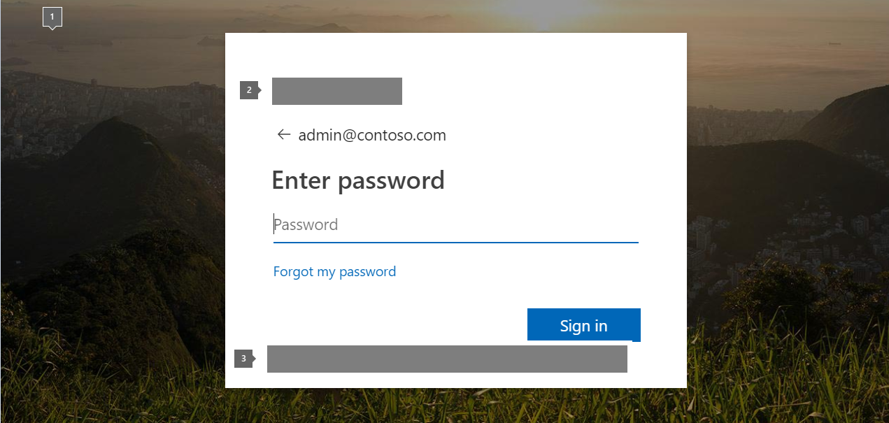

# Adicionar a identidade visual da empresa à página de entrada do Office 365Add your company branding to Office 365 Sign In page

 Agora você pode usar a assinatura do Azure Active Directory (AD) que está inclusa na sua assinatura do Office 365 para personalizar a página de entrada exibida a seus usuários.You can now use the Azure Active Directory (AD) subscription that is included with your Office 365 subscription to customize the sign-in page your users see. 
  
## Adicionar a identidade visual da empresa nas páginas de entrada e Painel de AcessoAdd company branding to your sign in page and Access Panel pages

Caso tenha uma assinatura paga do Office 365, do Microsoft Dynamics CRM Online, do Enterprise Mobility Suite ou de outros serviços da Microsoft, você dispõe de uma assinatura gratuita do Azure Active Directory. Você pode usar o Azure Active Directory para criar e gerenciar contas de usuários e grupos, e adicionar a identidade visual de sua empresa às suas páginas. Para ativar esta assinatura e acessar o Portal de Gerenciamento do Microsoft Azure, é preciso concluir um processo de registro uma única vez. Depois disso, você pode acessar o Azure Active Directory de seu serviço da Microsoft que o utiliza. Confira as instruções sobre como registrar sua assinatura do Office 365 em [Registre sua assinatura gratuita do Active Directory do Azure](https://go.microsoft.com/fwlink/p/?LinkID=527966) Confira também [Gerenciar o diretório de sua assinatura do Office 365 no Azure](https://go.microsoft.com/fwlink/p/?LinkId=620076) para ver as instruções gerais de gerenciamento.If you have a paid subscription to Office 365, Microsoft Dynamics CRM Online, Enterprise Mobility Suite, or other Microsoft services, you have a free subscription to Azure Active Directory. You can use Azure Active Directory to create and manage user and group accounts, and add company branding to your pages. To activate this subscription and access the Microsoft Azure Management Portal, you have to complete a one-time registration process. Afterward, you can access Azure Active Directory from your Microsoft service that uses it. For instructions on how to register your Office 365 subscription see [Register your free Azure Active Directory subscription](https://go.microsoft.com/fwlink/p/?LinkID=527966), and see [Manage the directory for your Office 365 subscription in Azure](https://go.microsoft.com/fwlink/p/?LinkId=620076) for general management instructions. 
  
A figura a seguir mostra quais partes da página de entrada podem ser alteradas no Azure.The following figure shows which parts of the sign-in page can be modified in Azure.
  

  
1. A ilustração grande e/ou sua cor de plano de fundoThe large illustration and/or its background color
    
2. O logotipo do bannerThe banner logo
    
3. Você também pode adicionar texto a esta áreaYou can also add text to this area
    
Além da página de entrada, você pode personalizar a página Painel de Acesso no Azure.In addition to the sign-in page, you can customize the Access Panel page in Azure.
  
Se você estiver pronto para adicionar a identidade visual, explore as opções de personalização do conjunto de conteúdo do Azure: [Adicionar a identidade visual da empresa nas páginas de entrada e Painel de Acesso](https://go.microsoft.com/fwlink/p/?LinkId=620077)If you are ready to add branding, explore the customization options in the Azure content set: [Add company branding to your Sign-in and Access Panel pages](https://go.microsoft.com/fwlink/p/?LinkId=620077).