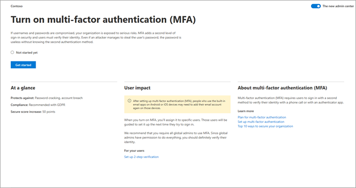

# Diferença entre o assistente de instalação e a página de Instalação

Microsoft 365 oferece duas experiências de instalação: 

- Instalação inicial usando o assistente de instalação
- Configuração contínua e avançada usando a página **De instalação**

O assistente de instalação fornece um passo a passo guiado para configurar a configuração básica Microsoft 365 configuração. Depois de concluir a configuração inicial, você pode ir até a página Instalação para concluir a configuração e a configuração dos serviços que vêm com suas assinaturas. 

## Use o assistente de instalação para concluir tarefas iniciais de instalação

Para configurar sua conta, vá para o centro de [administração,](https://go.microsoft.com/fwlink/p/?linkid=2024339)selecione **Instalação** no painel de navegação esquerdo e selecione **Configuração** guiada na página **Instalação.**

O assistente de instalação orienta você pelas seguintes etapas:

1. Instale os Microsoft 365 aplicativos em seu computador.

2. Escolha e verifique seu domínio, como contoso.com.

3. Adicione novos usuários e atribua licenças a eles para que eles possam baixar e instalar Microsoft 365 aplicativos.

4. Conexão seu domínio.

## Use a página De instalação para concluir e gerenciar sua configuração

Para acessar a **página Instalação** no centro [de administração,](https://go.microsoft.com/fwlink/p/?linkid=2024339)selecione **Configurar** no painel de navegação. Com base nos produtos que você comprou, os recursos que você definiu e sua função de administrador, tarefas e informações relacionadas de todas as Microsoft 365 são a tona aqui.

Você verá a lista completa de tarefas de instalação organizadas em categorias lógicas, incluindo as que você concluiu no assistente de instalação.

Escolha **Exibir** para qualquer tarefa para obter informações rápidas, como descrição da tarefa, impacto do usuário, pré-requisitos, esforço para implementar e estatísticas de segurança e adoção para ajudá-lo a entender as consequências e o impacto antes de prosseguir.

Você também verá o status da tarefa (**Iniciado**, Não iniciado **ainda** ou **Concluído**). Se você estiver com várias tarefas, trabalhando em tarefas ao longo de vários dias ou se houver vários administradores trabalhando em tarefas, você poderá acompanhar a conclusão vendo rapidamente quais tarefas foram concluídas e quais ainda exigem atenção. 

Para acessar artigos abrangentes sobre os recursos que você está configurando, selecione qualquer um dos links **Saiba mais.** A coleção de tarefas está sempre aqui, para que você possa retornar à página **de** Instalação a qualquer momento para explorar ainda mais os recursos.

Quando estiver pronto para concluir uma tarefa, selecione **Começar** a passar pelo processo de configuração. Depois de concluir uma tarefa, o botão **Iniciar** muda para um botão **Gerenciar,** permitindo que você gerencie a tarefa, conforme necessário.

