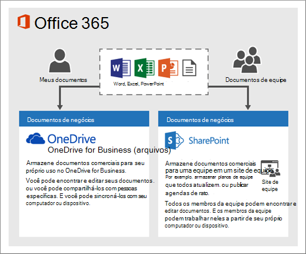
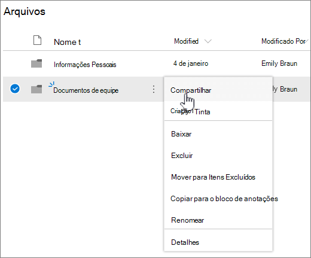
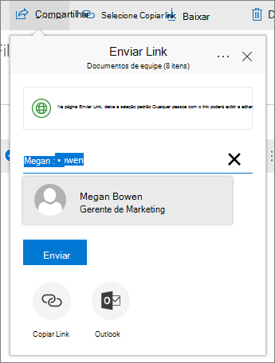
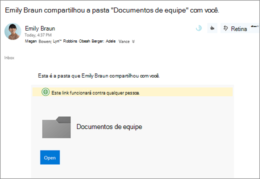
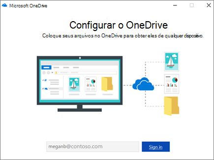
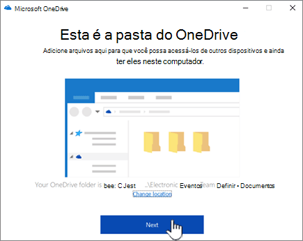
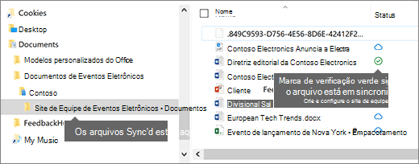

# Configurar o armazenamento e o compartilhamento de arquivosSet up file storage and sharing

Uma das melhores maneiras de configurar o armazenamento e o compartilhamento de arquivos para sua empresa é usar o OneDrive e um site de equipe juntos.One of the best ways to set up file storage and sharing for your business is to use OneDrive and a team site together. Isso é ideal se você tem uma empresa pequena com poucos funcionários.This is ideal if you have a small business with a few employees.

Assista a um pequeno vídeo sobre onde armazenar arquivos no Microsoft 365.Watch a short video about where to store files in Microsoft 365.  

> [!VIDEO https://www.microsoft.com/videoplayer/embed/RE1FTHX] 

Se você achou esse vídeo útil, Confira as [ séries completas de treinamento para pequenas empresas e as novidades do Microsoft 365](https://support.office.com/article/6ab4bbcd-79cf-4000-a0bd-d42ce4d12816).If you found this video helpful, check out the [complete training series for small businesses and those new to Microsoft 365](https://support.office.com/article/6ab4bbcd-79cf-4000-a0bd-d42ce4d12816).

## Onde você pode armazenar documentos no Microsoft 365Where you can store documents in Microsoft 365

- O OneDrive foi projetado para uso individual, com o compartilhamento ocasional de arquivos.OneDrive is designed for individual use, with the occasional sharing of files. 

- Um site de equipe é projetado para compartilhar e colaborar em arquivos regularmente.A team site is designed for sharing and collaborating on files regularly. Um site de equipe é ideal para armazenar arquivos que têm Propriedade compartilhada em que várias pessoas possuem os arquivos e podem colaborar neles.A team site is ideal for storing files that have shared ownership where several people own the files and might collaborate on them. Crie uma equipe da Microsoft para adicionar um site de equipe.Create a Microsoft Team to add a team site. [Saiba mais em criar uma equipe no Microsoft Teams](https://support.office.com/article/174adf5f-846b-4780-b765-de1a0a737e2b).[Learn more at Create a team in Teams](https://support.office.com/article/174adf5f-846b-4780-b765-de1a0a737e2b).

O OneDrive e os sites de equipe fornecem acesso em qualquer lugar para você e seus funcionários.Both OneDrive and team sites provide anywhere access for you and your employees.
  

  
Aqui estão as recomendações para o que armazenar em cada local quando você usa o OneDrive e sites de equipe juntos:Here are recommendations for what to store in each location when you use OneDrive and team sites together:
  
||||
|:-----|:-----|:-----|
|**Local de armazenamento****Storage location**   |**Para que serve****What it's for**   |**O que armazenar aqui****What to store here**   |
|**OneDrive****OneDrive**   |Armazenar conteúdo no OneDrive é como armazenar arquivos no computador; Ninguém mais pode acessá-las facilmente.Storing content in OneDrive is like storing files on your computer; no one else can easily access them.    Para obter mais informações, consulte [o que é o onedrive for Business?](https://support.office.com/article/187f90af-056f-47c0-9656-cc0ddca7fdc2.aspx)For more info, see [What is OneDrive for Business?](https://support.office.com/article/187f90af-056f-47c0-9656-cc0ddca7fdc2.aspx)   |Arquivos de negócios nos quais outros membros da equipe não precisarão colaborar ou acessar regularmente.Business files that other team members won't need to collaborate on or access regularly.    |
|**Sites de equipe do SharePoint****SharePoint team sites**   |Collabora.Collaboration. Quando você cria um grupo do Microsoft 365 (por exemplo, no centro de administração do Microsoft 365, no Outlook ou criando uma equipe no Microsoft Teams), um site de equipe do SharePoint é criado para esse grupo.When you create a Microsoft 365 group (for example, in the Microsoft 365 admin center, in Outlook, or by creating a team in Microsoft Teams) a SharePoint team site is created for that group. Da mesma forma, quando você cria um novo site de equipe do SharePoint a partir da home page do SharePoint ou do novo centro de administração do SharePoint, ele também cria um grupo do Microsoft 365.Likewise, when you create a new SharePoint team site from the SharePoint home page or from the new SharePoint admin center, it also creates a Microsoft 365 group. Para obter mais informações, consulte [o que é um site de equipe do SharePoint?](https://support.office.com/article/75545757-36c3-46a7-beed-0aaa74f0401e.aspx) e [crie um site de equipe no SharePoint Online](https://support.office.com/article/ef10c1e7-15f3-42a3-98aa-b5972711777d.aspx).For more info, see [What is a SharePoint team site?](https://support.office.com/article/75545757-36c3-46a7-beed-0aaa74f0401e.aspx) and [Create a team site in SharePoint Online](https://support.office.com/article/ef10c1e7-15f3-42a3-98aa-b5972711777d.aspx).    |Arquivos com Propriedade compartilhada.Files that have shared ownership. Recomendamos sites de equipe separados para cada unidade de trabalho em sua organização.We recommend separate team sites for each unit of work in your organization. Por exemplo, para manter os documentos pessoais e financeiros em particular para uma pequena equipe, crie um site de equipe separado.For example, to keep personnel and financial documents private to a small team, create a separate team site.    |

> [!NOTE]
> O SharePoint também tem outros tipos de sites que você pode usar para sua empresa.SharePoint also has other types of sites you can use for your business. Você pode usar [sites de comunicação](https://support.microsoft.com/en-us/office/create-a-communication-site-in-sharepoint-online-7fb44b20-a72f-4d2c-9173-fc8f59ba50eb) em sua intranet para publicar informações de uma grande audiência.You can use [communication sites](https://support.microsoft.com/en-us/office/create-a-communication-site-in-sharepoint-online-7fb44b20-a72f-4d2c-9173-fc8f59ba50eb) in your intranet to publish information for a broad audience. E você pode usar [sites de Hub](https://support.office.com/article/fe26ae84-14b7-45b6-a6d1-948b3966427f.aspx) para conectar sites em sua intranet.And you can use [hub sites](https://support.office.com/article/fe26ae84-14b7-45b6-a6d1-948b3966427f.aspx) to connect sites in your intranet.
  
## Começar a usar o OneDrive e seu site de equipeStart using OneDrive and your team site

### Os membros da equipe podem armazenar seus próprios arquivos no OneDriveTeam members can store their own files in OneDrive

Cada pessoa em sua empresa que tenha uma licença do Microsoft 365 atribuída (e o SharePoint Online selecionado) Obtém o armazenamento em nuvem do OneDrive.Each person in your business who has an Microsoft 365 license assigned (and SharePoint Online selected) gets OneDrive cloud storage. Eles podem armazenar arquivos relacionados aos negócios aqui para acesso de qualquer dispositivo e estão disponíveis somente para esse usuário.They can store business-related files here for access from any device, and they are only available to that user. Por exemplo, é possível armazenar um rascunho de proposta, suas anotações de reunião ou uma demonstração que será apresentada.For example, they might store a draft proposal, their meeting notes, or the script for a demo they're going to deliver.
  
Os funcionários também podem compartilhar arquivos e pastas do OneDrive.Employees can also share OneDrive files and folders. Se um funcionário estiver ausente ou sair da empresa, outras pessoas poderão acessar arquivos compartilhados armazenados no OneDrive.If an employee is away or leaves the company, others can access shared files stored in OneDrive.
  
Veja como cada pessoa em sua equipe pode configurar o OneDrive e compartilhar arquivos.Here's how each person on your team can set up OneDrive and share files.

1. Vá para o <a href="https://portal.office.com/ " target="_blank">portal do Microsoft 365</a>e entre com seu nome de usuário e senha.Go to the <a href="https://portal.office.com/ " target="_blank">Microsoft 365 Portal</a>, and sign in with your user name and password.

2. No inicializador de aplicativos, selecione **onedrive**.From the App launcher, select **OneDrive**.

3. No OneDrive, os membros da equipe podem armazenar seus próprios arquivos relacionados aos negócios.In OneDrive, team members can store their own business-related files. Você pode compartilhar arquivos individuais ou uma pasta inteira.You can share either individual files, or a whole folder. Escolha um arquivo ou pasta, clique com o botão direito do mouse e escolha **compartilhar**.Pick a file or folder, right-click, and then choose **Share**.

    
  
4. Na página **Enviar Link** , mantenha a seleção padrão **qualquer pessoa com o link pode exibir e editar**.On the **Send Link** page, leave the default selection **Anyone with the link can view and edit**.

    Digite nomes ou endereços de email de membros da equipe que você deseja que tenham acesso à pasta e adicione uma mensagem opcional.Type names or email addresses of team members who you want to have access to the folder, and add an optional message.

    Se você quiser sua própria cópia do email que será enviado, adicione seu endereço de email à lista.If you want your own copy of the email that will be sent, add your email address to the list.

    
  
5. Quando você terminar de inserir quem deseja compartilhar, selecione **Enviar**.When you're done entering who you want to share with, select **Send**. O email é imediatamente enviado para as pessoas que você convidar.The email is immediately sent to the people you invite.

    
  
6. Veja como é a aparência do email.Here's what the email looks like. 

    
  
### Carregar arquivos em um site de equipe para colaboração onlineUpload files to a team site for online collaboration

Os sites de equipe vêm com um local para armazenar arquivos, chamado de biblioteca de documentos.Team sites come with a place to store files, called a document library.  
  
Aqui estão as etapas para adicionar arquivos:Here are the steps to add files:
  
1. Na home page do seu site de equipe, escolha **documentos** no menu de navegação à esquerda.On the home page of your team site, choose **Documents** from the left-hand navigation menu. Isso levará você à sua **Biblioteca de documentos**.This will take you to your **Documents library**.
  
2. Enquanto você ainda estiver conectado ao Microsoft 365, abra o **Explorador de arquivos** do Windows na barra de tarefas ou em outro local.While you're still signed in to Microsoft 365, open Windows **File Explorer** from your taskbar or other location. Acesse os arquivos que você deseja carregar para seu site de equipe.Go to the files you want to upload to your team site.

3. Selecione os arquivos que você deseja carregar para seu site de equipe e arraste-os para a **biblioteca de documentos**.Select the files you want to upload to your team site, and then drag them to the **Document library**.
  
4. Quando terminar, os arquivos serão armazenados em seu site de equipe e em seu computador.When you're done, the files will be stored in both your team site and your computer.
  
5. Você pode excluir os arquivos de seu computador.You can delete the files from your computer. Na próxima etapa, [sincronize os arquivos online com seu PC ou Mac](#sync-online-files-with-your-pc-or-mac), você vai criar um novo local para esses arquivos no seu computador.In the next step, [Sync online files with your PC or Mac](#sync-online-files-with-your-pc-or-mac), you're going to create a new location for these files on your computer.

    Se você tiver muitos arquivos ou arquivos grandes para carregar para seu site de equipe, leia estas dicas sobre [Como carregar arquivos grandes ou muitos arquivos para uma biblioteca](https://support.office.com/article/da549fb1-1fcb-4167-87d0-4693e93cb7a0.aspx#__toc384119242).If you have a lot of files or large files to upload to your team site, read these tips on [uploading large or many files to a library](https://support.office.com/article/da549fb1-1fcb-4167-87d0-4693e93cb7a0.aspx#__toc384119242).

    Se precisar de mais espaço de armazenamento, confira [Alterar o espaço de armazenamento de sua assinatura](../../commerce/add-storage-space.md).If you need more storage space, see [Change storage space for your subscription](../../commerce/add-storage-space.md).

### Sincronizar arquivos online com seu PC ou MacSync online files with your PC or Mac

Agora que você já tem arquivos no site de equipe, é possível configurá-los para sincronizar com seu PC ou Mac.Now that you have files on your team site, you can set them up to sync with your PC or Mac. Dessa forma, você pode trabalhar em seus arquivos do seu PC ou Mac, em vez de trabalhar no Microsoft Edge, no Chrome ou em outro navegador.This way, you can work on your files from your PC or Mac instead of working in Microsoft Edge, Chrome, or another browser. Também é útil ter uma versão dos arquivos sincronizados no seu computador para situações em que você precisa de um arquivo e não tem acesso à Internet.It's also useful to have a version of your files synced on your computer for situations when you need to get to a file and you aren't connected to the Internet.
  
Depois de configurar os arquivos para sincronizar com o computador, quando você estiver conectado à Internet, eles serão sincronizados automaticamente.After you set up files to sync with your computer, when you're connected to the Internet, they'll be synchronized automatically.
  
Veja aqui como sincronizar os arquivos que estão no site de equipe com sua área de trabalho:Here's how to synchronize files on your team site with your desktop:
  
1. Na home page do seu site de equipe, escolha **documentos** no menu de navegação à esquerda.On the home page of your team site, choose **Documents** from the left-hand navigation menu. Isso leva você para sua biblioteca de documentos.This takes you to your Documents library.

    > [!TIP]
    > Ao sincronizar arquivos no site de equipe, você está sincronizando cada biblioteca de arquivos no site, e não todo o site.When syncing files on your team site, you're syncing each file library on the site, not the entire site.
  
2. Escolha **sincronizar** para sincronizar todos os arquivos.Choose **Sync** to synchronize all the files. Ou navegue até a pasta específica que você deseja sincronizar.Or browse to the specific folder you want to sync.

3. Se for solicitado a mudar de aplicativo, escolha **Sim**.If prompted to switch apps, choose **Yes**. O OneDrive é o processo que faz a sincronização.OneDrive is the process doing the synchronization.
  
4. Se você receber um prompt **Configurar o onedrive** , entre com sua conta corporativa ou de estudante.If you then get a **Set up OneDrive** prompt, sign in with your work or school account.

    
  
5. Se você ainda não tiver sincronizado o OneDrive, poderá ver a **sua tela de pastas do onedrive** .If you haven't yet synced your OneDrive, you might see a **This is your OneDrive folder** screen. Verifique se o caminho em **sua pasta do onedrive está aqui**.Check the path under **Your OneDrive folder is here**. Escolha **alterar local** se quiser usar um caminho diferente e, em seguida, selecione **Avançar**.Choose **Change Location** if you want to use a different path, and then select **Next**.

    
  
6. Os arquivos em seus sites de equipe aparecerão no painel esquerdo do explorador de arquivos com o nome da sua organização.The files in your team sites will appear in the left pane of File Explorer under the name of your organization. Os arquivos no OneDrive aparecerão em "OneDrive- \< nome da organização \> "The files in OneDrive will appear under "OneDrive - \<Name of Organization\>"

    
  
7. Teste a sincronização abrindo um arquivo na pasta da equipe em seu computador.Test the synchronization by opening a file in the team's folder on your computer. Faça uma alteração e, em seguida, escolha **Salvar**.Make a change, and then choose **Save**.

## Práticas recomendadas para compartilhamento e armazenamento de arquivosBest practices for file storage and sharing

Aqui estão algumas dicas para obter o máximo do OneDrive ou do seu site de equipe do SharePoint.Here are a few tips for getting the most from OneDrive or your SharePoint team site.
  
### Recomendações para colaboração e armazenamento de arquivos para outros tipos de pequenas empresasFile storage and collaboration recommendations for other types of small businesses

- **Empresa único**: Use o onedrive para armazenar seus próprios arquivos e compartilhá-los com os clientes em uma base caso a caso.**Sole proprietorships**: Use OneDrive to store your own files and share them with customers on a case-by-case basis.

- **Copropriedades**: os dois proprietários usam o onedrive e compartilham arquivos de frente e para trás.**Co-ownerships**: Both owners use OneDrive and share files back and forth.

- **Empresas com clientes externos ou parceiros que precisam acessar arquivos**: Crie um novo site de equipe para armazenar e compartilhar documentos destinados a um cliente específico.**Businesses with external clients or partners who need access to files**: Create a new team site to store and share documents intended for a specific customer. Configure o site para permitir acesso apenas ao cliente.Set up the site to allow access to only that customer. Você não precisa se preocupar que um cliente terá acesso acidentalmente às informações destinadas a outro cliente.You then don't need to worry that one customer will accidentally get access to information intended for another customer.

### Manter a privacidade de arquivos particularesKeep private files private

Ao armazenar um arquivo no OneDrive, ele só é acessível por você, a menos que você o compartilhe com outras pessoas.When you store a file in OneDrive it's only accessible by you, unless you share it with others. Ao compartilhar arquivos, você pode optar por criar um link que pode ser encaminhado ou compartilhar somente com pessoas específicas.When you share files, you can choose to create a link that can be forwarded, or to share with only specific people. Você também pode criar pastas separadas no OneDrive para finalidades diferentes, como projetos públicos, pessoais ou individuais.You can also create separate folders in OneDrive for different purposes such as public, personal, or for individual projects. Cada pasta pode ser compartilhada com pessoas ou grupos diferentes, ou não.Each folder can be shared with a different person or group, or nobody else at all.
  
Para obter mais informações sobre como compartilhar o, consulte também [compartilhar arquivos e pastas com o Microsoft 365](https://support.office.com/article/72f26d6c-bf9e-432c-8b96-e3c2437f5b65.aspx).For more information on sharing, also see [Share files and folders with Microsoft 365](https://support.office.com/article/72f26d6c-bf9e-432c-8b96-e3c2437f5b65.aspx).
  
### Controlar a quantidade de espaço livreTrack how much space you have left

Para ver quanto espaço de armazenamento resta no OneDrive, confira [gerenciar o armazenamento do onedrive for Business](https://support.office.com/article/31519161-059C-4764-B6F8-F5CD29F7FE68.aspx).To see how much storage space you have left in OneDrive, see [Manage your OneDrive for Business storage](https://support.office.com/article/31519161-059C-4764-B6F8-F5CD29F7FE68.aspx).
  
### Quais arquivos podem ser armazenados no OneDrive e em um site de equipe?What files can be stored in OneDrive and a team site?

Embora seja possível carregar quase todos os tipos de arquivos, alguns nomes de arquivos e caracteres nos nomes de arquivo não são permitidos.While you can upload almost all types of files, some file names and characters in file names aren't allowed. Para obter mais informações, consulte [caracteres de arquivo e tipos de arquivos inválidos no onedrive for Business](https://support.office.com/article/64883A5D-228E-48F5-B3D2-EB39E07630FA.aspx).For more info, see [Invalid file characters and file types in OneDrive for Business](https://support.office.com/article/64883A5D-228E-48F5-B3D2-EB39E07630FA.aspx).
  
### Habilitar ou desabilitar serviços de armazenamento de terceirosEnable or disable third-party storage services

Você pode habilitar o armazenamento de terceiros para seus usuários no Microsoft 365 para que eles possam armazenar e compartilhar documentos usando serviços como o Dropbox, além do OneDrive e sites de equipe.You can enable third-party storage for your users in Microsoft 365 so they can store and share documents using services like Dropbox in addition to OneDrive and team sites. Pode ser uma ótima maneira de oferecer serviços que eles já conhecem ou preferem usar para projetos comerciais.This can be a great way to provide services that your users may already be using or prefer to use for business projects. Se você não quiser que as pessoas em sua organização usando o Office abram arquivos em um serviço de terceiros, siga estas etapas para desativá-la.If you don't want people in your organization using Office to open files in a third-party service, follow these steps to turn it off.
  
> [!IMPORTANT]
> O armazenamento de terceiros é habilitado por padrão, portanto, você precisará executar estas etapas imediatamente se não quiser disponibilizá-lo para os usuários.Third-party storage is enabled by default so you need to perform these steps right away if you don't want it available to your users.
  
1. Entre no <a href="https://go.microsoft.com/fwlink/p/?linkid=2024339" target="_blank">centro de administração</a>.Sign in to to the <a href="https://go.microsoft.com/fwlink/p/?linkid=2024339" target="_blank">admin center</a>.

2. Vá para a **Settings** \> página Configurações da <a href="https://go.microsoft.com/fwlink/p/?linkid=2118715" target="_blank">**organização**</a> de configurações.Go to the **Settings** \> <a href="https://go.microsoft.com/fwlink/p/?linkid=2118715" target="_blank">**Org settings**</a> page.

3. Na guia **Serviços** , selecione **Office na Web**.On the **Services** tab, select **Office on the web**.

4. Marque ou desmarque a caixa de seleção para ativar ou desativar o armazenamento de terceiros e, em seguida, selecione **salvar alterações**.Select or deselect the check box to turn third-party storage on or off, then select **Save changes**.

## Próximas etapasNext steps

- [Personalize seu site de equipe para armazenamento e compartilhamento de arquivos](customize-team-site.md).[Customize your team site for file storage and sharing](customize-team-site.md). Este tutorial passo a passo mostra como você pode aproveitar recursos de colaboração e mais armazenamento.This step-by-step tutorial shows you how to you can take advantage of more storage and collaboration features. 

- **Configurar aplicativos do Office em tablets e telefone**.**Set up Office apps on your tablets and phones.** É necessário fazer isso para que você possa **Editar** arquivos armazenados no onedrive e nos sites de equipe de seu Tablet ou telefone.You need to do this so you can **edit** files that are stored in OneDrive and on team sites from your tablet or phone. Se você não instalar os aplicativos do Office para Tablet ou telefone, poderá exibir os arquivos, mas não editá-los.If you don't install the Office apps for your tablet or phone, you'll be able to view the files but not edit them.

  - [Instalar e configurar o Office em um Android com o Microsoft 365Install and set up Office on an Android with Microsoft 365](https://support.office.com/article/cafe9d6f-8b0c-4b03-b20a-12438a82a22d.aspx)

  - [Instalar e configurar o Office em um iPhone ou iPad com o Microsoft 365Install and set up Office on an iPhone or iPad with Microsoft 365](https://support.office.com/article/9df6d10c-7281-4671-8666-6ca8e339b628.aspx)

  - [Configurar o Office no Windows Phone com o Microsoft 365Set up Office on Windows Phone with Microsoft 365](https://support.microsoft.com/en-us/office/set-up-office-mobile-apps-on-a-windows-mobile-device-2b7c1b51-a717-45d6-90c9-ee1c1c5ee0b7)
