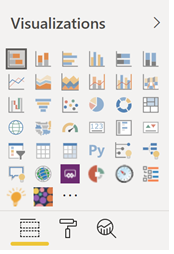

# Personalizar os relatórios na análise de uso do Microsoft 365Customize the reports in Microsoft 365 usage analytics

::: moniker range="o365-21vianet"

> [!NOTE]
> O centro de administração está mudando.The admin center is changing. Se a sua experiência não corresponder aos detalhes apresentados aqui, consulte [Sobre o novo centro de administração do Microsoft 365](https://docs.microsoft.com/microsoft-365/admin/microsoft-365-admin-center-preview?view=o365-21vianet).If your experience doesn't match the details presented here, see [About the new Microsoft 365 admin center](https://docs.microsoft.com/microsoft-365/admin/microsoft-365-admin-center-preview?view=o365-21vianet).

::: moniker-end

A análise de uso do Microsoft 365 fornece um painel no Power BI que oferece informações sobre como os usuários adotam e usam o Microsoft 365.Microsoft 365 usage analytics provides a dashboard in Power BI that offers insights into how users adopt and use Microsoft 365. O painel é apenas um ponto de partida para interagir com os dados de uso.The dashboard is just a starting point to interact with the usage data. Os relatórios podem ser personalizados para informações mais personalizadas.The reports can be customized for more personalized insights.
  
Você também pode usar a área de trabalho do Power BI para personalizar ainda mais seus relatórios conectando-os a outras fontes de dados para obter informações mais detalhadas sobre sua empresa.You can also use the Power BI desktop to further customize your reports by connecting them to other data sources to gain richer insights about your business.
  
## Personalizando relatórios no navegadorCustomizing reports in the browser

Os dois exemplos a seguir mostram como modificar um visual existente e como criar um novo visual.The following two examples show how to modify an existing visual and how to create a new visual.
  
### Modifique um visual existenteModify an existing visual

Este exemplo mostra como modificar a guia de **ativação** dentro do relatório de **ativação/licenciamento** .This example shows how to modify the **Activation** tab within the **Activation/Licensing** report. 
  
1. No relatório de **ativação/licenciamento** , selecione a guia **ativação** .Within the **Activation/Licensing** report, select the **Activation** tab.
    
2. Insira o modo de edição escolhendo o botão **Editar** na parte superior através do  .Enter the edit mode by choosing the **Edit** button on the top through the  button. 
    
    
  
3. No canto superior direito, escolha **duplicar esta página** .On the top right, choose **Duplicate this page** .
    
    
  
4. No canto inferior direito, escolha qualquer um dos gráficos de barras que mostram a contagem de ativação de usuários com base no sistema operacional, como Android, iOS, Mac, etc.In the bottom right, choose any of the bar-charts showing the count of users activating based on the OS such as Android, iOS, Mac, etc.
    
5. Na área **visualizações** para a direita, para remover a **contagem de Mac** do Visual, selecione o **X** ao lado dela.In the **Visualizations** area to the right, in order to remove **Mac Count** from the visual, select the **X** next to it.

        
    
### Criar um novo visualCreate a new visual

O exemplo a seguir mostra como criar um novo visual para rastrear novos usuários do Yammer mensalmente.The following example shows how to create a new visual to track new Yammer users on monthly basis.
  
1. Vá para o relatório de **uso do produto** usando a navegação esquerda e selecione a guia **Yammer** .Go to the **Product Usage** report using the left nav and select the **Yammer** tab.
    
2. Alterne para o modo de edição escolhendo  e **Editar** .Switch to edit mode by choosing  and **Edit** . 
    
3. Na parte inferior da página, selecione o botãoAt the bottom of the page, select the  para criar uma nova página.to create a new page.
  
4. Na área **visualizações** à direita, escolha o **gráfico de barras empilhadas** (linha superior, primeiro à esquerda).In the **Visualizations** area to the right, choose the **Stacked bar chart** (top row, first from left).

    
    
5. Selecione o canto inferior direito dessa visualização e arraste para aumentá-lo.Select the bottom right of that visualization and drag to make it larger.

6. Na área **campos** à direita, expanda a tabela **calendário** .In the **Fields** area to the right, expand the **Calendar** table.

7. Arraste **MonthName** para a área de campos, diretamente abaixo do cabeçalho **Eixo** na área **Visualizações** .Drag **MonthName** to the fields area, directly below the **Axis** heading in the **Visualizations** area.
 
    
    
8. Na área **Campos** à direita, expanda a tabela **TenantProductUsage** .In the **Fields** area to the right, expand the **TenantProductUsage** table.

9. Arraste **FirstTimeUsers** para a área de campos, diretamente abaixo do cabeçalho **Valor** .Drag **FirstTimeUsers** to the fields area, directly below the **Value** heading.

10. Arraste **Produto** para a área **Filtros** , diretamente abaixo do cabeçalho **Filtros de nível visual** .Drag **Product** to the **Filters** area, directly below the **Visual level filters** heading.

11. Na área **Tipo de filtro** que aparece, selecione a caixa de seleção **Yammer** .In the **Filter Type** area that appears, select the **Yammer** check box.

    
  
12. Logo abaixo da lista de visualizações, escolha o ícone **Format** Icon  .Just below the list of visualizations, choose the **Format** icon .

13. Expanda o título e altere o valor do **Título do Texto** para **Usuários do Yammer pela primeira vez por mês** .Expand Title and change the **Title Text** value to **First-Time Yammer Users by Month** .
    
14. Altere o valor do **Tamanho do texto** para **12** .Change the **Text Size** value to **12** .
    
15. Altere o título da nova página editando o nome da página no canto inferior direito.Change the title of the new page by editing the name of the page on bottom right.

16.  Salve o relatório clicando em modo de **exibição de leitura** na parte superior e em **salvar** .Save out the report by Clicking on **Reading View** on top and then **Save** .
    
## Personalizar os relatórios na área de trabalho do Power BICustomizing the reports in Power BI Desktop

Para a maioria dos clientes, modificar os relatórios e os gráficos visuais na Web do Power BI será suficiente. Para alguns, porém, pode haver necessidade de juntar esses dados a outras fontes de dados para obter informações mais complexas e contextuais para seus próprios negócios, caso em que eles podem personalizar e criar relatórios adicionais usando a Área de trabalho do Power BI. Você pode baixar a [Área de trabalho do Power BI](https://go.microsoft.com/fwlink/p/?linkid=849797) gratuitamente.For most customers modifying the reports and chart visuals in Power BI web will be sufficient. For some however, there may be a need to join this data with other data sources to gain richer insights contextual to their own business, in which case they can customize and build additional reports using Power BI Desktop. You can download [Power BI Desktop](https://go.microsoft.com/fwlink/p/?linkid=849797) for free. 
  
### Use as APIs de relatóriosUse the reporting APIs

Você pode começar conectando-se diretamente com as APIs de relatório ODATA da Microsoft 365 que alimentam esses relatórios.You can start by connecting directly to the ODATA reporting APIs from Microsoft 365 that power these reports.
  
1. Vá até **obter dados** \> **Outros** \> **Feed ODATA** \> **Conectar** .Go to **get data** \> **Other** \> **ODATA Feed** \> **Connect** .
    
2. Na janela URL, digite "https:// <i></i> reports.Office.com/PBI/v1.0/ \<tenantid\> "In the URL window enter "https://<i></i>reports.office.com/pbi/v1.0/\<tenantid\>"
    
    **Observação:** As APIs de relatórios estão em visualização e estão sujeitas a alterações até que entrem em produção.**NOTE:** The reporting APIs are in preview and are subject to change until they go into production. 
  
    
  
3. Digite suas credenciais de administrador do Microsoft 365 (organização ou escola) para se autenticar no Microsoft 365 quando solicitado.Enter your Microsoft 365 (organization or school) admin credentials to authenticate to Microsoft 365 when prompted.
    
    Consulte as [perguntas frequentes](usage-analytics.md#faq) para obter mais informações sobre quem tem permissão para acessar os relatórios de aplicativos de modelo de adoção do Microsoft 365.See the [FAQ](usage-analytics.md#faq) for more information about who is allowed to access the Microsoft 365 Adoption template app reports. 
    
4. Uma vez que a conexão é autorizada, você verá a janela do Navegador que mostra os conjuntos de dados disponíveis para se conectar.Once the connection is authorized, you will see the Navigator window that shows the datasets available to connect to.
    
    Selecione tudo e escolha **carregar** .Select all and choose **Load** .
    
    Isso baixará os dados em sua Área de trabalho do Power BI.This will download the data into your Power BI Desktop. Salve este arquivo e então você poderá começar a criar os relatórios de que precisa.Save this file and then you can start creating the reports you need.
    
    
  
### Usar o modelo de análise de uso do Microsoft 365Use the Microsoft 365 usage analytics template

Você também pode usar o arquivo de modelo do Power BI que corresponde aos relatórios de análise de uso do Microsoft 365 como ponto de partida para se conectar aos dados.You can also use the Power BI template file that corresponds to the Microsoft 365 usage analytics reports as a starting point to connect to the data. A vantagem de usar o arquivo .pbit é que ele possui a sequência de conexão já estabelecida.The advantage of using the pbit file is that it has the connection string already established. Você também pode aproveitar todas as medidas personalizadas que são criadas, em cima dos dados que o esquema base retorna e criar ainda mais.You can also take advantage of all the custom measures that are created, on top of the data that the base schema returns and build on it further.
  
Você pode baixar o arquivo de modelo do Power BI no centro de download da Microsoft a partir do [centro de download](https://download.microsoft.com/download/7/8/2/782ba8a7-8d89-4958-a315-dab04c3b620c/Microsoft%20365%20Usage%20Analytics.pbit).You can download the Power BI template file from the Microsoft download center from the [Download center](https://download.microsoft.com/download/7/8/2/782ba8a7-8d89-4958-a315-dab04c3b620c/Microsoft%20365%20Usage%20Analytics.pbit). Depois de baixar o arquivo de modelo do Power BI, siga estas etapas para começar:After you have downloaded the Power BI template file follow these steps to get started:
  
1. Abra o arquivo .pbit.Open the pbit file.
    
2. Digite o valor da ID do locatário na caixa de diálogo.Enter your tenant id value in the dialog.
    
    
  
3. Digite suas credenciais de administrador para se autenticar no Microsoft 365 quando solicitado.Enter your admin credentials to authenticate to Microsoft 365 when prompted.
    
     para obter mais informações sobre quem tem permissão para acessar os relatórios de análise de uso do Microsoft 365.for more information about who is allowed to access the Microsoft 365 usage analytics reports. 
    
    Uma vez autorizado, os dados serão atualizados no arquivo Power BI.Once authorized, the data will be refreshed in the Power BI file.
    
    A carga de dados pode levar algum tempo, uma vez concluída, você pode salvar o arquivo como um arquivo .pbix e continuar a personalizar os relatórios ou trazer uma fonte de dados adicional para este relatório.Data load may take some time, once complete, you can save the file as a .pbix file and continue to customize the reports or bring an additional data source into this report.
    
4. Siga a documentação [Introdução ao Power BI](https://go.microsoft.com/fwlink/?linkid=849802) para entender como criar relatórios, publicá-los no serviço do Power BI e compartilhar com sua organização. Seguir esse caminho para personalização e compartilhamento pode exigir licenças adicionais do Power BI. Confira as [diretrizes de licenciamento](https://go.microsoft.com/fwlink/p/?linkid=849803) do Power BI para obter mais detalhes.Follow [Getting started with Power BI](https://go.microsoft.com/fwlink/?linkid=849802) documentation to understand how to build reports, publish them to the Power BI service, and share with your organization. Following this path for customization and sharing may require additional Power BI licenses. See Power BI [licensing guidance](https://go.microsoft.com/fwlink/p/?linkid=849803) for details. 
    

