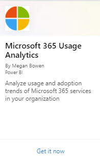
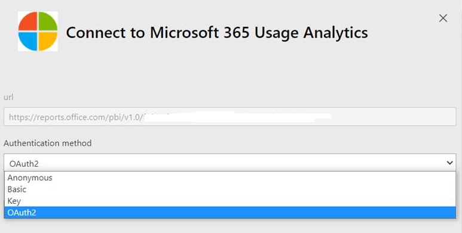

# Habilitar a análise de uso do Microsoft 365

A análise de uso do Microsoft 365 ainda não está disponível para o Microsoft 365 US Government Community.
  
## Etapas para habilitar a análise de uso do Microsoft 365

Para começar a usar a análise de uso do Microsoft 365, primeiro você deve disponibilizar os dados no Centro de administração do Microsoft 365 e iniciar o aplicativo de modelo no Power BI.
  
### Obter o Power BI

Se você ainda não tiver o Power BI, poderá [se inscrever no Power BI Pro](https://go.microsoft.com/fwlink/p/?linkid=845347). Selecione **Experimentar gratuitamente** para se inscrever em uma avaliação ou **Comprar agora** para obter o Power BI Pro.
  
  
Você também pode expandir **Produtos** para comprar uma versão do Power BI. 

> [!NOTE]
> Você precisa de uma licença do Power BI Pro para instalar, personalizar e distribuir um aplicativo de modelo. Para obter mais informações, consulte [Prerequisites](/power-bi/service-template-apps-install-distribute?source=docs#prerequisites).

Para compartilhar seus dados, você e as pessoas com quem você compartilha os dados precisam de uma licença do Power BI Pro ou o conteúdo precisa estar em um espaço de trabalho em um [serviço premium do Power BI.](/power-bi/service-premium-what-is) 
  
### Habilitar o aplicativo de modelo

Para habilitar o aplicativo de modelo, você precisa ser um **administrador global.**
  
Confira [mais informações sobre funções de](../add-users/about-admin-roles.md) administrador. 
  
1. No centro de administração do, vá para a página **Relatórios** \> <a href="https://go.microsoft.com/fwlink/p/?linkid=2074756" target="_blank">Uso</a>. 
    
2. Na página **Uso,** localize o cartão de análise de uso do **Microsoft 365** e selecione **Começar**.
    
3. No painel Relatórios que é aberto, de acordo com **Make data available to Microsoft 365 usage analytics for Power BI** to **On** \> **Save**. 
  
O processo de coleta de dados será concluído em duas a 48 horas, dependendo do tamanho do locatário. O **botão Ir para o Power BI** será habilitado (não mais cinza) quando a coleta de dados for concluída. 
    
### Iniciar o aplicativo de modelo

Para iniciar o aplicativo de modelo, você precisa ser um administrador **global,** um leitor de **relatório,** um administrador do **Exchange,** um administrador **do Skype for Business** ou um administrador do **SharePoint.** 
  
1. Copie a ID do locatário e selecione **Ir para Power BI**.
    
2.  Quando chegar ao Power BI, entre. Em **seguida, selecione** -> **Aplicativos Obter aplicativos** no menu de navegação.    
  
3. Na guia **Aplicativos,** digite o Microsoft 365 na caixa de pesquisa e selecione Análise de uso do **Microsoft 365** \> **Obter agora**.

    
    
4.  Depois que o aplicativo for instalado. Selecione o azulejo para abri-lo.

5.  Selecione **Explorar aplicativo** para exibir o aplicativo com dados de exemplo. Escolha **Conectar** para conectar o aplicativo aos dados da sua organização.

6.  Escolha **Conectar**, na tela de análise de uso conectar-se ao **Microsoft 365** e digite a ID do locatário (sem traços) copiada na etapa (1) e selecione **Próximo**.
    
7. Na próxima tela, selecione **OAuth2** como o método **Authentication Entrar** \> . Se você escolher qualquer outro método de autenticação, a conexão com o aplicativo de modelo falhará.
    
    
  
8. Depois que o aplicativo de modelo é instaurou o painel de análise de uso do Microsoft 365 estará disponível no Power BI na Web. O carregamento inicial do painel levará entre 2 a 30 minutos.
  
Os agregados de nível de locatário estarão disponíveis em todos os relatórios após a aceitação. **Os detalhes no nível do usuário** só estarão disponíveis por volta do dia 5 do próximo mês de calendário após a aceitação em . Isso afetará todos os relatórios em Atividade do Usuário (Consulte Navegar e utilizar os relatórios na análise de uso do [Microsoft 365](navigate-and-utilize-reports.md) para ver e usar esses relatórios).
    
## Tornar os dados coletados anônimos

Para tornar anônimos os dados coletados para todos os relatórios, você deve ser um administrador global. Isso ocultará informações identificáveis, como nomes de usuário, grupo e site em relatórios e no aplicativo de modelo.
  
1. No centro de administração, vá para a guia **Configurações** da Organização de Configurações e, em \>  **Serviços,** escolha **Relatórios**.
    
2. Selecione **Relatórios** e escolha Exibir **identificadores anônimos.** Essa configuração é aplicada tanto aos relatórios de uso quanto ao aplicativo de modelo.
  
3. Selecione **Salvar alterações**.