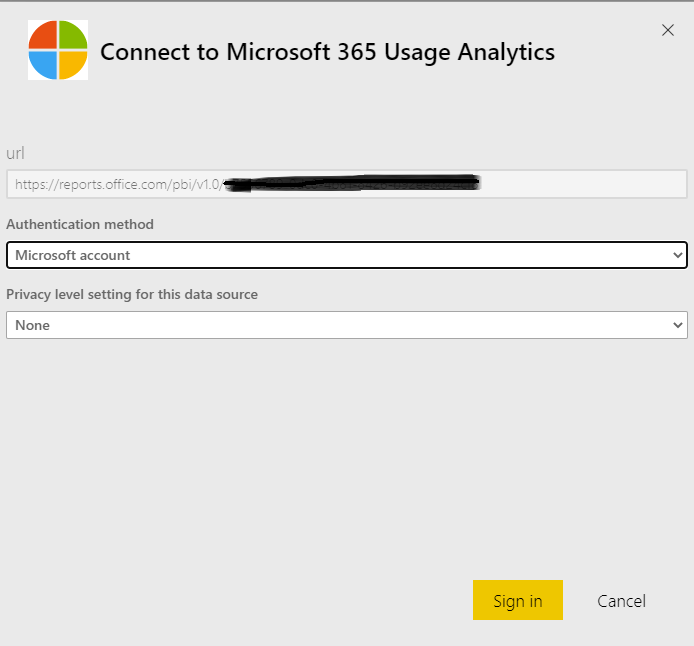

# Habilitar análise de uso do Microsoft 365Enable Microsoft 365 usage analytics

::: moniker range="o365-21vianet"

> [!NOTE]
> O centro de administração está mudando.The admin center is changing. Se a sua experiência não corresponder aos detalhes apresentados aqui, consulte [Sobre o novo centro de administração do Microsoft 365](https://docs.microsoft.com/microsoft-365/admin/microsoft-365-admin-center-preview?view=o365-21vianet).If your experience doesn't match the details presented here, see [About the new Microsoft 365 admin center](https://docs.microsoft.com/microsoft-365/admin/microsoft-365-admin-center-preview?view=o365-21vianet).

::: moniker-end

A análise de uso do Microsoft 365 ainda não está disponível para a Comunidade do governo dos EUA da Microsoft 365.Microsoft 365 usage analytics is not yet available for Microsoft 365 US Government Community.
  
## Etapas para habilitar a análise de uso do Microsoft 365Steps to enable Microsoft 365 usage analytics

Para começar a usar a análise de uso do Microsoft 365, primeiro você deve tornar os dados disponíveis no centro de administração do Microsoft 365 e, em seguida, iniciar o aplicativo de modelo no Power BI.To get started with Microsoft 365 usage analytics you must first make the data available in the Microsoft 365 admin center, then initiate the template app in Power BI.
  
### Obter o Power BIGet Power BI

Se você ainda não tem o Power BI, é possível [inscrever-se no Power bi pro](https://go.microsoft.com/fwlink/p/?linkid=845347).If you don't already have Power BI, you can [sign up for Power BI Pro](https://go.microsoft.com/fwlink/p/?linkid=845347). Selecione **tentar liberar** para inscrever-se em uma avaliação ou **Compre agora** para obter o Power bi pro.Select **Try free** to sign up for a trial, or **Buy now** to get Power BI Pro.
  
  
Você também pode expandir **Produtos** para comprar uma versão do Power BI.You can also expand **Products** to buy a version of Power BI. 

> [!NOTE]
> Você precisa de uma licença do Power BI pro para instalar, personalizar e distribuir um aplicativo de modelo.You need a Power BI Pro license to install, customize, and distribute a template app. Para obter mais informações, consulte [Prerequisites](https://docs.microsoft.com/power-bi/service-template-apps-install-distribute?source=docs#prerequisites).For more information, please see [Prerequisites](https://docs.microsoft.com/power-bi/service-template-apps-install-distribute?source=docs#prerequisites).

Você precisa de uma licença do Power BI pro para compartilhar seu conteúdo e as pessoas com as quais você o compartilha, ou o conteúdo precisa estar em um espaço de trabalho em uma [capacidade Premium](https://docs.microsoft.com/power-bi/service-premium-what-is).You need a Power BI Pro license to share your content, and the people you share it with do too, or the content needs to be in a workspace in a [Premium capacity](https://docs.microsoft.com/power-bi/service-premium-what-is). 
  
### Habilitar o aplicativo de modeloEnable the template app

Para habilitar o aplicativo de modelo, você deve ser um **administrador global**, um **leitor de relatórios**, um **administrador do Exchange**, **administrador do Skype for Business**ou **administrador do SharePoint**.To enable the template app, you have to be either a **global administrator**, **report reader**, **Exchange administrator**, **Skype for Business administrator**, or **SharePoint administrator**. 
  
Consulte [sobre funções de administrador](../add-users/about-admin-roles.md) para obter mais informações.See [About admin roles](../add-users/about-admin-roles.md) for more information. 
  
1. No centro de administração do, vá para a página**Relatórios** \> <a href="https://go.microsoft.com/fwlink/p/?linkid=2074756" target="_blank">Uso</a>.In the admin center, go to the **Reports** \> <a href="https://go.microsoft.com/fwlink/p/?linkid=2074756" target="_blank">Usage</a> page. 
    
2. Na página **uso** , localize o cartão de **análise de uso do Microsoft 365** e selecione **introdução**.On the **Usage** page, locate the **Microsoft 365 usage analytics** card, and select **Get started**.
    
3. No painel de relatórios que é aberto, defina **disponibilizar dados para a análise de uso do Microsoft 365 para o Power bi** **para ao** \> **salvar**.On the Reports panel that opens, set **Make data available to Microsoft 365 usage analytics for Power BI** to **On** \> **Save**. 
  
Isso iniciará o processo de coleta de dados e será concluído em 2 a 48 horas, dependendo do tamanho do seu locatário.This initiates the data collection process and will complete in 2 to 48 hours depending on the size of your tenant. O botão **ir para Power bi** será habilitado (não mais cinza) quando a coleta de dados estiver concluída.The **Go to Power BI** button will be enabled (no longer gray) when data collection is complete. 
    
### Iniciar o aplicativo de modeloInitiate the template app

Para iniciar o aplicativo de modelo, você deve ser um **administrador global**, um **leitor de relatórios**, um **administrador do Exchange**, **administrador do Skype for Business**ou **administrador do SharePoint**.To initiate the template app, you have to be either a **global administrator**, **report reader**, **Exchange administrator**, **Skype for Business administrator**, or **SharePoint administrator**. 
  
1. Copie a ID do locatário e selecione **ir para o Power bi**.Copy the tenant Id and select **Go to Power BI**.
    
2.  Quando chegar ao Power BI, entre.When you get to Power BI, sign in. Selecione aplicativos->obter aplicativos no menu de navegação.Select Apps->Get apps from the navigation menu.    
  
3. Na guia **aplicativos** , digite Microsoft 365 na caixa de pesquisa e selecione análise de **uso do Microsoft 365** \> **agora**.In the **Apps** tab, type Microsoft 365 in the search box and then select **Microsoft 365 usage analytics** \> **Get it now**.

    
    
4.  Depois que o aplicativo é instalado.Once the app is installed. Clique no bloco para abri-lo.Click on the tile to open it.

5.  Clique em **explorar aplicativo** para exibir o aplicativo com dados de exemplo.Click **Explore app** to view the app with sample data. Clique em **conectar** para conectar o aplicativo aos dados da sua organização.Click **Connect** to connect the app to your organization’s data.

6.  Após clicar em **conectar**, na tela **conectar ao Microsoft 365 Usage Analytics** , digite a ID do locatário (sem traços) que você copiou na etapa (1) e selecione **Avançar**.After clicking **Connect**, on the **Connect to Microsoft 365 usage analytics** screen, type in the tenant Id (without dashes) you copied in step (1), and select **Next**.
    
7. Na tela seguinte, selecione **conta da Microsoft** como o **método de autenticação** \> **entrar**.On the next screen, select **Microsoft account** as the **Authentication method** \> **Sign in**. Se você escolher qualquer outro método de autenticação, a conexão com o aplicativo de modelo irá falhar.If you choose any other authentication method, the connection to the template app will fail.
    
    
  
8. Depois que o aplicativo de modelo é instanciado, o painel de análise de uso do Microsoft 365 estará disponível no Power BI na Web.Once the template app is instantiated the Microsoft 365 usage analytics dashboard will be available in Power BI on the web. O carregamento inicial do painel levará entre 2 e 30 minutos.The initial loading of the dashboard will take between 2 to 30 minutes.
  
Os agregados de nível do locatário estarão disponíveis em todos os relatórios.Tenant level aggregates will be available in all reports. Os **detalhes no nível do usuário só ficarão disponíveis após o 1º ou o 15º dia do mês do calendário após o recebimento**.**User-level details will only become available after the 1st or 15th day of the calendar month after opting in**. Isso afetará todos os relatórios da atividade do usuário (consulte [navegar e usar a análise de uso dos relatórios no Microsoft 365](navigate-and-utilize-reports.md) para obter dicas sobre como exibir e usar esses relatórios).This will impact all reports under User Activity (See [Navigate and utilize the reports in Microsoft 365 usage analytics](navigate-and-utilize-reports.md) for tips on how to view and use these reports).
    
## Tornar os dados coletados anônimosMake the collected data anonymous

Para tornar anônimos os dados coletados para todos os relatórios, você deve ser um administrador global.To make the data that is collected for all reports anonymous, you have to be a global administrator. Isso ocultará as informações de identificação, como nomes de site, de grupo e de usuário em relatórios e no aplicativo de modelo.This will hide identifiable information such as user, group and site names in reports and in the template app .
  
1. No centro de administração, vá para as **Settings** configurações da \> **organização**configurações e, na guia **Serviços** , escolha **relatórios**.In the admin center, go to the **Settings** \> **Org Settings**, and under **Services** tab, choose **Reports**.
    
2. Selecione **relatórios**e, em seguida, escolha **Exibir identificadores anônimos**.Select **Reports**, and then choose to **Display anonymous identifiers**. Essa configuração é aplicada tanto para os relatórios de uso quanto para o aplicativo de modelo.This setting gets applied both to the usage reports as well as to the template app.
  
3. Selecione **Salvar alterações**.Select **Save changes**.
