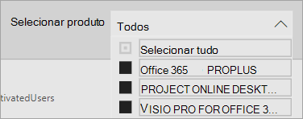
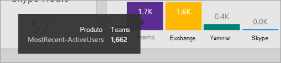

# Navegar e utilizar os relatórios da análise de uso do Microsoft 365 Navigate and utilize the reports in Microsoft 365 usage analytics

::: moniker range="o365-21vianet"

> [!NOTE]
> O centro de administração está mudando.The admin center is changing. Se a sua experiência não corresponder aos detalhes apresentados aqui, consulte [Sobre o novo centro de administração do Microsoft 365](https://docs.microsoft.com/microsoft-365/admin/microsoft-365-admin-center-preview?view=o365-21vianet).If your experience doesn't match the details presented here, see [About the new Microsoft 365 admin center](https://docs.microsoft.com/microsoft-365/admin/microsoft-365-admin-center-preview?view=o365-21vianet).

::: moniker-end

O painel mostra uma visão geral das principais métricas de uso e adoção.The dashboard provides you with a quick overview of the main usage and adoption metrics. Ao selecionar as métricas de nível superior, você pode acessar relatórios que fornecem mais detalhes e insights.By selecting the top-level metrics, you can access reports that provide more details and insights. Cada guia de relatório contém visualizações de dados específicas para um aspecto de uso e adoção da sua organização.Each report tab contains data visualizations specific to an aspect of usage and adoption for your organization. Os dados coletados são explicados no título de cada relatório e aparece um bloco que contém mais informações sobre as visualizações na guia relatório que você está exibindo.The data collected is explained in the title of each report and a tile appears that contains further information about the visualizations on the report tab that you are viewing.

Para começar com seus relatórios, aqui estão algumas dicas:To get started with your reports, here are some tips:

- Use as guias de navegação à esquerda ou em uma métrica relacionada na página **Resumo executivo** para navegar até cada relatório de nível superior.Use the navigation tabs on the left or on a related metric on the **Executive Summary** page to navigate to each top-level report.

    

- Use as guias de navegação na parte superior de cada relatório de nível superior para navegar para relatórios diferentes dentro desse nível.Use the navigation tabs at the top of each top-level report to navigate to different reports within that level.

    

- Muitos relatórios contêm uma segmentação de, onde você pode filtrar o produto, atributo AAD ou atividade que você deseja exibir.Many reports contain a slicer where you can filter on the product, AAD attribute, or activity that you want to view. Podem ser seleção única ou seleção múltipla.These can be either single-select or multi-select.

    

    

- Passe o mouse sobre os pontos de dados para ver um texto explicativo que contém detalhes.Hover over data points to view a callout that contains details.

    

O usuário que instanciou o aplicativo de modelo terá a capacidade de personalizar o relatório às suas necessidades.The user who has instantiated the template app will have the ability to customize the report to their needs. Para personalizar o aplicativo de modelo:To customize the template app:

- Selecione **Editar relatório** na parte superior do relatório.Select **Edit report** at the top of the report.

    

- Crie seus próprios recursos visuais usando os [conjuntos de dados](usage-analytics-data-model.md) subjacentes.Create your own visuals by using the underlying [datasets](usage-analytics-data-model.md).

- Use a Área de trabalho do PowerBI para trazer suas próprias fontes de dados.Use PowerBI Desktop to bring in your own data sources.

Para compartilhar seus relatórios, basta selecionar o botão compartilharTo share your reports, just select the share button  na parte superior da página.at the top of the page.

Para saber como personalizar os relatórios, consulte [Personalizando os relatórios na análise de uso do Microsoft 365](customize-reports.md).To learn how to customize the reports, see [Customizing the reports in Microsoft 365 usage analytics](customize-reports.md).

Você pode encontrar muitas informações adicionais na documentação de ajuda do Power BI:You can find lots of additional information in the Power BI help documentation:

- [Conceitos básicos do Power BIPower BI basic concepts](https://docs.microsoft.com/power-bi/service-basic-concepts)

    Saiba mais sobre Dashboard, DataSets, relatórios e outros conceitos do Power BI.Learn about dashboard, datasets, reports, and other Power BI concepts.

- [Introdução ao Power BIGet started with Power BI](https://docs.microsoft.com/power-bi/service-get-started?wt.mc_id=O365_Reports_PBI_contentpack)

    Aprenda a funcionalidade básica no Power BI. Encontre links sobre como usar a Área de trabalho do Power BI.Learn the basic functionality in Power BI. Find links to how to use Power BI Desktop.

- [Compartilhe painéis e relatóriosShare dashboards and reports](https://docs.microsoft.com/power-bi/service-share-dashboards)

    Saiba como compartilhar relatórios com seus colegas ou pessoas fora da sua organização.Learn how to share reports with your colleagues or people outside your organization. Você também pode compartilhar o relatório ou uma versão filtrada do relatório.You can also share the report or a filtered version of the report.
