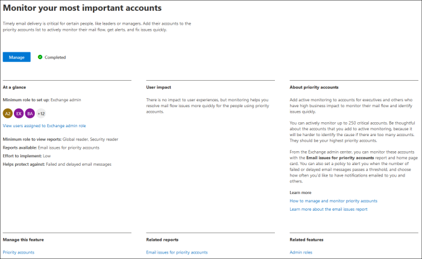
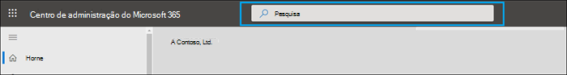
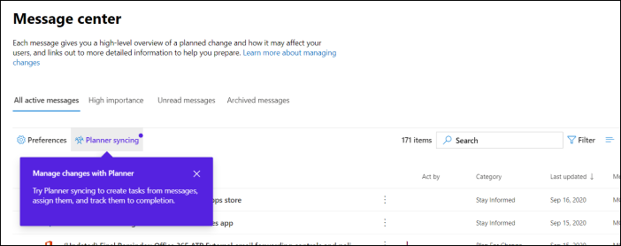
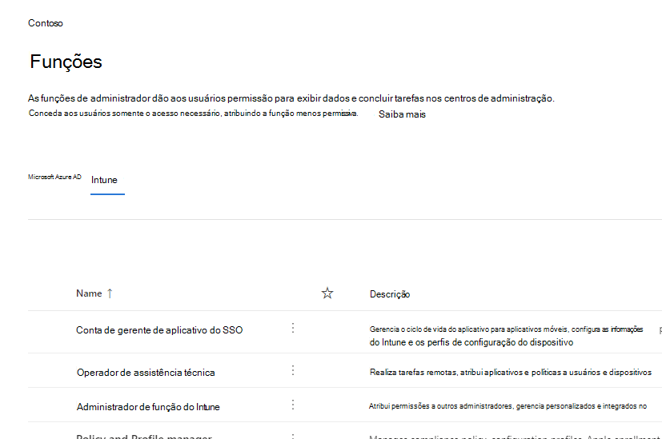
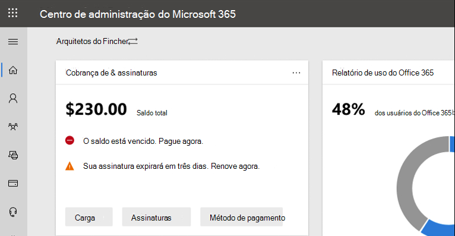
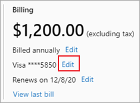
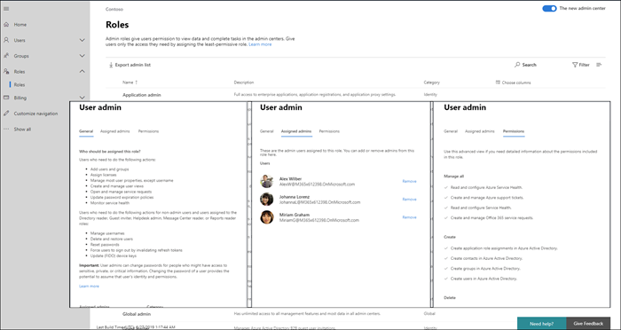

# Novidades no centro de administração do Microsoft 365

::: moniker range="o365-21vianet"

> [!NOTE]
> Algumas das informações neste artigo podem não se aplicar ao Office 365 operado pela 21Vianet.

::: moniker-end

Estamos continuamente adicionando novos recursos ao Centro de administração do [Microsoft 365,](microsoft-365-admin-center-preview.md)corrigindo problemas que aprendemos e fazendo alterações com base em seus comentários. Dê uma olhada abaixo para ver o que está disponível para você hoje. Alguns recursos são lançados em velocidades diferentes para nossos clientes. Se você ainda não estiver vendo um recurso, tente adicionar a [si mesmo ao lançamento direcionado.](manage/release-options-in-office-365.md)

E se você quiser saber as novidades de outros serviços de nuvem da Microsoft:

- [Novidades no Azure Active Directory](https://docs.microsoft.com/azure/active-directory/fundamentals/whats-new)
- [Novidades no Centro de administração do Exchange](https://docs.microsoft.com/Exchange/whats-new)
- [Novidades do Microsoft Intune](https://docs.microsoft.com/mem/intune/fundamentals/whats-new)
- [Novidades no centro de conformidade do Microsoft 365](https://docs.microsoft.com/Office365/SecurityCompliance/whats-new)
- [Novidades no Microsoft 365 Defender](https://docs.microsoft.com/microsoft-365/security/mtp/whats-new)
- [Novidades no centro de administração do SharePoint](https://docs.microsoft.com/sharepoint/what-s-new-in-admin-center)
- [Atualizações do Office](https://docs.microsoft.com/OfficeUpdates/)

## Ignite 2020 (agosto & setembro)

Bem-vindo ao Microsoft Ignite , nosso primeiro Ignite somente online. Esperamos vê-lo em uma de nossas sessões: Catálogo de Sessões do [Microsoft Ignite 2020.](https://myignite.microsoft.com/sessions) Aqui estão apenas algumas das coisas que vamos falar no Ignite. 
> [!NOTE]
> Nem todos os recursos estarão disponíveis imediatamente para todos. Se você não estiver vendo os novos recursos, in [join Targeted Release](manage/release-options-in-office-365.md).

### Gerenciamento de vários locatários

Desenvolvemos um conjunto de recursos para administradores de vários locatários como você para fazer seu trabalho de forma mais rápida e eficiente. Para obter mais informações, [consulte Gerenciar vários locatários.](multi-tenant/manage.md)

- **Seus locatários:** alternar rapidamente entre os locatários que você gerencia.
- Todos os **locatários:** uma nova página onde você pode ver rapidamente a saúde de todos os serviços de seus locatários, quaisquer solicitações de serviço abertas, seus produtos e cobranças, tarefas de configuração recomendadas e o número de usuários nesse locatário.
- **Instalação**: a página de instalação de vários locatários oferece uma exibição de lista da página de Instalação, mas organizada para muitos locatários. Você pode ver quais recursos não estão ligado, quais tarefas estão concluídas para todos os locatários, tarefas que os locatários ainda precisam concluir. Essa exibição ajudará você a acompanhar a adoção de recursos e a garantir que as tarefas de configuração de segurança recomendadas sejam sempre realizadas.
- **Saúde do** serviço: a exibição de saúde do serviço mostra se qualquer incidente ou aviso está afetando os locatários. Ele até mesmo dirá quantos de seus locatários gerenciados são afetados. Basta selecionar um incidente para obter mais informações na guia visão geral e, em seguida, alternar para a guia Locatários afetados para detalhar e dar suporte a esse locatário.
- **Migrações de** caixa de correio entre locatários é um novo serviço, agora na visualização pública, que permite mover caixas de correio entre locatários sem a necessidade de removê-los e, em seguida, fazer a integração de caixas de correio. 
- **Compartilhamento de domínio entre** locatários: em breve, você pode ingressar em uma visualização privada para recursos que permitem compartilhar um domínio entre vários locatários. Por exemplo, se a Contoso adquirir Wingtip Toys, a Contoso poderá compartilhar o domínio com Wingtip Toys para que as pessoas em ambos os locatários possam usar "contoso.com" como seus endereços de email.

### Monitorar suas contas mais importantes

Você pode monitorar e acompanhar mensagens de email com falha ou atraso enviadas aos usuários que têm um alto impacto nos negócios, como seu CEO. Você acompanha as contas de prioridade adicionando usuários à sua lista de contas prioritárias no Centro de administração do Microsoft 365. Adicione executivos, líderes, gerentes ou outros usuários que tenham acesso a informações confidenciais ou de alta prioridade.

As contas de prioridade só estão disponíveis para organizações que atendem a ambos os seguintes requisitos:

- Office 365 E3, Microsoft 365 E3, Office 365 E5 ou Microsoft 365 E5.
- Pelo menos 10.000 licenças e pelo menos 50 usuários ativos mensais do Exchange Online.

Há duas maneiras de começar:

- Vá para **Usuários** e, no menu "mais ações", selecione Gerenciar contas **de** prioridade para adicionar usuários à lista.
- Vá para **a Instalação,** encontre a tarefa de instalação **Monitore suas contas mais importantes** e selecione **Começar.**

Para obter mais informações sobre contas de prioridade, confira [Contas de prioridade de monitoramento.](https://docs.microsoft.com/microsoft-365/admin/setup/priority-accounts)

### Pesquisar mais rapidamente e obter melhores resultados de qualquer página

Começamos a lançar uma nova experiência de Pesquisa para o centro de administração e não podemos esperar que você experimente. 

- A caixa de pesquisa foi movida para a área de header onde diz "Centro de administração do Microsoft 365" para que você agora pesquise em qualquer página, não apenas na Home page. Até temos um atalho: **Alt+S.**
- A pesquisa é mais inteligente e lhe dará melhores resultados, ainda mais rápido. Tente digitar "2fa" para começar.
- Os resultados da pesquisa são organizados pelo tipo de item ou ação que você pode tomar.
  - **Usuários:** selecione o nome do usuário e você pode editar esse usuário ali mesmo. Se você selecionar o menu "mais ações" ao lado do nome, poderá redefinir a senha. Você pode pesquisar por nome de exibição, sobrenome, nome, nome de usuário ou endereço de email principal e aliases de email. Mas para obter uma combinação exata, pesquise pelo endereço de email principal ou nome de usuário.
  - **Grupos:** Edite o grupo de qualquer página, adicione membros, atribua proprietários.
  - **Ações:** semelhante a como você pode pesquisar por um usuário e redefinir a senha dele, também pode pesquisar "redefinir senha" em qualquer página e redefinir uma ou mais senhas para os usuários.
  - **Navegação:** os resultados em Navegação podem ajudá-lo rapidamente a acessar uma página no centro de administração rapidamente. Por exemplo, pesquisar "funções" levará você à página Funções para funções do Azure AD.
  - **Configurações:** procure qualquer configuração relacionada à sua organização, os serviços nos quais você se inscreve e as configurações de segurança e privacidade. 
  - **Domínios**: você pode encontrar links rápidos para seus domínios e, em seguida, o link levará você para a página visão geral e de saúde desse domínio.
  - **Documentação:** se não encontrarmos um resultado para você, tentaremos encontrar alguma documentação para ajudar. Demora um pouco mais para que a lista de artigos formatada encontre uma combinação, portanto, aguarde um segundo para permitir que a Pesquisa encontre os resultados. 
  - **Comentários:** Não encontrou o que estava procurando? Envie-nos comentários da Pesquisa. Adicionaremos a funcionalidade de pesquisa para mais páginas e mais recursos no centro de administração.

### Aplicativo móvel de administrador do Microsoft 365

O aplicativo móvel de administrador do [Microsoft 365,](https://www.microsoft.com/microsoft-365/business/manage-office-365-admin-app)que está incluído na sua assinatura, permite gerenciar o Microsoft 365 em seu dispositivo móvel para que você possa sair da sua mesa para realizar tarefas diárias. Na verdade, há mais de 90 recursos no aplicativo e adicionamos mais alguns:

- Suporte para o Gerenciamento de Aplicativos Móveis e políticas de Acesso Condicional do **Microsoft Intune:** agora você pode usar seu dispositivo pessoal para gerenciar o Microsoft 365, mesmo que sua organização tenha ligado o Gerenciamento de Aplicativos Móveis e as políticas de acesso condicional do Intune.
- **Notificações do centro de mensagens:** ative as notificações do centro de mensagens em Notificações de Configurações se quiser ser alertado sobre novas   >   postagens do centro de mensagens. Por meio de notificações, queremos garantir que você se mantenha informado sobre informações e eventos importantes em seu locatário.
- **Alertas de** cobrança: você também pode ativar as notificações de cobrança em Notificações de Configurações se quiser receber notificações de cobrança em seu dispositivo se uma assinatura estiver prestes  >   a expirar.
- **Modo escuro:** bem-vindo ao lado escuro do aplicativo móvel. Esse foi um dos nossos recursos mais solicitados. Vá para **Temas**  >  **de Configurações para** a ativar.
- **Relatar um problema:** agora você pode relatar um problema no aplicativo ou exibir problemas relatados por outros administradores. Visite **a saúde do** serviço para fazer check-out.

### Recomendações de uso para pequenas e médias empresas

Pequenas e médias empresas poderão receber uma recomendação na **home** page se algumas pessoas na organização não usarem ativamente os aplicativos do Teams, OneDrive ou Office. Ao exibir a recomendação, você pode enviar rapidamente um treinamento da Microsoft para usuários inativos para ajudá-los a começar a usar o aplicativo e para garantir que você está recebendo o valor total de suas assinaturas.

### Conjunto de trabalho remoto

Em outubro, adicionaremos uma coleção de trabalho remota para ajudar os proprietários de pequenas empresas e seus funcionários a ficar online e a trabalhar remotamente.  **A configuração de conceitos** essenciais de trabalho remoto é uma lista de todos os recursos que a Microsoft recomenda para habilitar com segurança o trabalho remoto e colaborar de forma eficaz. Em algumas semanas, você pode experimentar no **trabalho** da Instalação  >  **Remota no essencial.**

Para obter mais informações sobre como permitir com segurança o trabalho remoto e um endereço web útil que seja fácil de lembrar e compartilhar, acesse [aka.ms/remote-business](https://aka.ms/remote-business).

### Precisa de ajuda? mover para mais centros de administração

Estamos continuamente analisando e atualizando o conteúdo e as ferramentas para acompanhar as alterações no produto. Agora temos muito mais ferramentas de diagnóstico de autoatendências para ajudá-lo a resolver problemas de forma rápida e eficiente. Aqui estão alguns que foram adicionados recentemente:

- Alterar a política de replicação do Serviço Web do Exchange
- Verificando o status de provisionamento e validação do Teams para usuários específicos
- Corrigir problemas de instalação do DKIM
- Diagnosticar erros de registro do usuário do Intune

E estamos lançando a nova e aprimorada experiência de suporte que você já vê no centro de administração do Microsoft 365 para alguns dos outros centros de administração. O Centro de Administração do Teams e os Centros de Administração de Conformidade e Segurança já têm essa nova experiência. E, em breve, o Centro de administração do **Exchange,** o Centro de administração do **SharePoint** **e** Office.com serão atualizados juntamente com essa nova experiência de ajuda para administradores.

### Gerenciar alterações com o Microsoft Planner

Em maio, anunciamos que você poderá sincronizar as postagens do Centro de mensagens no Microsoft Planner e agora ele estará disponível para todos usarem.  Agora você pode criar tarefas a partir de mensagens, atribuí-las e rastreá-las até a conclusão. Na primeira vez, você seleciona **a sincronização** do Planner e precisa se conectar ao plano apropriado.

Para saber mais sobre isso, confira este artigo e vídeo para ver como ele funciona: acompanhar as [postagens](https://docs.microsoft.com/Office365/Planner/track-message-center-tasks-planner) do centro de mensagens no Planner

### Documentação, treinamento e vídeos

- Brand new and just in time for Microsoft Ignite--[The Virtual Hub](https://adoption.microsoft.com/virtual-hub/). Adoção profunda do treinamento técnico para profissionais de IT e desenvolvedores. Encontre rapidamente cerca de 20 novos vídeos como parte #SIDETRACKED, o nome da faixa de administração do Ignite neste ano.
- Novidades na série de vídeos do [Microsoft 365:](https://www.youtube.com/watch?v=OVjb2lGJ4GU&t=2s) este mês, abrangemos novos recursos disponíveis no Quadro de Opções para o Teams e na Web, como automatizar o provisionamento de usuários para o Azure AD, novos gatilhos e ações do Power Automate no Teams e muito mais. E fique atento para o próximo mês, onde teremos uma recapitulação de todas as coisas boas que estão acontecendo no Ignite!
- Fizemos uma reformulação da página de documentação [do Microsoft 365](https://docs.microsoft.com/microsoft-365) que se concentra primeiro nas soluções. Destacaremos novas soluções à medida que elas se tornarem disponíveis nesta página, portanto, fique atento.

## Julho de 2020

### Preparando-se para o Ignite 2020

À medida que estamos mudando para a estação do Ignite na Microsoft, não lançaremos tantos recursos para que tenhamos muito sobre o que falar durante nossas sessões.

A próxima atualização deste artigo será no dia de abertura do primeiro Ignite somente online. E este ano, é gratuito participar! Confira, entre em: [Microsoft Ignite 2020.](https://www.microsoft.com/ignite)

### Seus produtos

Houve muito trabalho no gerenciamento de assinaturas para tornar a página mais rápida de carregar, encontrar o que você está procurando e atender aos padrões de acessibilidade da Web (diretrizes[WCAG 2.1).](http://www.w3.org/TR/WCAG21/)

- **Reprojeto de** tabela: a tabela foi reprojetada para que você possa agrupar assinaturas semelhantes. Vá para **Cobrança de**  >  **seus produtos.**
- **Detalhes do** produto: obter mais detalhes do que nunca sobre suas assinaturas selecionando o produto na lista.
- **Faça tudo a partir daqui:** e você não precisa ir para pular várias páginas para gerenciar um produto. Por exemplo, se você precisar cancelar uma assinatura, o painel será aberto para fazer a ação logo ali.

### Domínios

O gerenciamento de domínios pode ser complicado, e lançamos um novo recurso para facilitar isso. Vá para Configurações > Domínios e selecione um domínio para obter mais informações sobre seu domínio e a saúde do domínio.

:::image type="content" source="../media/MAC-WN-DomainDNS.PNG" alt-text="Página de detalhes de domínios para contoso.com":::

### Documentos, treinamentos e vídeos (julho de 2020)

Novidades na série de vídeos do [Microsoft 365:](https://youtu.be/m1Nu8WJgCDY) este mês, abrangemos a nova experiência do Yammer para Web e dispositivos móveis, como integrar o aplicativo Comunidades do Yammer para o Microsoft Teams, novos pacotes de políticas para dar suporte a trabalhadores e gerentes da linha de frente e muito mais.

## Junho de 2020

### Acompanhar o gerenciamento do Office What's New

Alguns meses atrás, adicionamos uma configuração que permite gerenciar as mensagens do [What's New](#office-whats-new-management)que aparecem nos aplicativos do Office de um usuário. Este mês, lançamos um novo cartão de home page que  ajudará você a agir rapidamente e a acompanhar as mensagens de Novidades que você deseja mostrar aos usuários em sua organização.

### Documentos, treinamentos e vídeos (junho)

- [Como começar a trabalhar com o Teams](https://support.microsoft.com/office/184f1aba-2f91-43f0-86e1-9fae607e24f6)

## Maio de 2020

### Novo canal de atualização do Office

Em 12 de maio, anunciamos a disponibilidade de um novo canal de atualização para o Office: Canal Empresarial Mensal. Este canal de atualização fornece aos usuários novos recursos do Office uma vez por mês, na segunda terça-feira do mês.

Se você permitir que os usuários instalem o Office por conta própria a partir do portal, poderá selecionar o Canal Empresarial Mensal para eles. Para fazer isso, entre no centro de administração do Microsoft 365 e vá para Mostrar todas as configurações da Organização de Configurações configurações de  >   >    >    >  **download de software do Office.** Se você selecionar Uma vez por mês (Canal Empresarial **Mensal),** qualquer nova instalação do Office será configurada para usar o Canal Empresarial Mensal.

Em conjunto com o lançamento do Canal Empresarial Mensal, também estamos revisando os nomes dos canais de atualização existentes. Por exemplo, o Canal Mensal está sendo renomeado para Canal Atual. Os novos nomes vigoram em 9 de junho de 2020.

Para obter mais informações, consulte [Alterações nos canais de atualização dos Aplicativos do Microsoft 365.](https://docs.microsoft.com/DeployOffice/update-channels-changes)

### Novas funções de administrador

Adicionamos algumas novas funções de administrador do Azure Active Directory ao centro de administração do Microsoft 365.

- A função de administrador de identidade híbrida dá aos usuários permissão para gerenciar serviços de provisionamento e autenticação na nuvem.
- A função de administrador de rede permite que os usuários gerenciem locais de rede e revisem as informações de rede dos aplicativos de Software como Serviço do Microsoft 365.
- A função de administrador de impressora concede permissão para gerenciar todos os aspectos de impressoras e conexões de impressora.
- O técnico de impressora é um subconjunto da função de administrador impressora onde esses usuários podem registrar e desa registrar impressoras e atualizar o status da impressora.
Para saber mais sobre essas funções, consulte [Sobre funções de administrador.](https://docs.microsoft.com/microsoft-365/admin/add-users/about-admin-roles)

### Exportar lista de grupos

Ouvimos de muitos administradores que eles precisam compartilhar informações sobre grupos e seu uso com pessoas que não têm acesso aos centros de administração. Agora você pode exportar a lista de Grupos para um arquivo CSV para fins de auditoria, o que significa que você pode lançar esse script antigo do PowerShell. Para experimentar, vá para **Grupos** de Grupos e selecione Exportar grupos  >   **na** barra de comandos.

### Centro de soluções e arquitetura do Microsoft 365

Apenas este mês, lançamos um novo site chamado centro de soluções e arquitetura do [https://docs.microsoft.com](https://docs.microsoft.com) [Microsoft 365,](https://docs.microsoft.com/microsoft-365/solutions/solution-architecture-center)que reúne as orientações técnicas de que você precisa para entender, planejar e implementar soluções integradas do Microsoft 365 para colaboração segura e em conformidade. Neste centro, você encontrará:

- Diretrizes da solução de base
- Soluções de carga de trabalho e diretrizes de cenário
- Ilustrações de solução e arquitetura (os cartazes!!!)
- Diretrizes específicas do setor
- Entidades de design de arquitetura empresarial

### Documentos, treinamentos e vídeos (maio)

- Novidades na série de vídeos do **Microsoft 365:** este mês, abrangemos a nova experiência de suporte nos Centros de conformidade e administração do Teams, integração do Planner com o Centro de Mensagens e o novo layout de vídeo 3x3 no Microsoft Teams. 
- A página do hub de ajuda do Centro de administração do [Microsoft 365](https://docs.microsoft.com/microsoft-365/admin/) foi atualizada para ajudá-lo a encontrar o que precisa mais rapidamente. E se você olhar para essa página agora, adicionamos um cartão para informá-lo sobre atualizações e alterações importantes.

## Abril de 2020

### Gerenciamento de funções do Intune

[Abril de 2020](#april-2020)

Bem, nós conseguimos! Demos a segunda etapa para uma experiência de funções unificadas e agora você pode gerenciar as funções do Intune no centro de administração do Microsoft 365. Você também pode aproveitar recursos como a capacidade de pesquisar funções e exibir permissões de função. Isso significa que você não precisa de duas ferramentas separadas para gerenciar funções para o Microsoft 365 e o Intune. Ao entrar no centro de administração do Microsoft 365, você verá que há dois pivôs na página Funções, um para o Azure AD e outro para o Intune.

### Sincronizar postagens do Centro de Mensagens no Planner

A partir de maio, os administradores que estão no lançamento direcionado começarão a ver o botão "Sincronização do Planner" no centro de mensagens. Agora você pode controlar mensagens que precisam de ação, selecionar o tipo de mensagens que gostaria de rastrear, atribuir mensagens para acompanhar como tarefas e marcar mensagens para atenção posterior.

[Participe do Lançamento Direcionado](manage/release-options-in-office-365.md) para começar!

### "Precisa de ajuda?" lançado no centro de administração do Teams & de Segurança e Conformidade

O centro de administração do Teams, o Centro de Segurança e o Centro de Conformidade agora estão usando o mesmo "Precisa de ajuda?" recurso que o Centro de administração do Microsoft 365 usa para encontrar ajuda e entrar em contato com o suporte. Recebemos muitos comentários dos administradores de que você queria o mesmo nível de ajuda e suporte e estamos satisfeitos em trazer isso para você. Experimente e nos dê seus comentários!

#### Precisa de chat?

Nossos agentes de suporte têm trabalhado em casa enquanto ainda têm casos de clientes e limitações na largura de banda da Internet enquanto trabalham em casa podem afetar a qualidade da chamada do cliente. Para continuar dando suporte a você, iniciamos a opção de suporte ao chat ao vivo para clientes comerciais no Centro de administração do Microsoft 365.

Ao criar uma solicitação de serviço, agora você verá o chat como uma opção, além de telefone e email. Selecione o chat como um canal preferencial de comunicação e crie a solicitação. Depois de criar a solicitação, você poderá iniciar o chat quando estiver pronto para conversar com os agentes da Microsoft.

### Atualizações do Teams

Com o aumento do uso do Teams, adicionamos alguns recursos para ajudá-lo a gerenciá-los.

- Um novo cartão de recomendação na home page do centro de administração mostra quais usuários não usaram ativamente o Teams por 30 dias. Você pode enviar um email de treinamento a esses usuários para que eles possam começar a usar o Teams.
- **Reunir as pessoas com**  as equipes: Vá para a Instalação para ver uma nova página para ajudá-lo a ativar o Teams para usuários licenciados e permitir o acesso de convidados, para que você possa trabalhar com clientes externos no Teams.
- Um cartão do Microsoft Teams agora está fixado por padrão na home page. Ele mostra se o Teams está ligado e se o acesso de convidados é permitido. Ele também permite verificar o status de configuração de usuários recém-licenciados do Teams e verificar se problemas de rede podem afetar os usuários do Teams.
- Por fim, o Teams agora é uma etapa no fluxo de configuração inicial se você comprou uma licença que inclui o Teams.

### Pontuação de produtividade

A Pontuação de Produtividade fornece informações sobre como as pessoas usam os serviços de nuvem da Microsoft e as experiências de tecnologia que as suportam. A pontuação reflete o desempenho da sua organização em relação às medidas de experiência de funcionários e tecnologias e compara sua pontuação com organizações como a sua. Este mês, estamos apresentando os seguintes novos conceitos para a experiência de visualização:

- Exibição de tendências de insights principais na home page e páginas de detalhes de categoria -Categorias de Análise de Ponto de Extremidade e Conectividade de Rede adicionadas à Experiência De Tecnologia
- Percepções relevantes sobre a experiência de tecnologia mostradas nas categorias de Experiência do Funcionário
- Nova categoria de comunicações como parte da experiência do funcionário
- Detalhes do usuário com metadados organizacionais em categorias de Experiência do Funcionário

Se você quiser saber mais, confira o blog: Medir e melhorar a experiência do [Microsoft 365](https://techcommunity.microsoft.com/t5/microsoft-365-blog/measure-and-improve-the-microsoft-365-experience-with-microsoft/ba-p/1348618)com a Pontuação de Produtividade da Microsoft. A pontuação de produtividade está atualmente em visualização privada. [Participe da visualização privada da Pontuação de](https://aka.ms/productivityscorepreview) Produtividade para começar.

### Atualizações de grupos

Temos duas atualizações para Grupos este mês:

- Agora você pode editar endereços de email para grupos do Office 365 (também conhecidos como Grupos no Outlook e, em breve, ser conhecido como grupos do Microsoft 365).
- Ouvimos seus comentários e adicionamos mensagens de erro mais claras por que você não pode converter um grupo em um Microsoft Team.

### Documentos, vídeos e treinamento (abril)

Novidades na série de vídeos do **Microsoft 365:** este mês, abrangemos dicas e recursos para ajudar pequenas empresas a fazer a transição para o trabalho remoto, incluindo como lançar o Microsoft Teams, recursos de treinamento de trabalho remoto para se manter conectado com clientes e parceiros e o novo plano do Microsoft 365 Business Voice. [Novidades no Microsoft 365](https://go.microsoft.com/fwlink/p/?linkid=2118096)

#### Para seus usuários

- [Agendar uma reunião](https://support.microsoft.com/office/c61b4f61-ee62-4a06-8bf7-0a1cd302700a)
- [Participar de uma reunião do Teams](https://support.microsoft.com/office/078e9868-f1aa-4414-8bb9-ee88e9236ee4)
- [Criar uma equipe em toda a organização](https://support.microsoft.com/office/037bb27a-bcc9-48fe-8d72-44d9482420a3)
- [Criar uma equipe com convidados](https://support.microsoft.com/office/11fbb083-52ee-434d-8c6e-63711fdafac7)
- [Ingressar em uma equipe como convidado](https://support.microsoft.com/office/928d1eef-61e2-49ec-b754-c2fe86b34824)
- [Criar um endereço de e-mail do grupo](https://support.microsoft.com/office/ded875f9-a9de-437f-b559-2ae4f235bb2b)

#### Para administradores e proprietários de negócios

- [Capacitar sua pequena empresa com o trabalho remoto](https://support.microsoft.com/office/9b91a85a-39b4-40a6-a590-0f9bea0ba8e6)
- [Executando uma pequena empresa remota](https://support.microsoft.com/office/9ac1a0f1-789b-4143-b954-5821d5d89298)
- [Inscreva-se no Microsoft Business Basic](https://support.microsoft.com/office/9ac1a0f1-789b-4143-b954-5821d5d89298)
- [Configurando a login de dois fatores](https://support.microsoft.com/office/9ac1a0f1-789b-4143-b954-5821d5d89298)

## Março de 2020

### Correção de comentários em destaque: melhorar a confiabilidade "adicionar usuário" para licenciamento

Recebemos muitos comentários dos administradores sobre como é difícil atribuir licenças ao adicionar usuários. Fizemos a primeira atualização para essa correção e migramos para um serviço nos bastidores mais confiável para processar essas solicitações. E se algo der errado, você verá uma mensagem de erro que permite tentar novamente.

### Cartão da home page do Microsoft Teams

Com o uptick no uso do Teams, algumas organizações receberão um cartão de painel fixado que torna adoção do Teams mais acessível. O cartão também tem links para treinamento e documentos para ajudar sua organização na transição para o trabalho remoto. Basta ir para a **home** page para ver o novo cartão.

### Personalizar o tema do aplicativo móvel do SharePoint da sua organização

Usando o centro de administração do Microsoft 365, agora você pode personalizar o tema da sua organização no aplicativo móvel do SharePoint para iOS e aplicativo móvel do SharePoint para Android. Esse recurso fornece convenientemente uma experiência de aplicativo de intranet móvel que pode corresponder ao seu SharePoint Online para funcionários em qualquer lugar. A personalização de tema inclui a imagem do logotipo, a cor da barra de navegação, as cores do texto e do ícone e as cores de destaque, facilitando o reconhecimento.

### Melhorias no assistente "Adicionar um grupo"

Quando os administradores criaram um novo grupo e o criaram uma Equipe ao mesmo tempo, eles podem atribuir proprietários que não têm uma licença que inclua o Teams. E isso criou algumas cabeçadas. Atualizamos o fluxo do assistente para verificar se os proprietários têm uma licença do Teams e se eles não têm a opção de transformar o grupo em uma equipe está desabilitada.

### Ofertas do Microsoft 365 para pequenas e médias empresas

Sabemos que este é um anúncio para o próximo mês, mas queremos garantir que você esteja preparado.

A partir de 21 de abril, estamos fazendo alterações relacionadas às assinaturas do Office 365 para pequenas e médias empresas e ao Office 365 ProPlus. Esses produtos agora usarão a marca do Microsoft 365.

Os novos nomes de produtos entrarão em vigor em 21 de abril de 2020. Essa é uma alteração apenas no nome do produto e não há nenhuma alteração de preço ou recurso no momento.

|Nome atual |Novo nome  |
|---------|---------|
|Office 365 Business Essentials     |   Microsoft 365 Business Basic      |
|Office 365 Business Premium     |    Microsoft 365 Business Standard     |
|Microsoft 365 Business     |    Microsoft 365 Business Premium     |
|Office 365 Business     |    Microsoft 365 Apps para Pequenos e Médios negócios       |
|Office 365 ProPlus    |   Aplicativos do Microsoft 365 para empresas      |

### Vídeos, treinamentos e documentos

Novidades na série da Web do [Microsoft 365:](https://go.microsoft.com/fwlink/p/?linkid=2118096)no episódio deste mês, destacamos o aniversário de 3 anos do Microsoft Teams e abrangemos novos recursos, incluindo melhor qualidade de áudio em reuniões online, Comunicações Direcionadas para gerentes de linha de frente com o aplicativo Turnos, o Teams e a interoperabilidade do consumidor do Skype e muito mais.

## Fevereiro de 2020

### Correção de comentários em destaque: alternador de várias organizações

Recebemos muitos comentários de parceiros e administradores sobre os desafios de gerenciar várias organizações de nuvem da Microsoft. Um dos nossos primeiros recursos de gerenciamento multi org é o alternador **Organização,** que permite alterar entre as organizações que você gerencia em apenas 2 cliques.
> [!TIP]
> Você não precisa fazer nada para fazer com que o alternador da organização apareça desde que seja o Parceiro de registro de pelo menos uma organização.

1. No centro de administração do Microsoft 365, selecione o nome da organização.

2. No alternador de organização, selecione a organização que você deseja gerenciar.

Isso é literalmente!!!

### Grupos

Algumas alterações na área de grupos este mês:

- **Classificar por nome de grupo:** Você pode classificar a lista de grupos em ordem alfabética, selecionando a **coluna Nome do** grupo.
- Restaure os grupos excluídos do **Microsoft 365:** você não precisa mais ir para o Centro de administração do Exchange para restaurar grupos excluídos do Microsoft 365. Vá para o Centro de administração do **Microsoft 365** \> **Grupos** \> **Excluídos** \> grupos (selecione um grupo na lista) \> **Restaurar grupo.** Ele restaurará o grupo  de volta à lista de Grupos e restaurará o email, as conversas, o bloco de anotações, os arquivos e o calendário do grupo.

### Vídeos, treinamentos e documentos (fevereiro)

- Novidades na série de vídeos do **Microsoft 365:** este mês, estamos focados nos recursos de pesquisa personalizados para o SharePoint Online, o recurso de gerenciamento "Novidades" do Office que permite mostrar ou ocultar recursos específicos dos usuários finais por meio do painel de ajuda no aplicativo, as atualizações mais recentes de segurança e conformidade no Yammer e muito mais. Este é o último episódio: [Novidades do Microsoft 365](https://go.microsoft.com/fwlink/p/?linkid=2118096)

- **Movimentação de documentos:** combinamos os artigos da Web de administrador do Office 365 com o conteúdo do Microsoft 365 e você deve ter notado a nova URL. Por exemplo, este artigo costumava ser hospedado em: **docs.microsoft.com/Office365/Admin/whats-new-in-preview**, mas a URL agora é: **docs.microsoft.com/microsoft-365/admin/whats-new-in-preview**. Se você tiver páginas marcadas com indicadores, atualize seus links; No entanto, os links de conteúdo serão redirecionados para o novo novo conteúdo.

## Janeiro de 2020 - Feliz Ano Novo

> [!NOTE]
> Você sabe que há uma série de vídeos Novidades do [Microsoft 365](https://go.microsoft.com/fwlink/p/?linkid=2118096) no YouTube? Ele destaca os recursos mais recentes que foram lançados para os usuários. Todo mês, vamos começar a vincular ao último episódio na seção [Vídeos, treinamentos e documentos.](#videos-training-and-docs)     Este é o último episódio: [Novidades do Microsoft 365](https://go.microsoft.com/fwlink/p/?linkid=2118096)

### Modo escuro

Quando disponibilizamos o modo escuro pela primeira vez, ele estava disponível apenas na home page. O modo escuro agora está fora de visualização e está no lançamento direcionado na maioria das páginas no centro de administração.

1. Primeiro, você precisará ativar o Lançamento Direcionado: Vá para Configurações  \> **Configurações Preferências** de versão do \> **perfil** \> **da organização.**
1. Em seguida, para ativar o modo escuro, vá para a **Home** page e selecione o **botão Modo** Escuro. (Ele está ao lado do **campo Pesquisar** e este artigo é **o novo** link.)
1. Para qualquer página que tenha o modo escuro disponível, o botão fica na parte superior da página, ao lado da nova alternância **do centro** de administração.

### Gerenciamento de Novidades do Office

Os administradores querem controle sobre como a Microsoft comunica "Novidades" aos usuários nos aplicativos do Office, e agora você tem esse controle. Vá para **Configurações** \> **Office What's New management Preview**. Selecione um recurso para exibir seus detalhes  e, em seguida, você pode selecionar o botão Ocultar de usuários se não quiser que seus usuários vejam uma mensagem específica "novidades". Por exemplo, sua organização pode estar aguardando para que os usuários saibam sobre um recurso até que todos em sua organização sejam treinados sobre ele.

Esse recurso foi lançado pela primeira vez para visualização em novembro, mas há algumas atualizações de recursos que você deve conhecer: atualizações de visualização de gerenciamento do [Office What's New](https://techcommunity.microsoft.com/t5/microsoft-365-blog/office-what-s-new-management-preview/ba-p/1020438) agora disponíveis

### Parceiros

Olá, Parceiros! (Não pôde ajudar a mim mesmo.) Também temos uma atualização para você este mês. Há um novo recurso que permite aos parceiros dar aos clientes CSP a opção  de aceitar o MCA (Contrato de Cliente Microsoft) na seção De cobrança do centro de administração. Nesta nova experiência:

1. O cliente recebe um email de convite com um link para aceitar a relação de parceiro e o MCA.
2. Depois que o cliente entrar, ele poderá exibir e aceitar as permissões do MCA e do parceiro- direto do centro de administração.

### Caixas de correio de recurso

A lista de caixas de correio de recursos foi atualizada para o novo estilo. No centro de administração do Microsoft 365, vá para Salas de Recursos **&** \> **equipamento.**

### Vídeos, treinamentos e documentos (janeiro)

Confira o treinamento para administradores de pequenas empresas lançado em janeiro:

- [Criar seu site de negócios](https://support.microsoft.com/office/3325d50e-d131-403c-a278-7f3296fe33a9)
- [Encontrar respostas e ajuda](https://support.microsoft.com/office/7f681212-c649-4a3e-a43b-32b1d1e58988)
- [Obter ajuda ou suporte](https://support.microsoft.com/office/18948a4c-3eb1-4b30-b1bc-a4cc29eb7655)
- [Excluir um usuário](https://support.microsoft.com/office/6bcdad7b-732a-4260-997a-8c176bc3d9d6)
- [Escolher uma assinatura da Microsoft](https://support.microsoft.com/office/b9f7c78e-430f-4117-89ec-2eeb1dced2ca)
- [Visão geral da segurança do Microsoft 365 para empresas](https://support.microsoft.com/office/3274b159-a825-46d7-9421-7d6e209389d1)

## Novembro e dezembro de 2019

Estamos combinando as notícias de novembro e dezembro porque, depois do Ignite, fizemos muito poucos comunicados. Veja você no novo ano!

### Mudar de cartão de crédito para pagamento por fatura

Começamos a lançar a capacidade de alterar sua forma de pagamento de cartão de crédito para fatura. Vá para **Cobrança de** \> **Seus produtos,** selecione  uma assinatura e, em seguida, selecione o link Editar ao lado do pagamento do cartão de crédito.

Deseja ler mais sobre isso? [Mudar de cartão de crédito ou conta bancária para fatura](../commerce/billing-and-payments/change-payment-method.md)

### Leitor global

Mencionamos a função de leitor global em outubro de [2019 - Ignite Edition,](#october-2019---ignite-edition)mas conforme ela está sendo implantada mais amplamente, vamos discutir alguns detalhes:

- A função de leitor global é a contraparte somente leitura da função de administrador global. O leitor global pode ver tudo o que o administrador global tem permissão para fazer.
- Com algumas exceções, como alguns recursos de conformidade e segurança, os leitores globais têm acesso para exibir todos os centros de administração de nuvem da Microsoft que sua organização está licenciada para usar.
- Atribua a função de leitor global aos usuários que precisam dela para planejamento, auditorias e investigações.
- Você também pode combinar a função de leitor global com outra função que tenha menos permissões. Por exemplo, um proprietário de pequenas empresas pode ter as funções de leitor global do administrador de cobrança para que ele possa pagar as contas e ficar por dentro das alterações em sua organização  +   na nuvem.
- Os leitores globais podem acessar qualquer página no Centro de administração do Microsoft 365. Quando abrirem uma página editável, haverá um aviso na parte superior dizendo que eles não têm permissão para salvar alterações, e o botão Salvar será desabilitado.

We'd love to get your feedback about the global reader role and any of the role-based permissions that you'd like to see in the future. [Fazer comentários sobre permissões baseadas em função](https://office365.uservoice.com/forums/273493-office-365-admin/suggestions/10115430-have-a-consistent-experience-when-assigning-admin)

### Página Novas Configurações

O **perfil organização,** **&** privacidade e as páginas de & de serviços foram **combinadas** em uma página com três guias verticais. E a melhor parte – de um único local, agora você pode procurar todas as configurações.

### Documentos & treinamento

Esta seção é um novo recurso deste artigo, onde vamos começar a vincular a novos treinamentos e documentação que achamos interessantes.

Em novembro, lançamos alguns caminhos de aprendizado para o site [Microsoft Learn](https://docs.microsoft.com/learn/) para ajudar os profissionais de IT a aprender sobre e se treinar no Microsoft 365. Confira:

- [Conceitos básicos do Microsoft 365](https://docs.microsoft.com/learn/paths/m365-fundamentals/)
- [Estender os conceitos básicos do Office](https://docs.microsoft.com/learn/paths/extend-office-fundamentals/)
- [Microsoft 365 - Modernizar sua implantação corporativa com o Windows 10 e o Microsoft 365 Apps para empresas](https://docs.microsoft.com/learn/paths/m365-getmodern/)
- [Gerenciar a implantação empresarial com o Microsoft 365](https://docs.microsoft.com/learn/paths/manage-enterprise-deployment-m365/)
- [Atualizar o Microsoft Office para TI em escala](https://docs.microsoft.com/learn/paths/m365-office-for-it/)
- [Fornecer áreas de trabalho remotas e aplicativos do Azure com a Área de Trabalho Virtual do Windows ](https://docs.microsoft.com/learn/paths/m365-wvd/)
- [Modernize seu local de trabalho com o Microsoft 365 e o Surface para Empresas](https://docs.microsoft.com/learn/paths/modernize-workplace-with-m365-and-surface/)
- [Proteger a identidade e o acesso com o Microsoft 365](https://docs.microsoft.com/learn/paths/m365-identity/)
- [Proteja as informações da empresa com o Microsoft 365](https://docs.microsoft.com/learn/paths/m365-information-protection/)
- [Gerenciar a segurança com o Microsoft 365](https://docs.microsoft.com/learn/paths/m365-security-management/)
- [Defender-se contra ameaças com o Microsoft 365 Defender](https://docs.microsoft.com/learn/paths/m365-security-threat-protection/)
- [Gerenciar a colaboração em equipe com o Microsoft Teams](https://docs.microsoft.com/learn/paths/m365-manage-team-collaboration/)
- [Colaborar com o SharePoint no Microsoft 365](https://docs.microsoft.com/learn/paths/m365-teams-sharepoint/)

## Outubro de 2019 - Ignite Edition

Bem-vindo ao Ignite Edition do What's new in the Microsoft 365 admin center! Obviamente, essa não é uma lista completa de anúncios, mas aqui estão alguns destaques. Além disso, confira os blogs do Ignite para obter mais informações sobre versões:

- [ADMIN - Melhorias de segurança, produtividade e rede para o Microsoft 365.](https://techcommunity.microsoft.com/t5/Microsoft-365-Blog/ADMIN-Security-Productivity-and-Network-Enhancements-for/ba-p/964019)
- [Novidades no Microsoft Teams - Ignite 2020.](https://techcommunity.microsoft.com/t5/Microsoft-Teams-Blog/What-s-New-in-Microsoft-Teams-Ignite-2019/ba-p/937025)

### Controle de acesso baseado em função

Houve muitas alterações nas funções no centro de administração desde que começamos a lançar em junho:

- **Comparar funções** - Selecione até três funções para comparar as permissões de cada uma. Isso ajudará você a encontrar a função menos permissiva a atribuir aos usuários. Go to **Roles**, use the multi-select checkbox in the first column to choose up to 3 roles, and then select **Compare roles**.

    

- Favoritos - Você pode adicionar uma estrela às suas funções favoritas ou mais **usadas,** para que possa encontrá-las facilmente, classificação da coluna ou criação de um filtro.
- **Usuários ativos**  >  **Gerenciar funções** - Ele foi atualizado para se alinhar com as alterações em Funções. Assim como na lista de funções, definimos o escopo da lista padrão de funções para as mais úteis, mas você pode ver todas as funções expandindo **Mostrar tudo por categoria.**
- **Função de leitor global** - Você solicitou! Você conseguiu! A [função de leitor](add-users/about-admin-roles.md) global!

### Relatar um problema

A saúde do serviço foi atualizada para o novo estilo e, se você for afetado  por um problema que não está aparecendo no painel de saúde do serviço, poderá relatar um problema para informar à Microsoft. Vá para a **saúde**  >  **do Serviço de Saúde.**

### Assinaturas "Ela"

Como você sabe, os usuários podem ativar assinaturas gratuitas para uma série de produtos como o Power BI e o App Connect. Agora você pode ver as "assinaturas de usuário" que seus usuários estão tentando. Vá para **Cobrança de**  >  **seus produtos.** Selecione o **filtro tipo** de conta na guia assinaturas para ver as assinaturas adquiridas pelo usuário. Se necessário, agora você tem a capacidade de remover essas assinaturas da sua conta.

### Modelos do usuário

Os modelos permitem que você adicione facilmente muitos usuários salvando e reutilizando as configurações compartilhadas para esses usuários. Você pode salvar valores para funções, licenças atribuídas, informações de contato, local e muito mais. Quando você usa o modelo para criar um novo usuário, ele receberá automaticamente o valor salvo para essas configurações. Vá até **Usuários**  >  **Ativos e** selecione Modelos de **usuário** para experimentar.

### Gerenciamento "Novidades" do Office (Visualização)

Quando um recurso importante do Office é lançado para um aplicativo do Office, os usuários receberão um cartão "Novidades" para saber mais sobre o novo recurso. Se você não quiser que os usuários vejam o cartão, poderá o hide it. Você também pode escolher quando quiser que os usuários vejam o cartão mostrando-o. Vá para **Configurações do** Office Gerenciamento de Novidades  >   para fazer check-out.

### Alteração de URL do SharePoint

Tecnicamente, isso não é uma novidade do Centro de administração do Microsoft 365, mas estamos muito entusiasmados em garantir que você veja essas notícias:
> [!IMPORTANT]
> Agora você pode acessar o Centro de administração do SharePoint com uma URL normal: [https://admin.microsoft.com/SharePoint](https://admin.microsoft.com/SharePoint)

Para saber mais, confira [Novidades no Centro de administração do SharePoint.](https://docs.microsoft.com/sharepoint/what-s-new-in-admin-center)

## Setembro de 2019

Estamos nos preparando para alguns lançamentos de recursos interessantes no Ignite 2019, portanto, estamos anunciando apenas alguns novos recursos que foram lançados em setembro. Mas fique atento para o artigo do próximo mês, ele será publicado no primeiro dia do Ignite!

### Correção de Comentários em Destaque – A opção para converter a caixa de correio do usuário excluído em uma caixa de correio compartilhada está de volta

Ouvimos seus comentários altos e claros e conseguimos dar a outra pessoa acesso à caixa de correio de um usuário excluído convertendo-a em uma caixa **de correio compartilhada.** Adicionar isso de volta ao assistente excluir usuário permite que você decida o que fazer com os dados:

- Email: dê a outra pessoa acesso à caixa de correio do usuário excluído convertendo-a em uma caixa de correio compartilhada.
- Arquivos: salve os arquivos do OneDrive e dê acesso a outra pessoa.
- Permissões: remover permissões se outras pessoas tinham acesso a essa caixa de correio.
- Aliases: remova aliases de email para que eles sejam disponibilizados para uso para outro usuário imediatamente.

### Configuração inicial

Houve uma atualização para outro dos nossos assistentes de configuração iniciais: o Microsoft 365 para empresas. As etapas foram simplificadas e movemos duas das tarefas configuradas para a página De instalação:

- **Proteger computadores Windows 10** - configurar políticas para proteger melhor seus dispositivos Windows 10 contra vírus, malware e ataques por hackers.
- **Instalar automaticamente** o Office - Quando você ativar isso e os usuários conectarem seus computadores ao Microsoft 365 Business, seus computadores serão atualizados automaticamente para os aplicativos mais recentes do Office e se manterão atualizados.

## Agosto de 2019

### Cobrança

Temos algumas atualizações para cobrança e assinaturas este mês:

- Assinaturas baseadas em dispositivo: você pode atribuir ou desatribuição de licenças do **Microsoft 365 Apps para Educação (dispositivo)** a dispositivos no centro de administração do Microsoft 365. **O Microsoft 365 Apps para Educação (dispositivo)** é uma licença de complemento que permite atribuir uma licença a um dispositivo. Vá para **Cobrança de**  >  **seus produtos** para encontrar e comprar a licença.
- Gerenciamento de licenças baseadas no usuário: atualizamos como você atribui licenças em **usuários**  >  **ativos de usuários** ao novo estilo. Para saber mais, confira:
  - [Atribuir licenças a usuários](manage/assign-licenses-to-users.md)
  - [Cancelar licenças de usuários](manage/remove-licenses-from-users.md)

### Atualizações da página de instalação

A Instalação agora tem categorias  e seções, incluindo uma seção Recomendada para você em que sugerimos de forma inteligente sua próxima etapa para a ativas recursos e configuração da sua organização. Também adicionamos um novo recurso para configurar:

- **Microsoft Defender para Office 365** - Se sua organização estiver licenciada para usar o Microsoft Defender para Office 365 e você ainda não o tiver configurado ou ligado, você verá esta página. Vá para **a Instalação** para experimentar.

### Relatar um problema (agosto)

Se você for afetado por um problema que não está  aparecendo no painel de saúde do serviço, o recurso Relatar um problema fornecerá uma maneira rápida e fácil de nos informar. Vá para a **saúde**  >  **do Serviço de Saúde.**

## Julho de 2019

### Centro de mensagens

O Centro de mensagens foi atualizado para o novo design e tem uma aparência incrível!

- Agora você pode exibir **mensagens por status.** Basta selecionar uma das guias: Todas **as** mensagens ativas, Alta importância , Mensagens **não** lidas e Mensagens **descartadas.**
- Você também pode filtrar por categoria **Privacidade de** dados, **planejar** alterações, evitar ou **corrigir** problemas e manter **as categorias de mensagens** informadas.
- Selecione uma mensagem na lista e você tem algumas opções na barra de comandos: **Dismiss**, **Mark as read** or Mark as **unread**, or **Share**.
- E quando você abre uma mensagem, tem ainda mais opções:
  - Copie um link da mensagem para sua área de transferência para salvá-la para mais tarde ou para compartilhá-la com colegas.
  - Marcar mensagens como **Lidas** **ou Não Lidas.**
  - Forneça comentários sobre uma  mensagem selecionando Curtir ou Não, um painel de comentários é aberto solicitando que você forneça comentários específicos sobre o que você curtiu ou não a respeito dessa mensagem.

### Inteligência do painel de navegação

 O painel de navegação agora lembra suas últimas ações e mostra o painel no último estado em que você o deixou. Ele também torna os itens usados com frequência visíveis por padrão.

### Configuração inicial & página de Instalação

Temos algumas alterações interessantes para ajudá-lo a configurar sua organização. Primeiro, vamos discutir a diferença entre a instalação **e** a página **de Instalação.** **A** Instalação refere-se ao assistente de configuração inicial que você usou para fazer a integração aos serviços online da Microsoft. Isso geralmente inclui três etapas específicas: **Conectar um domínio,** **Adicionar usuários** e Baixar **os aplicativos do Office.** A **página** De instalação é a página no centro de administração que recomenda a configuração de tarefas para garantir que você esteja recebendo o máximo de suas assinaturas, como a a habilitação de recursos para os que você comprou licenças.

- **Instalação** - O assistente de configuração inicial foi atualizado para **assinaturas do Microsoft 365 para** empresas. Esse novo design ajudará as novas organizações a passar pelo assistente com mais rapidez e sucesso.
- **Página configuração** - A **página De** instalação ajuda você a concluir a configuração e a segurança dos serviços que vêm com suas assinaturas. Você também pode ver as recomendações descartadas na página **Configuração.** Para ver se ele ainda está disponível para suas assinaturas, vá para a Instalação do Centro de **administração do Microsoft 365.**  >  

### Assinaturas & cobrança

- **Tipo** de produto de software - Agora você pode exibir produtos de software comprados por meio de um Provedor de Serviços de Nuvem (CSP). Para ver seus downloads e chaves, vá para a **guia Software** de Cobrança  >  **de**  >  **seus** produtos.
- Você pode exibir produtos e serviços modernos do Azure no centro de administração do Microsoft 365, quer você os comprou da Microsoft ou de um provedor de terceiros. Exemplos de produtos modernos do Azure incluídos:
  - Instâncias virtuais reservadas do Azure
  - Planos de suporte do Azure
  - Benefícios de uso híbrido do Azure (AHUB)
  - Gerenciar aplicativos
  - Serviços de dispositivo
  - Assinaturas do Azure

### Simplificar a autenticação multifa factor

Os administradores têm acesso a informações confidenciais em sua organização. Exigir que todos os administradores usem a autenticação multifa factor ao entrar. O novo assistente ajuda você a fazer isso com apenas uma etapa. Para experimentar, vá para **Configuração** Reforçar a  >  **segurança de login.**

### Usuários

As **páginas Usuários Excluídos** e **Usuários** Convidados foram atualizadas para o novo estilo.

- **Usuários convidados:** você adiciona usuários convidados convidando-os a exibir ou compartilhar arquivos do SharePoint ou do OneDrive. Você pode exibir usuários convidados de **usuários**  >  **convidados.**
- **Usuários excluídos:** na  página usuários excluídos atualizados, você pode fazer todas as ações que podia no centro de administração mais antigo, mas agora você adiciona e remove colunas. E temos muitas opções de coluna para escolher. Na verdade, são as mesmas colunas que você pode escolher na **página Usuários ativos.**

## Junho de 2019

### Solicitação de comentários em destaque - Modo escuro

Exibir o centro de administração no modo escuro está em visualização! Você só pode testá-lo na **home** page no momento. Na **home** page, o **botão Modo** Escuro está na barra de comandos ao lado do link **Novidades.**

### Gerenciamento de funções

No final de junho, começamos a lançar uma nova maneira de gerenciar funções de administrador. Quando estiver disponível, vá para   >  Funções. Até lá, dê uma olhada. É incrível!
    

Essa nova experiência torna mais fácil ver quem tem permissões de administrador e atribuir funções que concedem o nível certo de acesso aos administradores. E também adicionamos mais funções do Azure AD para que você não perca tempo indo para vários centros de administração.
O que mais você pode fazer aqui?

- Exporte uma lista de todos os administradores em sua organização que têm funções do Azure Active Directory atribuídas no Microsoft 365.  
- Exibir todos os administradores atribuídos a uma função específica, adicionar ou remover administradores de uma função específica, procurar funções por nome e palavra-chave e saber mais sobre o que cada função permite que um usuário faça.
- Pesquise rapidamente uma função específica e crie filtros.

### Forma de pagamento

Atualizamos como você paga suas assinaturas. Vá para **Cobrança &**  >  **pagamentos**  >  **de pagamento.** Você pode ver seus métodos de pagamento em um modo de exibição de lista. Selecione qualquer item na lista para removê-lo, editá-lo e facilmente ver a qual assinatura esse método de pagamento está associado.

## Maio de 2019

### Correção em destaque de maio - sensibilidade a casos

Agora, quando você procura caixas de correio compartilhadas, contatos, recursos e permissões de caixa de correio, seus termos de pesquisa não devem ser sensíveis a caso.

**Gerenciamento de usuários e grupos** Este mês, atualizamos **Bloquear** **usuário,** redefinir **senha,** exibição  de lista de **contatos,** exibição de lista de grupos e as páginas de detalhes de grupos para o novo estilo do centro de administração.

- Com o **novo** modo de exibição de lista de Grupos, você recebe dados mais elaborados sobre seus grupos e pode personalizar a maneira como vê seus dados, e a lista de grupos lembra como você deseja ver seus dados. Por exemplo, agora você pode filtrar grupos com o **Teams** para ver se seus grupos fazem parte de uma equipe e você pode adicionar a coluna **de status do Teams.**
- A lista de grupos também traz com ela todos os aprimoramentos que fizemos para a experiência de lista no gerenciamento de usuários, incluindo ações rápidas e a barra de comandos contextual.

**Recomendações** 
Você pode ver um novo pop-up de recomendação em seu centro de administração- adicionamos 4 novas. Obviamente, você só verá recomendações se acharmos que isso beneficiará sua organização. Mas não espere até mostrarmos a recomendação. Você pode adicioná-la da biblioteca de cartões.

- **Expiração de senha** - Recomendamos que as senhas se desem qualquer uma **expirem.** E se sua organização tiver uma configuração diferente, talvez você veja apenas esta recomendação.
- **Muitos administradores globais** – Como ter muitos administradores globais é uma ameaça à segurança, se você tiver mais de 4 administradores globais, verá essa recomendação. Sugerimos dar aos usuários apenas o acesso de que precisam para fazer seu trabalho.
- Proteção de dispositivo do Intune – se suas licenças incluem o Intune e detectamos que você não concluiu a configuração do **Intune** ou registrou seus dispositivos, recomendamos que você crie uma política do Intune para proteger os arquivos da sua organização quando os usuários os acessarem de seus dispositivos móveis.
- **Obter atualizações** mensais de recursos do Office - Recebi comentários de nossos clientes muito pequenos de que, quando eles receberem atualizações de recursos mensais do Office, seus usuários ficam muito satisfeitos. Portanto, se você é uma empresa muito pequena e atualmente recebe as atualizações de recursos do Office a cada seis meses, você verá essa recomendação.

**Configurações**  
Em relação às configurações, houve algumas alterações. Basicamente, basta atualizar as configurações existentes para o novo estilo do centro de administração. À medida que avançarmos e adicionarmos novas configurações que você nunca viu, vamos começar a mencioná-las aqui. E temos uma configuração completa para anunciar: **autenticação moderna.** Sim, há uma nova configuração para ativar a **autenticação moderna!** Para fazer check-out, vá para **Serviços** de  >  **Configurações & a autenticação** moderna de  >  **complementos.**

## Abril de 2019

As coisas estão ótimas para o centro de administração. Estamos lendo seus comentários e sugestões, respondendo a maioria delas e realmente levando tudo o que você precisa dizer em seu coração. Obviamente, ainda estamos fazendo o trabalho para garantir que tudo esteja em paridade com o centro de administração antigo. E lembre-se: à medida que lançarmos novos recursos, talvez você não os receba imediatamente.

### Recurso em destaque - Adicionar usuários

Para abril, vamos apresentar o assistente **Adicionar usuário** que o orienta... aguarde... adicionando usuários. É um passo a passo para adicionar as informações básicas do usuário, como email e nome de exibição, atribuir uma licença e uma função, adicionar suas informações de contato e, em seguida, analisar a conta do usuário antes de você se comprometer. **Por que fizemos essa alteração?** Ouvimos seus comentários de que você não gosta da rolagem quase infinita para adicionar usuários na experiência anterior.
    

Há duas maneiras de fazer o check-out:  

1. Na **home** page, selecione **Adicionar usuário no** cartão de gerenciamento **de** usuários. O assistente é aberto logo ali, para que você não tenha que navegar de nenhum trabalho que esteja fazendo na **home** page.
2. Vá para **Usuários**  >  **Ativos e** selecione Adicionar **usuário** na barra de comandos.
  

Fizemos mais algumas alterações no gerenciamento de **usuários,** aqui está uma lista rápida:

- O **painel Gerenciar** funções foi atualizado para o novo estilo e é acessível. Também atualizamos os painéis **Bloquear usuário** e Excluir para o novo estilo. 
- **Gerencie a posição alterada** das licenças de produto na barra de comandos.
- Agora é mais fácil alterar a foto de um usuário. No **Active users** select a user, and then Change **photo** under their picture.

### Mas espere! Há mais

- Há uma nova faixa de configuração na **home** page que você verá se não tiver concluído as etapas de configuração, como adicionar um domínio, adicionar usuários e baixar os aplicativos do Office.
- A **lista** de grupos e o painel de detalhes foram atualizados para o novo estilo. Vá para **Grupos**  >  **de** Grupos para exibir as alterações.
  - Falando em grupos, também adicionamos uma guia do **Microsoft Teams** ao painel de detalhes dos grupos onde você pode transformar qualquer grupo do Microsoft 365 em uma equipe. Para "agrupar" um grupo, selecione qualquer grupo do Microsoft 365 na lista, selecione a guia **Microsoft Teams** e crie **equipe.** Se o grupo já for uma equipe, você obterá um link para gerenciá-lo no centro **de administração do Teams.**
  - Por fim, você pode adicionar o **status do Teams** à lista **de** grupos. No header da coluna, selecione **Escolher colunas**  >  **Status salvar do**  >  **Teams.**
- **Novas funções de administrador** limitadas – Lançamos algumas novas funções de administrador para que você possa dar aos usuários apenas o acesso de que precisam.
  - Administrador **do Kaizala:** os usuários nesta função têm permissão para executar todas as tarefas de gerenciamento no Microsoft Kaizala, incluindo criar e gerenciar usuários no diretório do Kaizala, gerenciar grupos do Kaizala, gerenciar cartões de ação e conectores e criar solicitações de serviço.
  - **Administrador de** pesquisa: os usuários nesta função têm acesso total a todos os recursos de gerenciamento da Pesquisa da Microsoft no centro de administração do Microsoft 365. Os administradores de pesquisa podem delegar as funções de administrador de Pesquisa e editor de Pesquisa aos usuários e criar e gerenciar conteúdo, como indicadores,&itens A e locais. Além disso, esses usuários podem exibir o Centro de mensagens, monitorar a saúde do serviço e criar solicitações de serviço.
  - **Editor de** pesquisa: os usuários nesta função podem criar, gerenciar e excluir conteúdo da Pesquisa da Microsoft no centro de administração do Microsoft 365, incluindo indicadores, itens de&P e locais.
- Há uma grande mudança **de** cobrança neste mês...
  - Agora você pode atualizar o CVV para cartões de crédito existentes sem precisar excluí-lo e adicioná-lo novamente. Você pode atualizar o CVV indo para métodos **de**  >  **pagamento de faturas.**
    - Facilitamos a localização de suas **faturas** e compreendemos os problemas de cobrança que sua conta pode ter. E agora você pode ver suas faturas no navegador da Web em vez de ter que baixar o PDF. Vá para  >  **Faturas de Faturas.**
    - Na página **Seus produtos,** agora agregamos suas informações de assinatura se você tiver várias assinaturas do mesmo tipo.

## Março de 2019 – lançamos oficialmente o centro de administração

Bem, se você perdeu as notícias interessantes, lançamos oficialmente o novo e aprimorado Centro de administração do Microsoft 365! Esta é a postagem do blog em que anunciamos: o novo centro de administração do [Microsoft 365 disponível hoje.](https://techcommunity.microsoft.com/t5/Microsoft-365-Blog/The-new-Microsoft-365-admin-center-available-today/ba-p/377870) Para março, contaremos com a postagem do blog para você conferir os recursos lançados. Além disso, você também pode ler a postagem para os recursos que serão lançados em um futuro próximo, o que não temos permissão para fazer no conteúdo principal.
    
Temos uma alteração na área de **assinaturas** & de cobrança que queremos mencionar. Quer dizer, todos vocês não pensam que nós conseguimos melhorá-lo, certo? Porque não estamos! Na verdade, este mês adicionamos a capacidade de gerenciar suas relações de parceiro para contas **de**  >  **cobrança.** A partir daqui, você pode revisar suas relações de parceiro entre revendedores Consultores, CSP e Indiretos. Você também pode aceitar novas solicitações de relação de parceiro, incluindo permissões de administrador delegada.

Como sempre, seus comentários são importantes para nós, portanto, continue! Em qualquer página no centro de administração, você pode fazer comentários selecionando Dar **comentários** no canto inferior direito, ao lado **de Precisa de ajuda?**

## Fevereiro de 2019 - Cobrança & Subscriptions Edition

Este mês, vamos nos concentrar em todas as melhorias feitas nas áreas que se referiam como "Cobrança e assinaturas". No passado, você provavelmente não se refere a essas coisas de forma tão mal-estar, mas acreditamos que agora...

- **Métodos de pagamento** - Ouvimos seus comentários de que a atualização da forma de pagamento foi difícil e fizemos muitas alterações em torno dele. Vá para **métodos de pagamento** de  >  **cobrança.** Você pode ver facilmente seus métodos de pagamento, como seu cartão Visa, e a qual assinatura ele está associado. Em sua lista de métodos de pagamento, selecione o **menu** Mais (3 pequenos pontos ao lado da data de expiração) e selecione **Exibir assinaturas**. Você também pode editar e excluir seus métodos de pagamento usando o menu **Mais.**
- **Conta de cobrança** - Os clientes de lançamento direcionado verão primeiro a nova página de conta de cobrança e, em seguida, a lançaremos em todo o mundo. Quando ele estiver disponível para você, vá para a **conta de**  >  **cobrança.** O que você pode fazer na nova página de conta de cobrança? Estou feliz por ter perguntado:
  - Atualize o endereço e outras informações de contato em seu perfil organizacional diretamente nesta página. Não é preciso ir para o perfil **Configurações**  >  **da** Organização, a menos que você queira.
  - E estamos facilitando a vida dos clientes de licenciamento direto ou por volume, você pode aceitar e analisar contratos de cliente de **contas de cobrança.** Você também pode se conectar a outras organizações, permitindo que você vincule as organizações para compartilhar licenças e recursos.
- Também fizemos alguns aprimoramentos menores e correções de bugs:
  - Reativar uma assinatura com um pagamento por fatura
  - Editar o endereço de uso do serviço para suas assinaturas
  - E na página detalhes do inventário, adicionamos alguns aprimoramentos de notificação, vinculamos você à página real onde você pode fazer o trabalho e há mais ações no cartão de detalhes do inventário. Vá para **Cobranças**  >  **Exibir detalhes**  >  **de** qualquer fatura.

## Janeiro de 2019 - Feliz Ano Novo

- Ainda adicionando **&** de serviços – atualizamos mais das páginas de > serviços & de **aplicativos.** Experimente Aplicativos Integrados ou Relatórios para ver o mais recente.
- **Procurando melhorias?** Não procure mais do que a **caixa Pesquisar** na barra de comandos. Ele foi atualizado para permitir que você pesquise tarefas. Por exemplo, tente "redefinir senha" ou "adicionar um usuário".

### Correção de Comentários em Destaque - Licenças e aplicativos

Combinamos **licenças e aplicativos no** painel de detalhes do usuário com base em seus comentários. Inicialmente, separamos os dois recursos para fornecer espaço para os detalhes de todas as licenças e todas as possibilidades do aplicativo. Ouvimos de você que separar licenças e aplicativos em dois painéis causou confusão. Ouvimos e juntamos novamente licenças e aplicativos em uma única guia. Agora você pode garantir que um aplicativo está desligado em todas as licenças atribuídas a um usuário em um único painel. Adoção e cookies. Licenças e aplicativos. Nós o temos agora.

Confira: Os usuários **> usuários ativos** > editar ou adicionar **licenças e aplicativos > usuários**
