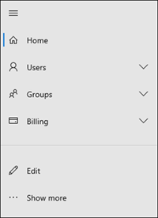
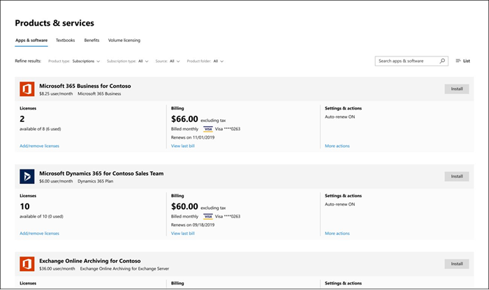

# O que há de novo no centro de administração do Microsoft 365

Estamos adicionando continuamente novos recursos ao [centro de administração do Microsoft 365](microsoft-365-admin-center-preview.md), corrigindo os problemas que aprendemos e fazendo alterações com base em seus comentários. Veja o que está disponível para você hoje. Alguns recursos são implementados em diferentes velocidades para nossos clientes. Se ainda não estiver vendo um recurso, [tente adicioná-lo ao lançamento direcionado](manage/release-options-in-office-365.md).

E se você estiver interessado no que há de novo em outros centros de administração:

- [O que há de novo no centro de conformidade da Microsoft 365](https://docs.microsoft.com/Office365/SecurityCompliance/whats-new)
- [O que há de novo no centro de administração do SharePoint](https://docs.microsoft.com/sharepoint/what-s-new-in-admin-center)

## Janeiro de 2020-feliz ano novo!

> [!NOTE]
> Você sabia que há uma [novidade no Microsoft 365](https://go.microsoft.com/fwlink/p/?linkid=2118096) Video Series no YouTube? Ele realça os recursos mais recentes que foram implantados para os usuários. A cada mês, começaremos a vincular o episódio mais recente na seção [vídeos, treinamento e documentos](#videos-training-and-docs) .     January's episódio: janeiro de [2020-o que há de novo no Microsoft 365](https://go.microsoft.com/fwlink/p/?linkid=2118096)

### Modo escuro

Quando fizemos pela primeira vez o modo escuro, ele estava disponível apenas na página inicial. O modo escuro agora está fora da visualização e está no lançamento direcionado na maioria das páginas no centro de administração.

1. Primeiro, você precisará ativar o lançamento direcionado: Vá para **** \> **configurações** \> de configurações **perfil** \> da organização **preferências de versão**. 
1. E, em seguida, ative o modo escuro, vá para a página **inicial** e selecione o botão **modo escuro** . (Está ao lado do campo de **pesquisa** e o link **novidades** do artigo.)
1. Para qualquer página que tenha um modo escuro disponível, o botão fica na parte superior da página, ao lado **do novo centro de administração** .

### Gerenciamento de o que há de novo no Office

Os administradores desejam controlar como a Microsoft se comunica "What ' s New" aos seus usuários nos aplicativos do Office – e agora você tem esse controle. Vá para **configurações** \> do **Office o que é a visualização de gerenciamento de**novidades. Selecione um recurso para exibir seus detalhes e, em seguida, selecione o botão **ocultar de usuários** se não quiser que seus usuários vejam uma mensagem específica "novidades". Por exemplo, sua organização pode estar esperando para permitir que os usuários saibam de um recurso até que todos em sua organização sejam treinados nele.

Este recurso foi lançado pela primeira vez em novembro, mas há algumas atualizações de recursos que você deve conhecer: [Office What ' s New Management Preview updates Now Available](https://techcommunity.microsoft.com/t5/microsoft-365-blog/office-what-s-new-management-preview/ba-p/1020438)

### Parceiros
Howdy, parceiros! (Não foi possível ajudar). Também temos uma atualização para esse mês. Há um novo recurso que permite aos parceiros conceder aos clientes de CSP a opção de aceitar seu contrato de cliente da Microsoft (MCA) na seção **contas de cobrança** do centro de administração. Nesta nova experiência:

1. O cliente recebe um email de convite com um link para aceitar o relacionamento de parceiro e o MCA.
2. Depois que o cliente entrar, eles poderão exibir e aceitar as permissões MCA e parceiros no centro de administração.

### Caixas de correio de recurso

A lista de caixas de correio de recursos foi atualizada para o novo estilo. No centro de administração do Microsoft 365, acesse salas de **recursos** \> **& equipamento**.

### Vídeos, treinamento e documentos

Confira o treinamento de administrador do Small Business que lançamos em janeiro:

- [Criar seu site de negócios](https://support.office.com/article/3325d50e-d131-403c-a278-7f3296fe33a9)
- [Encontre respostas e ajuda](https://support.office.com/article/7f681212-c649-4a3e-a43b-32b1d1e58988)
- [Obter ajuda ou suporte](https://support.office.com/article/18948a4c-3eb1-4b30-b1bc-a4cc29eb7655)
- [Excluir um usuário](https://support.office.com/article/6bcdad7b-732a-4260-997a-8c176bc3d9d6)
- [Escolha uma assinatura da Microsoft](https://support.office.com/article/b9f7c78e-430f-4117-89ec-2eeb1dced2ca)
- [Visão geral da segurança de negócios do Microsoft 365](https://support.office.com/article/3274b159-a825-46d7-9421-7d6e209389d1)

## Novembro e dezembro de 2019

Estamos combinando notícias de novembro e de dezembro porque, após o Ignite, tínhamos poucos anúncios a fazer. Veja você no ano novo!

### Alterar do cartão de crédito para o pagamento da fatura

Começamos a distribuir a capacidade de alterar sua forma de pagamento do cartão de crédito para uma fatura. Vá até produtos de **cobrança** \> **& serviços**, selecione uma assinatura e, em seguida, selecione o link **Editar** ao lado do pagamento do cartão de crédito.

Quer ler mais sobre ele? [Alterar de cartão de crédito ou conta bancária para fatura](../commerce/billing-and-payments/change-payment-method.md#change-from-credit-card-or-bank-account-to-invoice)

### Leitor global

Mencionamos a função de leitor global na [edição de outubro de 2019-Ignite](#october-2019---ignite-edition), mas à medida que ela é distribuída mais amplamente, vamos discutir alguns detalhes:

- A função de leitor global é a contraparte somente leitura para a função de administrador global. O leitor global pode ver tudo o que o administrador global tem permissão para fazer.
- Com algumas exceções, como alguns recursos de conformidade e segurança, os leitores globais têm acesso para exibir todos os centros de administração do Microsoft Cloud que sua organização está licenciado para usar.
- Atribua a função leitor global aos usuários que precisarem de planejamento, auditorias e investigações.
- Você também pode combinar a função leitor global com outra função que tenha menos permissões. Por exemplo, o proprietário de uma pequena empresa pode ter atribuído as funções do**leitor global** do **administrador** + de cobrança para que eles possam pagar as contas e permanecer na parte superior das alterações em sua organização na nuvem.
- Os leitores globais podem ir para qualquer página no centro de administração do Microsoft 365. Quando abrir uma página editável, haverá um aviso na parte superior informando que eles não têm permissão para salvar as alterações, e o botão salvar será desabilitado.

Adoraríamos obter seus comentários sobre a função de leitor global e qualquer uma das permissões baseadas em função que você gostaria de ver no futuro. [Fornecer comentários sobre permissões baseadas em função](https://office365.uservoice.com/forums/273493-office-365-admin/suggestions/10115430-have-a-consistent-experience-when-assigning-admin)

### Nova página de configurações

As páginas de **perfil da organização**, **segurança & privacidade**e **Serviços & suplementos** foram combinadas em uma página com três guias verticais. E a melhor parte, de um único local, agora você pode pesquisar todas as configurações.

### Treinamento & docs

Esta seção é um novo recurso deste artigo, onde vamos começar a criar um novo treinamento e documentação que achamos que você achará interessante.

Em novembro, lançamos alguns caminhos de aprendizado para [o site do Microsoft Learn](https://docs.microsoft.com/learn/) para ajudar os profissionais de ti a aprender e a ser treinado no Microsoft 365. Faça o check-out:

- [Fundamentos da Microsoft 365](https://docs.microsoft.com/learn/paths/m365-fundamentals/)
- [Estender conceitos básicos do Office](https://docs.microsoft.com/learn/paths/extend-office-fundamentals/)
- [Microsoft 365 – modernizar sua implantação corporativa com o Windows 10 e o Office 365 ProPlus](https://docs.microsoft.com/learn/paths/m365-getmodern/)
- [Gerenciar sua implantação corporativa com o Microsoft 365](https://docs.microsoft.com/learn/paths/manage-enterprise-deployment-m365/)
- [Atualizar o Microsoft Office em escala](https://docs.microsoft.com/learn/paths/m365-office-for-it/)
- [Entregar áreas de trabalho remotas e aplicativos do Azure com a área de trabalho virtual do Windows](https://docs.microsoft.com/learn/paths/m365-wvd/)
- [Modernizar seu local de trabalho com o Microsoft 365 e o Surface for Business](https://docs.microsoft.com/learn/paths/modernize-workplace-with-m365-and-surface/)
- [Proteger a identidade e o acesso ao Microsoft 365](https://docs.microsoft.com/learn/paths/m365-identity/)
- [Proteger informações da empresa com o Microsoft 365](https://docs.microsoft.com/learn/paths/m365-information-protection/)
- [Gerenciar a segurança com o Microsoft 365](https://docs.microsoft.com/learn/paths/m365-security-management/)
- [Defesa contra ameaças com o Microsoft 365 e a proteção contra ameaças da Microsoft](https://docs.microsoft.com/learn/paths/m365-security-threat-protection/)
- [Gerenciar colaboração de equipe com o Microsoft Teams](https://docs.microsoft.com/learn/paths/m365-manage-team-collaboration/)
- [Colaborar com o SharePoint no Microsoft 365](https://docs.microsoft.com/learn/paths/m365-teams-sharepoint/)

## Edição de outubro de 2019 Ignite

Bem-vindo à edição do Ignite do que há de novo no centro de administração do Microsoft 365! Obviamente, esta não é uma lista completa de comunicados, mas aqui estão alguns destaques. Além disso, confira os Blogs do Ignite para obter mais informações sobre as versões:

- [Administração – segurança, produtividade e aprimoramentos de rede para o Microsoft 365](https://techcommunity.microsoft.com/t5/Microsoft-365-Blog/ADMIN-Security-Productivity-and-Network-Enhancements-for/ba-p/964019).
- [O que há de novo no Microsoft Teams – Ignite 2020](https://techcommunity.microsoft.com/t5/Microsoft-Teams-Blog/What-s-New-in-Microsoft-Teams-Ignite-2019/ba-p/937025).

### Controle de acesso baseado em função 

Há muitas alterações para funções no centro de administração, pois começamos a ser distribuído em junho:

- **Compare Roles** -selecione até 3 funções para comparar as permissões de cada uma. Isso ajudará a localizar a função menos permissiva a ser atribuída aos usuários. Vá para **funções**, use a caixa de seleção de seleção múltipla na primeira coluna para escolher até 3 funções e selecione **comparar funções**.

    

- **Favoritos** -você pode adicionar uma estrela às suas funções favoritas ou mais usadas, para que possa encontrá-las facilmente classificando a coluna ou criando um filtro.
- **Usuários** > ativos**gerenciar funções** -isso foi atualizado para alinhar com as alterações nas funções. Da mesma forma que com a lista de funções, escopomos a lista padrão de funções para o mais útil, mas você pode ver todas as funções expandindo **Mostrar tudo por categoria**.
- **Função leitor global** -você pediu! Você chegou! A função [leitor global](add-users/about-admin-roles.md#roles-available-in-the-microsoft-365-admin-center) !

### Relatar um problema

A integridade do serviço foi atualizada para o novo estilo e, se você for afetado por um problema que não está aparecendo no painel de integridade do serviço, é possível **relatar um problema** para permitir que a Microsoft saiba. Vá para **** > **integridade do serviço**de integridade.

### Assinaturas "viral"

Como você sabe, os usuários podem ativar assinaturas gratuitas para uma infinidade de produtos como o Power BI e o app Connect. Agora você pode ver as "assinaturas viral" que os usuários tentaram. Vá até produtos de **cobrança** > **& serviços**. Selecione o filtro de **tipo de conta** na guia assinaturas para ver as assinaturas adquiridas pelo usuário. Se necessário, agora você tem a capacidade de remover essas assinaturas da sua conta.

### Modelos do usuário

Os modelos permitem que você adicione facilmente muitos usuários salvando e reutilizando as configurações compartilhadas desses usuários. Você pode salvar valores para funções, licenças atribuídas, informações de contato, local e muito mais. Quando você usa o modelo para criar um novo usuário, ele obtém automaticamente o valor salvo para essas configurações. Vá para usuários**ativos**do **usuários** > e selecione **modelos de usuário** para experimentá-lo.

### Gerenciamento de "novidades" do Office (visualização)
Quando um recurso importante do Office é lançado para um aplicativo do Office, os usuários receberão o cartão "What ' s New" para saber mais sobre o novo recurso. Se você não quiser que os usuários vejam o cartão, é possível ocultá-lo. Você também pode escolher quando deseja que os usuários vejam o cartão mostrando-o. Vá para **configurações** > **do Office o que é novo gerenciamento** para fazer o check-out.

### Alteração de URL do SharePoint
Tecnicamente, esta não é a novidade do centro de administração do Microsoft 365 a ser avisada, mas estamos tão entusiasmados para que você veja esta notícia:
> [!IMPORTANT]
> Agora você pode acessar o centro de administração do SharePoint com uma URL regular:https://admin.microsoft.com/SharePoint

Para obter mais informações, consulte [What ' s New in the SharePoint Admin Center](https://docs.microsoft.com/sharepoint/what-s-new-in-admin-center)

## Setembro de 2019

Estamos nos estendendo para algumas versões incríveis de recursos no Ignite 2019, então estamos apenas anunciando alguns novos recursos lançados em setembro. Mas fique atento no artigo do próximo mês, ele será publicado no primeiro dia de Ignite!

### Correção de comentários em destaque – a opção para converter a caixa de correio do usuário excluído em uma caixa de correio compartilhada está de volta!

Ouvimos seus comentários com voz alta e desmarcada e recolocamos a capacidade de permitir que outra pessoa acesse a caixa de correio de um usuário excluído, convertendo-o em uma **caixa de correio compartilhada**. Adicionar isso novamente ao assistente de exclusão de usuário permite que você decida o que fazer com os dados:

- Email: conceda a outra pessoa acesso à caixa de correio do usuário excluído, convertendo-a em uma caixa de correio compartilhada.
- Arquivos: salvar seus arquivos do OneDrive e conceder a alguém acesso a outras pessoas.
- Permissões: remover permissões se outras pessoas tivessem acesso a essa caixa de correio.
- Aliases: remover aliases de email para que eles fiquem disponíveis para uso de outro usuário imediatamente.

### Configuração inicial

Há uma atualização para outro dos nossos assistentes de instalação inicial: Microsoft 365 for Business. As etapas foram otimizadas e movemos duas das tarefas de configuração para a página de instalação:

- **Proteger computadores Windows 10** -configurar políticas para proteger melhor seus dispositivos Windows 10 contra vírus, malware e ataques por hackers.
- **Instalar automaticamente o Office** -quando você ativar essa opção e os usuários tiverem conectado seus computadores ao Microsoft 365 Business, seus computadores serão atualizados automaticamente para os aplicativos do Office mais recentes e permanecerão atualizados.

## Agosto de 2019

### Cobrança

Temos algumas atualizações para cobrança e assinaturas neste mês:

- Assinaturas baseadas em dispositivo: você pode atribuir ou cancelar a atribuição de licenças do **Office 365 ProPlus for Education (Device)** aos dispositivos no centro de administração do Microsoft 365. O **Office 365 ProPlus for Education (dispositivo)** é uma licença complementar que lhe permitirá atribuir uma licença a um dispositivo. Vá até produtos de **cobrança** > **& serviços** para encontrar e adquirir a licença.
- Gerenciamento de licença baseado em usuário: atualizamos o modo como você atribui licenças aos usuários**ativos** de **usuários** > para o novo estilo. Para saber mais, confira:
    - [Atribuir licenças a usuários](manage/assign-licenses-to-users.md)
    - [Cancelar licenças de usuários](manage/remove-licenses-from-users.md)

### Configurar atualizações de página

Agora, a instalação tem categorias e seções, incluindo uma seção **recomendada para você** , onde sugerimos de forma inteligente a próxima etapa para ativar os recursos e configurar sua organização. Também adicionamos um novo recurso para configurar:

- **Proteção avançada contra ameaças do Office** -se sua organização estiver licenciada para usar o Office ATP e você ainda não a configurou ou a ativou, você verá esta página. Vá para **configuração** para experimentá-lo.

### Relatar um problema

Se você for afetado por um problema que não está aparecendo no painel de integridade do serviço, o recurso **relatar um problema** lhe fornecerá uma maneira rápida e fácil de nos informar. Vá para **** > **integridade do serviço**de integridade.

## Julho de 2019

### Central de mensagens

O centro de mensagens foi atualizado para o novo design e parece incrível! 

- Agora você pode exibir **mensagens por status**. Basta selecionar uma das guias: **todas as mensagens ativas**, **alta prioridade**, **mensagens não lidas**e **mensagens descartadas**.
- Você também pode filtrar por **privacidade de dados**de categoria, **planejar alterações**, **impedir ou corrigir problemas**e manter categorias de mensagens **informadas** .
- Selecione uma mensagem na lista e tenha algumas opções na barra de comandos: **descartar**, **Marcar como lida** ou **Marcar como não lida**ou **compartilhar**. 
- E ao abrir uma mensagem, você tem ainda mais opções:
    - Copie um link da mensagem para a área de transferência para salvá-lo para mais tarde ou para compartilhá-lo com colegas. 
    -  Marcar mensagens como **lidas** ou não **lidas**. 
    -  Faça comentários sobre uma mensagem selecionando **como** ou **não, um painel de comentários**é aberto solicitando que você forneça comentários específicos sobre o que você gostou ou não gostou sobre esta mensagem.

### Inteligência do painel de navegação

 Agora, o painel de navegação lembra suas últimas ações e mostra o painel no último estado em que você o deixou. Ele também fará com que itens usados com frequência fiquem visíveis por padrão.

### Instalação inicial & página de configuração
Temos algumas alterações empolgantes para ajudá-lo a configurar sua organização. Primeiro, vamos discutir a diferença entre a **configuração** e a **página de configuração**. A **instalação** refere-se ao assistente de instalação inicial que você usou para se conectar aos serviços online da Microsoft. Isso geralmente inclui três etapas específicas: **Conecte um domínio**, **adicione usuários**e **Baixe os aplicativos do Office**. A **página de configuração** é a página no centro de administração que recomendava configurar tarefas para garantir que você esteja obtendo o máximo de suas assinaturas, como ativar os recursos para os quais comprou licenças.

- **Instalação** : o assistente de configuração inicial foi atualizado para as assinaturas do **Office 365 para empresas** . Esse novo design ajudará as novas organizações a obter o assistente mais rapidamente e com um sucesso maior.
- **Página de instalação** -a página de **configuração** ajuda você a concluir a configuração e a proteção dos serviços que vêm com suas assinaturas. Você também pode ver quaisquer recomendações descartadas na página de **configuração** . Para ver se ele está disponível para suas assinaturas ainda, vá para a**instalação**do **Centro** > de administração do 365 da Microsoft.

### Cobrança & assinaturas

- Tipo de produto de **software** – agora você pode exibir produtos de software adquiridos por meio de um provedor de serviços de nuvem (CSP). Para ver seus downloads e chaves, acesse produtos de **cobrança** > **&** > guia**software** de serviços.
- Você pode exibir os produtos e serviços modernos do Azure no centro de administração do Microsoft 365, se você os comprou da Microsoft ou de um provedor de terceiros. Exemplos de produtos modernos do Azure incluídos:
    - Instâncias virtuais do Azure reservadas
    - Planos de suporte do Azure
    - Benefícios de uso híbrido do Azure (AHUB)
    - Gerenciar aplicativos
    - Serviços de dispositivos
    - Assinaturas do Azure

### Simplificar a autenticação multifator

Os administradores têm acesso a informações confidenciais em sua organização. Exija que todos os administradores usem a autenticação multifator ao entrar. O novo assistente o ajuda a fazer isso com apenas uma etapa. Para experimentar, vá para **a configuração** > **reforçar a segurança de entrada**.

### Usuários

As páginas **usuários excluídos** e **usuários convidados** foram atualizadas para o novo estilo.

- **Usuários convidados**: Adicione usuários convidados convidando-os a exibir ou compartilhar arquivos do SharePoint ou do onedrive. Você pode exibir os usuários convidados de usuários**convidados**dos **usuários** > .
- **Usuários excluídos**: na página **usuários atualizados excluídos** , você pode fazer todas as ações que você poderia no centro de administração mais antigo, mas agora adiciona e remove colunas. E temos muitas opções de coluna para escolher. Na verdade, são as mesmas colunas que você pode escolher na página **usuários ativos** .

## Junho de 2019

### Solicitação de comentários de destaque-modo escuro

A exibição do centro de administração no modo escuro está em visualização! Você pode testá-lo apenas na **Home** Page no momento. Na **Home** Page, o botão **modo escuro** está na barra de comandos ao lado do link **What ' s New** .

### Gerenciamento de funções

No final de junho, começamos a implantar a nova maneira de gerenciar funções de administrador. Quando estiver disponível para você, vá**para funções de** **funções** > . Até lá, vamos dar uma olhada: é incrível!
    

Essa nova experiência facilita a visualização de quem tem permissões de administrador e a atribuição de funções que concedem o nível certo de acesso aos seus administradores. Além disso, adicionamos mais funções do Azure AD para que você não perca tempo indo para vários centros de administração.
O que mais você pode fazer aqui?
- Exporte uma lista de todos os administradores da sua organização aos quais as funções do Azure Active Directory estão atribuídas no Microsoft 365.  
- Exibir todos os administradores atribuídos a uma função específica, adicionar ou remover administradores de uma função específica, procurar funções por nome e palavra-chave e saber mais sobre o que cada função permite que um usuário faça. 
- Pesquise rapidamente por uma função específica e crie filtros.

### Método de pagamento
Atualizamos o modo como você paga por suas assinaturas. Acesse os > **métodos de pagamento** **de** > faturas **& pagamentos**. Você pode ver seus métodos de pagamento em um modo de exibição de lista. Selecione qualquer item na lista para removê-lo, editá-lo e, facilmente, ver a assinatura à qual o método de pagamento está associado.

## Maio de 2019

### Correção de maiúsculas e minúsculas de maio
Agora, quando você procura caixas de correio compartilhadas, contatos, recursos e permissões de caixa de correio, seus termos de pesquisa não precisam diferenciar maiúsculas de minúsculas. 

**Gerenciamento de usuários e grupos** Este mês, atualizamos o **usuário bloquear**, **Redefinir senha**, exibição de lista de **contatos** , exibição de lista de **grupos** e as páginas de detalhes de **grupos** para o novo estilo de centro de administração.
- Com o novo modo de exibição de lista de **grupos** , você obtém dados mais ricos sobre seus grupos e pode personalizar a maneira como você vê seus dados – e a lista de grupos lembra como deseja ver seus dados. Por exemplo, agora você pode filtrar **grupos com o Teams** para ver se seus grupos fazem parte de uma equipe e você pode adicionar a coluna **status do teams** .
- A lista de grupos também traz todos os aprimoramentos que fizemos na experiência de lista no gerenciamento de usuários, incluindo ações rápidas e a barra de comandos contextual. 

**Recomendações** 
Você pode ver um novo pop-up de recomendação em seu centro de administração, que acabamos de adicionar 4 novos. Naturalmente, você só verá recomendações se achar que ela será beneficiada pela sua organização. Mas não espere até mostrarmos a recomendação-você pode adicioná-lo a partir da biblioteca de cartões.
- **Expiração da senha** -recomendamos que as senhas sejam definidas para **nunca expirar**. Se sua organização tiver uma configuração diferente, você poderá apenas ver essa recomendação. 
- **Muitos administradores globais** – como ter muitos administradores globais é uma ameaça de segurança, se você tiver mais de quatro administradores globais, verá essa recomendação. Sugerimos dar aos usuários apenas o acesso que eles precisam para realizar o trabalho.
- **Proteção de dispositivo do Intune** – se suas licenças incluem o Intune e detectamos que você não concluiu a configuração do Intune ou inscreveu seus dispositivos, recomendamos que você crie uma política do Intune para proteger os arquivos da sua organização quando os usuários os acessam de seus dispositivos móveis.
- **Obter atualizações mensais dos recursos do Office** – obtemos comentários de nossos pequenos clientes que quando recebem atualizações mensais dos recursos do Office, seus usuários estão mais felizes. Portanto, se você é um negócio muito pequeno e você atualmente Obtém as atualizações de recursos do Office a cada seis meses, verá essa recomendação.

**Configurações**  
Quanto às configurações, há algumas alterações. Principalmente, apenas a atualização das configurações existentes para o novo estilo de centro de administração. À medida que estamos avançando e adicionamos novas configurações que você nunca viu antes, vamos começar a menciona-las aqui. E temos uma configuração completa para anunciar: **autenticação moderna**. Sim, há uma nova configuração para ativar a **autenticação moderna**! Para fazer o check-out, acesse serviços de **configurações** > **&** > a**autenticação moderna**dos suplementos.

## Abril de 2019

As coisas estão com uma ótima aparência para o centro de administração. Estamos lendo seus comentários e sugestões, respondendo a maioria deles e realmente tirando tudo o que você tem para dizer ao coração. Naturalmente, ainda estamos fazendo o trabalho para garantir que tudo esteja em paridade com o antigo centro de administração. E lembre-se de que, à medida que os novos recursos são distribuídos, você não pode obtê-lo imediatamente.

### Recurso de destaque-adicionar usuários

Para abril, estamos apresentando o assistente para **Adicionar usuário** que orienta você por meio de... Aguarde... adição de usuários. Ele é um passo a passo para adicionar as informações básicas do usuário, como o nome de exibição e email, atribuindo uma licença e uma função, adicionando suas informações de contato e, em seguida, examinando a conta do usuário antes de confirmar. **Por que fizemos essa alteração?** Ouvimos seus comentários que você não gostou da rolagem quase infinita para adicionar usuários na experiência anterior.
    

Há duas maneiras de fazer o check-out:  

1. Na página **inicial** , selecione **Adicionar usuário** na placa de **Gerenciamento de usuários** . O assistente é aberto imediatamente para que você não precise navegar de qualquer trabalho que esteja fazendo na página **inicial** .
2. Vá para usuários**ativos**do **usuários** > e selecione **Adicionar usuário** na barra de comandos.
  
Fizemos mais algumas alterações no **Gerenciamento de usuários**, aqui está uma lista rápida:
- O painel **gerenciar funções** foi atualizado para o novo estilo e está acessível. Também atualizamos o **usuário em bloco** e **excluímos** os painéis do usuário para o novo estilo.
- **Gerenciar licenças de produtos** alteração de posição na barra de comandos.
- Agora, alterar a foto de um usuário é mais fácil. Em **usuários ativos** , selecione um usuário e **altere a foto** sob sua imagem.

### Mas espere! Há mais...
- Há uma nova faixa de instalação na **Home** Page que você verá se não tiver concluído as etapas de configuração, como adicionar um domínio, adicionar usuários e baixar aplicativos do Office.
- A lista de **grupos** e o painel de detalhes foram atualizados para o novo estilo. Vá para **** > **grupos** de grupos para exibir as alterações. 
    - Falando sobre grupos, também adicionamos uma guia **do Microsoft Teams** ao painel de detalhes de grupos, onde você pode transformar qualquer grupo do Office 365 em uma equipe. Para "teamify" um grupo, selecione qualquer grupo do Office 365 na lista, selecione a guia **Microsoft Teams** e, em seguida, **criar equipe**. Se o grupo já for uma equipe, você receberá um link para gerenciá-lo no centro de administração do Microsoft **Teams**.
    - Por fim, você pode adicionar o **status do teams** à lista de **grupos** . No cabeçalho da coluna, selecione **escolher colunas** > **Teams status** > **salvar**.
- **Novas funções de administrador limitadas** – lançamos algumas novas funções de administrador para que você possa fornecer aos usuários somente o acesso de que precisam.
    -  **Administração do Kaizala**: os usuários desta função têm permissão para executar todas as tarefas de gerenciamento no Microsoft Kaizala, incluindo criar e gerenciar usuários no diretório do Kaizala, gerenciar grupos do Kaizala, gerenciar cartões de ação e conectores e criar solicitações de serviço.
    - **Administração de pesquisa**: os usuários desta função têm acesso total a todos os recursos de gerenciamento de pesquisa da Microsoft no centro de administração do Microsoft 365. Os administradores de pesquisa podem delegar as funções de administrador de pesquisa e editor de pesquisa aos usuários, e criar e gerenciar conteúdo, como indicadores, Q&itens e locais. Além disso, esses usuários podem exibir o centro de mensagens, monitorar a integridade do serviço e criar solicitações de serviço.
    - **Editor de pesquisa**: os usuários nessa função podem criar, gerenciar e excluir conteúdo para o Microsoft Search no centro de administração do Microsoft 365, incluindo indicadores, Q&itens e locais.
- Há uma Bonanza de alterações de **cobrança** neste mês...
    - Agora você pode atualizar o CVV para cartões de crédito existentes sem precisar excluí-lo e adicioná-lo novamente. Você pode atualizar o CVV indo até **Bills** > **Payment Methods**.
    - Tornamos mais fácil localizar suas **faturas** e compreender qualquer problema de cobrança que sua conta pode estar tendo. E agora você pode ver suas listas no navegador da Web em vez de precisar baixar o PDF. Vá para > **faturas** **de faturas**.
    - Na página **produtos & serviços** , agora agregamos suas informações de assinatura se você tiver várias assinaturas do mesmo tipo.

## Março de 2019 – lançamos oficialmente o centro de administração!

Bem, se você perdeu as notícias empolgantes, oficialmente lançamos o novo e aprimorado centro de administração do Microsoft 365! Aqui está a postagem de blog onde anunciamos: [o novo centro de administração 365 da Microsoft disponível atualmente](https://techcommunity.microsoft.com/t5/Microsoft-365-Blog/The-new-Microsoft-365-admin-center-available-today/ba-p/377870). Em março, vamos confiar na postagem de blog para que você confira os recursos lançados-mais, você também pode ler a postagem dos recursos que estão sendo lançados em um futuro próximo, que não podemos fazer no conteúdo principal.
    
Temos uma alteração na área de **cobrança & assinaturas** que gostaríamos de mencionar. Quero dizer, o y'all não achamos que nós fizemos o melhor aprimoramento. Porque não estamos! Na verdade, este mês adicionamos a capacidade de gerenciar suas relações de parceiros para **cobrança** > de**contas de cobrança**. A partir daqui, você pode revisar as relações de parceria entre o supervisor, o CSP e os revendedores indiretos. Você também pode aceitar novas solicitações de relacionamento de parceiros, incluindo permissões de administrador delegadas.

Como sempre, seus comentários são importantes para nós, portanto, vamos mantê-los chegando! Em qualquer página no centro de administração, você pode fazer comentários selecionando **enviar comentários** no canto inferior direito, ao lado de **precisar de ajuda?**

## Versão de fevereiro de 2019-faturamento & edição de assinaturas

Este mês, vamos nos concentrar em todos os aprimoramentos que fizemos nas áreas Affectionately referenciadas como "cobranças e assinaturas". No passado, você provavelmente não fez referência a essas coisas Affectionately, mas achamos que agora você vai...

- **Métodos de pagamento** : ouvimos seus comentários que a atualização de seu método de pagamento era difícil e fizemos muitas alterações em torno dele. Vá para **** > **métodos de pagamento**de cobrança. Você pode ver facilmente os métodos de pagamento, como o cartão Visa e a qual assinatura está associada. Na lista de métodos de pagamento, selecione o menu **mais** (3 pequenos pontos ao lado da data de vencimento) e, em seguida, selecione **Exibir assinaturas**. Você também pode editar e excluir seus métodos de pagamento usando o menu **mais** .
- **Conta de cobrança** – os clientes do lançamento direcionado verão primeiro a página da nova conta de cobrança e, em seguida, iremos revertê-la em todo o mundo. Quando estiver disponível para você, acesse a **** > **conta de cobrança**de cobrança. O que você pode fazer na página nova conta de cobrança? Estou feliz por você ter perguntado:
  - Atualize o endereço e outras informações de contato em seu perfil organizacional diretamente desta página. Não é necessário acessar o**perfil de organização**de **configurações** > , a menos que você queira.
  - E estamos facilitando a vida dos clientes de licenciamento por volume ou diretos, você pode aceitar e revisar os contratos de clientes de **contas de cobrança**. Você também pode se conectar com outros organizações expandidas permitindo que você vincule o organizações expandidas para compartilhar licenças e recursos.
- Também fizemos alguns aprimoramentos menores e correções de erros:
  - Reativar uma assinatura com um pagamento de fatura
  - Editar o endereço de uso do serviço para suas assinaturas
  - E, na página detalhes de inventário, adicionamos alguns aprimoramentos de notificação, nós nos vinculamos à página real onde você pode fazer o trabalho, e há mais ações no cartão de detalhes de inventário. Vá para **** > **títulos** > de cobrança**Exibir detalhes** em qualquer fatura.

## Janeiro de 2019-feliz ano novo!

- Ainda adicionando em **serviços & suplementos** , atualizamos mais das **configurações do > Services & Add-ins** . Experimente aplicativos integrados ou relatórios para ver a versão mais recente.
- **Procurando melhorias?** Não veja mais a caixa de **pesquisa** na barra de comandos. Ele foi atualizado para permitir que você pesquise tarefas. Por exemplo, tente "redefinição de senha" ou "adicionar um usuário".

### Correção de comentários em destaque-licenças e aplicativos

Recombinamos **licenças e aplicativos** no painel de detalhes do usuário com base em seus comentários. Inicialmente, separamos os dois recursos para fornecer espaço para os detalhes de todas as possibilidades de licença e de todos os aplicativos. Ouvimos que separar licenças e aplicativos em dois painéis adicionou confusão. Escutamos e colocamos as licenças e os aplicativos novamente em uma guia. Agora você pode certificar-se de que um aplicativo está desativado em todas as licenças atribuídas a um usuário em um painel. Leite e cookies. Licenças e aplicativos. Podemos obtê-lo agora.

Confira: **usuários > usuários ativos > editar** ou **adicionar licenças e aplicativos de > de usuário**.

## Dezembro de 2018

- **Serviços & suplementos** -em outubro, atualizamos os serviços de **configuração** \> **& suplementos** com nosso novo estilo de design, mas todas as páginas de configurações ainda estavam no estilo clássico. Este mês, começamos a atualizar as configurações reais para o novo design. Confira os **reservas** para ver a nova aparência.
- **Gerenciamento de usuários** -gerenciar nome de usuário, alias, endereço de email principal.
- Adicionamos duas placas de início à biblioteca. Você pode ler suas descrições completas na biblioteca.
  - **Registro de dispositivo do Intune**
  - **Domínios**
- **Recomendações** -você pode ver uma nova recomendação pop-up em seu centro de administração. Naturalmente, você só verá recomendações se achar que ela será beneficiada pela sua organização. Mas não espere até mostrarmos a recomendação-você pode adicioná-lo a partir da biblioteca de cartões.
  - **Proteger informações confidenciais** – recomendamos a criação de uma política de prevenção de perda de dados (DLP) para detectar quando os itens que contêm informações confidenciais são compartilhados com pessoas de fora da organização.

## Novembro de 2018

- A caixa de pesquisa está de volta! E mudamos levemente. Ainda está na parte superior da Home Page, mas agora está no lado direito da página, perto do botão **Adicionar cartão** .   

- Adicionamos cartões ao painel. Basta ir para o centro de administração e selecionar **Adicionar cartão** para ver os novos cartões:
  - **Relatório de usuários ativos do office 365** -monitorar o uso dos serviços do Office 365 que você comprou.
  - **Software do office 365** -instale ou implante o software do Office 365 ProPlus e veja quantos usuários licenciados o ativaram.
  - **Azure Active Directory** – dá acesso rápido às tarefas comuns do Azure AD, como redefinições de senha de autoatendimento, personalização de entrada e adição de aplicativos.
- A tarefa rápida **exportar usuários** foi adicionada à barra de comandos na página usuários ativos. 
- Os serviços de compra têm aprimoramentos adicionais de novembro. E todos estão bons! Para chegar lá, acesse serviços de cobrança > compra.  
  > 1.  Na parte superior da página, você pode dinamizar entre planos de negócios e de educação. Isso vai ajudá-lo a encontrar o que você está procurando.
  > 2.  Adicionamos uma caixa de pesquisa para que você não precise rolar por menos para localizar o que você está procurando.
  > 3.  Por fim, classificamos logicamente os planos que podem ser comprados em seções que podem ser expandidas e recolhidas. Não precisa comprar nenhum dos **aplicativos e serviços do Office**? Recolha essa seção e concentre-se nos planos do Microsoft 365.

## Outubro de 2018

- Há uma nova maneira de comprar assinaturas no centro de administração do Microsoft 365. Vá para **serviços de compra** para ver a experiência de compras completamente reprojetada que facilita a pesquisa, a comparação de planos e outros ótimos recursos novos que ajudam a tornar a compra de uma assinatura mais fácil.  

- A página **serviços e suplementos** foi atualizada para a nova aparência, mas tudo o mais funciona exatamente. Naturalmente, você deve fazer o check-out da barra de comandos para ver as novas coisas que você pode fazer, como filtragem e alteração da lista para o modo de exibição compacto. No painel de navegação, acesse suplementos de **Serviços &amp; ** de **configurações** \> para fazer o check-out.  

## Setembro de 2018

- **Melhorias de casa** A Home Page foi completamente refeita e não podemos esperar que você experimente e veja o que você imagina. Esta é sua home page pessoal e você não afetará as home pages de outros administradores em sua organização.  

  - Você pode adicionar, remover e mover cartões de Home Page ao redor da página inicial. Selecione **+ Adicionar cartão** no canto superior direito para ver quais cartões estão disponíveis na biblioteca de cartões e arraste-os para qualquer lugar na página inicial. Não gosta de onde ele Redirecionado? Arraste-a para o local desejado. Você nem precisa salvar mais.

  - Leve a organização para o próximo nível agrupando cartões em seções. Criamos duas seções padrão para você: **noções básicas** e **dispositivos e atualizações.** Muito cedo, você poderá adicionar, remover e renomear seções para criar uma home page que funcione para você.

  - A maioria dos cartões é informativa e acionável, o que significa que você receberá informações just-in-time para ajudá-lo a fazer suas tarefas diárias mais rápido e inteligente.

  - O painel de navegação foi reorganizado e você pode personalizá-lo para suas tarefas rápidas. Basta selecionar **Editar** na parte inferior do painel de navegação para começar a personalização.  

- **Cobrança** Você provavelmente observará algumas das maiores alterações no centro de administração do Microsoft 365 na seção de cobrança. Você pode gerenciar assinaturas e aplicativos que comprou da Microsoft ou de outro fornecedor, incluindo novas experiências para gerenciamento de estoque, histórico de pedidos, métodos de pagamento e faturamento.

  - O gerenciamento de assinatura foi reprojetado para fornecer uma nova experiência de gerenciamento de inventário para mais tipos de produtos, incluindo aplicativos, software e suplementos. Ele agora é chamado **de &amp; Products Services** para refletir melhor o suporte para novos tipos de produto que estão sendo adicionados. Agora você pode optar por ter um modo de exibição de cartão ou de tabela dos produtos e serviços, e pesquisar e filtrar para encontrar rapidamente o que você está procurando.  

  - Agora é mais fácil do que nunca atribuir uma licença de produto aos seus usuários. Selecione seu produto comprado e, em seguida, você pode atribuir o produto. Você também pode ver quais usuários já foram atribuídos a um produto específico.  

  - Os **planos de comutação** agora são chamados de * * atualizações * * e, por fim, as atualizações de assinatura acontecem nos bastidores, para que você não precise observar a conclusão da atualização. Por fim, não há mais uma limitação de licença em atualizações.

- **Gerenciamento de usuários** Fizemos muitas alterações no gerenciamento de usuários para ajudá-lo a realizar seu trabalho mais rapidamente. Atualizamos a página * * Active Users * * e o painel de detalhes do usuário. Veja algumas das alterações mais impressionantes:

  - Há um novo layout e design novo para a página **usuários ativos** . Não gosta da aparência da lista? Selecione **alterar exibição** (ao lado de **filtro**) e você pode alterar a lista da **lista normal** para a **lista compacta**. A lista compacta é especialmente útil se você tem muitos usuários em sua organização.  

  - A barra de comandos (onde **Search** Lives) é dinâmica e a lista de ações será alterada dependendo do número de usuários que você selecionou: nenhum usuário, um usuário ou vários usuários. Você também verá quantos usuários selecionou ao lado de **Pesquisar**.  

  - Você pode executar tarefas rápidas, como redefinir senhas para um ou vários usuários diretamente do modo de exibição de lista.

  - Os detalhes e configurações do usuário agora são organizados pelas seguintes guias: **conta**, **dispositivos**, **licenças**, **aplicativos**, **email**e **onedrive**. Anteriormente, muitas dessas configurações foram localizadas em várias telas.   
