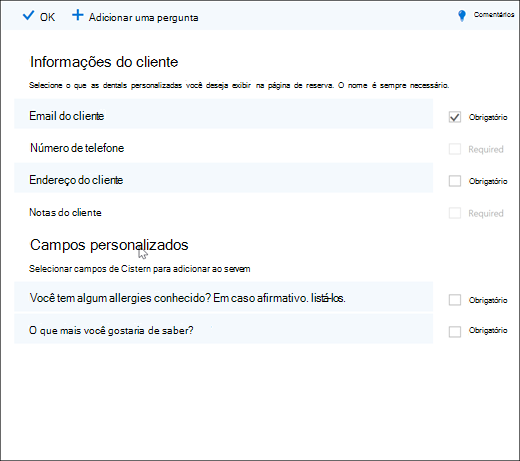
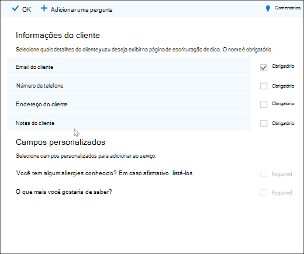
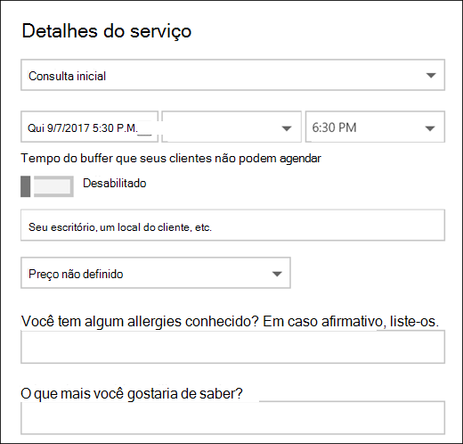

# Adicionar perguntas personalizadas e necessárias à página de reserva

O Bookings permite que você crie perguntas para fazer aos seus clientes quando eles estão reservando compromissos. Ele também permite escolher quais perguntas são necessárias.

Você associa as perguntas a um serviço, para que cada serviço possa ter um conjunto diferente de perguntas. Por exemplo, um hair stylist pode perguntar aos clientes que estão reservando um compromisso para colorir os olhos se eles têm alguma allergies conhecidas para laranjas ou tonalidades. Isso permite que você e seus clientes economizem tempo ao chegarem para o compromisso.

Os clientes verão as perguntas personalizadas quando criarem seus compromissos na página de reserva. Os funcionários verão as perguntas personalizadas quando criarem uma nova reserva a partir do calendário do Bookings ou ao exibir um compromisso existente. O Bookings salva todas as suas perguntas em uma lista mestra para que você não tenha que criar as mesmas perguntas para cada serviço. Você também pode escolher se as perguntas são necessárias ou opcionais.

> [!NOTE]
> As respostas do cliente para as perguntas podem ser vistas quando você vê o compromisso no calendário de reserva.

Para obter mais informações sobre como personalizar e personalizar sua página de reserva, consulte [Personalizar sua página de reserva.](customize-booking-page.md)

## Adicionar perguntas personalizadas aos seus serviços

1. Entre no Microsoft 365 e vá para **o Bookings.**

1. Vá para **Serviços** e edite um serviço existente ou **Adicione um serviço.**

1. Role para baixo até **a seção Campos personalizados** e selecione **Modificar**.

   Já adicionamos algumas perguntas básicas de informações do cliente: email do cliente, número de telefone, endereço do cliente e anotações do cliente. Na primeira vez que você fizer isso, as perguntas sobre as informações do cliente serão realçadas em cinza. Isso significa que o usuário verá essa pergunta. Se você selecionar a pergunta, a caixa de realçada em torno dela desaparecerá e o cliente não será solicitado a fazer essa pergunta.

   Neste exemplo, o número de telefone e as anotações do cliente foram desligados e criamos duas novas perguntas personalizadas para fazer.

   

1. Para fazer a pergunta necessária, marque a **caixa de seleção** Obrigatório. Seu cliente não poderá concluir a reserva até que ele tenha respondido às perguntas necessárias.

1. Para criar uma pergunta personalizada, selecione **Adicionar uma pergunta** na parte superior do painel. Escreva sua pergunta e selecione **Salvar.**

1. Clique na pergunta para habilita-la. Uma caixa realçada aparece ao redor dela e a pergunta é habilitada.

1. Clique **em Ok** na parte superior da página e salve o **serviço.**

O Bookings salvará todas as suas perguntas personalizadas em uma lista mestra para que você possa facilmente adicionar perguntas a cada serviço sem precisar digitar repetidamente as mesmas perguntas. Por exemplo, se você abrir um serviço diferente, a pergunta criada para o primeiro serviço será aberta na seção Campos personalizados, mas ela será desabilitada. Clique na pergunta para que um retângulo realçado seja exibido e a pergunta seja habilitada.

Neste exemplo, você pode ver que as perguntas que foram adicionadas para o primeiro serviço estão disponíveis para esse serviço. Quaisquer perguntas que você criar para esse serviço estarão disponíveis para todos os serviços.

   

Se sua página de reserva já tiver sido publicada, você não precisará fazer mais nada. Os clientes verão as perguntas na próxima vez que agendar com você. Se sua página de reserva ainda não  foi publicada, vá para a página de reserva do Outlook na Web e selecione **Salvar e publicar.**

> [!WARNING]
> Você também pode excluir perguntas da lista mestra. No entanto, se você excluir uma pergunta, ela será excluída de todos os serviços. Recomendamos que você desabilite a pergunta selecionando-a para garantir que não a impacte em nenhum outro serviço. Você pode ver que uma pergunta será desabilitada se não estiver envolta por um retângulo realçado.

## Experiência do cliente

Quando seus clientes agendam um compromisso com você, as perguntas básicas sobre as informações do cliente serão mostrar na **seção Adicionar seus detalhes.** Quaisquer perguntas personalizadas que você adicionar estarão na **seção Fornecer informações adicionais.**

## Experiência da equipe

Quando seus clientes agendam um compromisso com você, sua equipe verá as perguntas e as respostas do cliente no calendário de reserva. Para vê-lo, vá para **o Calendário do Bookings** \>  e abra um compromisso.

