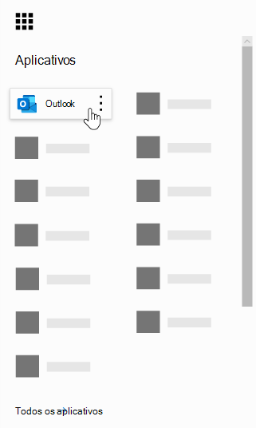
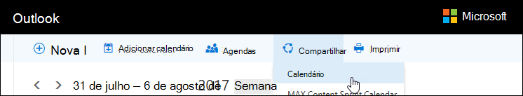
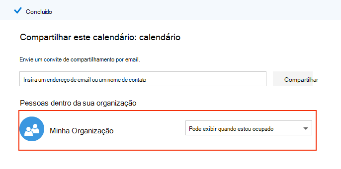
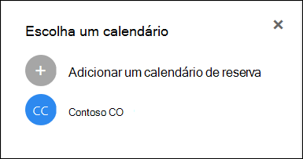

# Perguntas frequentes sobre o Microsoft BookingsMicrosoft Bookings Frequently Asked Questions

## GeralGeneral

### O que é o Microsoft Bookings?What is Microsoft Bookings?

O Microsoft Bookings é um aplicativo do Microsoft 365 que facilita o agendamento e o gerenciamento de compromissos.Microsoft Bookings is a Microsoft 365 app that makes scheduling and managing appointments easy. O Bookings inclui um calendário de reserva baseado na Web e se integra ao Outlook para otimizar o calendário da sua equipe, dando aos seus clientes a flexibilidade de reservar um horário que funcione melhor para eles.Bookings includes a Web-based booking calendar and integrates with Outlook to optimize your staff’s calendar, giving your customers flexibility to book a time that works best for them. Os emails de notificação automatizada reduzem os não-programas, e as organizações economizam tempo com uma redução nas tarefas de agendamento repetitivas.Automated notification emails reduce no-shows, and organizations save time with a reduction in repetitive scheduling tasks. O Bookings ajuda você a conduzir facilmente compromissos virtuais por meio do Skype ou do Microsoft Teams e a gerenciar o agendamento do dia a dia por meio do aplicativo Bookings no Teams.Bookings helps you easily conduct virtual appointments via Skype or Microsoft Teams, and helps you manage day-to-day scheduling via the Bookings app in Teams. Com a capacidade de personalizar, o Bookings foi projetado para atender às necessidades de várias partes de qualquer organização.With built-in ability to customize, Bookings is designed to meet the needs of multiple parts of any organization.

### Como usar o Microsoft Bookings?How do I use Microsoft Bookings?

O Bookings é um serviço online, portanto, você não precisa baixar nada.Bookings is an online service, so you don't need to download anything. Basta ir para o selador de aplicativo dentro da experiência da Web do Microsoft 365.Just go to the app chooser within the Microsoft 365 Web experience. Os administradores também podem usar o aplicativo que acompanha o Bookings para se manter atualizado com as informações mais recentes sobre os clientes e seus compromissos.Administrators can also use the Bookings companion app to stay current with the latest information about customers and their appointments.

### Quem tem acesso ao Microsoft Bookings?Who has access to Microsoft Bookings?

O Bookings está disponível e ativo por padrão para clientes do Microsoft 365 Business Premium, Microsoft 365 Business Standard, A3, A5, E3 e E5 em todo o mundo.Bookings is available and active by default for Microsoft 365 Business Premium, Microsoft 365 Business Standard, A3, A5, E3, and E5 customers worldwide. O Bookings também está disponível no Office 365 operado pela 21Vianet.Bookings is also available in Office 365 operated by 21Vianet.

### Meus clientes verão meu calendário pessoal ou de negócios?Will my customers see my personal or business calendar?

Seus clientes verão apenas o calendário do Bookings que você publicar online para os serviços, horários e funcionários que você escolher registrar.Your customers will only see the Bookings calendar that you publish online for the services, times, and staff that you choose to register.

### Como alterar um atributo bookable em Gerenciar equipe?How do I change a bookable attribute under Manage staff?

Quando membros da equipe foram adicionados, eles teriam recebido um email para aceitar ou rejeitar a solicitação.When staff members were added, they would have received an email to accept or reject the request. Eles podem abrir o mesmo email e selecionar "Rejeitar" para torná-los não bookable.They can open the same email and select "Reject" to make them non-bookable. No momento, não temos uma maneira de alternar isso de dentro do aplicativo.We currently do not have a way to toggle this from inside the app.

### Como os usuários finais acessam o aplicativo Bookings?How do end users access the Bookings app?

Qualquer pessoa licenciada para o Microsoft 365 Business Premium, Microsoft 365 Business Standard, A3, A5, E3, E5 ou adicionada como membro da equipe nas funções Administrador ou Visualizador pode acessar o Bookings no selador de aplicativo dentro da experiência da Web do Microsoft 365.Anyone who is licensed for Microsoft 365 Business Premium, Microsoft 365 Business Standard, A3, A5, E3, E5, or is added as a staff member in either the Administrator or Viewer roles can access Bookings in the app chooser within the Microsoft 365 Web experience. Também há um aplicativo companion disponível para iOS e Android.There is also a companion app available for iOS and Android.

### Posso usar o Bookings em meu próprio site?Can I use Bookings in my own Web site?

Sim.Yes. Fornecemos uma maneira de inserir o calendário do Bookings em seu site por meio de um iFrame.We provide a way for you to embed your Bookings calendar in your site via an iFrame. O código de incorporação de links está localizado na guia da **página do Bookings** dentro do aplicativo Bookings.Link embedding code is located in the **Bookings page** tab within the Bookings app.

### Posso usar o Bookings mesmo se não tiver uma página da Web para minha empresa?Can I use Bookings even if I don’t have a Web page for my business?

Sim.Yes. Fornecemos um link para sua página de reserva na guia **da página** De reserva no aplicativo Web.We provide a link to your booking page within the **Booking page** tab in the Web app. Você só precisa fornecer esse link para seus clientes ou clientes, e eles verão as informações de disponibilidade mais recentes para sua empresa.You just need to provide that link to your customers or clients, and they will see the latest availability information for your business. Como alternativa, você pode compartilhar a página de reserva nas redes sociais ou até mesmo usar o recurso de incorporar para hospedá-la em um iFrame.Alternatively, you can share the booking page in social media or even use the embed feature to host it in an iFrame. Você também tem a capacidade de controlar quem pode acessar a página desabilitando a indexação do mecanismo de pesquisa direto e restringindo o acesso apenas àqueles dentro da sua organização.You also have the ability to control who can access the page by disabling direct search engine indexing and restricting access to only those within your organization.

### Nosso departamento de IT pode controlar se os usuários finais podem acessar o Bookings?Can our IT department control whether end users can access Bookings?

O Bookings está disponível nos locatários do Microsoft 365 Business Premium, microsoft 365 Business Standard, M365 A3/A5 e E3/E5 por padrão, mas os administradores podem desabilitá-lo no Centro de administração do Microsoft 365, se preferirem.Bookings is available in Microsoft 365 Business Premium, Microsoft 365 Business Standard, M365 A3/A5 and E3/E5 tenants by default, but administrators can turn it off in the Microsoft 365 admin center if they choose. Para fazer isso, [siga estas instruções.](turn-bookings-on-or-off.md)To do so, [follow these instructions](turn-bookings-on-or-off.md).

Se um cliente deseja desabilitar o acesso ao Bookings para determinadas licenças qualificadas em seu locatário, ele pode usar uma política de grupo para restringir licenças ou implementar uma política de Caixa de Correio do OWA que restringirá quem é capaz de criar novos calendários do Bookings.If a customer wants to disable access to Bookings for certain eligible licenses in their tenant, they can either use a group policy to restrict licenses or implement an OWA Mailbox policy that will restrict who is able to create new Bookings calendars.

Se você usar uma política de Caixa de Correio do OWA para desabilitar o acesso ao Bookings, todos os usuários terão uma licença do Bookings, no entanto, quando tentarem acessar o aplicativo, eles só terão êxito se eles fazem parte da política ou se foram adicionados a um calendário do Bookings existente como funcionário.If you use an OWA Mailbox policy to disable access to Bookings, all users will have a Bookings license, however when they attempt to access the app, they will only be successful if they are part of the policy or if they have been added to an existing Bookings calendar as staff. Detalhes [aqui](turn-bookings-on-or-off.md) na seção "Permitir que apenas usuários selecionados criem calendários do Bookings".Details [here](turn-bookings-on-or-off.md) in the “Allow only selected users to create Bookings calendars” section.

### O Bookings é personalizável?Is Bookings customizable?

Sim, o Bookings é personalizável e pode ser usado para vários cenários diferentes.Yes, Bookings is customizable and can be used for a variety of different scenarios. Ao configurar um calendário do Bookings, muitos aspectos da página de agendamento baseada na Web, suas informações comerciais, detalhes da equipe, tipos de serviço e políticas de agendamento podem ser personalizados.When setting up a Bookings calendar, many aspects of the Web-based scheduling page, your business information, staff details, service types, and scheduling policies can be customized.

### Todas as funcionalidades do aplicativo Web original do Bookings estão disponíveis no Microsoft Teams?Is all the functionality of the original Bookings Web app available in Microsoft Teams?

Uma versão leve do Bookings agora está disponível como um aplicativo no Teams.A lightweight version of Bookings is now available as an app in Teams. Encontre o comunicado inicial [aqui.](https://www.microsoft.com/microsoft-365/blog/2020/03/06/empowering-care-teams-with-new-tools-in-microsoft-365/)Please find the initial announcement [here](https://www.microsoft.com/microsoft-365/blog/2020/03/06/empowering-care-teams-with-new-tools-in-microsoft-365/). Há uma funcionalidade de link profundo a ser destacada no aplicativo Web e, após a configuração, o uso do Bookings no dia a dia pode ser feito sem sair do Teams.There is deep link functionality to pop out in the Web app, and after setup, day-to-day use of Bookings can be done without ever leaving Teams. As informações fluem entre plataformas.Information flows across platforms.

### O Bookings é uma oferta de pequenas empresas ou uma oferta empresarial ou ambas?Is Bookings a small business offering or an Enterprise offering or both?

O Bookings é a solução ideal para clientes corporativos e de pequenas empresas, em uma variedade de setores.Bookings is an ideal solution for both Enterprise and small business customers, across a variety of industries. Os casos de uso incluem:Use cases include:

- Serviços financeirosFinancial services
    - consultasconsultations
    - serviços bancários e de segurosbanking and insurance services
    - arquivamentos fiscaistax filings

- Recursos humanos (RH)Human resources (HR)
    - entrevistas de candidatocandidate interviews
    - integraçãoonboarding
    - assistência a benefíciosbenefits assistance
    - treinamento e workshopstraining and seminars

- Serviços de SaúdeHealthcare
    - patient visitspatient visits
    - colaboração de provedor para provedorprovider-to-provider collaboration
    - insurance consultsinsurance consults

- Government & Public SectorGovernment & Public Sector
    - audiências e avaliação do tribunalcourt hearings and trials
    - serviços públicospublic services
    - compromissos de departamentodepartment appointments

- Educação -- K-12Education -- K-12
    - conferências pai-professorparent-teacher conferences
    - school town hallschool town hall
    - visitas realizadas por alunosstudent-counselor visits

- Educação – Ed superiorEducation -- Higher Ed
    - horário comercialoffice hours
    - tutoringtutoring
    - serviços de alunostudent services
    - inscrever-se no exameexam sign-up

- VarejoRetail
    - compras assistidasassisted shopping
    - cronograma de prestador de serviçoscontractor scheduling
    - serviços de designdesign services

- Necessidades gerais de empresas e pequenas empresasGeneral Enterprise and small business needs
    - reuniões de cliente e clientecustomer and client meetings
    - suporte técnicotech support
    - avaliações legaislegal reviews
    - facilitiesfacilities

## Preços e licenciamentoPricing and licensing

### Como obter o Microsoft Bookings?How do I get Microsoft Bookings?

O Bookings está disponível no Microsoft 365 para clientes com licenças do Microsoft 365 Business Premium, Microsoft 365 Business Standard, A3, A5, E3 e E5, juntamente com um aplicativo para iOS e Android.Bookings is available in Microsoft 365 for customers with Microsoft 365 Business Premium, Microsoft 365 Business Standard, A3, A5, E3, and E5 licenses, along with an iOS and Android companion app. O Bookings não está disponível como um aplicativo autônomo.Bookings is not available as a standalone app. O Outlook Web App ou o Outlook na Web deve estar habilitado para usar o Bookings, pois ele armazena dados no Outlook.Outlook Web App or Outlook on the web must be enabled to use Bookings, as it stores data within Outlook.

Uma licença do Bookings fornece funcionalidade completa para o produto, incluindo a criação e o gerenciamento de calendários.A Bookings license provides full functionality to the product, including creating and managing calendars. Ele também permite que os usuários visualizam e editem calendários existentes, quando esses usuários são adicionados como funcionários em uma função de Administrador ou Visualizador.It also enables the ability for users to view and edit existing calendars, when those users are added as staff in an Administrator or Viewer role.

### Preciso migrar minha conta de email do meu provedor atual para o Microsoft 365?Do I need to migrate my email account from my current provider to Microsoft 365?

Você pode manter seu provedor atual, mas o Bookings enviará todas as notificações para o email usado na sua conta do Microsoft 365.You can keep your current provider, but Bookings will send all notifications to the email used in your Microsoft 365 account.

### Meus funcionários podem usar o Bookings sem uma conta do Microsoft 365?Can my employees use Bookings without a Microsoft 365 account?

Sim.Yes. Você pode adicionar sua equipe com qualquer email e ele ainda receberá a confirmação de email e o convite do calendário quando alguém agendar um compromisso com ele.You can add your staff with any email, and they will still get the email confirmation and the calendar invite when someone books an appointment with them.

### Posso criar mais de um calendário do Bookings na mesma conta do Microsoft 365 e alternar entre eles?Can I create more than one Bookings calendar under the same Microsoft 365 account and switch between them?

Sim.Yes. Você pode criar e gerenciar mais de um calendário do Bookings com uma conta.You can create and manage more than one Bookings calendar with one account. Você pode alternar entre eles usando o a central de atendimento ao lado do nome da empresa no aplicativo Web do Bookings.You can switch between them using the caret next to the business name in the Bookings Web app.

### E se minha organização tiver licenças mistas com F1/F3, E1 e E3/E5?What if my organization has mixed licenses with F1/F3, E1, and E3/E5?

Reconhecemos que muitas organizações têm uma mistura de licenciamento do Microsoft 365.We recognize that many organizations have a mixture of Microsoft 365 licensing. Por exemplo, um cliente pode ter licenças M365 E3 para funcionários em sua sede, mas licenças M365 E1 (ou F1 ou F3) para seus funcionários da loja.For example, a customer may have M365 E3 licenses for employees in their headquarters, but M365 E1 (or F1 or F3) licenses for their store employees.

Neste exemplo, os funcionários da sede com uma licença do M365 E3 têm acesso total ao Bookings, o que significa que eles podem criar novos calendários, editar configurações, adicionar funcionários, publicar uma página de reserva, criar e gerenciar compromissos no calendário e efetuar pull de relatórios.In this example, the headquarters employees with an M365 E3 license have full access to Bookings, which means they can create new calendars, edit settings, add staff, publish a booking page, create and manage appointments within the calendar, and pull reports.

Esses funcionários da loja com licenças E1/F1/F3 ou sem licenças ainda podem ser adicionados como funcionários a calendários em uma função de Convidado e agendados para compromissos, e receberão emails de confirmação quando agendados.Those store employees with E1/F1/F3 licenses, or with no licenses, can still be added as staff to calendars in a Guest role and then booked for appointments, and they will receive confirmation emails when they are booked. Eles ainda podem ser reservados durante suas horas disponíveis/agendadas, conforme listado na guia funcionários. A disponibilidade de calendário do Bookings restringe os horários de agendamento por suas horas definidas e horário de serviço.They can still be booked during their available/scheduled hours as listed in the staff tab. The Bookings calendar availability constrains bookable times by their set hours and service hours.

Os funcionários da loja também serão exibidos como indisponíveis no Bookings se um compromisso já tiver sido agendado nesse momento por meio do aplicativo Web do Bookings.The store employees will also display as unavailable in Bookings if an appointment has already been scheduled at that time through the Bookings Web app. Os compromissos agendados por meio do Bookings serão refletidos como ocupados no calendário de um membro da equipe no Bookings.Appointments booked via Bookings will reflect as busy on a staff member's calendar within Bookings. Funcionários com uma licença não habilitada para o Bookings ainda podem ter seu calendário pessoal impactar sua disponibilidade no Bookings, desde que eles estão no mesmo locatário.Staff with a non-Bookings enabled license can still have their personal calendar impact their availability in Bookings, provided they are within the same tenant.

As pessoas na função Convidados podem exibir qualquer uma das informações que o cliente forneceu na criação inicial do compromisso.People in the Guests role can view any of the information the customer has provided within the initial appointment creation. Por exemplo, se o representante da loja agendado para o compromisso precisar ligar para o cliente antes do compromisso, ele terá acesso às informações que o cliente fornece durante o processo de agendamento.For example, if the store representative who is booked for the appointment is required to call the customer prior to the appointment, they will have access to the information the customer provides during the scheduling process. O membro da equipe agendado terá acesso a todas as informações que aparecem no email de confirmação, bem como ao evento de calendário .ics (como o número de telefone do cliente, se ele tiver sido inserido).The staff member who is booked will have access to all information that appears in the confirmation email, as well as the .ics calendar event (such as the customer phone number if it was entered).

As pessoas na função Convidado não terão a capacidade de acessar o aplicativo Web do Bookings para alterar as configurações ou visualizar e gerenciar compromissos (adicionar, cancelar e reagendar).People in the Guest role will not have the ability to access the Bookings Web app to change settings or to view and manage appointments (add, cancel, and reschedule). No entanto, eles podem fazer compromissos em nome dos clientes usando a página Autoatendir, da mesma forma que um cliente faria um compromisso.However, they can make appointments on behalf of customers using the Self-service page, in the same way that a customer would make an appointment.

Recomendamos o licenciamento de um gerente de negócios ou administrador de cada loja com uma licença qualificada para o Bookings para configurar e gerenciar páginas e compromissos.We recommend licensing a business manager or administrator of each store with a Bookings-eligible license to set up and manage pages and appointments. O restante da equipe trabalharia com o funcionário licenciado com o Bookings para reagendar ou cancelar uma reserva.The rest of the staff would then work with the employee licensed with Bookings in order to reschedule or cancel a booking.

## Recursos do produtoProduct features

### Onde os calendários do Bookings aparecem no meu locatário do Microsoft 365?\*\*Where do Bookings calendars show up in my Microsoft 365 tenant?\*\*

Cada novo calendário do Bookings cria uma caixa de correio correspondente no Exchange, bem como uma entrada relacionada no Azure Active Directory (AAD), onde a entrada é listada como um usuário não licençado.Each new Bookings calendar creates a corresponding mailbox in Exchange, as well as a related entry in Azure Active Directory (AAD), where the entry is listed as an unlicensed user.

### Posso excluir um calendário do Bookings criado anteriormente?Can I delete a previously created Bookings calendar?

Para excluir um calendário do Bookings, você deve excluir a caixa de correio associada no Exchange.In order to delete a Bookings calendar you must delete the associated mailbox in Exchange.

### Se eu criar um calendário e outra pessoa tiver acesso ao Bookings, ela poderá ver meu calendário?If I create a calendar and someone else has access to Bookings, would they be able to see my calendar?

A única pessoa que tem acesso aos calendários do Bookings que você cria (por meio do aplicativo Web) é qualquer pessoa que tenha sido adicionada como funcionário, em uma função de Administrador ou Visualizador.The only people who have access to Bookings calendars that you create (through the Web app) is anyone who has been added as staff, in either an Administrator or Viewer role. Os administradores de locatários poderão ver uma lista de todas as caixas de correio do Bookings no Exchange e no AAD.Tenant admins will be able to see a list of all Bookings mailboxes in Exchange and AAD.

### As reuniões de videoconferência estão integradas ao aplicativo Bookings?Are video conferencing meetings integrated into the Bookings app?

As reuniões online estão disponíveis no Bookings ao usar os clientes do Skype ou do Microsoft Teams.Online meetings are available within Bookings when using the Skype or Microsoft Teams clients. As reuniões online podem ser habilitadas no nível de serviço, e o cliente de reunião escolhido (Skype ou Teams) será definido por padrão para um membro da equipe reservada.Online meetings can be enabled at the service-level, and the meeting client you choose (Skype or Teams) will be the one set by default for a booked staff member. Para ingressar nas reuniões online, cada novo compromisso terá um link de reunião exclusivo anexado ao compromisso e, além disso, opções de entrada fácil são incluídas no evento e nos emails de confirmação.To join the online meetings, each new appointment will have a unique meeting link attached to the appointment, and in addition, easy join options are included in the event and in confirmation emails.

### Como funciona a política de agendamento?How does scheduling policy work?

Uma configuração **chamada Prazo** Máximo determina o mais distante com antecedência (medido em dias) que uma reserva pode ser feita.A setting called **Maximum lead time** determines the farthest in advance (measured in days) that a booking can be made. Deve haver pelo menos 24 horas entre o prazo mínimo **(o** prazo mínimo, em horas, para reservas e cancelamentos) e o prazo máximo.There must be at least 24 hours between **Minimum lead time** (the minimum lead time, in hours, for bookings and cancellations) and Maximum lead time. O prazo máximo pode ser definido como um dia se o prazo mínimo for definido como 0 horas, o que nesse caso significa que um cliente pode cancelar uma reserva até o horário em que ele começa, e os clientes só poderão agendar reservas se o compromisso for dentro do dia seguinte.Maximum lead time can be set to one day if Minimum lead time is set to 0 hours, which in this case means a customer can cancel a booking up until the time that it starts, and customers can only schedule bookings if the appointment is within the next day.

:::image type="content" source="media/bookings-faq-scheduling.png" alt-text="Agendamento no Bookings":::

### Como o Bookings funciona entre fusos horário?How does Bookings work across time zones?

Todas as vezes estão no fuso horário comercial (seu fuso horário local) por padrão.All times are in the business time zone (your local time zone) by default. Isso significa que qualquer configuração que você definir para um calendário do Bookings, como o horário de trabalho, aparecerá nesse fuso horário.This means any setting you configure for a Bookings calendar, such as working hours, will appear in this time zone. A página Autoatendir tem a capacidade de exibir todos os horários de compromisso no fuso horário do usuário final, que podem ser desligados, se desejado.The Self-service page has the ability to display all the appointment times in the end-user's time zone, which can be turned off if desired. Se Sempre mostrar **intervalos** de tempo no fuso horário comercial permanecer desmarcado na guia da página do Bookings, as pessoas que visitarem a página verão intervalos de tempo em seus próprios fusos horário locais.If **Always show time slots in business time zone** remains unchecked on the Bookings page tab, then people visiting the page will see time slots in their own local time zones.

:::image type="content" source="media/bookings-faq-region.png" alt-text="Configurações de região e fuso horário do Bookings":::

Não há nenhuma provisão para definir o fuso horário para funcionários no Bookings.There is no provision to set time zone for staff in Bookings. O fuso horário da equipe e, portanto, o horário comercial, estarão no fuso horário comercial.Staff time zone, and thus business hours, will be in the business time zone.

### As notificações por email podem ser enviadas como o nome de domínio do locatário?Can email notifications be sent as the tenant domain name?

Os endereços de email são controlados e gerenciados no nível de configurações do Microsoft 365 e dependem das configurações de domínio lá.The email addresses are controlled and managed at the Microsoft 365 settings level and depend on the domain configuration settings there. Mais informações podem ser [encontradas aqui.](https://docs.microsoft.com/powershell/module/exchange/get-accepteddomain)More information can be found [here](https://docs.microsoft.com/powershell/module/exchange/get-accepteddomain).

### A capacidade de enviar mensagens SMS depende de um serviço ou configuração específica diferente?Is the ability to send SMS messages dependent on a different service or specific configuration?

As mensagens SMS estão atualmente disponíveis na América do Norte e uma conta do Skype ou do Twilio será usada para entrega de SMS.SMS messages are currently available in North America, and a Skype or Twilio account will be used for SMS delivery.

### Como os compromissos do Bookings podem aparecer no calendário de uma pessoa?How can Bookings appointments show up on a person’s calendar?

A confirmação da reserva é enviada para as caixas de entrada do provedor de serviços e do cliente.The confirmation of the booking is sent to both the service provider’s and customer’s inboxes. O email de confirmação contém um anexo de arquivo \*.ics, que pode ser adicionado ao calendário do usuário com todos os detalhes relevantes do compromisso.The confirmation email contains an \*.ics file attachment, which can then be added to the user’s calendar with all relevant appointment details.

### O que dispara os emails do provedor de serviços, da equipe e dos clientes?What triggers service provider or staff and customer emails?

Os emails são disparados com base nas configurações na guia Serviços do aplicativo Web do Bookings.Emails are triggered based on settings in the Services tab in the Bookings Web app. A booking made by the customer on the Self-service page, or on the Calendar tab in the Bookings Web app, will trigger a confirmation and/or a reminder email.A booking made by the customer on the Self-service page, or on the Calendar tab in the Bookings Web app, will trigger a confirmation and/or a reminder email. A mesma coisa acontecerá quando alguém fizer uma  alteração na reserva por meio do botão Gerenciar reserva no email de confirmação ou no aplicativo Web.The same thing will happen when someone makes a change to the booking via the **Manage booking** button in the confirmation email or within the Web app. Os emails de lembrete são enviados em um período de tempo especificado antes de um compromisso, conforme detalhado na guia Serviços no aplicativo Web do Bookings.Reminder emails are sent at a specified time period prior to an appointment, as detailed in the Services tab in the Bookings Web app.

### Posso agendar compromissos no estilo sala de aula que sejam de 1:1 em vez de 1:1?Can I book classroom-style appointments that are 1:many instead of 1:1?

Sim, temos uma funcionalidade de reservas em grupo que permite que várias pessoas reservem o mesmo compromisso ao mesmo tempo (como para uma aula de fitness).Yes, we have a group bookings functionality that allows multiple people to book the same appointment at the same time (such as for a fitness class). Essa funcionalidade é descrita em detalhes [aqui.](https://techcommunity.microsoft.com/t5/microsoft-bookings-blog/microsoft-bookings-now-supports-online-meetings-and-group/ba-p/1214120)This functionality is described in detail [here](https://techcommunity.microsoft.com/t5/microsoft-bookings-blog/microsoft-bookings-now-supports-online-meetings-and-group/ba-p/1214120).

### Os calendários podem permanecer não publicados (não voltados ao público), mas ainda acessíveis a usuários designados?Can calendars remain unpublished (not public-facing) but still accessible to designated users?

Sim.Yes. Há uma caixa de seleção na guia Página de Reserva no aplicativo Web: Exigir uma conta do **Microsoft 365 ou Office 365** da minha organização para agendar.There is a check box on the Booking page tab in the Web app: **Require a Microsoft 365 or Office 365 account from my organization to book**. A seleção dessa caixa de seleção restringe o acesso à página De autoatendir apenas àqueles que estão no locatário.Selecting this check box restricts Self-service page access to only those that are within your tenant. O calendário do Bookings que fica no aplicativo Web para criação e gerenciamento só pode ser acessado por aqueles indivíduos adicionados como funcionários à página com funções de Administrador ou Visualizador.The Bookings calendar that sits within the Web app for creation and management can only be accessed by those individuals added as staff to the page with Administrator or Viewer roles.

:::image type="content" source="media/bookings-faq-access-ctrl.png" alt-text="Controle de acesso à página de reserva no Bookings":::

### Com que frequência a home page é atualizada?How frequently does the Home page update?

Os dados mais recentes vinculados à home page são recuperados sempre que o aplicativo Web é carregado.The latest data linked to your Home page is retrieved  whenever the Web app is loaded. Para obter mais detalhes sobre o tipo de informações rastreadas pelo Bookings, consulte este artigo [de suporte.](metrics-and-activity-tracking.md)For further details on the type of information tracked by Bookings, see this [support article](metrics-and-activity-tracking.md).

### Posso desativar as notificações por email para Folga?Can I turn off the email notifications for Time Off?

A gravação de Folga no aplicativo Web do Bookings sempre disparará um email de notificação para os membros da equipe.Recording Time Off within the Bookings Web app will always trigger a notification email to staff members. Se algum membro da equipe estiver confuso sobre a notificação, recomendamos que você adicione mais detalhes nas anotações ou no título da notificação de Folga, para informar melhor a equipe sobre o que está ocorrendo no lado do administrador.If any staff members are confused about the notification, we recommend you add more detail in the notes or title of the Time Off notification, to better inform staff about what is occurring on the admin side.

### Os calendários do Bookings podem ser clonados ou duplicados e podem ser temporários para facilitar o dimensionamento?Can Bookings calendars be cloned or duplicated, and can they be templatized for easy scaling?

O processo seria usar a API do Graph para obter detalhes da caixa de correio e usar esses detalhes para criar uma nova caixa de correio.The process would be to use the Graph API to get mailbox details, and then use those details to create a new mailbox. A documentação da API [está aqui.](https://docs.microsoft.com/graph/api/resources/booking-api-overview?view=graph-rest-beta)API documentation is [here](https://docs.microsoft.com/graph/api/resources/booking-api-overview?view=graph-rest-beta).

### Quais relatórios estão disponíveis no Bookings?What reporting is available in Bookings?

Toda a equipe do Bookings atribuída à função Administrador pode baixar valores separados por guias (. Arquivo TSV) com todas as reservas feitas nos últimos 120 dias.All Bookings staff assigned to the Administrator role can download a tab-separated values (.TSV) file with all bookings made in the past 120 days. Os relatórios do Bookings podem ser baixados em . Formulário TSV na guia Página Inicial da página do Bookings.Bookings reports can be downloaded in .TSV form from the Home tab of the Bookings page. A API do Bookings também pode ser usada para coletar esses dados para fins mais personalizados e específicos.The Bookings API can also be used to collect this data for more customized and specific purposes.

### É possível compartilhar apenas um serviço na página Autoatendido por vez?Is it possible to share only one service on the Self-service page at a time?

Sim, você pode criar calendários separados do Bookings para cada serviço ou ir para a guia Serviços, editar um serviço e, na parte superior da página, você verá uma opção para compartilhar uma URL apenas para esse serviço específico.Yes, you can either create separate Bookings calendars for each service, or you can go to the Services tab, edit a service, and at the top of the page you will see an option to share a URL only for that specific service.

### Quais opções estão disponíveis para incorporar um formulário de consentimento ou divulgação para aqueles que reservam um compromisso?What options are available for embedding a consent form or disclosure for those booking an appointment?

Recomendamos que  você habilita a caixa de seleção de consentimento de uso de dados do cliente na página de Reserva e personalização das palavras para transmitir corretamente os requisitos de divulgação ou consentimento da sua organização.We recommend enabling the **Customer data usage consent** check box in the Booking page and customizing the wording to properly convey your organization's disclosure or consent requirements. Outra opção é adicionar um campo personalizado ao serviço que inclui um link para o formulário de consentimento e exigir que os clientes confirmem que eles concluíram o formulário antes de prosseguir com a marcação de um compromisso.Another option is to add a custom field to the service that includes a link to the consent form, and require customers to confirm that they have completed the form before they can proceed with making an appointment. Você também pode adicionar a URL do formulário de consentimento como observações adicionais nos emails de confirmação e lembrete, mas isso não impedirá que os usuários reservem um compromisso.You can also add the consent form URL as additional notes in confirmation and reminder emails, but this will not prevent users from booking an appointment.

### Quais alterações podem ser feitas na funcionalidade de seleção de funcionários na página de reserva de autoatendado?What changes can be made to the staff selection capability on the Self-service booking page?

A capacidade dos clientes de selecionar membros específicos da equipe na reserva pode ser removida completamente ao desleixar a opção Permitir que os clientes escolham uma pessoa específica para **a** opção de reserva na página de Reserva ou na seção Serviços.The ability for customers to select specific staff members when booking can be removed completely by de-selecting the **Allow customers to choose a specific person for the booking** option from the Booking page or the Services section. O Bookings atribuirá automaticamente um membro da equipe disponível aleatoriamente à reserva, com base na disponibilidade da equipe.Bookings will automatically assign an available staff member at random to the booking, based on staff availability.

### O Bookings pode dar suporte a muitas solicitações simultâneas de reserva e visitas à página De autoatendência?Can Bookings support many concurrent booking requests and Self-service page visits?

O Booking pode dar suporte a uma grande quantidade de visitantes e reservas de uma só vez.Booking can support a large quantity of visitors and bookings at one time. Se a página tiver um volume muito grande de tráfego, os usuários receberão um erro de "ocupado do servidor".If the page experiences a very large volume of traffic, users will receive a “server busy” error. A disponibilidade do compromisso é atualizada quando a página é carregada, bem como quando uma reserva é feita.Appointment availability is updated when the page is loaded, as well as when a booking is made. Se várias pessoas estão tentando agendar o mesmo compromisso de uma só vez, o Bookings permitirá que apenas uma pessoa reserve esse horário e dê uma mensagem de notificação aos outros clientes potenciais e solicitará que ela encontre um horário diferente.If multiple people are trying to book the same appointment at one time, Bookings will only let one person book that time and give a notification message to the other potential customers, and prompt them to find a different time.

## PrivacidadePrivacy

### Onde os dados do Bookings são armazenados?Where is Bookings data stored?

O Bookings é um aplicativo do Microsoft 365, ou seja, todos os dados são armazenados na plataforma microsoft 365 e no Exchange.Bookings is a Microsoft 365 app, meaning all data is stored within the Microsoft 365 platform and in Exchange. O Bookings segue todas as políticas de armazenamento de dados definidas pela Microsoft, que são as mesmas políticas seguidas por todos os aplicativos do Office.Bookings follows all data storage policies set by Microsoft, which are the same policies followed by all Office apps. O Bookings usa caixas de correio compartilhadas no Exchange para armazenar detalhes de clientes, funcionários, serviços e compromissos.Bookings uses shared mailboxes in Exchange to store customer, staff, service, and appointment details. As políticas de conformidade para caixas de correio compartilhadas no Exchange também se aplicam às caixas de correio do Bookings.Compliance policies for shared mailboxes in Exchange also apply for Bookings mailboxes. Todos os dados do cliente (incluindo as informações fornecidas pelos clientes durante a reserva) são capturados no Bookings e armazenados no aplicativo, portanto, são armazenados no Exchange.All customer data (including information provided by customers when booking) is captured in Bookings and is stored within the app, thus it is stored within Exchange. O Microsoft Bookings usa as mesmas políticas usadas pelo Microsoft 365, que você pode encontrar [aqui.](https://www.microsoft.com/online/legal/v2/?docid=22&langid=en-us)Microsoft Bookings uses the same policies used by Microsoft 365, which you can find [here.](https://www.microsoft.com/online/legal/v2/?docid=22&langid=en-us)

### Há uma maneira de gerenciar centralmente os calendários do Bookings para todos os usuários?Is there a way to centrally manage Bookings calendars for all users?

Cada calendário do Bookings é mantido independentemente.Each Bookings calendar is maintained independently. Não há nenhuma exibição consolidada, a não ser o da pesquisa, depois de clicar no aro na home page.There is no consolidated view, other than the search drop-down after clicking the caret on the home page.

### Como os usuários são autenticados?How are users authenticated?

O acesso ao aplicativo Web do Bookings envolve autenticação por meio da autenticação regular do Azure Active Directory (AAD).Access to the Bookings Web app involves authentication through the regular Azure Active Directory (AAD) authentication. A página de reserva self-service pode ser disponibilizada para todos com o link da página da Web.The Self-service booking page can be made available to everyone with the Web page link. No entanto, quando a configuração Exigir uma conta do **Microsoft 365 ou Office 365** da minha organização para agendar está selecionada, a página fica restrita para uso somente no locatário do Microsoft 365 (usando a autenticação do AAD).However, when the **Require a Microsoft 365 or Office 365 account from my organization** to book setting is selected, the page is restricted for use only within the Microsoft 365 tenant (using AAD authentication).

:::image type="content" source="media/bookings-faq-access-ctrl.png" alt-text="Controle de acesso à página de reserva no Bookings":::

### Os dados do cliente deixam o sistema de produção por algum motivo?Does customer data leave the production system for any reason?

Sim, como o Bookings faz parte do Exchange, permitimos que as APIs do Graph e as APIs dos Serviços Web do Exchange (EWS) para os clientes baixem seus próprios dados aos quais eles têm acesso.Yes, since Bookings is a part of Exchange, we allow Graph APIs and Exchange Web Services (EWS) APIs for the customers to download their own data to which they have access.

### Existe a capacidade de personalizar endereços de email para respostas de clientes?Is there the ability to customize email addresses for customer replies?

Há a capacidade de definir para qual endereço de email o cliente enviará suas respostas.There is the ability to define which email address customer send their replies to. Essa configuração está na **guia Informações comerciais.** O próprio nome da caixa de correio do Bookings também pode ser alterado no Exchange, por meio de processos usuais de renomeação de caixa de correio do Exchange.This setting is on the **Business information** tab. The Bookings mailbox name itself can also be changed within Exchange, through usual Exchange mailbox renaming processes.

### Queremos que o cliente aceite nossos termos e condições durante o processo de reserva.We would like for the customer to accept our terms and conditions during the booking process. Isso é possível?Is that possible?

Esse recurso já existe para conformidade com o RGPD.This feature already exists for GDPR compliance. A página De reserva tem um campo para consentimento personalizado, logo abaixo da seção de detalhes de publicação.The Booking page has a field for custom consent, right under the publishing details section. Basta verificar essa caixa e escrever sua própria mensagem de consentimento personalizada e ela será aparecer como um campo obrigatório na página Autoatendência.Just check that box and write your own custom consent message and it will show up as a required field on the Self-service page. A data e a hora em que o cliente concede o consentimento serão registradas.The date and time that the customer grants consent will be recorded.

Esta seção não dá suporte a rich text, mas pense que links podem ser adicionados na seção de informações comerciais e aparecerão logo abaixo da caixa de seleção de consentimento.This section does not support rich text, but think links can be added under the business information section and would show up just below the consent check box.

### Como as caixas de correio associadas ao Bookings no Exchange podem ser identificadas?How can Bookings-associated mailboxes in Exchange be identified?

O comando a seguir pode ser usado para recuperar informações de todas as caixas de correio e usuários do Bookings que têm acesso a elas.The following command can be used to retrieve information of all Bookings mailboxes and users who have access to them.

`Get-Mailbox -RecipientTypeDetails SchedulingMailbox -ResultSize:Unlimited | Get-MailboxPermission |Select-Object Identity,User,AccessRights | Where-Object {($\_.user -like '\*@\*')}`

## Perguntas técnicasTechnical Questions

### Se um usuário agendar um compromisso para um serviço que consiste em uma reunião online, como ele receberá o link do Microsoft Teams para a reunião se deixar o campo de endereço de email opcional vazio?If a user schedules an appointment for a service consisting of an online meeting, how do they receive the Microsoft Teams link to the meeting if they leave the optional email address field empty?

Se o sistema não tiver as informações de email do cliente, não haverá como o email de confirmação ser entregue ao cliente e, portanto, ele não receberá um link do Teams.If the system does not have the customer's email information, there is no way for the confirmation mail to be delivered to the customer, and thus they will not receive a Teams link. A solução é definir o endereço de email como um campo obrigatório, o que você pode fazer na guia Serviços do Bookings.The solution is to set the email address as a required field, which you can do on the Services tab of Bookings. Observe que sempre que você cria um novo serviço no Bookings, o campo de email do cliente é definido como um campo obrigatório por padrão.Note that whenever you create a new service in Bookings, the customer email field is set as a required field by default.

### Como a equipe é atribuída aos compromissos quando "Qualquer pessoa" é selecionada ou quando os clientes não têm a capacidade de escolher um membro da equipe para o compromisso?How are staff assigned to appointments when “Anyone” is selected, or when customers do not have the ability to choose a staff member for the appointment?

Os funcionários são atribuídos aleatoriamente nesses cenários, sem todos os membros da equipe disponíveis no momento do agendamento do compromisso.Staff are assigned randomly in these scenarios, out of all staff members available at the time of the appointment being booked. No momento, não há nenhuma maneira de garantir a distribuição igual de compromissos atribuídos aleatoriamente em todos os membros da equipe ou para o limite do número de compromissos atribuídos a cada membro da equipe.Currently there is no way to ensure equal distribution of randomly assigned appointments across all members of the staff, or to cap the number of assigned appointments to each staff member. Se houver um balanceamento de carga que precise ser feito em toda a equipe após várias atribuições aleatórias, isso poderá ser feito manualmente na guia Calendário da página Do Bookings.If there is load-balancing that needs to be done across your staff after a number of random assignments, it can be done manually in the Calendar tab within the Bookings page.

### Como os usuários podem optar por não receber mensagens SMS se já optaram por isso anteriormente?How can users opt out of receiving SMS messages if they have already opted in previously?

Ao agendar um compromisso com mensagens de texto SMS habilitadas, os clientes serão solicitados a marcar a caixa de aceitação sempre que agendar.When booking an appointment with SMS text messages enabled, customers will be prompted to check the opt in box each time they book. Os clientes também podem responder diretamente à mensagem SMS (o provedor SMS), indicando que eles querem que as mensagens parem e, em seguida, nenhum texto será enviado para esse número de telefone.Customers can also reply directly to the SMS message (the SMS provider) indicating that they would like the messages to cease, and then no further texts will be sent to that phone number. Se o cliente optar por não receber mensagens de texto do provedor, e não do Próprio Bookings, ele não receberá mais mensagens SMS no futuro, mesmo ao optar pela página do Bookings.If the customer opts out of receiving text messages from the provider, not from Bookings itself, they will no longer receive SMS messages in the future, even when opting in from the Bookings page.

## Solução de problemasTroubleshooting

### O calendário desse membro da equipe não pode ser sincronizadoThis staff member's calendar can't be synced

Se você receber o erro "O calendário deste membro da equipe não pode ser sincronizado", esta seção contém vários procedimentos de solução de problemas para ajudá-lo a resolver o erro.If you receive the error, "This staff member's calendar can't be synced", this section contains several troubleshooting procedures to help you resolve the error.

> [!NOTE]
> O Bookings está ligado por padrão para clientes que têm assinaturas do Microsoft 365 Business Standard, Microsoft 365 A3 ou Microsoft 365 A5.Bookings is turned on by default for customers who have the Microsoft 365 Business Standard, Microsoft 365 A3, or Microsoft 365 A5 subscriptions. O Bookings também está disponível para clientes que têm o Office 365 Enterprise E3 e o Office 365 Enterprise E5, mas está desligado por padrão.Bookings is also available to customers who have Office 365 Enterprise E3 and Office 365 Enterprise E5, but it is turned off by default. Para começar, confira [Obter acesso ao Microsoft Bookings.](get-access.md)To get started, see [Get access to Microsoft Bookings](get-access.md). Para ativar ou desativar o Bookings, confira Ativar ou desativar o [Bookings para sua organização.](turn-bookings-on-or-off.md)To turn Bookings on or off, see [Turn Bookings on or off for your organization](turn-bookings-on-or-off.md).

Se você estiver procurando informações sobre como sincronizar o calendário da sua equipe, confira [Adicionar equipe ao Bookings.](add-staff.md)If you are looking for information on syncing your staff's calendar, see [Add staff to Bookings](add-staff.md). Certifique-se de que, na **página Detalhes da** Equipe, os eventos no calendário afetam a **disponibilidade** estão marcados.Make sure on the **Staff details** page, **Events on calendar affect availability** is checked.

### O membro da equipe precisa alterar suas permissões de calendárioThe staff member needs to change their calendar permissions

Para que o Bookings seja sincronizado corretamente com os calendários dos membros da equipe, cada membro da equipe deve compartilhar o calendário.In order for Bookings to properly sync with your staff members' calendars, each staff member must share their calendar. Cada membro da equipe deve seguir estas instruções para compartilhar seu próprio calendário.Each staff member must follow these instructions to share their own calendar.

1. Entre no Microsoft 365 e selecione **Outlook** no iniciador de aplicativos.Sign in to Microsoft 365, and then select **Outlook** from the app launcher.

   > [!div class="mx-imgBorder"]
   > 

1. Na parte superior da página, selecione **Compartilhar** \> **Calendário.**At the top of the page, select **Share** \> **Calendar**.

   

1. Na seção **Pessoas dentro da sua** organização, selecione a caixa de lista ao lado de Minha **Organização** e selecione Pode exibir quando **estou ocupado.**In the **People inside your organization** section, select the drop-down box next to **My Organization**, and then select **Can view when I'm busy**.

   > [!NOTE]
   > Esta configuração compartilha suas informações de livre/ocupado com o Bookings e com outros usuários em sua organização.This setting shares your free/busy information with Bookings and with other users in your organization. Ele não inclui outras informações, como o tipo de compromisso agendado, com quem você programou o compromisso ou o local.It does not include any other information, such as what type of appointment you have scheduled, who you have scheduled the appointment with, or the location.

   > [!div class="mx-imgBorder"]
   > 

1. Selecione **Concluído**.Select **Done**.

### Não é possível encontrar um membro da equipe em nossa organizaçãoWe can't find a staff member in our organization

Se um funcionário saiu da sua empresa e você o removeu da sua organização do Microsoft 365 ou office 365, você ainda precisa remover esse usuário do Bookings para que ele não seja aparecer no calendário e para impedir que os clientes reservem compromissos com ele.If an employee has left your company and you removed them from your Microsoft 365 or Office 365 organization, you still need to remove that user from Bookings so they won't show up in the calendar and to prevent customers from booking appointments with them.

1. Entre no Microsoft 365 e vá para o **Bookings** \> **Staff.**Sign in to Microsoft 365, and then go to **Bookings** \> **Staff**.

1. Passe o cursor do mouse sobre o nome do membro da equipe.Hover your mouse cursor over the staff member's name. **Ícones** **de** edição e exclusão aparecem à direita da **coluna** Telefone.**Edit** and **delete** icons appear to the right of the **Phone** column.

1. Selecione o **ícone** Excluir.Select the **Delete** icon.

1. Na caixa de confirmação, selecione **OK**.In the confirmation box, select **OK**.

> [!NOTE]
> Se você tiver mais de um calendário de reserva, deverá remover o usuário de todos eles.If you have more than one booking calendar, you must remove the user from all of them.

Para verificar se você tem mais de um calendário, no menu à esquerda, selecione a seta para baixo ao lado do nome da sua empresa e, em seguida, selecione **Abrir**.To check if you have more than one calendar, in the left menu, select the drop-down arrow next to your company name, and then select **Open**. Se você tiver apenas um calendário, verá apenas a opção de adicionar um calendário de reserva.If you only have one calendar, then you will see only the option to add a booking calendar. Este exemplo mostra que há um segundo calendário chamado "Contoso CO".This example shows that there is a second calendar named "Contoso CO".

### Há um erro de sincronização que não podemos identificarThere's a syncing error we can't identify

Este é um erro transitório e normalmente ocorre devido a uma conexão de Internet instável.This is a transient error and typically occurs because of an unstable internet connection. Esses problemas geralmente resolvem a si mesmos após alguns minutos.These problems usually resolve themselves after a few minutes.

Se você ainda vir esse erro após um longo período de tempo ou estiver vendo-o com frequência, entre em contato com o suporte.If you still see this error after an extended period of time or you are seeing it often, please contact support.

## Recursos adicionaisAdditional resources

  - [O Microsoft Bookings expande a disponibilidade no blog de empresasMicrosoft Bookings expands availability in the enterprises blog](https://techcommunity.microsoft.com/t5/microsoft-bookings-blog/microsoft-bookings-expands-availability-in-enterprises/ba-p/1214065)

  - [Como o Microsoft Bookings funciona em vídeoHow Microsoft Bookings Works video](https://support.office.com/article/microsoft-bookings-69c45b78-6de4-4f28-9449-cdcc18b7ae45)

  - [Começar a usar o Microsoft BookingsStart using Microsoft Bookings](get-access.md)

  - [Ativar ou desativar o Microsoft BookingsTurn Microsoft Bookings on or off](turn-bookings-on-or-off.md)

  - [Adicionar usuários individualmente ou em massaAdd users individually or in bulk](https://docs.microsoft.com/microsoft-365/admin/add-users/add-users?view=o365-worldwide.)

  - [Adicionar funcionários ao Microsoft BookingsAdd staff to Bookings](add-staff.md)

  - [Componentes de API para automatizar após a definição do modeloAPI components to automate after template has been defined](https://docs.microsoft.com/graph/api/bookingbusiness-post-bookingbusinesses)

  - [URL do Calendário do Bookings para ExibiçãoURL to Bookings Calendar for Display](https://outlook.office.com/bookings/calendar)

  - [Políticas de conformidade do BookingsBookings compliance policies](https://docs.microsoft.com/microsoft-365/compliance/gdpr-dsr-office365?view=o365-worldwide#bookings)

  - [Personalizar e publicar a página de reservaCustomize and publish your booking page](customize-booking-page.md)

  - [Configuração de Caixa de Correio de LocatárioTenant Mailbox configuration](https://docs.microsoft.com/powershell/module/exchange/get-accepteddomain)

  - [Reservas de GrupoGroup Bookings](https://techcommunity.microsoft.com/t5/microsoft-bookings-blog/microsoft-bookings-now-supports-online-meetings-and-group/ba-p/1214120)

  - [Métricas do Bookings e controle de atividadesBookings metrics and activity tracking](metrics-and-activity-tracking.md)

  - [Mapa público do M365M365 Public Roadmap](https://www.microsoft.com/microsoft-365/roadmap?filters=&searchterms=bookings)

  - Enviar comentários por meio [do UserVoice](https://outlook.uservoice.com/forums/314907-microsoft-bookings/suggestions/39505261-365-admins-should-have-full-access-to-all-bookings)Submit feedback via [UserVoice](https://outlook.uservoice.com/forums/314907-microsoft-bookings/suggestions/39505261-365-admins-should-have-full-access-to-all-bookings)
