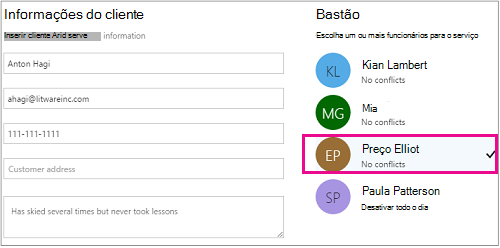

# Criar uma reserva manualCreate a manual booking

As reservas podem ser agendadas e são equipadas de duas maneiras diferentes.Bookings can be scheduled and staffed in two different ways. A primeira maneira é pelo cliente usando uma página de reserva autônoma ou uma página de reserva incorporada que você adiciona ao seu site.The first way is by the customer using a standalone booking page or an embedded booking page that you add to your website. A outra maneira é para você ou um de seus funcionários inserir manualmente os registros, como quando um cliente liga para um compromisso.The other way is for you or one of your employees to enter the bookings manually, such as when a customer calls for an appointment. Este artigo aborda o cenário manual.This article covers the manual scenario.

> [!NOTE]
> As reservas são ativadas por padrão para clientes que têm as assinaturas do Microsoft 365 Business Standard, da Microsoft 365 a3 ou do Microsoft 365 a5.Bookings is turned on by default for customers who have the Microsoft 365 Business Standard, Microsoft 365 A3, or Microsoft 365 A5 subscriptions. As reservas também estão disponíveis para clientes que têm o Office 365 Enterprise E3 e o Office 365 Enterprise e5, mas estão desativados por padrão.Bookings is also available to customers who have Office 365 Enterprise E3 and Office 365 Enterprise E5, but it is turned off by default. Para começar, confira [obter acesso aos Microsoft bookings](get-access.md).To get started, see [Get access to Microsoft Bookings](get-access.md). Para ativar ou desativar reservas, consulte [Ativar ou desativar reservas para sua organização](turn-bookings-on-or-off.md).To turn Bookings on or off, see [Turn Bookings on or off for your organization](turn-bookings-on-or-off.md).

1. No Microsoft 365, selecione o inicializador de aplicativos e, em seguida, selecione **reservas**.In Microsoft 365, select the App launcher, and then select **Bookings**.

   

1. No painel de navegação, selecione **Calendar** \> **novo agendamento**do calendário.In the navigation pane, select **Calendar** \> **New booking**.

   

1. Selecione o serviço a ser fornecido.Select the service to be provided. Consulte [definir suas ofertas de serviço no Microsoft bookings](define-service-offerings.md) para obter instruções de configuração de serviço.See [Define your service offerings in Microsoft Bookings](define-service-offerings.md) for service setup instructions.

1. Insira as informações do cliente, incluindo o nome, o endereço de email, o número de telefone e outros detalhes relevantes.Enter the customer information, including name, email address, phone number, and other relevant details.

1. Selecione o membro da equipe para fornecer o serviço.Select the staff member to provide the service. A lista de membros da equipe mostrada baseia-se no que você configurou na página serviços.The list of staff members shown is based on what you set up on the services page.

   

1. Insira os detalhes do serviço, incluindo data, hora, local e outras informações relevantes.Enter the service details, including date, time, location, and other relevant information. Depois de inserir um endereço de email válido para o cliente, o botão **salvar** será alterado para **Enviar**e você verá uma nota informando que uma confirmação será enviada ao cliente.Once you enter a valid email address for the customer, the **Save** button will change to **Send**, and you'll see a note telling you that a confirmation will be sent to the customer. A confirmação do cliente inclui um anexo para adicionar ao calendário.The customer confirmation includes an attachment for them to add to their calendar. Os membros da equipe selecionados também receberão convites de reunião com as informações de compromisso para que possam adicioná-lo aos seus calendários pessoais.Selected staff members will also receive meeting invitations with the appointment information so they can add it to their personal calendars.

1. Selecione **Adicionar um lembrete de email**.Select **Add an email reminder**.

1. Especifique quando o lembrete deve ser enviado, onde deve ser enviado (**cliente**, **equipe**, **todos os participantes**) e o que a mensagem de lembrete deve ser.Specify when the reminder should be sent, where it should be sent (**Customer**, **Staff**, **All attendees**), and what the reminder message should be.

1. Selecione **salvar** \> **envio**.Select **Save** \> **Send**.

   Veja um exemplo de email do lembrete que seu cliente receberá:Here's an example email of the reminder your customer will receive:

:::image type="content" source="../media/bookings-confirmed-email.png" alt-text="Captura de tela: exemplo de email de confirmação de uma reserva manual":::