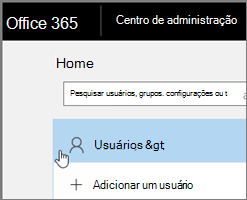
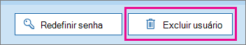

# <a name="delete-a-booking-calendar-in-bookings"></a>Excluir um calendário de reserva no Bookings

Este artigo explica como você pode excluir um calendário de reserva indesejado. Você pode excluir o calendário de reserva no centro de administração do Microsoft 365 ou pode usar o PowerShell. O calendário do Bookings é uma caixa de correio no Exchange Online, portanto, você exclui a conta de usuário correspondente para excluir o calendário de reserva.

> [!IMPORTANT]
> Todos os calendários de reserva criados em 2017 ou anterior devem ser excluídos usando as instruções do PowerShell neste tópico. Todos os calendários de reserva criados em 2018 ou posterior podem ser excluídos no Centro de administração do Microsoft 365.

O calendário de reserva é onde todas as informações relevantes sobre esse calendário de reserva e dados são armazenadas, incluindo:

- Informações comerciais, logotipo e horários de trabalho adicionados quando o calendário de reserva foi criado
- Equipe e serviços relevantes adicionados quando o calendário de reserva foi criado
- Todas as reservas e compromissos de folga adicionados ao calendário de reserva depois que ele foi criado.

> [!WARNING]
> Depois que um calendário de reserva é excluído, essas informações adicionais também são excluídas permanentemente e não podem ser recuperadas.

## <a name="delete-a-booking-calendar-in-the-microsoft-365-admin-center"></a>Excluir um calendário de reserva no centro de administração do Microsoft 365

1. Vá para o centro de administração do Microsoft 365.

1. No Centro de administração, selecione **Usuários**.

   

1. Na página **Usuários Ativos**, escolha os nomes dos usuários que você deseja excluir e escolha **Excluir usuário**.

   

## <a name="delete-a-booking-calendar-using-exchange-online-powershell"></a>Excluir um calendário de reserva usando o PowerShell do Exchange Online

Consulte [Connect to Exchange Online PowerShell](https://docs.microsoft.com/powershell/exchange/exchange-online-powershell-v2?view=exchange-ps) for prerequisites and guidance for connecting to Exchange Online PowerShell.

Para executar essas etapas, você deve estar usando uma janela de comando ativa do Microsoft PowerShell que você executava escolhendo a opção "Executar como administrador".

1. Em uma janela do Windows PowerShell, carregue o módulo EXO V2 executando o seguinte comando:

   ```powershell
   Import-Module ExchangeOnlineManagement
   ```

   > [!NOTE]
   > Se você já tiver [instalado o módulo EXO v2](https://docs.microsoft.com/powershell/exchange/exchange-online-powershell-v2?view=exchange-ps#install-and-maintain-the-exo-v2-module), o comando anterior funcionará como escrito.
   
2. O comando que você precisa executar usa a seguinte sintaxe:

   ```powershell
   Connect-ExchangeOnline -UserPrincipalName <UPN> 
   ```

   - _\<UPN\>_ é a sua conta no formato de nome principal do usuário (por exemplo, `john@contoso.com`).

3. Quando for solicitado, faça logoff com credenciais de administrador de locatários para o locatário do Microsoft 365 que hospeda o calendário de reserva que você deseja excluir permanentemente.

4. Depois que esse comando terminar de processar, insira o seguinte comando para obter uma lista das caixas de correio de reserva em seu locatário:

   ```powershell
   Get-EXOMailbox -RecipientTypeDetails Scheduling
   ```

5. Digite o seguinte comando:

   ```powershell
   remove-mailbox [BookingCalendarToDelete]
   ```

   > [!IMPORTANT]
   > Tenha cuidado para digitar o nome exato do alias de caixa de correio de reserva que você deseja excluir permanentemente.

6. Para verificar se o calendário foi excluído, insira o seguinte comando:

   ```powershell
    Get-EXOMailbox -RecipientTypeDetails Scheduling
   ```

   O calendário excluído não aparecerá na saída.
