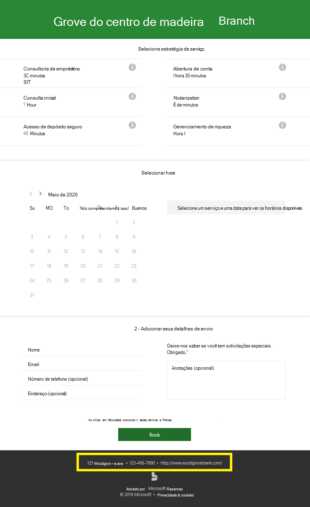
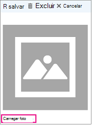

# Insira suas informações comerciaisEnter your business information

No Microsoft Bookings, a página Informações Comerciais dentro do aplicativo Web contém todos os detalhes que você normalmente encontrará na página "Sobre nós" de uma empresa.In Microsoft Bookings, the Business Information page within the web app contains all the details that you'd typically find on a business' "About us" page. Esses detalhes incluem um nome relevante, endereço, número de telefone, URL do site, URL da política de privacidade, logotipo e horário comercial.These details include your a relevant name, address, phone number, web site URL, privacy policy URL, logo, and business hours.

As informações fornecidas aqui serão exibidas na página que os clientes e clientes usam para agendar compromissos (conhecido como página de reserva) e em mensagens e lembretes enviados a eles pelo Bookings.The information you provide here will be displayed on the page customers and clients use to book appointments (known as the booking page) and in messages and reminders sent to them by Bookings. Um exemplo dessas informações na página de reserva é realçada abaixo.An example of this information on the booking page is highlighted below.

   

> [!NOTE]
> Para começar, confira [Obter acesso ao Microsoft Bookings.](get-access.md)To get started, see [Get access to Microsoft Bookings](get-access.md). Para ativar ou desativar o Bookings, confira Ativar ou desativar o [Bookings para sua organização.](turn-bookings-on-or-off.md)To turn Bookings on or off, see [Turn Bookings on or off for your organization](turn-bookings-on-or-off.md).

## Fornecer informações de contato e nome da empresaProvide business name and contact information

1. No Microsoft 365, selecione o iniciador de aplicativos e, em seguida, selecione **Bookings.**In Microsoft 365, select the App launcher, and then select **Bookings**.

1. No painel de navegação, selecione Informações **comerciais.**In the navigation pane, select **Business information**.

1. Insira o nome, o endereço e o número de telefone relevantes que você gostaria de usar para o calendário do Bookings.Enter the relevant name, address, and phone number you would like to use for your Bookings calendar.

1. Em **Enviar respostas do cliente para**, digite o endereço de email preferido onde as respostas de email para confirmações de reserva e lembretes devem ser encaminhadas.In **Send customer replies to**, type the preferred email address where email replies to booking confirmations and reminders should be forwarded.

1. No campo **URL do site,** insira a URL da home page da sua empresa.In the **Website URL** field, enter the URL of the home page for your business.

1. Insira a **política de privacidade** e os termos & **URLs.**Enter the **privacy policy** and **terms & conditions** URLs.

1. Selecione **Salvar**.Select **Save**.

## Definir seu horário comercialSet your business hours

Por padrão, o horário comercial no aplicativo Bookings é definido como 8h.By default, the business hours in the Bookings app are set to 8 a.m. às 17:00, de segunda a sexta-feira.to 5 p.m., Monday through Friday. As horas são fornecidas em incrementos de 15 minutos.Times are provided in 15-minute increments. O aplicativo Bookings usa o relógio de 12 horas.The Bookings app uses the 12-hour clock.

Definir **o horário comercial** para seu horário operacional.Set **business hours** to your operational hours. Estas são as horas para as quais todas as reservas são restritas.These are the hours to which all bookings are restricted. Restrições de tempo adicionais de quando os compromissos podem ser reservados podem ser definidas para cada serviço e para cada membro da equipe nas páginas Serviços e Funcionários, respectivamente.Additional time restrictions of when appointments can be booked can be set for each service and for each staff member in the Services and Staff pages, respectively.

1. Na página Informações comerciais, em Horário comercial, use os menus suspensos para selecionar horários de início e término de cada dia.On the Business information page, under Business hours, use the dropdowns to select start and end times for each day.

1. Clique **+** para adicionar seletores de início e hora de término.Click **+** to add start- and end-time selectors.

## Como definir horas para um turno divididoHow to set hours for a split shift

Talvez seja necessário bloquear uma parte de cada dia ou semana para fazer reuniões de equipe, atualizar o inventário ou cuidar de outros detalhes do ritmo de negócios.You might need to block out a portion of each day or week to have staff meetings, update inventory, or take care of other rhythm-of-business details. O aplicativo Bookings permite limitar os compromissos do cliente aos intervalos de tempo especificados.The Bookings app allows you to limit customer appointments to your specified time slots.

Por exemplo, você tem reuniões de equipe toda quinta-feira das 13h às 2h30 e deseja bloquear esse horário para que todos os membros da equipe possam participar.For example, you have staff meetings every Thursday from 1 o'clock to 2:30 and want to block out that time so all of your staff members can attend. Para fazer isso:To do this:

1. Na página Informações comerciais, em Horário comercial, selecione uma hora de início e término das quintas-feiras.On the Business information page, under Business hours, select a start and end time for Thursdays. Neste exemplo, definiremos 8:00 a.m.In this example we'll set 8:00 a.m. às 13:00to 1:00 p.m.

1. Selecione **+** para criar uma nova linha para quinta-feira.Select **+** to create a new row for Thursday.

   

1. Na nova linha, selecione 14:30.In the new row, select 2:30 p.m. para a hora de início e 18:00for the start time and 6:00 p.m. para a hora de término.for the end time.

   

1. Selecione Salvar.Select Save.

    Quando um cliente for até sua página de reserva, ele verá que sua empresa está fechada de 1 a 2:30 às quintas-feiras.When a customer goes to your booking page, he or she will see that your business is closed from 1 to 2:30 on Thursdays.

## Carregar seu logotipoUpload your logo

Se você ainda não tiver carregado o logotipo da sua empresa no aplicativo Bookings, poderá fazê-lo na página Informações comerciais.If you haven't already uploaded your business logo to the Bookings app, you can do it from the Business information page.

1. Na página Informações comerciais, em Carregar logotipo, selecione **Alterar**.On the Business information page, under Upload logo, select **Change**.

1. Selecione **Carregar foto**.Select **Upload photo**.

   

1. Selecione **Salvar**.Select **Save**.
