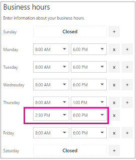

# Insira suas informações comerciais

No Microsoft Bookings, a página Informações Comerciais dentro do aplicativo Web contém todos os detalhes que normalmente você encontrará na página "Sobre nós" de uma empresa. Esses detalhes incluem um nome relevante, endereço, número de telefone, URL do site, URL da política de privacidade, logotipo e horário comercial.

As informações fornecidas aqui serão exibidas na página que os clientes e clientes usam para agendar compromissos (conhecidos como a página de reserva) e em mensagens e lembretes enviados a eles pelo Bookings. Um exemplo dessas informações na página de reserva é realçado abaixo.

   

> [!NOTE]
> Para começar, consulte [Obter acesso ao Microsoft Bookings](get-access.md). Para ativar ou desativar o Bookings, consulte Ativar ou desativar o [Bookings para sua organização.](turn-bookings-on-or-off.md)

## Fornecer informações de contato e nome da empresa

1. Em Microsoft 365, selecione o iniciador de aplicativos e selecione **Bookings**.

1. No painel de navegação, selecione **Informações de negócios.**

1. Insira o nome, o endereço e o número de telefone relevantes que você gostaria de usar para o calendário do Bookings.

1. Em **Enviar respostas do cliente para**, digite o endereço de email preferencial em que as respostas de email às confirmações de reserva e lembretes devem ser encaminhadas.

1. No campo **URL do site,** insira a URL da home page para sua empresa.

1. Insira a **política de privacidade** e os termos & **URLs de** condições.

1. Selecione **Salvar**.

## Definir seus horários comerciais

Por padrão, o horário comercial no aplicativo Bookings é definido como 8:00. às 17h, de segunda a sexta- feira. Os tempos são fornecidos em incrementos de 15 minutos. O aplicativo Bookings usa o relógio de 12 horas.

De **definir o horário** comercial para seu horário operacional. Esses são os horários aos quais todas as reservas são restritas. Restrições de tempo adicionais de quando os compromissos podem ser reservados podem ser definidas para cada serviço e para cada membro da equipe nas páginas Serviços e Funcionários, respectivamente.

1. Na página Informações de negócios, em Horário Comercial, use os menus suspensos para selecionar horários de início e término para cada dia.

1. Clique **+** para adicionar seletores de início e de fim.

## Como definir horas para um turno dividido

Talvez seja necessário bloquear uma parte de cada dia ou semana para ter reuniões de equipe, atualizar inventário ou cuidar de outros detalhes do ritmo do negócio. O aplicativo Bookings permite limitar os compromissos do cliente aos intervalos de tempo especificados.

Por exemplo, você tem reuniões de equipe todas as quintas-feiras das 13:00 às 2:30 e deseja bloquear esse horário para que todos os seus membros da equipe possam participar. Para fazer isso:

1. Na página Informações de negócios, em Horário Comercial, selecione uma hora de início e término para quintas-feiras. Neste exemplo, definiremos 8:00 da manhã. às 13:00.

1. Selecione **+** para criar uma nova linha para quinta-feira.

   

1. Na nova linha, selecione 14:30. para a hora de início e 18:00. para a hora de término.

   

1. Selecione Salvar.

    Quando um cliente for até sua página de reserva, ele verá que sua empresa está fechada de 1 a 2:30 às quintas-feiras.

## Upload seu logotipo

Se você ainda não tiver carregado o logotipo da sua empresa no aplicativo Bookings, poderá fazê-lo na página Informações comerciais.

1. Na página Informações de negócios, em Upload logotipo, selecione **Alterar**.

1. Selecione **Upload foto**.

   

1. Selecione **Salvar**.
