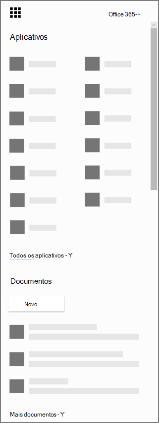

# Obter o aplicativo Microsoft Bookings para iOS e Android

Obrigado por baixar o aplicativo Microsoft Bookings! O Microsoft Bookings está disponível como um aplicativo móvel para iOS e Android. O aplicativo Bookings para iOS está disponível em todas as regiões e países com suporte da Apple. Você pode baixar o aplicativo na [App Store do iTunes.](https://apps.apple.com/app/microsoft-bookings/id1065657468) O aplicativo Bookings para Android está disponível para download na [Google Play Store](https://play.google.com/store/apps/details?id=com.microsoft.exchange.bookings) nos EUA e no Canadá.

Antes de começar, você precisa configurar o Bookings na Web.

1. Não consegue encontrar o aplicativo que está procurando? No iniciador de aplicativos, selecione Todos os aplicativos para ver uma lista em ordem alfabética dos aplicativos do Microsoft 365 disponíveis para você. A partir daí, você pode procurar um aplicativo específico

   

2. Got to [the Office home page](https://office.com) and from the app launcher, select **Bookings**.

3. Selecione **Obter agora.**

4. Forneça o nome e o tipo de negócios que você executará, como o hair hair hair ou a prática de hotel, e selecione **Para o Bookings.**

5. Agora você está pronto para configurar o Bookings para sua organização. Siga as etapas no tópico [do Microsoft Bookings](bookings-overview.md) para concluir a configuração do Bookings. Volte para seu dispositivo móvel e saia do aplicativo móvel. Entre novamente para acessar seu novo calendário de reserva.

## Modo somente exibição

Qualquer usuário que não tenha acesso de leitura e gravação no Bookings ainda poderá usar o aplicativo móvel no modo somente exibição. Qualquer pessoa com uma licença do Bookings que é adicionada a um calendário de reserva pode ver suas próprias agendas, detalhes de compromisso e informações comerciais de seus colegas. Um usuário com acesso somente para exibição não pode fazer alterações ou edições e não pode acessar a lista de clientes.
