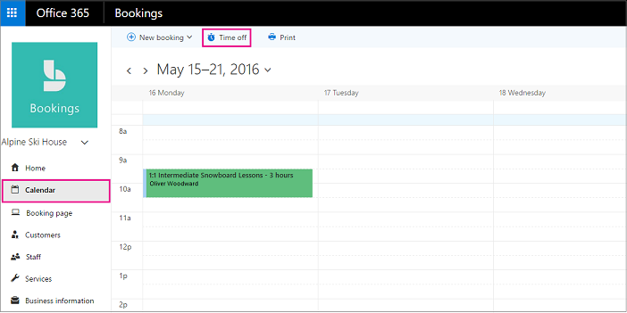
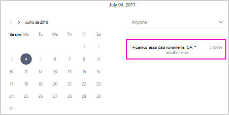

# Agendar fechamentos comerciais, folgas e períodos de férias

Ocasionalmente, você vai querer fechar sua empresa para feriados ou eventos de equipe, ou seus funcionários precisarão de licença médica, em férias ou indisponíveis por outros motivos. Você pode agendar uma folga no calendário do Microsoft Bookings, e o funcionário ficará indisponível para reservas durante o horário especificado. Depois que a empresa reabrir ou os funcionários retornarem ao trabalho, todos serão listados na página de reserva de acordo com suas horas de trabalho estabelecidas.

Assista a este vídeo ou siga as etapas abaixo para agendar fechamentos comerciais ou funcionários desligados.

> [!VIDEO https://www.microsoft.com/videoplayer/embed/RE2TxDC]

## Agendar fechamentos comerciais ad hoc

1. No Microsoft 365, selecione o iniciador de aplicativos e, em seguida, selecione Bookings.

1. No painel de navegação, selecione **Folga** \> **do Calendário.**

   

1. Preencha os detalhes, incluindo título, data e hora de início e término, local e anotações adicionais.

1. Selecione **o evento de dia inteiro.**

1. Selecione todos os membros da equipe.

1. Selecione **Salvar**.

Quando um cliente tentar agendar o serviço em um dia em que o escritório estiver fechado, ele verá uma mensagem na página de reserva.

   

## Agendar folga do funcionário

1. No Microsoft 365, selecione o iniciador de aplicativos e, em seguida, selecione **Bookings.**

   

1. No painel de navegação, selecione **Folga** \> **do Calendário.**

   

1. Preencha os detalhes, incluindo título, data e hora de início e término, local e anotações adicionais. Se o funcionário ficar fora por um dia completo ou por vários dias, selecione **o evento De dia inteiro.**

1. Selecione o membro ou membros da equipe que estão de folga.

1. Selecione **Salvar**.
