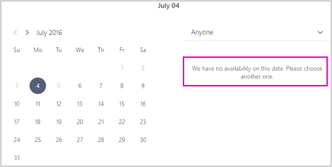

# Agendar fechamentos de negócios, folga e período de fériasSchedule business closures, time off, and vacation time

Ocasionalmente, você vai querer fechar sua empresa para feriados ou eventos de equipe, ou seus funcionários precisarão de folga quando eles estão doentes, em férias ou indisponíveis por outros motivos.Occasionally, you'll want to close your business for holidays or team events, or your employees will need time off when they're sick, on vacation, or unavailable for other reasons. Você pode agendar o tempo de folga do calendário do Microsoft Bookings e o funcionário ficará indisponível para reservas durante o horário especificado.You can schedule time off from the Microsoft Bookings calendar, and the employee will be unavailable for bookings during the specified time. Quando a empresa reabrir ou os funcionários retornarem ao trabalho, todos serão listados na página de reserva de acordo com suas horas de trabalho estabelecidas.Once the business reopens or employees return to work, everyone will be listed on the booking page according to their established work hours.

Assista a este vídeo ou siga as etapas abaixo para agendar fechamentos de negócios ou funcionários desligados.Watch this video or follow the steps below to schedule business closures or employee off.

> [!VIDEO https://www.microsoft.com/videoplayer/embed/RE2TxDC]

## Agendar fechamentos comerciais ad hocSchedule ad hoc business closures

1. Em Microsoft 365, selecione o launcher do aplicativo e selecione Bookings.In Microsoft 365, select the app launcher, and then select Bookings.

1. No painel de navegação, selecione **Tempo** \> **de folga do calendário**.In the navigation pane, select **Calendar** \> **Time off**.

   

1. Preencha os detalhes, incluindo um título, data e hora de início e término, local e anotações adicionais.Fill in the details, including a title, start and end date and times, location, and additional notes.

1. Selecione **Evento Todos os dias**.Select **All day event**.

1. Selecione todos os membros da equipe.Select all staff members.

1. Selecione **Salvar**.Select **Save**.

Quando um cliente tenta agendar o serviço em um dia em que o escritório é fechado, ele verá uma mensagem na página de reserva.When a customer attempts to schedule service on a day the office is closed, they'll see a message on the booking page.

   

## Agendar o tempo de folga do funcionárioSchedule employee time off

1. Em Microsoft 365, selecione o launcher do aplicativo e selecione **Bookings**.In Microsoft 365, select the app launcher, and then select **Bookings**.

   

1. No painel de navegação, selecione **Tempo** \> **de folga do calendário**.In the navigation pane, select **Calendar** \> **Time off**.

   

1. Preencha os detalhes, incluindo um título, data e hora de início e término, local e anotações adicionais.Fill in the details, including a title, start and end date and times, location, and additional notes. Se o funcionário for embora por um dia completo ou por vários dias, selecione **Evento Todo o dia**.If the employee will be gone for a full day or for several days, select **All day event**.

1. Selecione o membro da equipe ou membros que estão de folga.Select the staff member or members who are taking the time off.

1. Selecione **Salvar**.Select **Save**.
