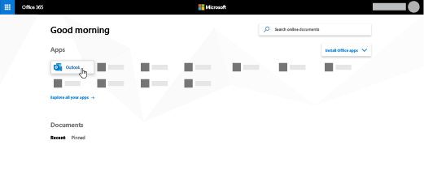
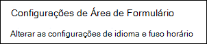
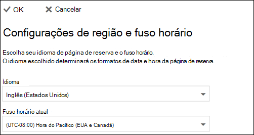

# Definir idioma e fusos horário no Microsoft Bookings

Se você estiver usando o Microsoft Bookings e as reservas são criadas na hora errada, as configurações do fuso horário podem precisar ser alteradas. Da mesma forma, se algumas reservas estão no idioma errado, talvez seja necessário alterar suas configurações de idioma.

Há duas configurações de idioma e fuso horário separados para o Bookings. A primeira configuração controla o idioma e o fuso horário do calendário de reserva e é definida usando o Outlook nas configurações da Web para o calendário pessoal do usuário conectado. A segunda configuração afeta a página de reserva de autoatendamento que seus clientes usam e é definida usando uma página "configurações regionais" que controla o idioma e o fuso horário apenas para essa página.

## Definindo idioma e fuso horário para um calendário de reserva

O calendário de reserva usa as configurações de idioma e fuso horário do usuário conectado. Por exemplo, se o fuso horário do usuário conectado estiver definido como Horário Padrão do Leste (EST), o calendário de reserva mostrará os horários de início e término de compromisso existentes no EST. Esse fuso horário foi originalmente definido quando as Microsoft 365 e Outlook nas contas da Web foram criadas.

Para definir o idioma e o fuso horário do calendário de reserva:

1. Entre no Microsoft 365 e selecione o Outlook na página inicial (conforme mostrado na captura de tela abaixo) ou no Microsoft 365 de aplicativos.

   

1. Depois Outlook abrir, selecione  o ícone de engrenagem no canto superior direito da tela para abrir suas configurações pessoais e de conta e, em seguida, procure "fuso horário" na caixa de pesquisa do painel **Configurações.** O painel será atualizado para mostrar suas configurações atuais de fuso horário e idioma pessoal para essa conta. Conforme mencionado acima, essa configuração também controla o idioma e o fuso horário do calendário de reserva.

1. Altere o idioma ou o fuso horário selecionando a seta para baixo na caixa **Idioma** ou fuso horário atual e escolhendo a configuração desejada.

1. Clique em **Salvar**. O Configurações painel é fechado, Outlook na Web reinicia e as novas configurações de idioma e fuso horário são aplicadas.

## Definindo o idioma e o fuso horário da página de reserva

1. Em Microsoft 365, selecione o launcher do aplicativo e selecione **Bookings**.

1. No painel de navegação, selecione **Página reserva** e selecione **Alterar configurações de fuso horário e idioma.**

   

1. Selecione seu idioma e fuso horário atual e escolha OK.

   
