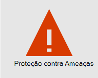
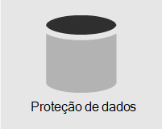
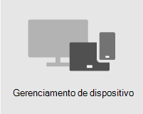

# Visão geral da segurançaOverview of security

> [!VIDEO https://www.microsoft.com/videoplayer/embed/RE4mzxI?autoplay=false]

Microsoft 365 Business Premium fornece proteção contra ameaças, proteção de dados e recursos de gerenciamento de dispositivos para ajudá-lo a proteger sua empresa contra ameaças online e acesso não autorizado, bem como proteger e gerenciar dados da empresa em seus telefones, tablets e computadores.Microsoft 365 Business Premium provides threat protection, data protection, and device management features to help you protect your company from online threats and unauthorized access, as well as protect and manage company data on your phones, tablets, and computers.

| [Proteção contra AmeaçasThreat protection](#threat-protection)|  [Proteção de dadosData protection](#data-protection) |   [Gerenciamento de dispositivoDevice management](#device-management) |
|--|--|--|

## Proteção contra ameaçasThreat protection

Microsoft 365 Business Premium inclui Office 365 Proteção Avançada contra Ameaças [(ATP),](safe-links.md)um serviço de filtragem de email baseado em nuvem que protege você contra malware, ransomware, links prejudiciais e muito mais.Microsoft 365 Business Premium includes [Office 365 Advanced Threat Protection (ATP)](safe-links.md), a cloud-based email filtering service that protects you from malware, ransomware, harmful links, and more. Os links Cofre ATP protegem você contra URLs mal-intencionadas no email ou Office documentos.ATP Safe Links protects you from malicious URLs in email or Office documents. A atp Cofre anexos protege você contra malware e vírus anexados a mensagens ou documentos.ATP Safe Attachments protects you from malware and viruses attached to messages or documents.

A autenticação multifatória [(MFA)](turn-on-mfa.md), ou verificação em duas etapas, exige que você apresente uma segunda forma de autenticação, como um código de verificação, para confirmar sua identidade antes de poder acessar recursos.[Multi-factor authentication (MFA)](turn-on-mfa.md), or two-step verification, requires you to present a second form of authentication, such as a verification code, to confirm your identity before you can access resources.

[Windows Defender](/windows/security/threat-protection/overview-of-threat-mitigations-in-windows-10) oferece proteção abrangente para seu sistema, arquivos e atividades online contra vírus, malware, spyware e outras ameaças.[Windows Defender](/windows/security/threat-protection/overview-of-threat-mitigations-in-windows-10) provides comprehensive protection for your system, files, and online activities from viruses, malware, spyware, and other threats.

## Proteção de dadosData protection

Os recursos de proteção de dados Microsoft 365 Business Premium ajudar a garantir que os dados importantes permaneçam seguros e que somente as pessoas autorizadas tenham acesso a eles.Data protection features in Microsoft 365 Business Premium help ensure that important data stays secure and only authorized people have access to it.

Você pode usar políticas de prevenção contra perda de dados [(DLP)](set-up-dlp.md) para identificar e gerenciar informações confidenciais, como números de cartão de crédito ou previdência social, para que não seja compartilhada por engano.You can use [data loss prevention (DLP)](set-up-dlp.md) policies to identify and manage sensitive information, such as Social Security or credit card numbers, so that it isn't mistakenly shared.

[Criptografia de Mensagens do Office 365](/microsoft-365/compliance/ome) combina recursos de criptografia e direitos de acesso para ajudar a garantir que apenas os destinatários pretendido possam exibir o conteúdo da mensagem.[Office 365 Message Encryption](/microsoft-365/compliance/ome) combines encryption and access rights capabilities to help ensure that only intended recipients can view message content. Criptografia de Mensagens do Office 365 funciona com Outlook.com, Yahoo!, Gmail e outros serviços de email.Office 365 Message Encryption works with Outlook.com, Yahoo!, and Gmail, and other email services.

[Arquivamento do Exchange Online](/office365/servicedescriptions/exchange-online-archiving-service-description/exchange-online-archiving-service-description) é uma solução de arquivamento baseada em nuvem que funciona com o Microsoft Exchange ou Exchange Online para fornecer recursos avançados de arquivamento, incluindo resquências e redundância de dados.[Exchange Online Archiving](/office365/servicedescriptions/exchange-online-archiving-service-description/exchange-online-archiving-service-description) is a cloud-based archiving solution that works with Microsoft Exchange or Exchange Online to provide advanced archiving capabilities, including holds and data redundancy. Você pode usar políticas de retenção para ajudar sua organização a reduzir os passivos associados a emails e outras comunicações.You can use retention policies to help your organization reduce the liabilities associated with email and other communications. Se sua empresa for necessária para manter comunicações relacionadas a litígios, você poderá usar In-Place Retençãos e Retençãos de Litígio para preservar emails relacionados.If your company is required to retain communications related to litigation, you can use In-Place Holds and Litigation Holds to preserve related email.

## Gerenciamento de dispositivoDevice management

Microsoft 365 Business Premium recursos avançados de gerenciamento de dispositivos permitem monitorar e controlar o que os usuários podem fazer com dispositivos inscritos.Microsoft 365 Business Premium advanced device management features let you monitor and control what users can do with enrolled devices. Esses recursos incluem acesso condicional, Gerenciamento de Dispositivo [Móvel (MDM),](/microsoft-365/admin/basic-mobility-security/manage-enrolled-devices)BitLocker e atualizações automáticas.These features include conditional access, [Mobile Device Management (MDM)](/microsoft-365/admin/basic-mobility-security/manage-enrolled-devices), BitLocker, and automatic updates.

Você pode usar políticas de acesso condicional para exigir medidas de segurança adicionais para determinados usuários e tarefas.You can use conditional access policies to require additional security measures for certain users and tasks. Por exemplo, você pode exigir a autenticação multifacional (MFA) ou bloquear clientes que não suportam acesso condicional.For example, you can require multi-factor authentication (MFA) or block clients that don't support conditional access.

Com o MDM, você pode ajudar a proteger e gerenciar os dispositivos móveis dos usuários, como iPhones, iPads, Androids e Windows telefones.With MDM, you can help secure and manage your users' mobile devices like iPhones, iPads, Androids, and Windows phones. Você pode criar e gerenciar políticas de segurança de dispositivos, apagar remotamente um dispositivo para remover todos os dados da empresa, redefinir um dispositivo para configurações de fábrica e exibir relatórios de dispositivo detalhados.You can create and manage device security policies, remotely wipe a device to remove all company data, reset a device to factory settings, and view detailed device reports.

Você pode habilitar BitLocker criptografia para ajudar a proteger dados no caso de um dispositivo ser perdido ou roubado e permitir que Windows Exploit Guard forneça proteção avançada contra ransomware.You can enable BitLocker encryption to help protect data in case a device is lost or stolen, and enable Windows Exploit Guard to provide advanced protection against ransomware.

Você pode configurar atualizações automáticas para que os recursos e atualizações mais recentes de segurança sejam aplicados a todos os dispositivos do usuário.You can configure automatic updates so that the latest security features and updates are applied to all user devices.

## Diretrizes de segurança recomendadasRecommended security guidance

Se você tem o Microsoft Business Premium, a maneira mais rápida para configurar a segurança e iniciar a colaborar com segurança é seguir as orientações nesta biblioteca:[Microsoft 365 para pequenas empresas e campanhas](../campaigns/index.md).If you have Microsoft Business Premium, the quickest way to setup security and begin collaborating safely is to follow the guidance in this library: [Microsoft 365 for smaller businesses and campaigns](../campaigns/index.md). Essa diretriz foi criada em parceria com a equipe do Microsoft Defendering Democracy para proteger todos os clientes de pequenas empresas contra ameaças cibernéticas iniciadas por hackers sofisticados.This guidance was developed in partnership with the Microsoft Defending Democracy team to protect all small business customers against cyber threats launched by sophisticated hackers.
