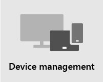

# Visão geral da segurança

> [!VIDEO https://www.microsoft.com/videoplayer/embed/RE4mzxI?autoplay=false]

O Microsoft 365 Business Premium fornece proteção contra ameaças, proteção de dados e recursos de gerenciamento de dispositivos para ajudar você a proteger sua empresa contra ameaças online e acesso não autorizado, bem como proteger e gerenciar dados da empresa em seus telefones, tablets e computadores.

| [Proteção contra ameaças](#threat-protection)|  [Proteção de dados](#data-protection) |   [Gerenciamento de dispositivos](#device-management) |
|--|--|--|

## Proteção contra Ameaças

O Microsoft 365 Business Premium inclui a Proteção Avançada contra Ameaças (ATP) do Office 365, um serviço de filtragem de email baseado em nuvem que protege você contra malware, ransomware, links prejudiciais e muito mais. Os Links Seguros da ATP protegem você contra URLs mal-intencionadas em emails ou documentos do Office. Os Anexos Seguros da ATP protegem você contra malware e vírus anexados a mensagens ou documentos.

A MFA (autenticação multifatória), ou verificação em duas etapas, exige que você apresente uma segunda forma de autenticação, como um código de verificação, para confirmar sua identidade antes de poder acessar os recursos.  

O Windows Defender fornece proteção abrangente para seu sistema, arquivos e atividades online contra vírus, malware, spyware e outras ameaças.

## Proteção de dados

Os recursos de proteção de dados do Microsoft 365 Business Premium ajudam a garantir que dados importantes permaneçam seguros e que somente pessoas autorizadas tenham acesso a eles.

Você pode usar políticas de prevenção contra perda de dados (DLP) para identificar e gerenciar informações confidenciais, como números de cartão de crédito ou previdência social, para que não seja compartilhada por engano. 

A Criptografia de Mensagens do Office 365 combina recursos de direitos de acesso e criptografia para ajudar a garantir que somente os destinatários pretendido possam exibir o conteúdo da mensagem. A Criptografia de Mensagens do Office 365 funciona com Outlook.com, Yahoo!, Gmail e outros serviços de email.

O Arquivamento do Exchange Online é uma solução de arquivamento baseada em nuvem que funciona com o Microsoft Exchange ou o Exchange Online para fornecer recursos avançados de arquivamento, incluindo retém e redundância de dados. Você pode usar políticas de retenção para ajudar sua organização a reduzir as obrigações associadas ao email e a outras comunicações. Se sua empresa for obrigada a manter as comunicações relacionadas a litígios, você poderá usar In-Place Retenção e Reter Litígios para preservar emails relacionados.

## Gerenciamento de dispositivo

Os recursos avançados de gerenciamento de dispositivos do Microsoft 365 Business Premium permitem monitorar e controlar o que os usuários podem fazer com dispositivos inscritos. Esses recursos incluem acesso condicional, Gerenciamento de Dispositivo Móvel (MDM), BitLocker e atualizações automáticas.

Você pode usar políticas de acesso condicional para exigir medidas de segurança adicionais para determinados usuários e tarefas. Por exemplo, você pode exigir a MFA (autenticação multifacional) ou bloquear clientes que não suportam acesso condicional.

Com o MDM, você pode ajudar a proteger e gerenciar os dispositivos móveis dos usuários, como iPhones, iPads, Androids e telefones Windows. Você pode criar e gerenciar políticas de segurança de dispositivo, apagar remotamente um dispositivo para remover todos os dados da empresa, redefinir um dispositivo para configurações de fábrica e exibir relatórios detalhados do dispositivo. 

Você pode habilitar a criptografia BitLocker para ajudar a proteger dados caso um dispositivo seja perdido ou roubado e permitir que o Windows Exploit Guard forneça proteção avançada contra ransomware.

Você pode configurar as atualizações automáticas para que os recursos e as atualizações de segurança mais recentes sejam aplicados a todos os dispositivos do usuário. 