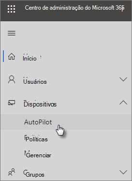

# Use o guia passo a passo para adicionar perfil e dispositivos do AutopilotUse the step-by-step guide to add Autopilot devices and profile

Você pode usar o Windows AutoPilot para configurar novos dispositivos **Windows** 10 para sua empresa para que eles ficam prontos para uso quando você os entrega aos funcionários.You can use Windows AutoPilot to set up **new** Windows 10 devices for your business so they're ready for use when you give them to your employees.
  
## Requisitos do dispositivoDevice requirements

Os dispositivos devem atender a estes requisitos:Devices must meet these requirements:
  
- Windows 10, versão 1703 ou posteriorWindows 10, version 1703 or later
    
- Novos dispositivos que não passaram pela configuração de configuração do WindowsNew devices that haven't been through Windows out-of-box experience
    
## Usar o guia de configuração para criar perfis e dispositivosUse the setup guide to create devices and profiles

Se você ainda não criou grupos de dispositivos ou perfis, a melhor maneira de começar é usando o guia passo a passo.If you haven't created device groups or profiles yet, the best way to get started is by using the step-by-step guide. Você também pode [adicionar dispositivos](create-and-edit-autopilot-devices.md) [e atribuir perfis](create-and-edit-autopilot-profiles.md) a eles sem usar o guia.You can also [add devices](create-and-edit-autopilot-devices.md) and [assign profiles](create-and-edit-autopilot-profiles.md) to them without using the guide. 
  
1. Vá para o centro de administração do<a href="https://go.microsoft.com/fwlink/p/?linkid=837890" target="_blank">https://admin.microsoft.com</a>.Go to the admin center at <a href="https://go.microsoft.com/fwlink/p/?linkid=837890" target="_blank">https://admin.microsoft.com</a>.

2. No painel de navegação esquerdo, escolha **Dispositivos** \> **AutoPilot.**On the left navigation pane, choose **Devices** \> **AutoPilot**.

    
  
2. Na página **AutoPilot,** clique ou toque no **guia Iniciar.**On the **AutoPilot** page, click or tap **Start guide**.
    
    
  
3. No arquivo **Upload .csv com a lista** de dispositivos, navegue até um local onde você preparou. Arquivo CSV **e,** em seguida, Abrir \> **Próximo**.On the **Upload .csv file with list of devices** page, browse to a location where you have the prepared .CSV file, then **Open** \> **Next**. O arquivo deve ter três headers:The file must have three headers:
    
    - Coluna A: Número de série do dispositivoColumn A: Device Serial Number
    
    - Coluna B: ID do produto WindowsColumn B: Windows Product ID
    
    - Coluna C: Hash de hardwareColumn C: Hardware Hash
    
    Você pode obter essas informações do fornecedor de hardware ou usar o [script Get-WindowsAutoPilotInfo powerShell](https://www.powershellgallery.com/packages/Get-WindowsAutoPilotInfo) para gerar um arquivo CSV.You can get this information from your hardware vendor, or you can use the [Get-WindowsAutoPilotInfo PowerShell script](https://www.powershellgallery.com/packages/Get-WindowsAutoPilotInfo) to generate a CSV file. 
    
    Para saber mais, confira o [Arquivo CSV da lista de dispositivos](https://docs.microsoft.com/microsoft-365/admin/misc/device-list). Você também pode baixar um exemplo de arquivo na página **Carregar arquivo .csv com uma lista de dispositivos**.For more information, see [Device list CSV-file](https://docs.microsoft.com/microsoft-365/admin/misc/device-list). You can also download a sample file on the **Upload .csv file with list of devices** page. 
    
> [!NOTE]
> Esse script usa WMI para recuperar as propriedades necessárias para que um cliente registre um dispositivo com o Windows Autopilot.This script uses WMI to retrieve properties needed for a customer to register a device with Windows Autopilot. Observe que é normal que o arquivo CSV resultante não colete um valor de ID de Produto (PKID) do Windows, pois isso não é necessário para registrar um dispositivo e o PKID sendo NULL no CSV de saída é totalmente bom.Note that it is normal for the resulting CSV file to not collect a Windows Product ID (PKID) value since this is not required to register a device and PKID being NULL in the output CSV is totally fine. Somente o número de série e o hash de hardware serão preenchidos.Only the serial number and hardware hash will be populated.
    
4. Na página **Atribuir um perfil,** você pode escolher um perfil existente ou criar um novo.On the **Assign a profile** page, you can either pick an existing profile or create a new one. Se você ainda não tiver um, será solicitado a criar um.If you don't have one yet, you'll be prompted to create one. 
    
    Um perfil é um conjunto de configurações que podem ser aplicadas a um único dispositivo ou a um grupo de dispositivos.A profile is a collection of settings that can be applied to a single device or to a group of devices.
    
    Os recursos padrão são necessários e são definidos automaticamente.The default features are required and are set automatically. Os recursos padrão são:The default features are:
    
    - Ignore o registro da Cortana, do OneDrive e do OEM.Skip Cortana, OneDrive, and OEM registration.
    
    - Crie uma experiência de entrada com a marca da sua empresaCreate sign-in experience with your company brand.
    
    - Conecte seus dispositivos às contas do Azure Active Directory e inscreva-os automaticamente para serem gerenciados pelo Microsoft 365 Business Premium.Connect your devices to Azure Active Directory accounts, and automatically enroll them to be managed by Microsoft 365 Business Premium.
    
    Para obter mais informações, consulte Sobre as configurações do [Perfil do AutoPilot.](autopilot-profile-settings.md)For more information, see [About AutoPilot Profile settings](autopilot-profile-settings.md). 
    
5. As outras configurações são **Ignorar as configurações de privacidade** e **Não permitir que o usuário se torne o administrador local**. Por padrão, essas configuração são definidas como **Desativado**.The other settings are **Skip privacy settings** and **Don't allow user to become the local admin**. These are both set to **Off** by default. 
    
    Escolha **Avançar**.Choose **Next**.
    
6. **Você terminou indica que** o perfil que você criou (ou escolheu) será aplicado ao grupo de dispositivos que você criou carregando a lista de dispositivos.**You're done** indicates that the profile you created (or chose) will be applied to the device group you created by uploading the list of devices. As configurações entrarão em vigor quando os usuários do dispositivo entrarem em seguida.The settings will be in effect when the device users sign in next. Escolha **Fechar**.Choose **Close**.
    
