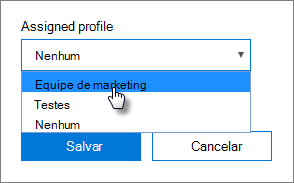

# Crie e edite os perfis do AutoPilot

## Criar um perfil

Um perfil aplica-se a um dispositivo ou a um grupo de dispositivos,
  
1. No centro de administração do Microsoft 365, escolha **Dispositivos** \> **AutoPilot**.
  
2. Na página **AutoPilot,** escolha a guia **Perfis** \> **Criar perfil**.
    
3. Na página **Criar perfil,** insira um nome para o perfil que o ajuda a identificá-lo, por exemplo, Marketing. A opção Ativar a configuração que você deseja e, em seguida, escolha **Salvar**. Para obter mais informações sobre as configurações de perfil do AutoPilot, consulte [Sobre configurações do Perfil do AutoPilot.](autopilot-profile-settings.md)
    
    
  
### Aplicar perfil a um dispositivo

Depois de criar um perfil, você pode aplicá-lo a um dispositivo ou a um grupo de dispositivos. Você pode escolher um perfil existente no guia passo a passo e [aplicá-lo](add-autopilot-devices-and-profile.md) a novos dispositivos ou substituir um perfil existente para um dispositivo ou grupo de dispositivos. 
  
1. Na página **Preparar o Windows**, escolha a guia **Dispositivos**. 
    
2. Marque a caixa de seleção ao lado  de um nome de  dispositivo e, no painel Dispositivo, escolha um perfil na lista de perfis \> **atribuídos Salvar**.
    
    
  
## Editar, excluir ou remover um perfil

Após atribuir um perfil a um dispositivo, você poderá atualizá-lo, mesmo que já tenha atribuído o dispositivo a um usuário. Quando o dispositivo se conecta à Internet, ele baixa a versão mais recente do seu perfil durante o processo de configuração. Se o usuário restaurar o dispositivo para as configurações padrão de fábrica, o dispositivo baixará novamente as atualizações mais recentes para seu perfil. 
  
### Editar um perfil

1. Na página **Preparar o Windows**, escolha a guia **Perfis**. 
    
2. Marque a caixa de seleção ao lado  de um nome de dispositivo e, no painel Perfil, atualize qualquer uma das configurações disponíveis \> **Salvar**.
    
    Se você fizer isso antes de um usuário conectar o dispositivo à internet, o perfil será aplicado ao processo de configuração.
    
### Excluir um perfil

1. Na página **Preparar o Windows**, escolha a guia **Perfis**. 
    
2. Marque a caixa de seleção ao lado de um nome de dispositivo e, no **painel** Perfil, selecione Excluir **salvar perfil** \> .
    
    Quando você exclui um perfil, ele é removido de um dispositivo ou grupo de dispositivos ao qual foi atribuído.
    
### Remover um perfil

1. Na página **Preparar o Windows**, escolha a guia **Dispositivos**. 
    
2. Marque a caixa de seleção ao lado  de um nome  de dispositivo e, no painel Dispositivo, escolha **Nenhum** na lista de perfis \> **atribuídos Salvar**.
    
