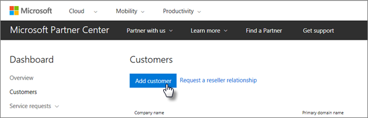

# Obter o Microsoft 365 Business Premium

## Obter o Microsoft 365 Business Premium da Microsoft

Se você não tem um parceiro e deseja obter o Microsoft 365 Business Premium, você pode [comprá-lo aqui](https://www.microsoft.com/en-US/microsoft-365/business).

Consulte [inscrever-se no Microsoft 365 Business Premium](sign-up.md) para obter instruções detalhadas.

Você também pode fazer o início para uma [loja da Microsoft](https://www.microsoft.com/en-us/store/locations/find-a-store?icid=en_US_Store_UH_FAS) para comprar o Microsoft 365 Business Premium e obter a ajuda da configuração.
  
## Obter o Microsoft 365 Business Premium da Microsoft Partner Center

1. Entre no site [Microsoft Partner Center](https://go.microsoft.com/fwlink/p/?linkid=849910) usando as credenciais criadas quando você se inscreveu no programa Provedor de Soluções na Nuvem da Microsoft. 
    
2. No painel do parceiro, escolha **clientes**e, em seguida, selecione seu cliente ou adicione um novo cliente antes de obter o Microsoft 365 Business Premium.
    
    
  
3. Na página **assinatura** do cliente, selecione **Adicionar assinatura**, escolha a opção pequena empresa em catálogo e, em seguida, escolha **Microsoft 365 Business Premium**.
    
    Selecione o número de licenças necessárias (até 300). Se você tiver mais de 300 usuários, confira [Microsoft 365 Enterprise](https://go.microsoft.com/fwlink/p/?linkid=862316) . 
    
    
  
    Conclua o restante das etapas para adicionar um novo cliente, incluindo o nome da empresa.
    

