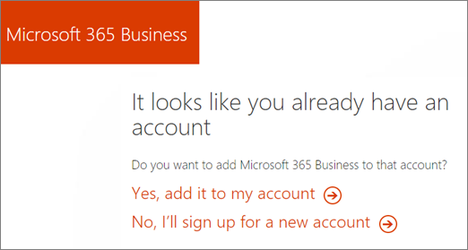
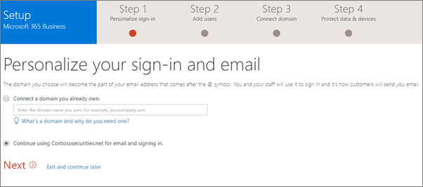

# Migrar para o Microsoft 365 corporativos do Office 365 Business Premium

Se você já tiver um Office 365 para assinatura de negócios, por exemplo, Office 365 Business Premium, facilmente você pode adicionar licenças ao Microsoft 365 Business e atribuí-las a alguns ou todos os usuários.
  
> [!NOTE]
> Você não pode usar o botão de [planos de opção](https://support.office.com/article/73318661-8f33-478b-bcc7-fb8d69dbb22a?.aspx#switchbutton) para atualizar para o Microsoft 365 Business ainda. 
  
## Adicionar licenças da Microsoft 365 Business

Você tem duas maneiras de obter Microsoft 365 Business. Se você tiver um parceiro, ele pode comprar Microsoft 365 Business para você do [Centro de parceiros da Microsoft](get-microsoft-365-business.md). Seu parceiro também pode ajudar a transição para o Microsoft 365 Business.
  
Se você gerenciar seu próprios assinatura, você pode [contatos de vendas](https://www.microsoft.com/microsoft-365/business) para adquirir licenças da Microsoft 365 Business. 
  
Consulte [Adicionar, alterar ou excluir um parceiro de assinatura advisor](https://support.office.com/article/f86e8177-936e-491e-9024-44dea2b296ff) para descobrir como você pode começar a trabalhar com um parceiro. 
  
Se você receber um link para adquirir licenças de suas, falaremos um assistente como o mostrado abaixo. Escolha **Sim, adicioná-lo à minha conta**. Você também pode escolher o número de licenças e o método de pagamento.
  

  
## Atribuir licenças da Microsoft 365

1. Depois que você comprou novas licenças e esta for a primeira vez em que você fez, a faixa de instalação para Microsoft 365 Business será exibida na parte superior do Centro de administração.
    
    > [!NOTE]
    > Na faixa de instalação é uma oportunidade para adicionar novos usuários, um novo domínio e migrar email para novos usuários. Se você não pretende fazer, você deve passar o assistente e escolha opções padrão para torná-lo a desaparecem da home page da administração. 
  
   
  
    Escolha **Iniciar a configuração**.
    
2. Na página **Personalizar seu entrar e email** , você pode adicionar um domínio, escolhendo **conectar um domínio que você já possui** se desejar usar esta oportunidade para adicionar outro domínio à sua assinatura. 
    
    Se você já tiver configurado a um domínio, o segundo campo indicará que e dirá **continuar usando** \< _seu nome de domínio_ \> **para email e entrando**. Se você ainda não tiver configurado a um domínio com você assinatura, ele indicará que **continuar usando** \< _nome.onmicrosoft.com sua empresa_ \> **para email e entrando**.    
    
    Escolha **Avançar**.
    
    
  
3. Na página **Adicionar novos usuários** , você pode adicionar novos usuários, se você tiver que você deseja atribuir as licenças da Microsoft 365 Business para novos funcionários. 
    
    Se você não possui novos funcionários para adicionar e deseja atribuir licenças a usuários existentes, escolha **Avançar**.
    
4. Sobre o * * Migrate mensagens de email * * página, você pode optar por migrar email de qualquer os novos usuários que você adicionou na etapa 3. Você também pode ignorar esta etapa. Escolha **Avançar**.
    
5. Na última página, escolha **Ir para o Centro de administração**e continuar a instalação lá.
    
6. No Centro de administração, vá para **usuários** \> **usuários ativos**.
    
7. Selecione o usuário a quem você deseja atribuir a licença do **Microsoft 365 Business** para e escolha **Editar** ao lado de **Licenças de produto**.
    
    
  
8. No **licenças do produto** **Microsoft 365 Business** de slides para **ativado** \> **Salvar**e **Fechar**.
    
Depois que você comprou a licença inicial para Microsoft 365 Business, agora você pode também adicionar em mais **de faturamento** \> **Serviços de compra**. Na página **Serviços de compra** , você pode clicar nas elipses no cartão de **Visita de 365 da Microsoft** e escolha a **quantidade de licença de alteração** para comprar mais. 
  
## Proteger os arquivos e dispositivos do usuário

Depois de atribuir licenças aos negócios de 365 da Microsoft, você pode iniciar Protegendo arquivos e dispositivos dos usuários.
  
1. No Centro de administração, no painel de navegação esquerdo, vá para **dispositivos** \> **políticas**.
    
2. Na página de **políticas de dispositivo** , escolha **Adicionar**.
    
3. No painel **Adicionar diretiva** forneça um nome para a diretiva e, em seguida, escolha um **tipo de política** no menu suspenso. 
    
    Você pode configurar políticas de aplicativo para proteger os arquivos em dispositivos iPhone e Android, bem como 10 do Windows, e você pode configurar políticas de configuração de dispositivo para empresa pertencentes dispositivos Windows 10. Consulte os seguintes links para obter detalhes:
    
  - [Definir configurações de proteção de aplicativo para dispositivos Android ou iOS](app-protection-settings-for-android-and-ios.md)
    
  - [Definir configurações de proteção de aplicativo para dispositivos Windows 10](protection-settings-for-windows-10-devices.md)
    
  - [Defina configurações de proteção de dispositivos para PCs com Windows 10](protection-settings-for-windows-10-pcs.md)
    
   
  
4. Depois de configurar as políticas, você e seus funcionários podem configurar dispositivos:
    
  - Se as janelas já não Update criador profissional do Windows, você precisará [atualizá-los para atualizar do Windows Pro criadores](upgrade-to-windows-pro-creators-update.md).
    
  - Para ver etapas para dispositivos do Windows, consulte [Configurar os dispositivos do Windows para usuários do Microsoft 365 Business](set-up-windows-devices.md) . 
    
  - Para ver etapas para telefones Android e iPhones, consulte [Configurar dispositivos móveis para usuários do Microsoft 365 Business](set-up-mobile-devices.md) . 
    
5. Para instalar automaticamente os aplicativos de cliente do Office, consulte [preparar para a implantação de cliente do Office pelo Microsoft 365 Business](prepare-for-office-client-deployment.md) e [automaticamente instalar ou desinstalar o Office em dispositivos Windows 10](auto-install-or-uninstall-office.md).
    

