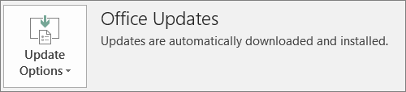

# Preparar a implantação do cliente do Office pela Microsoft 365 para empresasPrepare for Office client deployment by Microsoft 365 for business

Este artigo se aplica ao Microsoft 365 Business Premium.This article applies to Microsoft 365 Business Premium.

## Preparar-se para instala automaticamente os aplicativos do Office em computadores de clientesPrepare to automatically install Office apps to client computers

Você pode usar o Microsoft 365 Business Premium para instalar automaticamente os aplicativos do Office de 32 bits em computadores com Windows 10 e mantê-los atualizados com as atualizações.You can use Microsoft 365 Business Premium to automatically install the 32-bit Office apps on Windows 10 computers and keep them current with updates.
  
A instalação automática funciona melhor se o computador do usuário final estiver no Windows 10 Business e:Automatic installation works best if the end user's computer is on Windows 10 Business and:
  
- Não tiver aplicativos de área de trabalho do Office existentes (por exemplo, Word, Excel, PowerPoint, Outlook, OneNote, Publisher, Access e OneDrive).Doesn't have existing Office desktop apps (Word, Excel, PowerPoint, Outlook, OneNote, Publisher, Access, and OneDrive).
    
    ouor
    
- Tiver instalada uma versão Clique para Executar do Office.Has an existing version of Click-to-Run Office installed.
    
Para determinar se você tem a versão Clique para Executar do Office, em qualquer aplicativo do Office, vá para **Arquivo** \> **Conta** ( **Conta do Office**).To determine if you have the Click-to-Run version of Office, in any Office app go to **File** \> **Account** ( **Office Account** in Outlook). Se você vir **atualizações do Office** , conforme mostrado na figura a seguir, a instalação foi feita usando clique para executar.If you see **Office Updates** as shown in the following figure, then the installation was done by using Click-to-Run. 
  

  
 **Quem se beneficia de ter esse recurso****Who benefits from having this feature**
  
O usuário final cujo PC:The end user whose PC:
  
- **Tem** uma licença de usuário do Windows 10 Business, uma licença ativa do Microsoft 365 for Business, uma atualização do Windows 10 Creators e ingressou no Azure Active Directory.**Has**  a Windows 10 Business user license, an active Microsoft 365 for business license, Windows 10 Creators Update, and is joined to Azure Active Directory. 
    
- **Não tem** aplicativos do Office de 64 bits (exemplo: Word, Excel, PowerPoint).**Doesn't have** 64-bit Office apps (example: Word, Excel, PowerPoint). Se os aplicativos do Office de 64 bits forem necessários, este recurso não é um bom ajuste porque não há suporte para o disparo de uma versão de 64 bits de 2016 clique para executar do Office no console de administração do Microsoft 365 for Business.If 64-bit Office apps are required, then this feature isn't a good fit because there's no support for triggering a 64-bit 2016 Click-to-Run version of Office from the Microsoft 365 for business admin console. 
    
- **Não tem** aplicativos autônomos do 2016 Windows Installer (MSI) (por exemplo, Visio ou Project).**Doesn't have** any 2016 Windows Installer (MSI) standalone apps (for example, Visio or Project). O Microsoft 365 for Business atualiza o Office para a versão clique para executar do Office 2016 e que não funciona com o Office 2016 MSI standalone apps.Microsoft 365 for business upgrades Office to the Click-to-Run version of Office 2016 and that doesn't work with Office 2016 MSI standalone apps. 
    
A tabela a seguir mostra a ação que os usuários finais/administradores podem precisar executar, dependendo do seu estado inicial, para ter uma versão bem-sucedida de clique para executar de 32 bits do deployment do Office no console de administração do Microsoft 365 para empresas.The following table shows what action the end users/admins may need to take, depending on their beginning state, to have a successful 32-bit Click-to-Run version of Office deployment from the Microsoft 365 for business admin console.
  
|**Status inicial de instalação do Office****Starting Office install status**|**Ação a ser tomada antes da instalação do Office 365 para empresas****Action to take before Microsoft 365 for business Office install**|**Estado final****End state**|
|:-----|:-----|:-----|
|Nenhum pacote do Office instaladoNo Office suite installed    |NenhumNone    |O Office 2016 32-bit é instalado usando clique para executarOffice 2016 32-bit is installed by using Click-to-Run    |
|Versão Clique para Executar de 32 bits do Office (2016 ou anterior) existente e nenhum aplicativo autônomoExisting Click-to-Run 32-bit version of Office (2016 or earlier) and no standalone apps    |NenhumNone    |Atualizar para a versão Clique para Executar de 32 bits mais recente do Office 2016, conforme necessário **\***Upgraded to the latest 32-bit Click-to-Run version of Office 2016, as needed **\***   |
|Versão de clique para executar de 32 bits do Office e aplicativos do Office autônomos clique para executar 32 bits ou 64 bits (por exemplo, Visio, Project)Existing Click-to-Run 32-bit version of Office and Click-to-Run 32-bit or 64-bit standalone Office apps (for example, Visio, Project)    |NenhumNone    |Aplicativos autônomos não são afetados.Standalone apps aren't affected. O pacote é atualizado para a versão Clique para Executar de 32 bits do Office 2016Suite is upgraded to Click-to-Run 32-bit version of Office 2016    |
|Versão Clique para Executar de 32 bits do Office e qualquer aplicativo autônomo do Office MSI de 32 bits ou 64 bits (exceto 2016)Existing Click-to-Run 32-bit version of Office and any 32-bit or 64-bit (except 2016) MSI standalone Office apps    |NenhumNone    |Aplicativos autônomos não são afetados.Standalone apps aren't affected. O pacote é atualizado para a versão Clique para Executar de 32 bits do Office 2016Suite is upgraded to Click-to-Run 32-bit version of Office 2016    ||||
|Qualquer versão Clique para Executar de 64 bits do OfficeAny existing Click-to-Run 64-bit version of Office    |Desinstale os aplicativos do Office de 64 bits, se estiver tudo certo para substituí-los por aplicativos do Office de 32 bitsUninstall the 64-bit Office apps, if it's OK to replace them with 32-bit Office apps    |Se os aplicativos do Office de 64 bits forem removidos, a versão Clique para Executar de 32 bits do Office 2016 será instaladaIf Office 64-bit apps are removed, the Click-to-Run 32-bit version of Office 2016 is installed    |
|Uma instalação MSI existente do Office 2016 com ou sem aplicativos autônomosAn existing MSI install of Office 2016 with or without standalone apps    |Desinstale o MSI Office 2016.Uninstall MSI Office 2016.    |A versão Clique para Executar de 32 bits do Office 2016 está instalada. Nenhuma alteração nos aplicativos autônomosClick-to-Run 32-bit version of Office 2016 is installed. No change to standalone apps    |
|Instalação MSI existente do Office 2013 (ou anterior) e/ou aplicativos autônomos do OfficeExisting MSI install of Office 2013 (or earlier) and/or standalone Office apps    |NenhumaNone    |A versão Clique para Executar de 32 bits do Office 2016 com a instalação do MSI Office preexistente (e aplicativos autônomos) funcionam lado a ladoClick-to-Run 32-bit version of Office 2016 with the pre-existing MSI Office install (and standalone apps) exist side-by-side    |
||||
   
 **(\*) Observação:** A atualização para a versão Clique para Executar de 32 bits do Office 2016 não é instalada devido a um bug conhecido.**(\*) Note:** Does not upgrade to Click-to-Run 32-bit version of Office 2016 due to a known bug. Uma correção está em andamento.A fix is in progress. 
  
