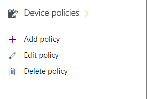

# Definir configurações de proteção de aplicativo para dispositivos Windows 10

## Criar uma política de gerenciamento de aplicativos para Windows 10

Se seus usuários possuírem dispositivos pessoais do Windows 10 nos quais executam tarefas de trabalho, você também pode proteger seus dados nesses dispositivos.
  
1. Acesse o [Microsoft 365 Business](https://portal.office.com) com credenciais de administrador global. Escolha o bloco **Administrador** para ir para o centro de administração. 
    
2. No cartão **Políticas de dispositivos** do portal de administração, escolha **Adicionar política**.
    
    
  
3. No painel **Adicionar política**, insira um nome exclusivo para essa política. 
    
4. Em **Tipo de política**, escolha **Gerenciamento de Aplicativos para Windows 10**.
    
5. Sob * * o tipo de dispositivo * *, escolha **pessoal** ou **Empresa proprietária**.
    
6. A opção **Criptografar arquivos de trabalho** é ativada automaticamente. 
    
7. Defina **Impedir que os usuários copiem os dados da empresa para arquivos pessoais e forçar que eles salvem arquivos de trabalho no OneDrive for Business** para **Ativado** se não quiser que os usuários salvem arquivos de trabalho em seus computadores. 
    
8. Expanda **Gerenciar como os usuários acessam arquivos do Office em dispositivos** \> defina as configurações como desejar. A opção **Gerenciar como os usuários acessam dispositivos do Office em dispositivos móveis** é **Desativada** por padrão, mas recomenda-se que ela seja **Ativada** e que os valores padrão sejam aceitos. Confira [Configurações disponíveis](protection-settings-for-windows-10-devices.md#bkmk_settings) para saber mais. 
    
    Você sempre poderá usar o link **Redefinir as configurações padrão** para voltar para a configuração padrão. 
    
9. Expanda **Recupera dados em dispositivos Windows** e é recomendável que essa opção seja **Ativada**.
    
    Antes de poder navegar para o local do certificado do Agente de Recuperação de Dados, você precisa primeiro criar um. Para obter instruções, veja [Criar e verificar se um certificado de Agente de Recuperação de Dados (DRA) para o Encrypting File System (EFS)](https://go.microsoft.com/fwlink/p/?linkid=853700).
    
    Por padrão, os arquivos de trabalho são criptografados usando uma chave secreta que é armazenada no dispositivo e associada ao perfil do usuário. Somente o usuário pode abrir e descriptografar o arquivo. No entanto, se um dispositivo for perdido ou um usuário for removido, um arquivo pode ficar preso em um estado criptografado. O certificado do Agente de Recuperação de Dados (DRA) pode ser usado por um administrador para descriptografar o arquivo.
    
    
  
10. Expanda **Proteger locais de rede e nuvem adicionais** se quiser adicionar mais domínios ou locais do SharePoint Online para garantir que os arquivos em todos os aplicativos listados sejam protegidos. Se desejar inserir mais de um item em um campo, use um ponto e vírgula (;) entre os itens. 
    
    
  
11. Em seguida, decida **Quem receberá estas configurações?** Se não quiser usar o grupo de segurança padrão **Todos os Usuários**, escolha **Alterar**, escolha o grupo de segurança que deverá receber essas configurações \> **Selecionar**.
    
12. Por fim, escolha **Adicionar** para salvar a política e atribui-la a dispositivos. 
    
## Configurações disponíveis

As configurações a seguir estão disponíveis para gerenciar a forma como os usuários acessam arquivos de trabalho do Office.
  
Para saber mais, confira [Como os recursos de proteção no Microsoft 365 Business são mapeados para as configurações do Intune](map-protection-features-to-intune-settings.md).
  
|**Configuração**|**Descrição**|
|:-----|:-----|
|Exigir um PIN ou uma impressão digital para acessar aplicativos do Office    |Se essa configuração estiver **Ativada**, os usuários precisarão fornecer outra forma de autenticação, além de seu nome de usuário e senha, para poderem usar os aplicativos do Office em seus dispositivos móveis.    |
|Redefinir o PIN quando houver muitas falhas de logon    |Para impedir que um usuário não autorizado adivinhe um PIN, o PIN será redefinido após determinado número de tentativas incorretas.    |
|Exigir que os usuários entrem novamente depois que os aplicativos do Office ficarem ociosos    |Esta configuração determina quanto tempo o usuário pode ficar ocioso antes de ser solicitado a entrar novamente.    |
   

