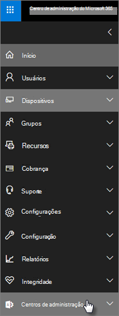

# Recursos de segurança e conformidade do Microsoft 365 Business PremiumMicrosoft 365 Business Premium security and compliance features

O Microsoft 365 Business Premium oferece recursos simplificados de segurança para ajudar a proteger seus dados em PCs, telefones e tablets.Microsoft 365 Business Premium offers simplified security features to help safeguard your data on PCs, phones, and tablets.
    
## Recursos de segurança do centro de administração do Microsoft 365Microsoft 365 admin center security features

Você pode gerenciar muitos dos recursos de segurança do Microsoft 365 Business Premium no centro de administração, que oferece uma maneira simplificada de ativar ou desativar esses recursos.You can manage many of the Microsoft 365 Business Premium security features in the admin center, which gives you a simplified way to turn these features on or off. No centro de administração, você pode fazer o seguinte:In the admin center, you can do the following:
  
- [Definir configurações de gerenciamento de aplicativo para dispositivos Android ou Ios](app-protection-settings-for-android-and-ios.md) .[Set application management settings for Android or iOS devices](app-protection-settings-for-android-and-ios.md) . 
    
    Essas configurações incluem a exclusão de arquivos de um dispositivo inativo após um período definido, a criptografia de arquivos de trabalho, exigindo que os usuários definam um PIN e assim por diante.These settings include deleting files from an inactive device after a set period, encrypting work files, requiring that users set a PIN, and so on.
    
- [Definir configurações de proteção de aplicativo para dispositivos Windows 10](protection-settings-for-windows-10-devices.md) .[Set application protection settings for Windows 10 devices](protection-settings-for-windows-10-devices.md) . 
    
    Essas configurações podem ser aplicadas a dados da empresa em dispositivos pertencentes à empresa ou pessoais.These settings can be applied to company data on both company-owned, or personally owned devices.
    
- [Definir configurações de proteção de dispositivos para dispositivos Windows 10](protection-settings-for-windows-10-pcs.md) .[Set device protection settings for Windows 10 devices](protection-settings-for-windows-10-pcs.md) . 
    
    Você pode habilitar a criptografia [BitLocker](https://go.microsoft.com/fwlink/p/?linkid=871405) para ajudar a proteger os dados caso um dispositivo seja perdido ou roubado, e permitir que o [Windows Exploit Guard](https://docs.microsoft.com/windows/security/threat-protection/microsoft-defender-atp/enable-exploit-protection) forneça proteção avançada contra o ransomware.You can enable [BitLocker](https://go.microsoft.com/fwlink/p/?linkid=871405) encryption to help protect data in case a device is lost or stolen, and enable [Windows Exploit Guard](https://docs.microsoft.com/windows/security/threat-protection/microsoft-defender-atp/enable-exploit-protection) to provide advanced protection against ransomware. 
    
- [Remover dados da empresa de dispositivosRemove company data from devices](remove-company-data.md)
    
    Você pode limpar dados da empresa remotamente se um dispositivo for perdido, roubado ou se um funcionário sair da sua empresa.You can remotely wipe company data if a device is lost, stolen, or an employee leaves your company.
    
- [Redefina dispositivos Windows 10 para suas configurações de fábrica](reset-devices-to-factory-settings.md) .[Reset Windows 10 devices to their factory settings](reset-devices-to-factory-settings.md) . 
    
    Você pode redefinir qualquer dispositivo Windows 10 que tenha as configurações de proteção de dispositivo aplicadas a eles.You can reset any Windows 10 devices that have device protection settings applied to them.
    
## Recursos de segurança adicionaisAdditional security features 

Recursos avançados no Microsoft 365 Business Premium estão disponíveis para ajudá-lo a proteger sua empresa contra ameaças e proteger as informações confidenciais.Advanced features in Microsoft 365 Business Premium are available to help you protect your business against cyber-threats and safeguard sensitive information.
  
- **[Proteção Avançada contra Ameaças do Office 365](https://docs.microsoft.com/microsoft-365/security/office-365-security/office-365-atp)****[Office 365 Advanced Threat Protection](https://docs.microsoft.com/microsoft-365/security/office-365-security/office-365-atp)**
    
    A proteção avançada contra ameaças (ATP) ajuda a proteger sua empresa contra ataques sofisticados de phishing e ransomware, projetados para comprometer informações de funcionários ou clientes.Advanced Threat Protection (ATP) helps guard your business against sophisticated phishing and ransomware attacks designed to compromise employee or customer information. Os recursos incluem:Features include:
    
  - Análise de conexão sofisticada e análise com alimentação de AI para detectar e descartar mensagens perigosas.Sophisticated attachment scanning and AI-powered analysis to detect and discard dangerous messages.
    
  - Verificações automáticas de links em email para avaliar se eles fazem parte de um esquema de phishing.Automatic checks of links in email to assess if they're part of a phishing scheme. Isso impede você de acessar sites não seguros.This keeps you safe from accessing unsafe websites.

- **[Os recursos completos do Intune no portal do Azure](https://go.microsoft.com/fwlink/p/?linkid=871403)****[The full capabilities of Intune in the Azure portal](https://go.microsoft.com/fwlink/p/?linkid=871403)**
    
    O acesso ao centro de administração do Intune no portal do Azure permite que você configure recursos de segurança adicionais, como gerenciamento de dispositivos MacOS, iPhone e dispositivos Android, juntamente com o gerenciamento avançado de dispositivos do Windows, que não está disponível através do centro de administração do Microsoft 365.Accessing the Intune admin center in the Azure portal allows you to set up additional security features, such as management of MacOS devices, iPhone, and Android devices, along with advanced device management for Windows, that aren't available through Microsoft 365 admin center.
- **Mesmo [acesso condicional](https://docs.microsoft.com/azure/active-directory/conditional-access/overview) do Azure ad Premium P1 plano****Same [Conditional Access](https://docs.microsoft.com/azure/active-directory/conditional-access/overview) as Azure AD Premium P1 plan**

    O acesso condicional pode ajudar a proteger sua organização contra o risco de entrada, as tentativas de acesso de uma rede ou localidade inesperada, o acesso tenta de tipos de dispositivos arriscados e assim por diante.Conditional Access can help protect your organization from sign-in risk, access attempts from an unexpected network or locale, access attempts from risky device types, and so on. As políticas de acesso condicional são aplicadas depois que a primeira autenticação é concluída e usa sinais do primeiro evento de autenticação para determinar se o acesso tentado deve ser aprovado, negado ou se é necessário mais prova (como uma segunda forma de identificação).Conditional Access policies are enforced after the first authentication is completed, and it uses signals from the first authentication event to determine if the attempted access should be approved, denied, or if more proof (such as a second form of identification) is required.

    Os recursos de acesso condicional incluídos são:The conditional access features included are:

    - Acesso com base no nome de usuário, grupo e funçãoAccess based on username, group, and role
    - Acesso [baseado em um aplicativo](https://docs.microsoft.com/azure/active-directory/conditional-access/app-based-conditional-access)Access [based on an app](https://docs.microsoft.com/azure/active-directory/conditional-access/app-based-conditional-access) 
    - [Acesso com base no local](https://docs.microsoft.com/azure/active-directory/authentication/howto-registration-mfa-sspr-combined#conditional-access-policies-for-combined-registration);  Só permitir o acesso de intervalos de IP confiáveis ou países específicos[Access based on location](https://docs.microsoft.com/azure/active-directory/authentication/howto-registration-mfa-sspr-combined#conditional-access-policies-for-combined-registration);  only allow access from trusted IP ranges or specific countries 
    - Exigir MFA para acessoRequire MFA for access
    - Bloquear o acesso a aplicativos que usam [autenticação herdada](https://docs.microsoft.com/azure/active-directory/conditional-access/block-legacy-authentication)Block access to apps that use [legacy authentication](https://docs.microsoft.com/azure/active-directory/conditional-access/block-legacy-authentication)
    - Exigir que os aplicativos usem a [proteção de aplicativo do Intune](https://docs.microsoft.com/azure/active-directory/conditional-access/app-protection-based-conditional-access)Require apps tp use [Intune app protection](https://docs.microsoft.com/azure/active-directory/conditional-access/app-protection-based-conditional-access)
    - Autenticação personalizada, como a MFA, com provedores terceirizados, por exemplo, DUO.Custom authentication such as MFA with third-party providers, for example DUO.
   
    Outros recursosOther features:
    - [Redefinição de senha de autoatendimento](https://docs.microsoft.com/azure/active-directory/authentication/concept-sspr-customization) para o Azure ad híbrido[Self-service password reset](https://docs.microsoft.com/azure/active-directory/authentication/concept-sspr-customization) for hybrid Azure AD
    
## Recursos de conformidadeCompliance features

Sua assinatura do Microsoft 365 Business Premium inclui recursos que ajudam você a manter padrões normativos e de conformidade.Your Microsoft 365 Business Premium subscription includes features that help you maintain compliance and regulatory standards.

- **[Visão geral das políticas de prevenção contra perda de dados](https://docs.microsoft.com/microsoft-365/compliance/data-loss-prevention-policies)** (DLP).**[Overview of data loss prevention policies](https://docs.microsoft.com/microsoft-365/compliance/data-loss-prevention-policies)** (DLP). 
    
    Você pode configurar a DLP para detectar automaticamente informações confidenciais, como números de cartão de crédito, números de seguridade social e assim por diante, para evitar o compartilhamento inadvertido fora da empresa.You can set up DLP to automatically detect sensitive information, like credit card numbers, social security numbers, and so on, to prevent their inadvertent sharing outside your company.
    
- **[Arquivamento do Exchange Online](https://products.office.com/exchange/microsoft-exchange-online-archiving-email)****[Exchange Online Archiving](https://products.office.com/exchange/microsoft-exchange-online-archiving-email)**
    
    A licença de arquivamento do Exchange Online permite que as mensagens sejam facilmente arquivadas com o backup contínuo de dados.Exchange Online Archiving license enables messages to be easily archived with continuous data backup. Ele armazena todos os emails de um usuário, incluindo itens excluídos, caso eles sejam necessários posteriormente para descoberta ou restauração.It stores all of a user's emails, including deleted items, in case they're needed later for discovery or restoration. Além disso, você pode usar diferentes políticas de retenção para preservar dados de email para litígios, eDiscovery ou para atender aos requisitos de conformidade.Additionally, you can use different retention policies to preserve email data for litigation holds, eDiscovery, or to meet compliance requirements.
    
- **[Rótulos de confidencialidade](https://docs.microsoft.com/microsoft-365/compliance/sensitivity-labels)****[Sensitivity labels](https://docs.microsoft.com/microsoft-365/compliance/sensitivity-labels)**

   O Microsoft 365 Business Premium inclui todos os recursos do [plano de proteção de informações do Azure 1](https://go.microsoft.com/fwlink/p/?linkid=871407).Microsoft 365 Business Premium includes all the features of [Azure Information Protection Plan 1](https://go.microsoft.com/fwlink/p/?linkid=871407). Com esse plano, você pode criar **Rótulos de confidencialidade** que permitem controlar o acesso a informações confidenciais em emails e documentos, com controles como "não encaminhar" e "não copiar".With this plan, you can create **Sensitivity labels** that allow you to control access to sensitive information in email and documents, with controls like "Do not forward" and "Do not copy." Você também pode classificar informações confidenciais como "confidencial" e especificar como as informações classificadas podem ser compartilhadas fora e dentro da empresa.You can also classify sensitive information as "Confidential" and specify how classified information can be shared outside and inside the business. A criptografia de nível empresarial é fácil de aplicar a emails e documentos para manter suas informações privadas.Enterprise-grade encryption is easy to apply to email and documents to keep your information private. Você também pode instalar o suplemento cliente de proteção de informações do Azure para aplicativos do Office.You can also install the Azure Information Protection client add-in for Office apps. Para obter mais informações, consulte [cliente de rotulação unificado de proteção de informações do Azure](https://docs.microsoft.com/azure/information-protection/rms-client/unifiedlabelingclient-version-release-history).For more information, see [Azure Information Protection unified labeling client](https://docs.microsoft.com/azure/information-protection/rms-client/unifiedlabelingclient-version-release-history). Para rótulos de confidencialidade, instale o **AzInfoProtection_UL. exe**.For Sensitivity labels, install the **AzInfoProtection_UL.exe**.

Você pode gerenciar esses recursos no centro de &amp; conformidade de segurança e no centro de administração do Intune.You can manage these features in the Security &amp; Compliance center and the Intune admin center. Com o tempo, os controles simplificados serão adicionados ao centro de administração do Microsoft 365.Over time the simplified controls will be added to the Microsoft 365 admin center.
  
    
## Perguntas frequentesFAQ

 ### Esses recursos de segurança estão disponíveis em todos os mercados?Are these security features available in all markets?
  
Sim, esses recursos estão disponíveis em todos os mercados onde o Microsoft 365 Business Premium é vendido.Yes, these features are available in all markets where Microsoft 365 Business Premium is sold.
  
### Como localizar o centro de conformidade de segurança &amp; ?How do I find the Security &amp; Compliance center?
  
1. [Entre no Microsoft 365 Business Premium](https://portal.microsoft.com/) usando suas credenciais de administrador.[Sign in to Microsoft 365 Business Premium](https://portal.microsoft.com/) by using your admin credentials. 
    
2. No painel de navegação à esquerda, localize **centros de administração** e expanda-o.In the left nav, locate **Admin centers** and expand it. 
    
    
  
3. Escolha \*\* &amp; conformidade de segurança\*\* para acessar o &amp; centro de conformidade de segurança.Choose **Security &amp; Compliance** to go to Security &amp; compliance center.
