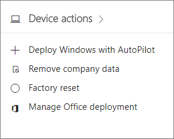
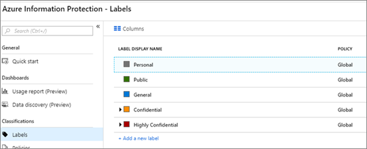

# Recursos de segurança do Microsoft 365 Business

Microsoft 365 Business oferece recursos de segurança simplificado para ajudar a proteger os dados em PCs, telefones e tablets.
    
## Recursos de segurança do Microsoft 365 Business admin center

Você pode gerenciar muitos dos recursos de segurança do Microsoft 365 Business no Centro de administração, que oferece uma maneira simplificada para ativar ou desativar a esses recursos. No Centro de administração, você pode fazer o seguinte:
  

  
- [Definir as configurações de gerenciamento de aplicativo para dispositivos Android ou iOS](app-protection-settings-for-android-and-ios.md) . 
    
    Essas configurações incluem a exclusão de arquivos de um dispositivo inativo após um período definido, a criptografia de arquivos de trabalho, que exigem que os usuários definir um PIN, etc.
    
- [Definir configurações de proteção de aplicativos para dispositivos Windows 10](protection-settings-for-windows-10-devices.md) . 
    
    Essas configurações podem ser aplicadas para dados da empresa nos dois empresa proprietária ou dispositivos pertencentes pessoalmente.
    
- [Definir as configurações de proteção do dispositivo para dispositivos Windows 10](protection-settings-for-windows-10-pcs.md) . 
    
    Você pode habilitar a criptografia de [disco BitLocker](https://go.microsoft.com/fwlink/p/?linkid=871405) ajudar a proteger os dados no caso de um dispositivo é perdido ou roubado e habilitar o [Windows explorar Guard](https://go.microsoft.com/fwlink/p/?linkid=871404) oferecer proteção avançada contra ransomware. 
    
- [Remover dados da empresa de dispositivos](remove-company-data.md)
    
    Você pode limpar os dados da empresa remotamente, se um dispositivo for perdido, roubado, ou um funcionário deixa a sua empresa.
    
- [Redefinir Windows 10 dispositivos suas configurações de fábrica](reset-devices-to-factory-settings.md) . 
    
    Você pode redefinir todos os dispositivos Windows 10 que possuem configurações de proteção do dispositivo aplicadas aos mesmos.
    
## Recursos de segurança adicionais 

Os recursos avançados do Microsoft 365 Business estão disponíveis para ajudá-lo a proteger sua empresa contra ameaças de virtuais e proteger informações confidenciais.
  
- **[Proteção Avançada contra Ameaças do Office 365](https://support.office.com/article/e100fe7c-f2a1-4b7d-9e08-622330b83653)**
    
    Avançadas de proteção de ameaça (ATP) ajuda a proteger a sua empresa contra phishing sofisticado e ataques de ransomware projetados para comprometer funcionário ou informações do cliente. Os recursos incluem:
    
  - Verificação de anexo sofisticado e ativado por AI análise para detectar e descartar mensagens perigosas.
    
  - Automático verifica de links da web em email para avaliar se eles fazem parte de um esquema de phishing. Isso mantém a sua segurança acessem sites não seguros.
    
- **[Visão geral das políticas de prevenção de perda de dados](https://support.office.com/article/1966b2a7-d1e2-4d92-ab61-42efbb137f5e)** (DLP). 
    
    Você pode configurar DLP para detectar automaticamente informações confidenciais, como números de cartão de crédito, números de seguridade social, etc. para impedir que seus inadvertidas compartilhamento fora da sua empresa.
    
- **[Arquivamento do Exchange Online](https://products.office.com/exchange/microsoft-exchange-online-archiving-email)**
    
    Licença de arquivamento do Exchange Online permite que as mensagens arquivadas facilmente com o backup de dados contínuo. Ele armazena todos os emails de um usuário, incluindo itens excluídos, caso eles são necessários posteriormente para descoberta ou restauração. Além disso, você pode usar diferentes políticas de retenção para preservação de dados de email para isenções de litígio, eDiscovery, ou para atender aos requisitos de conformidade.
    
- **[Proteção de Informações do Azure](https://go.microsoft.com/fwlink/p/?linkid=871406)**
    
    Ajuda a proteção de informações que você controlar o acesso a informações confidenciais em email e documentos com controles, como "Não encaminhar" e "Não copie." Você também pode classificar informações confidenciais, como "Confidencial" e especificar como informações classificadas podem ser compartilhadas fora e dentro dos negócios. Criptografia de nível empresarial é fácil aplicar a email e documentos para manter suas informações particulares. Microsoft Business de 365 inclui todos os recursos do [plano 1 de proteção de informações do Azure](https://go.microsoft.com/fwlink/p/?linkid=871407). Você também pode instalar o Windows Azure Information Protection cliente suplemento para aplicativos do Office. Para obter mais detalhes, consulte o [guia de pelo administrador de cliente de proteção de informações do Windows Azure](https://docs.microsoft.com/azure/information-protection/rms-client/client-admin-guide).
    
- **[Recursos completos de Intune no portal do Azure](https://go.microsoft.com/fwlink/p/?linkid=871403)**
    
    Acessando o Intune Centro de administração no portal do Windows Azure permite configurar recursos de segurança adicionais, como o gerenciamento de dispositivos MacOS, iPhone e dispositivos Android junto com o gerenciamento avançado de dispositivos para Windows, que não estão disponíveis através da Microsoft Centro de administração de negócios 365.
    
As próximas seções descrevem como você pode gerenciar esses recursos na segurança &amp; Centro de conformidade e o Intune admin center. Ao longo do tempo os controles simplificados serão adicionados ao centro de administração do Microsoft 365 Business.
  
## Configurar recursos de proteção de ameaça avançadas

- **Proteger contra anexos não seguros:** ATP identifica conteúdo mal-intencionado ao abrir anexos de email em um ambiente virtual e executar a análise do comportamento resultante. O conteúdo é avaliado para determinar sua intenção (se normal ou mal intencionado), e ATP bloqueia a entrega de anexos não seguros, ajudando a protegê-lo contra os esquemas de phishing e ransomware infecções. Para ativar a proteção de anexo, consulte [Configurar políticas de anexos do Office 365 ATP seguros](https://support.office.com/article/078eb946-819a-4e13-8673-fe0c0ad3a775).
    
- Proteger seu ambiente, quando os usuários clicam links mal-intencionado: ATP também examina links no email no momento em que um usuário clica neles. Se não for um link não seguro, o usuário é advertido não a visitar o site ou informado que o site foi bloqueado. Isso ajuda a proteger contra esquemas de phishing. Você pode [Configurar políticas de vínculos do Office 365 ATP seguros](https://support.office.com/article/bdd5372d-775e-4442-9c1b-609627b94b5d#reveddefaultscc) ou [Configurar políticas de vínculos do Office 365 ATP seguros](https://support.office.com/article/bdd5372d-775e-4442-9c1b-609627b94b5d#addemailpolscc).
    
## Configurar recursos DLP

Consulte [criar uma política de DLP a partir de um modelo](https://support.office.com/article/59414438-99f5-488b-975c-5023f2254369) para ver um exemplo de como configurar uma política para proteger contra as informações de identificação pessoal (PII). 
  
DLP vem com muitos modelos de política prontos para uso para várias localidades diferentes. Por exemplo, dados financeiros da Austrália, lei de informações pessoais do Canadá, EUA de dados financeiros, etc. Para obter uma lista completa, consulte [modelos de política de DLP a que incluem](https://support.office.com/article/c2e588d3-8f4f-4937-a286-8c399f28953a) . Todos esses modelos podem ser habilitados similar ao exemplo modelo PII. 
  
## Configurar a retenção de email com o arquivamento do Exchange Online

 Recursos de licença de **Arquivamento do Exchange Online** oferecem a capacidade de ajudar a manter a conformidade e das normas regulamentares preservando email conteúdo para fins de descoberta eletrônica. Ele também ajuda a reduzir o risco em caso de litígio e fornece uma maneira de recuperar dados após uma violação de segurança ou quando você precisar recuperar itens excluídos. Para ativar esses recursos, você pode usar litígio para preservar a todo o conteúdo de um usuário ou usar políticas de retenção para maior personalização. 
  
**Litígio:** Você pode preservar incluindo itens excluídos colocando-se a caixa de correio inteira do usuário em retenção de litígio mantenha todo o conteúdo da caixa de correio. 
    
Para colocar uma caixa de correio em suspensão de litígio, no Centro de administração:
    
1. No painel de navegação esquerdo, vá para **usuários** \> **usuários ativos**.
    
2. Selecione um usuário cuja caixa de correio que você deseja colocar em retenção de litígio mantenha e no painel de tarefas do usuário, expanda **configurações de email** e ao lado de **mais configurações** , escolha **Exchange editar propriedades**.
    
3. Na página caixa de correio do usuário, escolha * * recursos de caixa de correio * * no painel de navegação esquerdo e escolha o link **Habilitar** em **retenção de litígio**.
    
4. Em **litígio** a caixa de diálogo, você pode especificar a retenção de litígio duração da retenção no campo **duração da retenção de litígio** , deixe o campo vazio se você desejar colocar uma espera infinita. Você também pode adicionar anotações e direcionar o proprietário de caixa de correio para um site, talvez seja necessário explicar mais sobre a retenção de litígio mantenha \> **Salvar**.
    
**Retenção:** Você pode habilitar as políticas de retenção personalizada, por exemplo, para preservar por um período específico ou excluir o conteúdo permanentemente no final do período de retenção. Para saber mais, consulte [Visão geral das políticas de retenção](https://support.office.com/article/5e377752-700d-4870-9b6d-12bfc12d2423).
## Configurar recursos de proteção de informações do Windows Azure

Proteção de informações Azure (AIP) é uma solução baseada na nuvem que ajuda a uma organização para classificar e, opcionalmente, proteger seus documentos e emails aplicando rótulos. Rótulos podem ser aplicados automaticamente pelos administradores que definem as regras e condições, manualmente por usuários ou uma combinação de onde os usuários receberem recomendações.

A capacidade de aplicar as seguintes restrições durante o envio de emails no Outlook na web é automaticamente habilitada para todos os usuários:
  
- **Não encaminhar**: os destinatários podem ler a mensagem, mas eles não podem encaminhar, imprimir ou copiar o conteúdo
    
- **Criptografar**: toda a mensagem é criptografada. Os destinatários necessário executar etapas adicionais para confirmar sua identidade antes de acessar conteúdo criptografado e não é possível remover a criptografia.
    
- **Confidencial**: oferece os funcionários em sua organização permissões total para o conteúdo de email e anexos, mas não para pessoas fora da sua organização. Os proprietários de dados podem controlar e revogar o conteúdo a qualquer momento.
    
- **Altamente confidenciais**: essa restrição pode ser aplicada aos dados altamente confidenciais, permitindo que os funcionários exibir, editar e responder, mas não encaminhar, imprimir ou copiar os dados. Os proprietários de dados podem controlar e revogar o conteúdo a qualquer momento.

### Certifique-se de que proteção de informações do Windows Azure é ativada

Para verificar que AIP está ativado:

1. Entrar no [portal do Azure](https://portal.azure.com/).

2. Selecione **todos os serviços** e digite no *Azure Information Protection* na **Caixa Pesquisar**.

3. Depois que os resultados são exibidos, clique em Iniciar próximo a **Proteção de informações do Windows Azure** para torná-lo um favorito e fácil de encontrar mais tarde.

4. Selecione a **Proteção de informações do Windows Azure** \> **ativação de proteção** e torna Verifique se o status está definido como ativado. 

### Exibir os rótulos de política e padrão de proteção de informações do Windows Azure 

Para exibir e modificar, existentes etiquetas:

1. No painel de proteção de informações do Windows Azure, selecione **classificações** \> **rótulos**.  

2. Você pode escolher qualquer rótulo para exibir opções, você pode alterar o nome para exibição, cores, etc.
 
3. Consulte [modificar e criar novas etiquetas](https://docs.microsoft.com/azure/information-protection/infoprotect-tutorial-step2) se você quiser criar seus próprios. 

### Instalar o cliente de proteção de informações do Azure manualmente

Para instalar manualmente o cliente AIP:

1. Baixe **AzInfoProtection.exe** do [Centro de download da Microsoft](https://www.microsoft.com/download/details.aspx?id=53018).
 
2. Você pode verificar se a instalação funcionou exibindo um documento do Word e certificando-se de que a opção **proteger** está disponível na guia **página inicial** .  

Para mais informações, consulte [instalar o cliente](https://docs.microsoft.com/azure/information-protection/infoprotect-tutorial-step3)

## Vá para o Centro de administração Intune

1. Entrar no [portal do Azure](https://portal.azure.com/).

2. Selecione **todos os serviços** e digite no *Intune* na **Caixa Pesquisar**.

3. Depois que os resultados são exibidos, clique em Iniciar próximo ao **Microsoft Intune** torná-lo um favorito e fácil de encontrar mais tarde.
 
Você pode usar o Intune para registrar e gerenciar dispositivos de sua organização. Para obter mais informações, consulte [recursos pelo método de inscrição para dispositivos do Windows](https://docs.microsoft.com/intune/enrollment-method-capabs) e [Opções de inscrição para dispositivos gerenciados por Intune](https://docs.microsoft.com/intune/enrollment-options).
    
## Perguntas frequentes

 ### Esses recursos de segurança estão disponíveis em todos os mercados?
  
Sim, esses recursos estão disponíveis em todos os mercados onde Microsoft 365 Business é vendido.
  
### Como encontrar a segurança &amp; Centro de conformidade?
  
1. [Entrar no Microsoft 365 Business](https://portal.microsoft.com/) usando suas credenciais de administrador. 
    
2. No painel de navegação esquerdo, localize a **centrais de Admin** e expandi-la. 
    
    
  
3. Escolha **segurança &amp; conformidade** para ir para segurança &amp; Centro de conformidade.