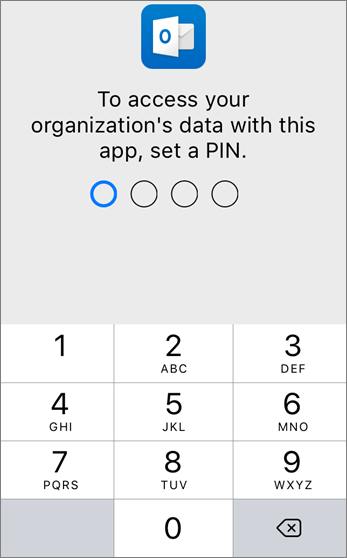

# Configurar dispositivos móveis para usuários do Microsoft 365 BusinessSet up mobile devices for Microsoft 365 Business users

Siga as instruções nas guias para instalar o Office em um iPhone ou em um telefone Android. Após seguir essas etapas, os arquivos de trabalho criados em aplicativos do Office serão protegidos pelo Microsoft 365 Business.Follow the instructions in the tabs to install Office on an iPhone or an Android phone. After you follow these steps, your work files created in Office apps will be protected by Microsoft 365 Business.

  
O exemplo é do Outlook, mas se aplica a quaisquer outros aplicativos do Office que você também queira instalar.The example is for Outlook, but applies for any other Office apps you want to install also.
  
## Configurar dispositivos móveisSet up mobile devices

## [iPhoneiPhone](#tab/iPhone)
  
Assista a um vídeo sobre como configurar os aplicativos do Office em dispositivos iOS com o Microsoft 365 Business:Watch a video on how to set up Office apps on iOS devices with Microsoft 365 Business:

> [!VIDEO https://www.microsoft.com/videoplayer/embed/e0ee7052-e0f4-4c42-a4f1-5e91b9776ce9?autoplay=false] 

Vá para a **App Store** e, no campo de pesquisa, digite Microsoft Outlook.Go to **App store**, and in the search field type in Microsoft Outlook.
  

  
Toque no ícone de nuvem para instalar o Outlook.Tap the cloud icon to install Outlook.
  

  
Quando a instalação for concluída, toque no botão **Abrir** para abrir o Outlook e, em seguida, toque em **Iniciar**.When the installation is done, tap the **Open** button to open Outlook and then tap **Get Started**.
  

  
Insira seu endereço de email corporativo na tela **Adicionar Conta de Email** \> **Adicionar Conta** e, em seguida, insira suas Microsoft 365 Business credenciais \> **Entrar**.Enter your work email address on the **Add Email Account** screen \> **Add Account**, and then enter your Microsoft 365 Business credentials \> **Sign in**.
  

  
Se sua organização estiver protegendo arquivos em aplicativos, você verá uma caixa de diálogo informando que sua organização agora está protegendo os dados no aplicativo e precisará reiniciar o aplicativo para continuar a usá-lo.If your organization is protecting files in apps, you'll see a dialog stating that your organization is now protecting the data in the app and you need to restart the app to continue to use it. Toque em **OK** e feche o Outlook.Tap **OK** and close Outlook. 
  

  
Localize o Outlook no iPhone e reinicie-o.Locate Outlook on the iPhone, and restart it. Quando solicitado, insira um PIN e verifique-o.When prompted, enter a PIN and verify it. O Outlook no iPhone agora está pronto para ser usado.Outlook on your iPhone is now ready to be used.
  

  
## [AndroidAndroid](#tab/Android)
  
Para iniciar a instalação no seu telefone Android, vá para o repositório de reprodução.To begin setup on your Android phone, go to the Play Store.
  

  
Insira o Microsoft Outlook na caixa de pesquisa Google Play e toque em **instalar**.Enter Microsoft Outlook in the Google Play search box and tap **Install**. Após a instalação do Outlook, toque em **abrir**.Once Outlook is done installing, tap **Open**.
  

  
No aplicativo Outlook, toque em **começar**, adicione sua conta \> de email do Microsoft 365 Business **continue**e entre com as credenciais da sua organização.In the Outlook app, tap **Get Started**, then add your Microsoft 365 Business email account \> **Continue**, and sign in with your organization credentials.
  

  
A caixa de diálogo informa que você deve instalar o aplicativo Portal da Empresa do Intune. Toque em **Ir para a loja**.In the dialog that states you must install the Intune Company Portal app, tap **Go to store**.
  

  
Em reproduzir repositório, instale o portal da empresa do Intune.In Play Store, install Intune Company Portal.
  

  
Abra o Outlook novamente e digite e confirme um PIN. O aplicativo Outlook agora está pronto para uso.Open Outlook again, and enter and confirm a PIN. Your Outlook app is now ready for use.
  

  
---

