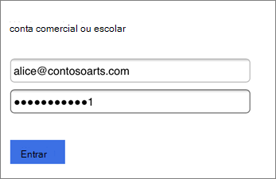
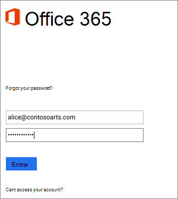
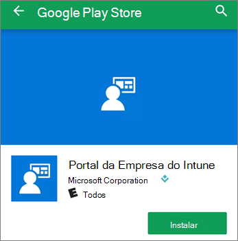

# Configurar dispositivos móveis para usuários do Microsoft 365 para empresasSet up mobile devices for Microsoft 365 for business users

Siga as instruções nas guias para instalar o Office em um iPhone ou em um telefone Android.Follow the instructions in the tabs to install Office on an iPhone or an Android phone. Depois que você seguir essas etapas, seus arquivos de trabalho criados em aplicativos do Office serão protegidos pelo Microsoft 365 para empresas.After you follow these steps, your work files created in Office apps will be protected by Microsoft 365 for business.

O exemplo é do Outlook, mas se aplica a quaisquer outros aplicativos do Office que você também queira instalar.The example is for Outlook, but applies for any other Office apps you want to install also.
  
## Configurar dispositivos móveisSet up mobile devices

## [iPhoneiPhone](#tab/iPhone)
  
Assista a um vídeo curto sobre como configurar aplicativos do Office em dispositivos iOS com o Microsoft 365 para empresas.Watch a short video on how to set up Office apps on iOS devices with Microsoft 365 for business.  

> [!VIDEO https://www.microsoft.com/videoplayer/embed/RWee2n] 

Se você achou esse vídeo útil, consulte as [séries completas de treinamento para pequenas empresas e as novidades do Microsoft 365](https://support.microsoft.com/office/6ab4bbcd-79cf-4000-a0bd-d42ce4d12816).If you found this video helpful, check out the [complete training series for small businesses and those new to Microsoft 365](https://support.microsoft.com/office/6ab4bbcd-79cf-4000-a0bd-d42ce4d12816).

Vá para a **App Store** e, no campo de pesquisa, digite Microsoft Outlook.Go to **App store**, and in the search field type in Microsoft Outlook.
  

  
Toque no ícone de nuvem para instalar o Outlook.Tap the cloud icon to install Outlook.
  

  
Quando a instalação for concluída, toque no botão **Abrir** para abrir o Outlook e, em seguida, toque em **Iniciar**.When the installation is done, tap the **Open** button to open Outlook and then tap **Get Started**.
  

  
Insira seu endereço de email comercial na tela Adicionar Conta de **Email** Adicionar Conta e insira suas credenciais do \> Microsoft 365 para \> **empresas.**Enter your work email address on the **Add Email Account** screen \> **Add Account**, and then enter your Microsoft 365 for business credentials \> **Sign in**.
  

  
Se sua organização estiver protegendo arquivos em aplicativos, você verá uma caixa de diálogo informando que sua organização agora protege os dados no aplicativo e precisa reiniciar o aplicativo para continuar a usá-lo.If your organization is protecting files in apps, you'll see a dialog stating that your organization is now protecting the data in the app and you need to restart the app to continue to use it. Toque em **OK** e feche o Outlook.Tap **OK** and close Outlook. 
  

  
Localize o Outlook no iPhone e reinicie-o.Locate Outlook on the iPhone, and restart it. Quando solicitado, insira um PIN e verifique-o.When prompted, enter a PIN and verify it. O Outlook no iPhone agora está pronto para ser usado.Outlook on your iPhone is now ready to be used.
  

  
## [AndroidAndroid](#tab/Android)
  
Assista a um vídeo sobre como instalar o Outlook e o Office em dispositivos Android.Watch a video about installing Outlook and Office on Android devices.  

> [!VIDEO https://www.microsoft.com/videoplayer/embed/ecc2e9c0-bc7e-4f26-8b14-91d84dbcfef0] 

Se você achou esse vídeo útil, consulte as [séries completas de treinamento para pequenas empresas e as novidades do Microsoft 365](https://support.microsoft.com/office/6ab4bbcd-79cf-4000-a0bd-d42ce4d12816).If you found this video helpful, check out the [complete training series for small businesses and those new to Microsoft 365](https://support.microsoft.com/office/6ab4bbcd-79cf-4000-a0bd-d42ce4d12816).

Para começar a instalação no seu telefone Android, vá para a Play Store.To begin setup on your Android phone, go to the Play Store.
  

  
Insira o Microsoft Outlook na caixa de pesquisa do Google Play e toque em **Instalar.**Enter Microsoft Outlook in the Google Play search box and tap **Install**. Quando a instalação do Outlook terminar, toque em **Abrir.**Once Outlook is done installing, tap **Open**.
  

  
In the Outlook app, tap **Get Started**, then add your Microsoft 365 for business email account \> **Continue**, and sign in with your organization credentials.In the Outlook app, tap **Get Started**, then add your Microsoft 365 for business email account \> **Continue**, and sign in with your organization credentials.
  

  
A caixa de diálogo informa que você deve instalar o aplicativo Portal da Empresa do Intune. Toque em **Ir para a loja**.In the dialog that states you must install the Intune Company Portal app, tap **Go to store**.
  

  
Na Play Store, instale o Portal da Empresa do Intune.In Play Store, install Intune Company Portal.
  

  
Abra o Outlook novamente e digite e confirme um PIN. O aplicativo Outlook agora está pronto para uso.Open Outlook again, and enter and confirm a PIN. Your Outlook app is now ready for use.
  

## Confira tambémSee also

[Vídeos de treinamento do Microsoft 365 Business Microsoft 365 for business training videos](https://support.microsoft.com/office/6ab4bbcd-79cf-4000-a0bd-d42ce4d12816)

---
