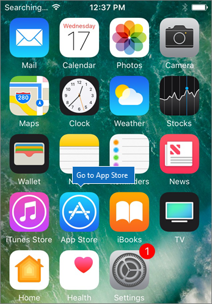
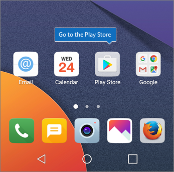
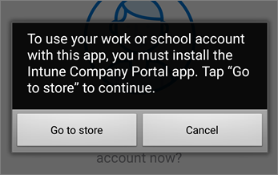

# Configurar dispositivos móveis para usuários do Microsoft 365 para empresas

Siga as instruções nas guias para instalar o Office em um iPhone ou em um telefone Android. Depois que você seguir essas etapas, seus arquivos de trabalho criados em aplicativos do Office serão protegidos pelo Microsoft 365 para empresas.

O exemplo é do Outlook, mas se aplica a quaisquer outros aplicativos do Office que você também queira instalar.
  
## Configurar dispositivos móveis

## [iPhone](#tab/iPhone)
  
Assista a um vídeo curto sobre como configurar aplicativos do Office em dispositivos iOS com o Microsoft 365 para empresas.  

> [!VIDEO https://www.microsoft.com/videoplayer/embed/RWee2n] 

Se você achou esse vídeo útil, consulte as [séries completas de treinamento para pequenas empresas e as novidades do Microsoft 365](https://support.microsoft.com/office/6ab4bbcd-79cf-4000-a0bd-d42ce4d12816).

Vá para a **App Store** e, no campo de pesquisa, digite Microsoft Outlook.
  

  
Toque no ícone de nuvem para instalar o Outlook.
  

  
Quando a instalação for concluída, toque no botão **Abrir** para abrir o Outlook e, em seguida, toque em **Iniciar**.
  

  
Insira seu endereço de email de trabalho na tela Adicionar Conta de **Email** Adicionar Conta e insira suas credenciais do \> Microsoft 365 para \> **empresas.**
  

  
Se sua organização estiver protegendo arquivos em aplicativos, você verá uma caixa de diálogo informando que sua organização agora protege os dados no aplicativo e precisa reiniciar o aplicativo para continuar a usá-lo. Toque em **OK** e feche o Outlook. 
  

  
Localize o Outlook no iPhone e reinicie-o. Quando solicitado, insira um PIN e verifique-o. O Outlook no iPhone agora está pronto para ser usado.
  

  
## [Android](#tab/Android)
  
Assista a um vídeo sobre como instalar o Outlook e o Office em dispositivos Android.  

> [!VIDEO https://www.microsoft.com/videoplayer/embed/ecc2e9c0-bc7e-4f26-8b14-91d84dbcfef0] 

Se você achou esse vídeo útil, consulte as [séries completas de treinamento para pequenas empresas e as novidades do Microsoft 365](https://support.microsoft.com/office/6ab4bbcd-79cf-4000-a0bd-d42ce4d12816).

Para começar a instalação no seu telefone Android, vá para a Play Store.
  

  
Insira o Microsoft Outlook na caixa de pesquisa do Google Play e toque em **Instalar.** Quando a instalação do Outlook terminar, toque em **Abrir.**
  

  
In the Outlook app, tap **Get Started**, then add your Microsoft 365 for business email account \> **Continue**, and sign in with your organization credentials.
  

  
A caixa de diálogo informa que você deve instalar o aplicativo Portal da Empresa do Intune. Toque em **Ir para a loja**.
  

  
Na Play Store, instale o Portal da Empresa do Intune.
  

  
Abra o Outlook novamente e digite e confirme um PIN. O aplicativo Outlook agora está pronto para uso.
  

## Confira também

[Vídeos de treinamento do Microsoft 365 Business ](https://support.microsoft.com/office/6ab4bbcd-79cf-4000-a0bd-d42ce4d12816)

---
