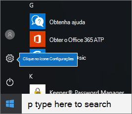
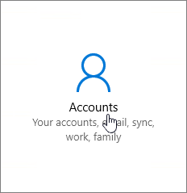
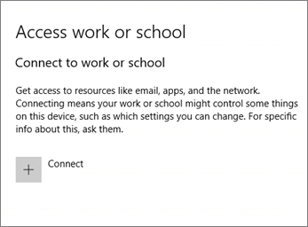

# Configurar dispositivos Windows para usuários do Microsoft 365 Business Premium

## Pré-requisitos para configurar dispositivos Windows para usuários do Microsoft 365 Business Premium

Antes de poder configurar dispositivos Windows para usuários do Microsoft 365 Business Premium, certifique-se de que todos os dispositivos Windows estão executando o Windows 10 pro, versão 1703 (atualização de criadores). O Windows 10 pro é um pré-requisito para implantar o Windows 10 Business, que é um conjunto de serviços de nuvem e recursos de gerenciamento de dispositivos que complementam o Windows 10 pro e habilitam o gerenciamento centralizado e os controles de segurança do Microsoft 365 Business Premium.
  
Se você tiver dispositivos Windows executando o Windows 7 Pro, Windows 8 Pro ou Windows 8,1 Pro, sua assinatura do Microsoft 365 Business Premium o entitulará para uma atualização do Windows 10.
  
Para obter mais informações sobre como atualizar dispositivos Windows para a Atualização do Windows 10 Pro para Criadores, siga as etapas deste tópico: [Atualize dispositivos Windows para a Atualização do Windows Pro para Criadores](upgrade-to-windows-pro-creators-update.md).
  
Confira [verificar se o dispositivo está conectado ao Azure ad](#verify-the-device-is-connected-to-azure-ad) para verificar se você tem a atualização ou se a atualização funcionou.

Assista a um pequeno vídeo sobre como conectar o Windows ao Microsoft 365.  

> [!VIDEO https://www.microsoft.com/videoplayer/embed/RE3yXh3] 

Se você achou esse vídeo útil, Confira as [ séries completas de treinamento para pequenas empresas e as novidades do Microsoft 365](https://support.office.com/article/6ab4bbcd-79cf-4000-a0bd-d42ce4d12816).
  
## Ingressar dispositivos Windows 10 ao Azure AD de sua organização

Quando todos os dispositivos Windows da sua organização tiverem sido atualizados para a atualização do Windows 10 pro Creators ou já estiverem executando o Windows 10 pro Creators Update, você poderá ingressar nesses dispositivos no Azure Active Directory da sua organização. Depois que os dispositivos são associados, eles serão automaticamente atualizados para o Windows 10 Business, que é parte da sua assinatura do Microsoft 365 Business Premium.
  
### No caso de um dispositivo Windows 10 Pro novo ou atualizado recentemente

No caso de um novo dispositivo que executa a Atualização do Windows 10 Pro para Criadores ou um dispositivo que foi atualizado para a Atualização do Windows 10 Pro para Criadores, mas não passou pela configuração do dispositivo Windows 10, siga estas etapas.
  
1. Execute a configuração do dispositivo Windows 10 até chegar à página **Como você deseja configurar?**. 
    
    
  
2. Aqui, escolha **Configurar para uma organização** e insira seu nome de usuário e senha para o Microsoft 365 Business Premium. 
    
3. Conclua a configuração do dispositivo Windows 10.
    
   Quando terminar, o usuário será conectado ao Azure AD de sua organização. Para garantir a conexão, confira [Verifique se o dispositivo está conectado ao Azure AD](#verify-the-device-is-connected-to-azure-ad). 
  
### Para um dispositivo já configurado executando o Windows 10 Pro

 **Conecte os usuários ao Azure AD:**
  
1. No PC Windows do usuário, que esteja executando o Windows 10 Pro, versão 1703 (Atualização do Criador) (veja os [pré-requisitos](pre-requisites-for-data-protection.md)), clique no logotipo do Windows e, em seguida, no ícone de Configurações.
  
   
  
2. Em **Configurações**, vá para **Contas**.
  
   
  
3. Na página **Suas informações**, clique em **Acessar trabalho ou escola** \> **Conectar**.
  
   
  
4. Na caixa de diálogo **Configurar uma conta corporativa ou de estudante**, em **Ações alternativas**, escolha **Ingressar este dispositivo no Azure Active Directory**.
  
   
  
5. Na página de **login**, insira sua conta corporativa ou de estudante \> **Avançar**.
  
   Na página **Insira sua senha**, insira a senha \> **Entrar**.
  
   
  
6. Na página **Verifique se esta é sua organização** , verifique se as informações estão corretas e clique em **ingressar**.
  
   Na página **Tudo pronto!**, clique em **Concluído**.
  
   
  
Se você carregou arquivos no OneDrive for Business, sincronize-os novamente. Se você usou uma ferramenta de terceiros para migrar o perfil e os arquivos, sincronize-os com o novo perfil.
  
## Verifique se o dispositivo está conectado ao Azure AD

Para verificar seu status de sincronização, na página **trabalho ou escola do Access** em **configurações**, clique na área **conectado a** _ \<organization name\> _ para expor as **informações** e **Desconectar**os botões. Clique em **Informações** para obter o status da sincronização. 
  
Na página de status de sincronização, clique em Sincronização para obter as últimas políticas de gerenciamento de dispositivo móvel no PC.
  
Para começar a usar a conta do Microsoft 365 Business Premium, vá para o botão **Iniciar** do Windows, clique com o botão direito do mouse na sua imagem da conta atual e **mude de conta**. Entre com o email e a senha da sua organização.
  

  
## Verifique se o dispositivo está atualizado para o Windows 10 Business

Verifique se os dispositivos Windows 10 associados ao Azure AD foram atualizados para o Windows 10 Business como parte da sua assinatura do Microsoft 365 Business Premium.
  
1. Vá para **Configurações** \> **Sistema** \> **Sobre**.
    
2. Confirme se a opção **Edição** exibe **Windows 10 Business**.
    
    
  
## Próximas etapas

Para configurar seus dispositivos móveis, consulte [configurar dispositivos móveis para usuários do Microsoft 365 Business Premium](set-up-mobile-devices.md), para definir proteção de dispositivo ou políticas de proteção de aplicativos, consulte [Manage Microsoft 365 for Business](manage.md).
  
## Para saber mais sobre como configurar e usar o Microsoft 365 Business Premium

[Vídeos de treinamento do Microsoft 365 Business ](https://support.office.com/article/6ab4bbcd-79cf-4000-a0bd-d42ce4d12816)
