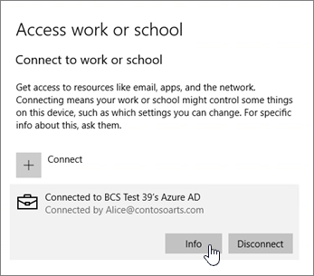

# Configurar dispositivos Windows para usuários do Microsoft 365 Business PremiumSet up Windows devices for Microsoft 365 Business Premium users

## Pré-requisitos para configurar dispositivos Windows para usuários do Microsoft 365 Business PremiumPrerequisites for setting up Windows devices for Microsoft 365 Business Premium users

Antes de poder configurar dispositivos Windows para usuários do Microsoft 365 Business Premium, certifique-se de que todos os dispositivos Windows estão executando o Windows 10 pro, versão 1703 (atualização de criadores).Before you can set up Windows devices for Microsoft 365 Business Premium users, make sure all the Windows devices are running Windows 10 Pro, version 1703 (Creators Update). O Windows 10 pro é um pré-requisito para implantar o Windows 10 Business, que é um conjunto de serviços de nuvem e recursos de gerenciamento de dispositivos que complementam o Windows 10 pro e habilitam o gerenciamento centralizado e os controles de segurança do Microsoft 365 Business Premium.Windows 10 Pro is a prerequisite for deploying Windows 10 Business, which is a set of cloud services and device management capabilities that complement Windows 10 Pro and enable the centralized management and security controls of Microsoft 365 Business Premium.
  
Se você tiver dispositivos Windows executando o Windows 7 Pro, Windows 8 Pro ou Windows 8,1 Pro, sua assinatura do Microsoft 365 Business Premium o entitulará para uma atualização do Windows 10.If you have Windows devices running Windows 7 Pro, Windows 8 Pro, or Windows 8.1 Pro, your Microsoft 365 Business Premium subscription entitles you to a Windows 10 upgrade.
  
Para obter mais informações sobre como atualizar dispositivos Windows para a Atualização do Windows 10 Pro para Criadores, siga as etapas deste tópico: [Atualize dispositivos Windows para a Atualização do Windows Pro para Criadores](upgrade-to-windows-pro-creators-update.md).For more information on how to upgrade Windows devices to Windows 10 Pro Creators Update, follow the steps in this topic: [Upgrade Windows devices to Windows Pro Creators Update](upgrade-to-windows-pro-creators-update.md).
  
Confira [verificar se o dispositivo está conectado ao Azure ad](#verify-the-device-is-connected-to-azure-ad) para verificar se você tem a atualização ou se a atualização funcionou.See [Verify the device is connected to Azure AD](#verify-the-device-is-connected-to-azure-ad) to verify you have the upgrade, or to make sure the upgrade worked.

Assista a um pequeno vídeo sobre como conectar o Windows ao Microsoft 365.Watch a short video about connecting Windows to Microsoft 365.  

> [!VIDEO https://www.microsoft.com/videoplayer/embed/RE3yXh3] 

Se você achou esse vídeo útil, Confira as [ séries completas de treinamento para pequenas empresas e as novidades do Microsoft 365](https://support.office.com/article/6ab4bbcd-79cf-4000-a0bd-d42ce4d12816).If you found this video helpful, check out the [complete training series for small businesses and those new to Microsoft 365](https://support.office.com/article/6ab4bbcd-79cf-4000-a0bd-d42ce4d12816).
  
## Ingressar dispositivos Windows 10 ao Azure AD de sua organizaçãoJoin Windows 10 devices to your organization's Azure AD

Quando todos os dispositivos Windows da sua organização tiverem sido atualizados para a atualização do Windows 10 pro Creators ou já estiverem executando o Windows 10 pro Creators Update, você poderá ingressar nesses dispositivos no Azure Active Directory da sua organização.When all Windows devices in your organization have either been upgraded to Windows 10 Pro Creators Update or are already running Windows 10 Pro Creators Update, you can join these devices to your organization's Azure Active Directory. Depois que os dispositivos são associados, eles serão automaticamente atualizados para o Windows 10 Business, que é parte da sua assinatura do Microsoft 365 Business Premium.Once the devices are joined, they'll be automatically upgraded to Windows 10 Business, which is part of your Microsoft 365 Business Premium subscription.
  
### No caso de um dispositivo Windows 10 Pro novo ou atualizado recentementeFor a brand new, or newly upgraded, Windows 10 Pro device

No caso de um novo dispositivo que executa a Atualização do Windows 10 Pro para Criadores ou um dispositivo que foi atualizado para a Atualização do Windows 10 Pro para Criadores, mas não passou pela configuração do dispositivo Windows 10, siga estas etapas.For a brand new device running Windows 10 Pro Creators Update, or for a device that was upgraded to Windows 10 Pro Creators Update but has not gone through Windows 10 device setup, follow these steps.
  
1. Execute a configuração do dispositivo Windows 10 até chegar à página **Como você deseja configurar?**.Go through Windows 10 device setup until you get to the **How would you like to set up?** page. 
    
    
  
2. Aqui, escolha **Configurar para uma organização** e insira seu nome de usuário e senha para o Microsoft 365 Business Premium.Here, choose **Set up for an organization** and then enter your username and password for Microsoft 365 Business Premium. 
    
3. Conclua a configuração do dispositivo Windows 10.Finish Windows 10 device setup.
    
   Quando terminar, o usuário será conectado ao Azure AD de sua organização. Para garantir a conexão, confira [Verifique se o dispositivo está conectado ao Azure AD](#verify-the-device-is-connected-to-azure-ad).Once you're done, the user will be connected to your organization's Azure AD. See [Verify the device is connected to Azure AD](#verify-the-device-is-connected-to-azure-ad) to make sure. 
  
### Para um dispositivo já configurado executando o Windows 10 ProFor a device already set up and running Windows 10 Pro

 **Conecte os usuários ao Azure AD:****Connect users to Azure AD:**
  
1. No PC Windows do usuário, que esteja executando o Windows 10 Pro, versão 1703 (Atualização do Criador) (veja os [pré-requisitos](pre-requisites-for-data-protection.md)), clique no logotipo do Windows e, em seguida, no ícone de Configurações.In your user's Windows PC, that is running Windows 10 Pro, version 1703 (Creators Update) (see [pre-requisites](pre-requisites-for-data-protection.md)), click the Windows logo, and then the Settings icon.
  
   
  
2. Em **Configurações**, vá para **Contas**.In **Settings**, go to **Accounts**.
  
   
  
3. Na página **Suas informações**, clique em **Acessar trabalho ou escola** \> **Conectar**.On **Your info** page, click **Access work or school** \> **Connect**.
  
   
  
4. Na caixa de diálogo **Configurar uma conta corporativa ou de estudante**, em **Ações alternativas**, escolha **Ingressar este dispositivo no Azure Active Directory**.On the **Set up a work or school account** dialog, under **Alternate actions**, choose **Join this device to Azure Active Directory**.
  
   
  
5. Na página de **login**, insira sua conta corporativa ou de estudante \> **Avançar**.On the **Let's get you signed in** page, enter your work or school account \> **Next**.
  
   Na página **Insira sua senha**, insira a senha \> **Entrar**.On the **Enter password** page, enter your password \> **Sign in**.
  
   
  
6. Na página **Verifique se esta é sua organização** , verifique se as informações estão corretas e clique em **ingressar**.On the **Make sure this is your organization** page, verify that the information is correct, and click **Join**.
  
   Na página **Tudo pronto!**, clique em **Concluído**.On the **You're all set!** page, click **Done**.
  
   
  
Se você carregou arquivos no OneDrive for Business, sincronize-os novamente.If you uploaded files to OneDrive for Business, sync them back down. Se você usou uma ferramenta de terceiros para migrar o perfil e os arquivos, sincronize-os com o novo perfil.If you used a third-party tool to migrate profile and files, also sync those to the new profile.
  
## Verifique se o dispositivo está conectado ao Azure ADVerify the device is connected to Azure AD

Para verificar seu status de sincronização, na página **trabalho ou escola do Access** em **configurações**, clique na área **conectado a** _ \<organization name\> _ para expor as **informações** e **Desconectar**os botões.To verify your sync status, on the **Access work or school** page in **Settings**, click in the **Connected to** _ \<organization name\> _ area to expose the buttons **Info** and **Disconnect**. Clique em **Informações** para obter o status da sincronização.Click on **Info** to get your synchronization status. 
  
Na página de status de sincronização, clique em Sincronização para obter as últimas políticas de gerenciamento de dispositivo móvel no PC.On the Sync status page, click Sync to get the latest mobile device management policies onto the PC.
  
Para começar a usar a conta do Microsoft 365 Business Premium, vá para o botão **Iniciar** do Windows, clique com o botão direito do mouse na sua imagem da conta atual e **mude de conta**.To start using the Microsoft 365 Business Premium account, go to the Windows **Start** button, right-click your current account picture, and then **Switch account**. Entre com o email e a senha da sua organização.Sign in by using your organization email and password.
  

  
## Verifique se o dispositivo está atualizado para o Windows 10 BusinessVerify the device is upgraded to Windows 10 Business

Verifique se os dispositivos Windows 10 associados ao Azure AD foram atualizados para o Windows 10 Business como parte da sua assinatura do Microsoft 365 Business Premium.Verify that your Azure AD joined Windows 10 devices were upgraded to Windows 10 Business as part of your Microsoft 365 Business Premium subscription.
  
1. Vá para **Configurações** \> **Sistema** \> **Sobre**.Go to **Settings** \> **System** \> **About**.
    
2. Confirme se a opção **Edição** exibe **Windows 10 Business**.Confirm that the **Edition** shows **Windows 10 Business**.
    
    
  
## Próximas etapasNext steps

Para configurar seus dispositivos móveis, consulte [configurar dispositivos móveis para usuários do Microsoft 365 Business Premium](set-up-mobile-devices.md), para definir proteção de dispositivo ou políticas de proteção de aplicativos, consulte [Manage Microsoft 365 for Business](manage.md).To set up your mobile devices, see [Set up mobile devices for Microsoft 365 Business Premium users](set-up-mobile-devices.md), To set device protection or app protection policies, see [Manage Microsoft 365 for business](manage.md).
  
## Para saber mais sobre como configurar e usar o Microsoft 365 Business PremiumFor more on setting up and using Microsoft 365 Business Premium

[Vídeos de treinamento do Microsoft 365 Business Microsoft 365 for business training videos](https://support.office.com/article/6ab4bbcd-79cf-4000-a0bd-d42ce4d12816)
