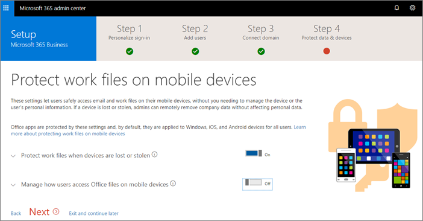
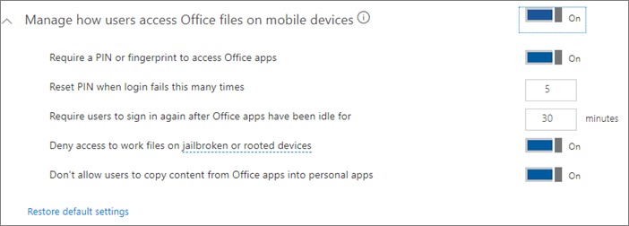

# Configurar o Microsoft 365 Business no assistente de instalaçãoSet up Microsoft 365 Business in the setup wizard

## Adicionar o domínio, os usuários e as políticas de configuraçãoAdd your domain, users, and set up policies

Ao comprar o Microsoft 365 Business, você tem a opção de usar um domínio de sua propriedade ou comprar um durante a [inscrição](sign-up.md).When you purchase Microsoft 365 Business, you have the option of using a domain you own, or buying one during the [sign-up](sign-up.md).

- Se você comprou um novo domínio ao se inscrever, seu domínio está configurado e você pode mover para [Adicionar usuários e atribuir licenças](#add-users-and-assign-licenses).If you purchased a new domain when you signed up, your domain is all set up and you can move to [Add users and assign licenses](#add-users-and-assign-licenses).

### Adicionar seu domínio para personalizar a entradaAdd your domain to personalize sign-in

1. Entre no [centro de administração do Microsoft 365](https://admin.microsoft.com) usando suas credenciais de administrador global.Sign in to [Microsoft 365 admin center](https://admin.microsoft.com) by using your global admin credentials. 

2. Escolha **Adicionar um domínio** ou **Adicionar usuários** para iniciar o assistente.Choose **Add a domain** or **Add users** to start the wizard.
    > [!IMPORTANT]
    > Se você comprou um domínio durante a inscrição, não verá a etapa **Adicionar um domínio** .If you purchased a domain during the sign-up, you will not see **Add a domain** step here. Em vez disso, vá para [Adicionar usuários](#add-users-and-assign-licenses) .Go to [Add users ](#add-users-and-assign-licenses) instead.

    
    
3. No assistente, digite o nome de domínio que você deseja usar (como contoso.com).In the wizard, enter the domain name you want to use (like contoso.com).

    

    
4. Siga as etapas no Assistente para [criar registros DNS em qualquer provedor de Hospedagem de DNS para o Office 365](https://docs.microsoft.com/office365/admin/get-help-with-domains/create-dns-records-at-any-dns-hosting-provider) que verifica se você é o proprietário do domínio.Follow the steps in the wizard to [Create DNS records at any DNS hosting provider for Office 365](https://docs.microsoft.com/office365/admin/get-help-with-domains/create-dns-records-at-any-dns-hosting-provider) that verifies you own the domain. Se você souber seu host de domínio, consulte também as [instruções específicas do host](https://docs.microsoft.com/office365/admin/get-help-with-domains/set-up-your-domain-host-specific-instructions).If you know your domain host, see also the [host specific instructions](https://docs.microsoft.com/office365/admin/get-help-with-domains/set-up-your-domain-host-specific-instructions).

    Se o seu provedor de hospedagem for o GoDaddy, o processo será fácil e você será solicitado a entrar e permitir que a Microsoft autentique em seu nome:If your hosting provider is GoDaddy, the process is easy and you will be automatically asked to sign in and let Microsoft authenticate on your behalf:

    

### Adicionar usuários e atribuir licençasAdd users and assign licenses

Você pode adicionar usuários no assistente, mas você também pode [Adicionar usuários posteriormente](add-users-m365b.md) no centro de administração.You can add users in the wizard, but you can also [add users later](add-users-m365b.md) in the admin center. Além disso, se você tiver um controlador de domínio local, poderá adicionar usuários com o [Azure ad Connect](https://docs.microsoft.com/azure/active-directory/hybrid/how-to-connect-install-express).Additionally, if you have a local domain controller, you can add users with [Azure AD Connect](https://docs.microsoft.com/azure/active-directory/hybrid/how-to-connect-install-express).

#### Adicionar usuários no assistenteAdd users in the wizard

Todos os usuários adicionados ao assistente recebem automaticamente uma licença de negócios do Microsoft 365.Any users you add in the wizard get automatically assigned a Microsoft 365 Business license.

1. Se sua assinatura do Microsoft 365 Business tiver usuários existentes (por exemplo, se você usou o Azure AD Connect), você terá uma opção para atribuir licenças a eles agora.If your Microsoft 365 Business subscription has existing users (for example, if you used Azure AD Connect) , you get an option to assign licenses to them now. Adicione licenças para eles também.Go ahead and add licenses to them as well.

3. Depois de adicionar os usuários, você também terá uma opção para compartilhar credenciais com os novos usuários que você adicionou.After you have added the users, you will also get an option to share credentials with the new users you added. Você pode optar por imprimi-las, enviá-las por email ou baixá-las.You can choose to print them out, email them, or download them.

4. Ignore a migração de mensagens de email e escolha **Avançar** na página **Migrar mensagens de email**.Skip migrating email messages and choose **Next** on **Migrate email messages** page. 

    Se você estiver migrando de outro provedor de email e deseja copiar os dados mais tarde, poderá [migrar emails e contatos para o Office 365](https://support.office.com/article/a3e3bddb-582e-4133-8670-e61b9f58627e).If you are moving from another email provider and want to copy your data later, you can [Migrate email and contacts to Office 365](https://support.office.com/article/a3e3bddb-582e-4133-8670-e61b9f58627e).

### Conectar seu domínioConnect your domain

> [!NOTE]
> Se você optar por usar o domínio. onmicrosoft ou usado o Azure AD Connect para configurar usuários, esta etapa não será exibida.If you chose to use the .onmicrosoft domain, or used Azure AD Connect to set up users, you will not see this step.
  
Para configurar serviços, você deve atualizar alguns registros no registrador de domínios ou no host DNS.To set up services, you have to update some records at your DNS host or domain registrar.
  
1. O assistente de configuração normalmente detecta o registrador e proporciona um link para as instruções passo a passo para atualizar seus registros NS no site do registrador.The setup wizard typically detects your registrar and gives you a link to step-by-step instructions for updating your NS records at the registrar website. Caso contrário, [altere os nameservers para configurar o Office 365 com qualquer registrador de domínio](https://support.office.com/article/a8b487a9-2a45-4581-9dc4-5d28a47010a2).If it doesn't, [Change nameservers to set up Office 365 with any domain registrar](https://support.office.com/article/a8b487a9-2a45-4581-9dc4-5d28a47010a2). 

    - Se você tiver registros DNS existentes, por exemplo, um site existente, será necessário gerenciar seus próprios registros DNS para garantir que os serviços existentes permaneçam conectados.If you have existing DNS records, for example an existing web site, you will want to manage your own DNS records to make sure the existing services stay connected. Confira [noções básicas sobre domínios](https://docs.microsoft.com/office365/admin/get-help-with-domains/dns-basics) para obter mais informações.See [domain basics](https://docs.microsoft.com/office365/admin/get-help-with-domains/dns-basics) for more info.

        

2. Siga as etapas do assistente e email e outros serviços serão configurados para você.Follow the steps in the wizard and email and other services will be set up for you.

### Configurar políticas de segurança e configurações de dispositivosSet up security policies and device configurations 

As políticas configuradas no assistente são aplicadas automaticamente a um [grupo de segurança](https://docs.microsoft.com/office365/admin/create-groups/compare-groups#security-groups) chamado *todos os usuários*.The policies you set up in the wizard are applied automatically to a [Security group](https://docs.microsoft.com/office365/admin/create-groups/compare-groups#security-groups) called *All Users*. Você também pode criar grupos adicionais para atribuir políticas ao centro de administração.You can also create additional groups to assign policies to in the admin center.

1. Na lista **proteger seus arquivos de trabalho em dispositivos móveis** , a opção **proteger arquivos de trabalho quando dispositivos forem perdidos ou roubados** será selecionada por padrão.On the **Protect your work files on mobile devices** the option **Protect work files when devices are lost or stolen** is selected by default. Você pode ativar a opção **gerenciar como os usuários acessam arquivos do Office em dispositivos móveis**e isso é recomendável.You have an option to turn on **Manage how users access Office files on mobile devices**, and this is recommended.

    

     - Expanda **proteger arquivos de trabalho quando dispositivos forem perdidos ou roubados** para exibir os [valores padrão](protect-work-files-on-lost-or-stolen-device.md):Expand **Protect work files when devices are lost or stolen** to display the [default values](protect-work-files-on-lost-or-stolen-device.md):

        

    - Selecione **gerenciar como os usuários acessam arquivos do Office em dispositivos móveis** e expanda-o para exibir os [valores padrão](manage-user-access-on-mobile-devices.md).Select **Manage how users access Office files on mobile devices** and expand it to display the [default values](manage-user-access-on-mobile-devices.md). Recomendamos que você aceite os valores padrão durante a instalação para criar políticas de aplicativo para Android, iOS e Windows 10 que se apliquem a todos os usuários.We recommend that you accept the default values during setup to create application policies for Android, iOS, and Windows 10 that apply to all users. Você pode criar mais políticas após concluir a instalação.You can create more policies after setup completes.

        

2. A última etapa para proteger dados e dispositivos permite que você configure políticas para proteger dispositivos Windows 10.The last step on protect data and devices allows you to set up policies to secure Windows 10 devices. Essas configurações são aplicadas automaticamente quando o Windows 10 de um usuário se conecta à sua organização.These settings are applied automatically when a user's Windows 10 connects to your organization. Você pode expandir **dispositivos Windows 10 seguros** para ver e modificar os [valores padrão](secure-windows-10-devices.md).You can expand **Secure Windows 10 devices** to see and modify the [default values](secure-windows-10-devices.md).
3. Você também pode optar por [instalar automaticamente o Office](install-office-on-windows-10-during-setup.md) em dispositivos Windows 10.You can also choose to [automatically install Office](install-office-on-windows-10-during-setup.md) on Windows 10 devices.

    

## Implantar aplicativos cliente do Office 365Deploy Office 365 client apps

Se você optar por instalar automaticamente os aplicativos do Office no durante a configuração, os aplicativos serão instalados nos dispositivos Windows 10 depois que eles entrarem no Azure AD de seus dispositivos Windows com suas credenciais de trabalho.If you chose to automatically install Office apps in during the set up, the apps will install on the Windows 10 devices once the users have signed in to Azure AD from their Windows devices with their work credentials.
Para instalar o Office no Mobile iOS ou dispositivos Android, consulte [set up Mobile Devices for Microsoft 365 business users](set-up-mobile-devices.md).To install Office on mobile iOS or Android devices, see [Set up mobile devices for Microsoft 365 Business users](set-up-mobile-devices.md).

Você também pode instalar o Office individualmente.You can also install Office individually. Confira [instalar o Office em um PC ou Mac](https://support.office.com/article/4414eaaf-0478-48be-9c42-23adc4716658) para obter instruções.See [install Office on a PC or Mac](https://support.office.com/article/4414eaaf-0478-48be-9c42-23adc4716658) for instructions.
