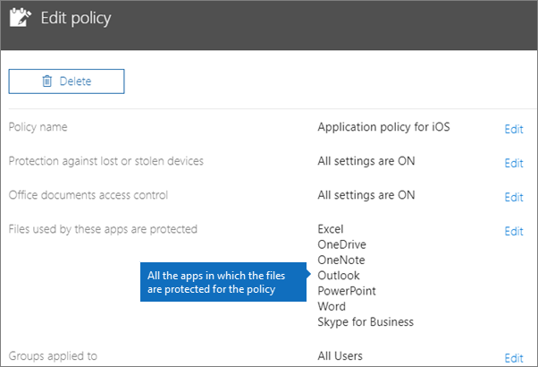

# Validar configurações de proteção de aplicativos em dispositivos Android ou iOS

Siga as instruções nas seções a seguir para validar as configurações de proteção de aplicativos em dispositivos Android ou iOS.
  
## Android
  
### Verifique se as configurações de proteção do aplicativo estão funcionando em dispositivos de usuário

Depois de [definir configurações de aplicativo para dispositivos Android](app-protection-settings-for-android-and-ios.md) para proteger aplicativos, você pode seguir estas etapas para validar o funcionamento das configurações escolhidas. 
  
Primeiro, certifique-se de que a política se aplique ao aplicativo no qual você irá validá-la.
  
1. No centro de Microsoft 365 Business Premium [de administração,](https://admin.microsoft.com)vá para **Política Editar** \> **política**.
    
2. Escolha **Política de aplicativo** para Android para as configurações criadas na instalação ou outra política que você criou e verifique se ela é imposta para Outlook, por exemplo. 
    
    
  
### Validar Exigir um PIN ou uma impressão digital para acessar aplicativos do Office

No painel **Editar política**, escolha **Editar** ao lado de **Controle de acesso a documentos do Office**, expanda **Gerenciar como os usuários acessam arquivos do Office em dispositivos móveis** e verifique se a opção **Exigir um PIN ou uma impressão digital para acessar os aplicativos do Office** está definida como **Ativada**.
  

  
1. No dispositivo Android do usuário, abra Outlook e entre com as credenciais de Microsoft 365 Business Premium do usuário.
    
2. Você também será solicitado a inserir um PIN ou usar uma impressão digital.
    
    
  
### Validar Redefinir PIN após algumas tentativas fracassadas

No painel **Editar** política, escolha **Editar** ao lado do controle de acesso **Office** documentos, expanda **Gerenciar como** os usuários acessam arquivos Office em dispositivos móveis e certifique-se de que **Redefinir PIN** após o número de tentativas com falha seja definido como algum número. Isso é 5 por padrão. 
  
1. No dispositivo Android do usuário, abra Outlook e entre com as credenciais de Microsoft 365 Business Premium do usuário.
    
2. Insira um PIN incorreto o número de vezes especificado pela política. Você verá um prompt informando limite de tentativa **de PIN atingido** para redefinir o PIN. 
    
    
  
3. Pressione **Redefinir PIN**. Você será solicitado a entrar com as credenciais de Microsoft 365 Business Premium do usuário e, em seguida, será necessário definir um novo PIN.
    
### Validar Forçar os usuários a salvarem todos os arquivos de trabalho no OneDrive for Business

No painel **Editar política**, escolha **Editar** ao lado de **Proteção contra dispositivos perdidos ou roubados**, expanda **Proteger arquivos de trabalho quando dispositivos forem perdidos ou roubados** e verifique se a opção **Forçar os usuários a salvarem todos os arquivos de trabalho no OneDrive for Business** está definida como **Ativada**.
  

  
1. No dispositivo Android do usuário, abra Outlook e entre com as credenciais de Microsoft 365 Business Premium do usuário e insira um PIN, se solicitado.
    
2. Abra um email que contenha um anexo e toque no ícone de seta para baixo ao lado das informações do anexo.
    
    
  
    Você verá Não **é possível salvar no dispositivo** na parte inferior da tela. 
    
    
  
    > [!NOTE]
    > A opção para salvar no OneDrive for Business não está habilitada para o Android neste momento, portanto, só é possível ver que salvar localmente está bloqueado. 
  
### Validar Solicitar que o usuário entre novamente se os aplicativos do Office ficarem ociosos por um período especificado

No  painel Editar política, escolha **Editar** ao lado do controle de acesso **Office** documentos, expanda Gerenciar como  os usuários acessam arquivos **Office** em dispositivos móveis e certifique-se de exigir que os usuários entre novamente depois que os aplicativos Office estão ociosos por algum número de minutos. Por padrão, são 30 minutos. 
  
1. No dispositivo Android do usuário, abra Outlook e entre com as credenciais de Microsoft 365 Business Premium do usuário e insira um PIN, se solicitado.
    
2. Agora você deverá ver a caixa de entrada do Outlook. Deixe o dispositivo Android ocioso sem tocar nele por pelo menos 30 minutos (ou por um período diferente superior ao especificado na política). O dispositivo provavelmente ficará escuro.
    
3. Acesse Outlook no dispositivo Android novamente.
    
4. Você será solicitado a inserir seu PIN antes de poder acessar Outlook novamente.
    
### Validar Proteger arquivos de trabalho com criptografia

No painel **Editar política**, escolha **Editar** ao lado de **Proteção contra dispositivos perdidos ou roubados**, expanda **Proteger arquivos de trabalho quando dispositivos forem perdidos ou roubados** e verifique se a opção **Proteger arquivos de trabalho com criptografia** está definida como **Ativada** e a opção **Forçar os usuários a salvarem todos os arquivos de trabalho no OneDrive for Business** está definida como **Desativada**.
  
1. No dispositivo Android do usuário, abra Outlook e entre com as credenciais de Microsoft 365 Business Premium do usuário e insira um PIN, se solicitado.
    
2. Abra um email que contém alguns anexos de arquivo de imagem.
    
3. Toque no ícone de seta para baixo ao lado das informações do anexo para salvá-lo.
    
    
  
4. Você poderá ser solicitado a permitir que o Outlook acesse arquivos, mídia e fotos em seu dispositivo. Toque em **Permitir**.
    
5. Na parte inferior da tela, escolha **Salvar no Dispositivo** e, em seguida, abra o aplicativo **Galeria**. 
    
6. Você deverá ver uma foto criptografada (ou mais, caso tenha salvado vários anexos de arquivos de imagem) na lista. Ela poderá aparecer na lista Imagens como um quadrado cinza com um ponto de exclamação branco dentro de um círculo branco no centro do quadrado cinza.
    
    
  
## iOS
  
### Verifique se as configurações de proteção do aplicativo estão funcionando nos dispositivos de usuário

Depois de [definir configurações de aplicativo para dispositivos iOS](app-protection-settings-for-android-and-ios.md) para proteger aplicativos, você pode seguir estas etapas para validar o funcionamento das configurações escolhidas. 
  
Primeiro, certifique-se de que a política se aplique ao aplicativo no qual você irá validá-la.
  
1. No centro de Microsoft 365 Business Premium [de administração,](https://admin.microsoft.com)vá para **Política Editar** \> **política**.
    
2. Escolha **Política de aplicativo para iOS** para as configurações criadas na instalação ou outra política que você criou e verifique se ela é imposta para Outlook por exemplo. 
    
    
  
### Validar Exigir um PIN para acessar aplicativos do Office

No painel **Editar política**, escolha **Editar** ao lado de **Controle de acesso a documentos do Office**, expanda **Gerenciar como os usuários acessam arquivos do Office em dispositivos móveis** e verifique se a opção **Exigir um PIN ou uma impressão digital para acessar os aplicativos do Office** está definida como **Ativada**.
  

  
1. No dispositivo iOS do usuário, abra Outlook e entre com as credenciais de Microsoft 365 Business Premium do usuário.
    
2. Você também será solicitado a inserir um PIN ou usar uma impressão digital.
    
    
  
### Validar Redefinir PIN após algumas tentativas fracassadas

No painel **Editar** política, escolha **Editar** ao lado do controle de acesso **Office** documentos, expanda **Gerenciar como** os usuários acessam arquivos Office em dispositivos móveis e certifique-se de que **Redefinir PIN** após o número de tentativas com falha seja definido como algum número. Isso é 5 por padrão. 
  
1. No dispositivo iOS do usuário, abra Outlook e entre com as credenciais de Microsoft 365 Business Premium do usuário.
    
2. Insira um PIN incorreto o número de vezes especificado pela política. Você verá um prompt informando limite de tentativa **de PIN atingido** para redefinir o PIN. 
    
    
  
3. Pressione **OK**. Você será solicitado a entrar com as credenciais de Microsoft 365 Business Premium do usuário e, em seguida, será necessário definir um novo PIN.
    
### Validar Forçar os usuários a salvarem todos os arquivos de trabalho no OneDrive for Business

No painel **Editar política**, escolha **Editar** ao lado de **Proteção contra dispositivos perdidos ou roubados**, expanda **Proteger arquivos de trabalho quando dispositivos forem perdidos ou roubados** e verifique se a opção **Forçar os usuários a salvarem todos os arquivos de trabalho no OneDrive for Business** está definida como **Ativada**.
  

  
1. No dispositivo iOS do usuário, abra Outlook e entre com as credenciais de Microsoft 365 Business Premium do usuário e insira um PIN, se solicitado.
    
2. Abra um email que contenha um anexo, abra o anexo e escolha **Salvar** na parte inferior da tela. 
    
    
  
3. Você só verá uma opção para o OneDrive for Business. Se não, toque **em Adicionar Conta** e selecione **OneDrive for Business** na tela **Adicionar Armazenamento** Conta. Forneça ao usuário final Microsoft 365 Business Premium entrar quando solicitado. 
    
    Toque em **Salvar** e selecione **OneDrive for Business**.
    
### Validar Solicitar que o usuário entre novamente se os aplicativos do Office ficarem ociosos por um período especificado

No  painel Editar política, escolha **Editar** ao lado do controle de acesso **Office** documentos, expanda Gerenciar como  os usuários acessam arquivos **Office** em dispositivos móveis e certifique-se de exigir que os usuários entre novamente depois que os aplicativos Office estão ociosos por algum número de minutos. Por padrão, são 30 minutos. 
  
1. No dispositivo iOS do usuário, abra Outlook e entre com as credenciais de Microsoft 365 Business Premium do usuário e insira um PIN, se solicitado.
    
2. Agora você deverá ver a caixa de entrada do Outlook. Deixe o dispositivo iOS sem tocar nele por pelo menos 30 minutos (ou por um período diferente superior ao especificado na política). O dispositivo provavelmente ficará escuro.
    
3. Acesse Outlook no dispositivo iOS novamente.
    
4. Você será solicitado a inserir seu PIN antes de poder acessar Outlook novamente.
    
### Validar Proteger arquivos de trabalho com criptografia

No painel **Editar política**, escolha **Editar** ao lado de **Proteção contra dispositivos perdidos ou roubados**, expanda **Proteger arquivos de trabalho quando dispositivos forem perdidos ou roubados** e verifique se a opção **Proteger arquivos de trabalho com criptografia** está definida como **Ativada** e a opção **Forçar os usuários a salvarem todos os arquivos de trabalho no OneDrive for Business** está definida como **Desativada**.
  
1. No dispositivo iOS do usuário, abra Outlook e entre com as credenciais de Microsoft 365 Business Premium do usuário e insira um PIN, se solicitado.
    
2. Abra um email que contém alguns anexos de arquivo de imagem.
    
3. Toque no anexo e, em seguida, toque na opção **Salvar** abaixo dele. 
    
4. Abra o aplicativo **Fotos** na tela inicial. Você deverá ver uma foto criptografada (ou mais, caso tenha salvado vários anexos de arquivos de imagem) salva, mas criptografada. 
    
---

