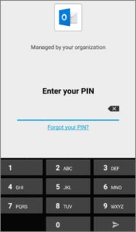

# Validar configurações de proteção de aplicativos em dispositivos Android ou iOSValidate app protection settings on Android or iOS devices

Siga as instruções nas seções a seguir para validar as configurações de proteção de aplicativos em dispositivos Android ou iOS.Follow the instructions in the following sections to validate app protection settings on Android or iOS devices.
  
## AndroidAndroid
  
### Verifique se as configurações de proteção do aplicativo estão funcionando em dispositivos de usuárioCheck that the app protection settings are working on user devices

Depois de [definir configurações de aplicativo para dispositivos Android](app-protection-settings-for-android-and-ios.md) para proteger aplicativos, você pode seguir estas etapas para validar o funcionamento das configurações escolhidas.After you [set app configurations for Android devices](app-protection-settings-for-android-and-ios.md) to protect the apps, you can follow these steps to validate that the settings you chose work. 
  
Primeiro, certifique-se de que a política se aplique ao aplicativo no qual você irá validá-la.First, make sure that the policy applies to the app in which you're going to validate it.
  
1. No centro de Microsoft 365 Business Premium [de administração,](https://admin.microsoft.com)vá para **Política Editar** \> **política**.In the Microsoft 365 Business Premium [admin center](https://admin.microsoft.com), go to **Policies** \> **Edit policy**.
    
2. Escolha **Política de aplicativo** para Android para as configurações criadas na instalação ou outra política que você criou e verifique se ela é imposta para Outlook, por exemplo.Choose **Application policy for Android** for the settings you created at setup, or another policy you created, and verify that it's enforced for Outlook, for example. 
    
    
  
### Validar Exigir um PIN ou uma impressão digital para acessar aplicativos do OfficeValidate Require a PIN or a fingerprint to access Office apps

No painel **Editar política**, escolha **Editar** ao lado de **Controle de acesso a documentos do Office**, expanda **Gerenciar como os usuários acessam arquivos do Office em dispositivos móveis** e verifique se a opção **Exigir um PIN ou uma impressão digital para acessar os aplicativos do Office** está definida como **Ativada**.In the **Edit policy** pane, choose **Edit** next to **Office documents access control**, expand **Manage how users access Office files on mobile devices**, and make sure that **Require a PIN or fingerprint to access Office apps** is set to **On**.
  

  
1. No dispositivo Android do usuário, abra Outlook e entre com as credenciais de Microsoft 365 Business Premium do usuário.In the user's Android device, open Outlook and sign in with the user's Microsoft 365 Business Premium credentials.
    
2. Você também será solicitado a inserir um PIN ou usar uma impressão digital.You'll also be prompted to enter a PIN or use a fingerprint.
    
    
  
### Validar Redefinir PIN após algumas tentativas fracassadasValidate Reset PIN after number of failed attempts

No painel **Editar** política, escolha **Editar** ao lado do controle de acesso **Office** documentos, expanda **Gerenciar como** os usuários acessam arquivos Office em dispositivos móveis e certifique-se de que **Redefinir PIN** após o número de tentativas com falha seja definido como algum número.In the **Edit policy** pane, choose **Edit** next to **Office documents access control**, expand **Manage how users access Office files on mobile devices**, and make sure that **Reset PIN after number of failed attempts** is set to some number. Isso é 5 por padrão.This is 5 by default. 
  
1. No dispositivo Android do usuário, abra Outlook e entre com as credenciais de Microsoft 365 Business Premium do usuário.In the user's Android device, open Outlook and sign in with the user's Microsoft 365 Business Premium credentials.
    
2. Insira um PIN incorreto o número de vezes especificado pela política.Enter an incorrect PIN as many times as specified by the policy. Você verá um prompt informando limite de tentativa **de PIN atingido** para redefinir o PIN.You'll see a prompt that states **PIN Attempt Limit Reached** to reset the PIN. 
    
    
  
3. Pressione **Redefinir PIN**.Press **Reset PIN**. Você será solicitado a entrar com as credenciais de Microsoft 365 Business Premium do usuário e, em seguida, será necessário definir um novo PIN.You'll be prompted to sign in with the user's Microsoft 365 Business Premium credentials, and then required to set a new PIN.
    
### Validar Forçar os usuários a salvarem todos os arquivos de trabalho no OneDrive for BusinessValidate Force users to save all work files to OneDrive for Business

No painel **Editar política**, escolha **Editar** ao lado de **Proteção contra dispositivos perdidos ou roubados**, expanda **Proteger arquivos de trabalho quando dispositivos forem perdidos ou roubados** e verifique se a opção **Forçar os usuários a salvarem todos os arquivos de trabalho no OneDrive for Business** está definida como **Ativada**.In the **Edit policy** pane, choose **Edit** next to **Protection against lost or stolen devices**, expand **Protect work files when devices are lost or stolen**, and make sure that **Force users to save all work files to OneDrive for Business** is set to **On**.
  

  
1. No dispositivo Android do usuário, abra Outlook e entre com as credenciais de Microsoft 365 Business Premium do usuário e insira um PIN, se solicitado.In the user's Android device, open Outlook and sign in with the user's Microsoft 365 Business Premium credentials, and enter a PIN if requested.
    
2. Abra um email que contenha um anexo e toque no ícone de seta para baixo ao lado das informações do anexo.Open an email that contains an attachment and tap the down arrow icon next to the attachment's information.
    
    
  
    Você verá Não **é possível salvar no dispositivo** na parte inferior da tela.You'll see **Cannot save to device** on the bottom of the screen. 
    
    
  
    > [!NOTE]
    > A opção para salvar no OneDrive for Business não está habilitada para o Android neste momento, portanto, só é possível ver que salvar localmente está bloqueado.Saving to OneDrive for Business is not enabled for Android at this time, so you can only see that saving locally is blocked. 
  
### Validar Solicitar que o usuário entre novamente se os aplicativos do Office ficarem ociosos por um período especificadoValidate Require user to sign in again if Office apps have been idle for a specified time

No  painel Editar política, escolha **Editar** ao lado do controle de acesso **Office** documentos, expanda Gerenciar como  os usuários acessam arquivos **Office** em dispositivos móveis e certifique-se de exigir que os usuários entre novamente depois que os aplicativos Office estão ociosos por algum número de minutos.In the **Edit policy** pane, choose **Edit** next to **Office documents access control**, expand **Manage how users access Office files on mobile devices**, and make sure that **Require users to sign in again after Office apps have been idle for** is set to some number of minutes. Por padrão, são 30 minutos.This is 30 minutes by default. 
  
1. No dispositivo Android do usuário, abra Outlook e entre com as credenciais de Microsoft 365 Business Premium do usuário e insira um PIN, se solicitado.In the user's Android device, open Outlook and sign in with the user's Microsoft 365 Business Premium credentials, and enter a PIN if requested.
    
2. Agora você deverá ver a caixa de entrada do Outlook. Deixe o dispositivo Android ocioso sem tocar nele por pelo menos 30 minutos (ou por um período diferente superior ao especificado na política). O dispositivo provavelmente ficará escuro.You should now see Outlook's inbox. Let the Android device idle untouched for at least 30 minutes (or some other amount of time, longer than what you specified in the policy). The device will likely dim.
    
3. Acesse Outlook no dispositivo Android novamente.Access Outlook on the Android device again.
    
4. Você será solicitado a inserir seu PIN antes de poder acessar Outlook novamente.You'll be prompted to enter your PIN before you can access Outlook again.
    
### Validar Proteger arquivos de trabalho com criptografiaValidate Protect work files with encryption

No painel **Editar política**, escolha **Editar** ao lado de **Proteção contra dispositivos perdidos ou roubados**, expanda **Proteger arquivos de trabalho quando dispositivos forem perdidos ou roubados** e verifique se a opção **Proteger arquivos de trabalho com criptografia** está definida como **Ativada** e a opção **Forçar os usuários a salvarem todos os arquivos de trabalho no OneDrive for Business** está definida como **Desativada**.In the **Edit policy** pane, choose **Edit** next to **Protection against lost or stolen devices**, expand **Protect work files when devices are lost or stolen**, and make sure that **Protect work files with encryption** is set to **On**, and **Force users to save all work files to OneDrive for Business** is set to **Off**.
  
1. No dispositivo Android do usuário, abra Outlook e entre com as credenciais de Microsoft 365 Business Premium do usuário e insira um PIN, se solicitado.In the user's Android device, open Outlook and sign in with the user's Microsoft 365 Business Premium credentials, and enter a PIN if requested.
    
2. Abra um email que contém alguns anexos de arquivo de imagem.Open an email that contains a few image file attachments.
    
3. Toque no ícone de seta para baixo ao lado das informações do anexo para salvá-lo.Tap the down arrow icon next to the attachment's info to save it.
    
    
  
4. Você poderá ser solicitado a permitir que o Outlook acesse arquivos, mídia e fotos em seu dispositivo. Toque em **Permitir**.You may be prompted to allow Outlook to access photos, media, and files on your device. Tap **Allow**.
    
5. Na parte inferior da tela, escolha **Salvar no Dispositivo** e, em seguida, abra o aplicativo **Galeria**.At the bottom of the screen, choose to **Save to Device** and then open the **Gallery** app. 
    
6. Você deverá ver uma foto criptografada (ou mais, caso tenha salvado vários anexos de arquivos de imagem) na lista. Ela poderá aparecer na lista Imagens como um quadrado cinza com um ponto de exclamação branco dentro de um círculo branco no centro do quadrado cinza.You should see an encrypted photo (or more, if you saved multiple image file attachments) in the list. It may appear in the Pictures list as a gray square with a white exclamation point within a white circle in the center of the gray square.
    
    
  
## iOSiOS
  
### Verifique se as configurações de proteção do aplicativo estão funcionando nos dispositivos de usuárioCheck that the App protection settings are working on user devices

Depois de [definir configurações de aplicativo para dispositivos iOS](app-protection-settings-for-android-and-ios.md) para proteger aplicativos, você pode seguir estas etapas para validar o funcionamento das configurações escolhidas.After you [set app configurations for iOS devices](app-protection-settings-for-android-and-ios.md) to protect apps, you can follow these steps to validate that the settings you chose work. 
  
Primeiro, certifique-se de que a política se aplique ao aplicativo no qual você irá validá-la.First, make sure that the policy applies to the app in which you're going to validate it.
  
1. No centro de Microsoft 365 Business Premium [de administração,](https://admin.microsoft.com)vá para **Política Editar** \> **política**.In the Microsoft 365 Business Premium [admin center](https://admin.microsoft.com), go to **Policies** \> **Edit policy**.
    
2. Escolha **Política de aplicativo para iOS** para as configurações criadas na instalação ou outra política que você criou e verifique se ela é imposta para Outlook por exemplo.Choose **Application policy for iOS** for the settings you created at setup, or another policy you created, and verify that it's enforced for Outlook for example. 
    
    
  
### Validar Exigir um PIN para acessar aplicativos do OfficeValidate Require a PIN to access Office apps

No painel **Editar política**, escolha **Editar** ao lado de **Controle de acesso a documentos do Office**, expanda **Gerenciar como os usuários acessam arquivos do Office em dispositivos móveis** e verifique se a opção **Exigir um PIN ou uma impressão digital para acessar os aplicativos do Office** está definida como **Ativada**.In the **Edit policy** pane, choose **Edit** next to **Office documents access control**, expand **Manage how users access Office files on mobile devices**, and make sure that **Require a PIN or fingerprint to access Office apps** is set to **On**.
  

  
1. No dispositivo iOS do usuário, abra Outlook e entre com as credenciais de Microsoft 365 Business Premium do usuário.In the user's iOS device, open Outlook and sign in with the user's Microsoft 365 Business Premium credentials.
    
2. Você também será solicitado a inserir um PIN ou usar uma impressão digital.You'll also be prompted to enter a PIN or use a fingerprint.
    
    
  
### Validar Redefinir PIN após algumas tentativas fracassadasValidate Reset PIN after number of failed attempts

No painel **Editar** política, escolha **Editar** ao lado do controle de acesso **Office** documentos, expanda **Gerenciar como** os usuários acessam arquivos Office em dispositivos móveis e certifique-se de que **Redefinir PIN** após o número de tentativas com falha seja definido como algum número.In the **Edit policy** pane, choose **Edit** next to **Office documents access control**, expand **Manage how users access Office files on mobile devices**, and make sure that **Reset PIN after number of failed attempts** is set to some number. Isso é 5 por padrão.This is 5 by default. 
  
1. No dispositivo iOS do usuário, abra Outlook e entre com as credenciais de Microsoft 365 Business Premium do usuário.In the user's iOS device, open Outlook and sign in with the user's Microsoft 365 Business Premium credentials.
    
2. Insira um PIN incorreto o número de vezes especificado pela política.Enter an incorrect PIN as many times as specified by the policy. Você verá um prompt informando limite de tentativa **de PIN atingido** para redefinir o PIN.You'll see a prompt that states **PIN Attempt Limit Reached** to reset the PIN. 
    
    
  
3. Pressione **OK**.Press **OK**. Você será solicitado a entrar com as credenciais de Microsoft 365 Business Premium do usuário e, em seguida, será necessário definir um novo PIN.You'll be prompted to sign in with the user's Microsoft 365 Business Premium credentials, and then required to set a new PIN.
    
### Validar Forçar os usuários a salvarem todos os arquivos de trabalho no OneDrive for BusinessValidate Force users to save all work files to OneDrive for Business

No painel **Editar política**, escolha **Editar** ao lado de **Proteção contra dispositivos perdidos ou roubados**, expanda **Proteger arquivos de trabalho quando dispositivos forem perdidos ou roubados** e verifique se a opção **Forçar os usuários a salvarem todos os arquivos de trabalho no OneDrive for Business** está definida como **Ativada**.In the **Edit policy** pane, choose **Edit** next to **Protection against lost or stolen devices**, expand **Protect work files when devices are lost or stolen**, and make sure that **Force users to save all work files to OneDrive for Business** is set to **On**.
  

  
1. No dispositivo iOS do usuário, abra Outlook e entre com as credenciais de Microsoft 365 Business Premium do usuário e insira um PIN, se solicitado.In the user's iOS device, open Outlook and sign in with the user's Microsoft 365 Business Premium credentials, and enter a PIN if requested.
    
2. Abra um email que contenha um anexo, abra o anexo e escolha **Salvar** na parte inferior da tela.Open an email that contains an attachment, open the attachment and choose **Save** on the bottom of the screen. 
    
    
  
3. Você só verá uma opção para o OneDrive for Business.You should only see an option for OneDrive for Business. Se não, toque **em Adicionar Conta** e selecione **OneDrive for Business** na tela **Adicionar Armazenamento** Conta.If not, tap **Add Account** and select **OneDrive for Business** from the **Add Storage Account** screen. Forneça ao usuário final Microsoft 365 Business Premium entrar quando solicitado.Provide the end user's Microsoft 365 Business Premium to sign in when prompted. 
    
    Toque em **Salvar** e selecione **OneDrive for Business**.Tap **Save** and select **OneDrive for Business**.
    
### Validar Solicitar que o usuário entre novamente se os aplicativos do Office ficarem ociosos por um período especificadoValidate Require user to sign in again if Office apps have been idle for a specified time

No  painel Editar política, escolha **Editar** ao lado do controle de acesso **Office** documentos, expanda Gerenciar como  os usuários acessam arquivos **Office** em dispositivos móveis e certifique-se de exigir que os usuários entre novamente depois que os aplicativos Office estão ociosos por algum número de minutos.In the **Edit policy** pane, choose **Edit** next to **Office documents access control**, expand **Manage how users access Office files on mobile devices**, and make sure that **Require users to sign in again after Office apps have been idle for** is set to some number of minutes. Por padrão, são 30 minutos.This is 30 minutes by default. 
  
1. No dispositivo iOS do usuário, abra Outlook e entre com as credenciais de Microsoft 365 Business Premium do usuário e insira um PIN, se solicitado.In the user's iOS device, open Outlook and sign in with the user's Microsoft 365 Business Premium credentials, and enter a PIN if requested.
    
2. Agora você deverá ver a caixa de entrada do Outlook. Deixe o dispositivo iOS sem tocar nele por pelo menos 30 minutos (ou por um período diferente superior ao especificado na política). O dispositivo provavelmente ficará escuro.You should now see Outlook's inbox. Let the iOS device untouched for at least 30 minutes (or some other amount of time, longer than what you specified in the policy). The device will likely dim.
    
3. Acesse Outlook no dispositivo iOS novamente.Access Outlook on the iOS device again.
    
4. Você será solicitado a inserir seu PIN antes de poder acessar Outlook novamente.You'll be prompted to enter your PIN before you can access Outlook again.
    
### Validar Proteger arquivos de trabalho com criptografiaValidate Protect work files with encryption

No painel **Editar política**, escolha **Editar** ao lado de **Proteção contra dispositivos perdidos ou roubados**, expanda **Proteger arquivos de trabalho quando dispositivos forem perdidos ou roubados** e verifique se a opção **Proteger arquivos de trabalho com criptografia** está definida como **Ativada** e a opção **Forçar os usuários a salvarem todos os arquivos de trabalho no OneDrive for Business** está definida como **Desativada**.In the **Edit policy** pane, choose **Edit** next to **Protection against lost or stolen devices**, expand **Protect work files when devices are lost or stolen**, and make sure that **Protect work files with encryption** is set to **On**, and **Force users to save all work files to OneDrive for Business** is set to **Off**.
  
1. No dispositivo iOS do usuário, abra Outlook e entre com as credenciais de Microsoft 365 Business Premium do usuário e insira um PIN, se solicitado.In the user's iOS device, open Outlook and sign in with the user's Microsoft 365 Business Premium credentials, and enter a PIN if requested.
    
2. Abra um email que contém alguns anexos de arquivo de imagem.Open an email that contains a few image file attachments.
    
3. Toque no anexo e, em seguida, toque na opção **Salvar** abaixo dele.Tap the attachment and then tap the **Save** option under it. 
    
4. Abra o aplicativo **Fotos** na tela inicial. Você deverá ver uma foto criptografada (ou mais, caso tenha salvado vários anexos de arquivos de imagem) salva, mas criptografada.Open **Photos** app from the home screen. You should see an encrypted photo (or more, if you saved multiple image file attachments) saved, but encrypted. 
    
---

