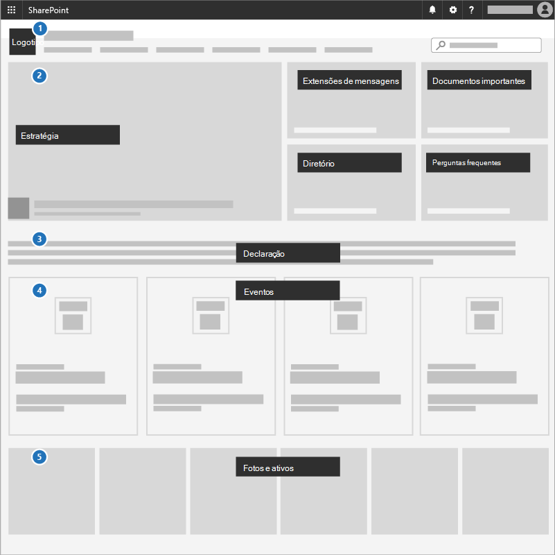
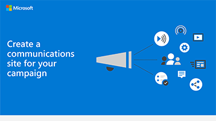

# Criar um site de comunicações para sua campanha

Uma ótima maneira de comunicar prioridades, compartilhar documentos de estratégia e realçar eventos futuros é usar um site de comunicações no SharePoint. Os sites de comunicação são para compartilhar coisas de forma ampla em toda a sua campanha; é seu site de campanha interna.

## Práticas recomendadas

Inclua os seguintes elementos no site de comunicações:

1. Adicionar o logotipo e as cores da campanha como uma imagem de cabeçalho e um tema
2. Comece com sua estratégia, mensagem, documentos importantes, um diretório e perguntas frequentes em uma **Web Part herói**.
3. Inclua uma instrução candidata para a equipe em uma **Web Part de texto**.
4. Adicionar eventos de campanha a uma **Web Part de eventos** para que todos possam ver o que está chegando.
5. Adicionar fotos que as pessoas podem usar ou compartilhar com uma **Web Part da Galeria de imagens**.

## Infográfico: criar um site de comunicação infográfico 
Os links a seguir para PowerPoint e PDF podem ser baixados e impressos no formato tablóide (também conhecido como razão, 11 x 17 ou a3).

[PDF](downloads/M365CampaignsCreateCommunicationSite.pdf)  |  [PowerPoint](downloads/M365CampaignsCreateCommunicationSite.pptx)

## Configuração

1. Entre no https://Office.com.
2. No canto superior esquerdo da página, selecione o ícone do inicializador de aplicativos e, em seguida, selecione o bloco do **SharePoint** . Se você não vir o bloco do **SharePoint** , clique no bloco **sites** ou **todos** se o SharePoint não estiver visível.
3. Na parte superior da home page do SharePoint, clique em **+ criar site** e escolha a opção **site de comunicação** .

Saiba tudo [sobre sites de comunicações](https://support.office.com/article/What-is-a-SharePoint-communication-site-94A33429-E580-45C3-A090-5512A8070732) e como [criar um site de comunicação no SharePoint Online](https://support.microsoft.com/en-us/office/create-a-communication-site-in-sharepoint-online-7fb44b20-a72f-4d2c-9173-fc8f59ba50eb).

## Configurações de administrador

Se você não vir o link **+ criar** site, a criação de site pessoal pode não estar disponível no Microsoft 365. Para criar um site de equipe, entre em contato com a pessoa que está administrando o Microsoft 365 em sua organização. Se você for um administrador do Microsoft 365, confira [gerenciar a criação de sites no SharePoint Online](https://docs.microsoft.com/sharepoint/manage-site-creation) para habilitar a criação de site pessoal para sua organização ou [gerenciar sites no novo centro de administração do SharePoint](https://docs.microsoft.com/sharepoint/manage-sites-in-new-admin-center) para criar um site do centro de administração do SharePoint Online.
  
