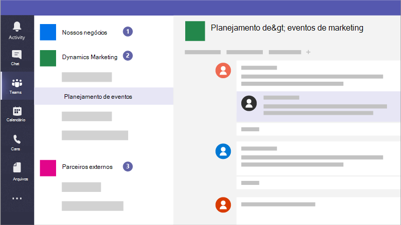

# Criar equipes para colaboração no Microsoft TeamsCreate teams for collaboration in Microsoft Teams

O Microsoft Teams é um aplicativo de colaboração que ajuda sua equipe a se manter organizada e ter conversas de qualquer dispositivo.Microsoft Teams is a collaboration app that helps your staff stay organized and have conversations, from any device. Você pode usar o Microsoft Teams para ter conversas instantâneas com membros da sua equipe ou convidados fora da sua organização.You can use Microsoft Teams to have instant conversations with members of your staff or guests outside your organization. Você também pode fazer chamadas telefônicas, reuniões de host e compartilhar arquivos.You can also make phone calls, host meetings, and share files.

## Práticas recomendadasBest practices

1. Crie equipes privadas para obter informações confidenciais.Create private teams for sensitive information.
1. Crie uma equipe de toda a organização para comunicação com todos em sua organização.Create an org-wide team for communication with everyone across your organization.
1. Crie equipes para projetos específicos e aplique a quantidade certa de proteção com base em quem deve ser incluído.Create teams for specific projects and apply the right amount of protection based on who should be included.
1. Crie equipes específicas para comunicação com parceiros externos para mantê-las separadas de qualquer coisa sensível para sua empresa.Create specific teams for communication with external partners to keep them separate from anything sensitive for your business.

Por exemplo, uma empresa, uma empresa legal ou uma prática de saúde poderia criar as seguintes equipes:For example, a business, legal firm, or healthcare practice could create the following teams:

1. **Uma equipe de negócios, de empresa ou de toda a prática:** Isso é para que todos usem as comunicações diárias e trabalhem em toda a sua empresa.**A business-, firm-, or practice-wide team:** This is for everyone to use for day to day communications and work across your business. Você pode usar essa equipe para postar comunicados ou compartilhar informações de interesse para toda a sua empresa ou prática.You can use this team to post announcements or share information of interest for your whole firm or practice.
1. **Equipes individuais:** Configurar equipes para grupos menores colaborarem sobre o trabalho do dia a dia.**Individual teams:** Set up teams for smaller groups to collaborate about their day to day work.
1. **Uma equipe ou equipe de comunicações externas:** Coordene com seus fornecedores, parceiros ou clientes sem permitir que eles insumentem nada.**An external communications team or teams:** Coordinate with your vendors, partners, or clients without allowing them into anything sensitive. Configurar canais diferentes para grupos específicos.Set up different channels for specific groups.

E as campanhas podem criar as seguintes equipes para se comunicar e colaborar com segurança:And campaigns could create the following teams to communicate and collaborate securely:

1. **Uma equipe líder de campanha:** Configurar isso como uma equipe privada para que apenas os membros principais da campanha possam acessá-lo e discutir preocupações potencialmente confidenciais.**A campaign Leads team:** Set this up as a private team so that only your key campaign members can access it and discuss potentially sensitive concerns.
2. **Uma equipe de campanha geral:** Isso é para que todos usem as comunicações diárias e o trabalho.**A general campaign team:** This is for everyone to use for day to day communications and work. Indivíduos, grupos ou comitês podem configurar canais nesta equipe para fazer seu trabalho.Individuals, groups, or committees can set up channels in this team to do their work. Por exemplo, as pessoas de planejamento de eventos podem configurar um canal para chat e coordenar a logística para eventos de campanha.For example, the event planning people can set up a channel to chat and coordinate logistics for campaign events.
3. **Uma equipe de parceiros:** Coordene com seus fornecedores, parceiros ou voluntários sem permitir que eles insumentem nada.**A partners team:** Coordinate with your vendors, partners, or volunteers without allowing them into anything sensitive.

Ao criar uma equipe, veja o que mais é criado:When you create a team, here's what else gets created:

- Um novo [grupo do Microsoft 365](/MicrosoftTeams/office-365-groups)A new [Microsoft 365 group](/MicrosoftTeams/office-365-groups)
- Um [site do SharePoint Online](/MicrosoftTeams/sharepoint-onedrive-interact) e uma biblioteca de documentos para armazenar arquivos de equipeA [SharePoint Online](/MicrosoftTeams/sharepoint-onedrive-interact) site and document library to store team files
- Uma [caixa de correio e](/MicrosoftTeams/exchange-teams-interact) calendário compartilhados do Exchange OnlineAn [Exchange Online](/MicrosoftTeams/exchange-teams-interact) shared mailbox and calendar
- Um bloco de anotações do OneNoteA OneNote notebook
- Vincula-se a outros aplicativos do Office 365, como o Planner e o Power BITies into other Office 365 apps such as Planner and Power BI

No Microsoft Teams, você pode encontrar:Inside Microsoft Teams, you can find:

1. **Teams:** Encontre canais que pertencem ou criem seus próprios.**Teams:** Find channels to belong to or create your own. Dentro dos canais, você pode realizar reuniões in-loco, ter conversas e compartilhar arquivos.Inside channels you can hold on-the-spot meetings, have conversations, and share files.
2. **Reuniões:** Veja tudo o que você tem alinhado para o dia ou semana.**Meetings:** See everything you've got lined up for the day or week. Ou agende uma reunião.Or, schedule a meeting. Esse calendário é sincronizado com o calendário do Outlook.This calendar syncs with your Outlook calendar.
3. **Chamadas:** Em alguns casos, se sua organização a tiver configurada, você poderá chamar qualquer pessoa do Microsoft Teams, mesmo que não esteja usando o Microsoft Teams.**Calls:** In some cases, if your organization has it set up, you can call anyone from Microsoft Teams, even if they're not using Microsoft Teams.
4. **Atividade:** Acompanhe todas as mensagens não lidas, @mentions, respostas e muito mais.**Activity:** Catch up on all your unread messages, @mentions, replies, and more.

Use a caixa de comando na parte superior para pesquisar itens ou pessoas específicos, realizar ações rápidas e iniciar aplicativos.Use the command box at the top to search for specific items or people, take quick actions, and launch apps.

## ConfiguraçãoSet it up

Crie uma equipe privada para apenas o proprietário e gerentes de negócios, ou o gerente de campanha e o candidato assim.Create a private team for just the business owner and managers, or campaign manager and candidate like this.

> [!VIDEO https://www.microsoft.com/videoplayer/embed/RWeqWA]

Crie uma equipe de toda a organização que todos na empresa ou campanha possam usar para se comunicar e compartilhar arquivos.Create an organization-wide team that everyone in the business or campaign can use to communicate and share files.

> [!VIDEO https://www.microsoft.com/videoplayer/embed/RE2GCG9]

Crie uma equipe que você compartilhe com convidados fora da sua organização, como para publicidade ou finanças.Create a team that you share with guests outside your organization, such as for advertising or finances.

> [!VIDEO https://www.microsoft.com/videoplayer/embed/RE1FQMp]

Saiba mais sobre o Microsoft Teams na [documentação técnica do Microsoft Teams](/microsoftteams/microsoft-teams)Learn more about Microsoft Teams at [Microsoft Teams technical documentation](/microsoftteams/microsoft-teams)

## Configurações do administradorAdmin settings

Você deve ser um administrador para criar uma equipe em toda a organização.You must be an admin to create an organization-wide team. Para obter mais informações, consulte [O que é um Administrador no Microsoft 365?](https://support.office.com/article/what-is-an-admin-e123627e-4892-4461-b9aa-1b6d57a5cfa4?ui=en-US&rs=en-US&ad=US).For more information, see [What is an Admin in Microsoft 365?](https://support.office.com/article/what-is-an-admin-e123627e-4892-4461-b9aa-1b6d57a5cfa4?ui=en-US&rs=en-US&ad=US).