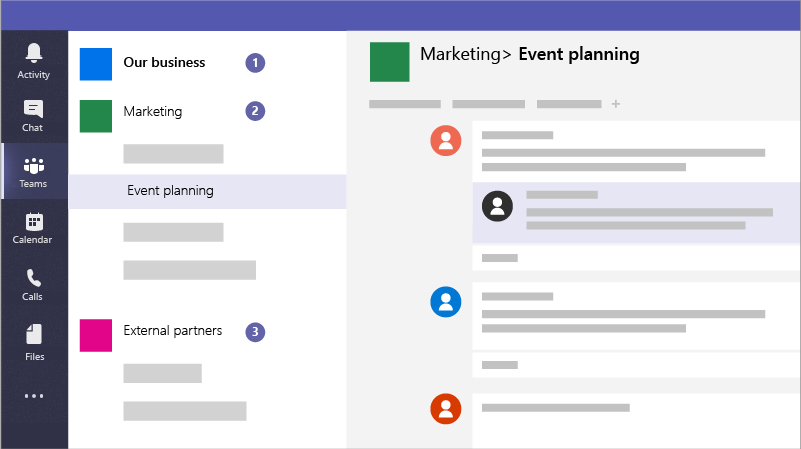

# Criar equipes para colaboração no Microsoft Teams

O Microsoft Teams é um aplicativo de colaboração que ajuda sua equipe a se manter organizada e ter conversas de qualquer dispositivo. Você pode usar o Microsoft Teams para ter conversas instantâneas com membros da sua equipe ou convidados fora da sua organização. Você também pode fazer chamadas telefônicas, reuniões de host e compartilhar arquivos.

## Práticas recomendadas

1. Crie equipes privadas para obter informações confidenciais.
1. Crie uma equipe de toda a organização para comunicação com todos em sua organização.
1. Crie equipes para projetos específicos e aplique a quantidade certa de proteção com base em quem deve ser incluído.
1. Crie equipes específicas para comunicação com parceiros externos para mantê-las separadas de qualquer coisa sensível para sua empresa.

Por exemplo, uma empresa, uma empresa legal ou uma prática de saúde poderia criar as seguintes equipes:

1. **Uma equipe de negócios, de empresa ou de toda a prática:** Isso é para que todos usem as comunicações diárias e trabalhem em toda a sua empresa. Você pode usar essa equipe para postar comunicados ou compartilhar informações de interesse para toda a sua empresa ou prática.
1. **Equipes individuais:** Configurar equipes para grupos menores colaborarem sobre o trabalho do dia a dia.
1. **Uma equipe ou equipe de comunicações externas:** Coordene com seus fornecedores, parceiros ou clientes sem permitir que eles insumentem nada. Configurar canais diferentes para grupos específicos.

E as campanhas podem criar as seguintes equipes para se comunicar e colaborar com segurança:

1. **Uma equipe líder de campanha:** Configurar isso como uma equipe privada para que apenas os membros principais da campanha possam acessá-lo e discutir preocupações potencialmente confidenciais.
2. **Uma equipe de campanha geral:** Isso é para que todos usem as comunicações diárias e o trabalho. Indivíduos, grupos ou comitês podem configurar canais nesta equipe para fazer seu trabalho. Por exemplo, as pessoas de planejamento de eventos podem configurar um canal para chat e coordenar a logística para eventos de campanha.
3. **Uma equipe de parceiros:** Coordene com seus fornecedores, parceiros ou voluntários sem permitir que eles insumentem nada.

Ao criar uma equipe, veja o que mais é criado:

- Um novo [grupo do Microsoft 365](/MicrosoftTeams/office-365-groups)
- Um [site do SharePoint Online](/MicrosoftTeams/sharepoint-onedrive-interact) e uma biblioteca de documentos para armazenar arquivos de equipe
- Uma [caixa de correio e](/MicrosoftTeams/exchange-teams-interact) calendário compartilhados do Exchange Online
- Um bloco de anotações do OneNote
- Vincula-se a outros aplicativos do Office 365, como o Planner e o Power BI

No Microsoft Teams, você pode encontrar:

1. **Teams:** Encontre canais que pertencem ou criem seus próprios. Dentro dos canais, você pode realizar reuniões in-loco, ter conversas e compartilhar arquivos.
2. **Reuniões:** Veja tudo o que você tem alinhado para o dia ou semana. Ou agende uma reunião. Esse calendário é sincronizado com o calendário do Outlook.
3. **Chamadas:** Em alguns casos, se sua organização a tiver configurada, você poderá chamar qualquer pessoa do Microsoft Teams, mesmo que não esteja usando o Microsoft Teams.
4. **Atividade:** Acompanhe todas as mensagens não lidas, @mentions, respostas e muito mais.

Use a caixa de comando na parte superior para pesquisar itens ou pessoas específicos, realizar ações rápidas e iniciar aplicativos.

## Configuração

Crie uma equipe privada para apenas o proprietário e gerentes de negócios, ou o gerente de campanha e o candidato assim.

> [!VIDEO https://www.microsoft.com/videoplayer/embed/RWeqWA]

Crie uma equipe de toda a organização que todos na empresa ou campanha possam usar para se comunicar e compartilhar arquivos.

> [!VIDEO https://www.microsoft.com/videoplayer/embed/RE2GCG9]

Crie uma equipe que você compartilhe com convidados fora da sua organização, como para publicidade ou finanças.

> [!VIDEO https://www.microsoft.com/videoplayer/embed/RE1FQMp]

Saiba mais sobre o Microsoft Teams na [documentação técnica do Microsoft Teams](/microsoftteams/microsoft-teams)

## Configurações do administrador

Você deve ser um administrador para criar uma equipe em toda a organização. Para obter mais informações, consulte [O que é um Administrador no Microsoft 365?](https://support.office.com/article/what-is-an-admin-e123627e-4892-4461-b9aa-1b6d57a5cfa4?ui=en-US&rs=en-US&ad=US).