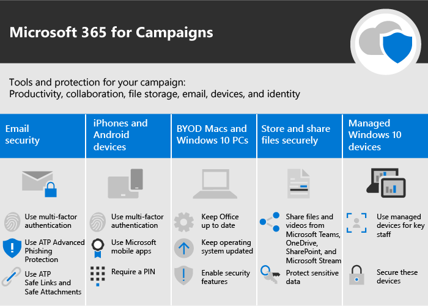

Microsoft 365 para campanhas
===========================

No nosso mundo atual, manter os dados e comunicações seguras é uma prioridade, especialmente para campanhas políticas, práticas médicas e legais e muitas outras empresas. O Microsoft 365 for Campaigns vem com um conjunto de recomendações projetadas para ajudar a proteger você e seus dados. Esta biblioteca inclui ajuda para configurar e usar esse ambiente recomendado, mesmo que você não seja uma campanha.

> [!VIDEO https://www.microsoft.com/videoplayer/embed/RE3clbH] 

**O que é o Microsoft 365 para campanhas?** É uma configuração segura recomendada que inclui o Microsoft 365 Business para que você possa:
- Confie em ferramentas de colaboração e produtividade corporativas confiáveis, como Outlook, Word, Excel e outros produtos do Office 
- Proteger seus arquivos de trabalho em todos os dispositivos iOS, Android e Windows 10 com segurança de nível empresarial que seja simples de gerenciar 
- Aplicar proteção extra para contas de usuário e identidade 

Enquanto campanhas de eleição federais nos Estados Unidos estão qualificadas para preços especiais para o Microsoft 365 Business, qualquer organização com esse plano pode aproveitar estas orientações para configurar maior segurança e aprender a colaborar com segurança.

Esta biblioteca inclui o seguinte:
- Diretrizes de configuração prescritiva para aumentar a segurança.
- Ajuda para que os usuários instalem dispositivos para acesso seguro.
- Orientações sobre como colaborar e compartilhar com segurança.

Para obter mais informações sobre o que está incluído, consulte [Microsoft 365 Business](https://www.microsoft.com/microsoft-365/business). 

Introdução
--------------------------

<ul class="panelContent cardsJ">
    <li>
        

            

                

                    

                        

                            
                        

                    

                    

                        
<b>Siga estas etapas para iniciar:</b>

                        
<a href="get-microsoft-365-campaigns.md">Obter campanhas da Microsoft 365</a>

                        
<a href="m365-campaigns-users.md">Saiba como seus usuários trabalharão com o Microsoft 365</a>

                        
<a href="microsoft-365-campaigns-setup-overview.md">Configurar campanhas do Microsoft 365</a>

                    

                

            

        

    </li>
</ul>

Soluções para sua campanha ou para pequenas empresas
--------------------------

Depois de configurar seu ambiente seguro da Microsoft 365, você pode usar as seguintes soluções para obter o funcionamento:

<ul class="panelContent cardsW cols cols2">
    <li>
        

            

                

                    

                        

                            
                        

                    

                    

                        <h3>Criar equipes para colaboração</h3>
                        
Crie um espaço para comunicação e colaboração com equipes específicas para o pessoal principal, todos os funcionários e parceiros ou fornecedores com o Microsoft Teams.

                        
<a href="create-teams-for-collaboration.md">Criar sua equipe</a>

                    

                

            

        

    </li>
    <li>
        

            

                

                    

                        

                            
                        

                    

                    

                        <h3>Configurar reuniões online</h3>
                        
Agendar uma reunião com áudio, vídeo e compartilhamento com o Microsoft Teams.

                        
<a href="set-up-meetings.md">Configurar uma reunião</a>

                    

                

            

        

    </li>
    <li>
        

            

                

                    

                        

                            
                        

                    

                    

                        <h3>Criptografar ou rotular seus emails confidenciais</h3>
                        
Use os rótulos de criptografia e sensibilidade para proteger emails que contêm informações confidenciais ou confidenciais.

                        
<a href="send-encrypted-email.md">Enviar email criptografado</a>

                    

                

            

        

    </li>
    <li>
        

            

                

                    

                        

                            
                        

                    

                    

                        <h3>Criar um site de comunicações</h3>
                        
Compartilhe eventos, mensagens, imagens e muito mais com sua equipe em um site de comunicações interno criado com o SharePoint.

                        
<a href="create-communications-site.md">Criar seu site</a>

                    

                

            

        

    </li>
    <li>
        

            

                

                    

                        

                            
                        

                    

                    

                        <h3>Compartilhar arquivos e vídeos</h3>
                        
Salve seus arquivos e vídeos na nuvem para que eles fiquem disponíveis para todas as pessoas adequadas.

                        
<a href="share-files-and-videos.md">Iniciar compartilhamento</a>

                    

                

            

        

    </li>
</ul>
