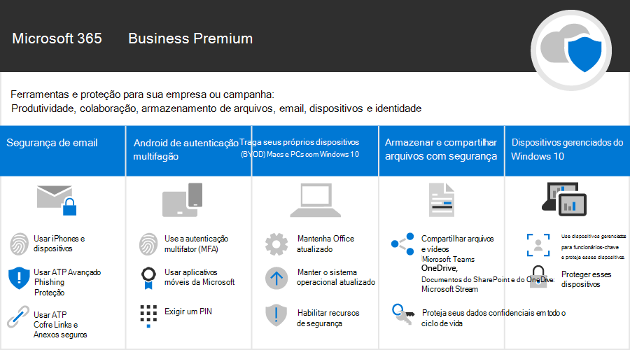

Microsoft 365 para campanhasMicrosoft 365 for Campaigns
===========================

No mundo de hoje, manter os dados e as comunicações seguras é uma prioridade, especialmente para campanhas políticas, práticas médicas e legais, e muitos outros assuntos.In our current world, keeping data and communications secure is a priority, particularly for political campaigns, medical and legal practices, and many other businesses. O Microsoft 365 para campanhas possui um conjunto de recomendações elaboradas para ajudar a proteger você e seus dados.Microsoft 365 for Campaigns comes with a set of recommendations designed to help protect you and your data. Esta biblioteca inclui ajuda para configurar e usar esse ambiente recomendado, mesmo que você não seja uma campanha.This library includes help for setting up and using this recommended environment, even if you're not a campaign.

> [!VIDEO https://www.microsoft.com/videoplayer/embed/RE3clbH]

O que é o Microsoft 365 para Campanhas?What is Microsoft 365 for Campaigns?
------------------------------------

É uma configuração segura, que inclui o Microsoft 365 Business Premium, para que você possa:It's a recommended secure configuration that includes Microsoft 365 Business Premium so that you can:

- Conte com as ferramentas de colaboração e produtividade corporativas confiáveis, como o Outlook, o Word, o Excel e outros produtos do Office.Rely on trusted business productivity and collaboration tools, such as Outlook, Word, Excel, and other Office products.
- Proteja seus arquivos de trabalho em todos os seus dispositivos iOS, Android e Windows 10 com segurança de nível empresarial que é fácil de gerenciar.Protect your work files on all of your iOS, Android, and Windows 10 devices with enterprise-grade security that is simple to manage.
- Aplique proteção extra a contas de usuário e identidade.Apply extra protection for user accounts and identity.

Embora as campanhas de eleição federais nos Estados Unidos possam obter um preço especial para o Microsoft 365 Business Premium, qualquer organização com esse plano pode aproveitar essas orientações para aumentar a segurança e aprender a colaborar com segurança.While federal election campaigns in the United States qualify for special pricing for Microsoft 365 Business Premium, any organization with this plan can take advantage of this guidance to configure increased security and learn how to collaborate securely.

Esta lista inclui o seguinte:This library includes the following:

- Guia de configuração prescritiva para aumentar a segurança.Prescriptive setup guidance for adding increased security.
- Ajuda para que os usuários configurem dispositivos para um acesso seguro.Help for users to setup devices for secure access.
- Diretrizes sobre como colaborar e compartilhar com segurança.Guidance on how to collaborate and share securely.

Para saber mais sobre o que está incluído, confira [Microsoft 365 Business Premium](https://www.microsoft.com/microsoft-365/business).For more information about what's included, see [Microsoft 365 Business Premium](https://www.microsoft.com/microsoft-365/business).

IntroduçãoGet started
--------------------------

Siga estas etapas para começar:Follow these steps to get started:

- [Obter campanhas do Microsoft 365Get Microsoft 365 campaigns](get-microsoft-365-campaigns.md)
- [Saiba como seus usuários podem trabalhar com o Microsoft 365Learn how your users will work with Microsoft 365](m365-campaigns-users.md)
- [Configurar campanhas do Microsoft 365Set up Microsoft 365 campaigns](microsoft-365-campaigns-setup-overview.md)

Soluções para sua campanha ou pequena empresaSolutions for your campaign or small business
--------------------------

Depois de configurar o ambiente seguro da Microsoft 365, você pode usar as seguintes soluções para trabalhar:After you set up your secure Microsoft 365 environment, you can use the following solutions to get working:

| Criar equipes de colaboraçãoCreate teams for collaboration | Configurar reuniões onlineSet up online meetings |
| ------------- | ------------- |
|  |  |
| Colabore com equipes de principais funcionários, de todos os funcionários e parceiros, ou de fornecedores.Collaborate with teams for key staff, all staff, and partners or vendors. [Criar uma equipeCreate your team](create-teams-for-collaboration.md) | Agende uma reunião com áudio, vídeo e compartilhamento com o Microsoft Teams.Schedule a meeting with audio, video, and sharing with Microsoft Teams. [Configurar uma reuniãoSet up a meeting](set-up-meetings.md) |

| Criptografe ou rotule emails confidenciaisEncrypt or label your sensitive email | Criar um site de comunicaçãoCreate a communications site |
| ------------- | ------------- |
|  |  |
| Use criptografia e rótulos de confidencialidade para proteger emails que contenham informações confidenciais.Use encryption and sensitivity labels to protect email that contains confidential or sensitive information. [Enviar email criptografadoSend encrypted email](send-encrypted-email.md) | Compartilhe eventos, mensagens, imagens e muito mais com a sua equipe em um site de comunicações internas criado com o SharePoint.Share events, message, images, and more with your team in an internal communications site created with SharePoint. [Criar seu siteCreate your site](create-communications-site.md) |

| Compartilhar arquivos e vídeosShare files and videos |
| ------------- |
|  |
| Salve seus arquivos e vídeos na nuvem para que eles fiquem disponíveis para todasSave your files and videos to the cloud so they're available to all   as pessoas adequadas.of the appropriate people. [Começar a compartilharStart sharing](share-files-and-videos.md) |

