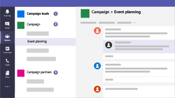

# Microsoft 365 para pequenas empresas e campanhas

Se você tem o Microsoft 365 Business Premium, a orientação nesta biblioteca é a maneira mais rápida de configurar a segurança e começar a colaborar com proteção. Em nosso mundo atual, manter dados e comunicações seguras é uma prioridade, especialmente para práticas médicas e jurídicas, campanhas políticas e muitas outras empresas menores. Esta solução fornece um conjunto de recomendações projetadas para ajudar a proteger você e seus dados. Esta biblioteca inclui ajuda para configurar e usar este ambiente recomendado, independentemente do seu tipo de negócio.

Essa configuração inclui as seguintes orientações para produtividade, colaboração, armazenamento de arquivos, email, dispositivos e identidade para proteger sua empresa:

| Proteção para | Descrição | Links |
| ----- | ----- | ----- | ----- |
|Email | Use a autenticação multifatorial e a Proteção Avançada contra Phishing ATP e Links e Anexos Seguros ATP, e use email criptografado para informações confidenciais.| [Configure a autenticação multifator](m365-campaigns-multifactor-authenication.md), [Proteja-se contra ataques de phishing](m365-campaigns-phishing-and-attacks.md), [Criptografe ou rotule seu email confidencial](send-encrypted-email.md) |
|iPhones e dispositivos Android |Use a autenticação multifator, configure aplicativos móveis da Microsoft e exija um PIN | [Configure a autenticação multifator](m365-campaigns-multifactor-authenication.md), [Configure os dispositivos móveis](../business/set-up-mobile-devices.md?toc=/microsoft-365/campaigns/toc.json)|
|Traga seus próprios dispositivos (BYOD) Macs e PCs com Windows 10 |Mantenha o Office atualizado, mantenha os sistemas operacionais atualizados e habilite os recursos de segurança. | [Proteja PCs e Macs com Windows 10 não gerenciados](m365-campaigns-protect-pcs-macs.md) |
|Armazenamento e compartilhamento de arquivos com segurança | Compartilhe arquivos e vídeos do Microsoft Teams, OneDrive, SharePoint e Microsoft Stream e proteja dados confidenciais.| [Compartilhe arquivos e vídeos](share-files-and-videos.md) |
|Dispositivos gerenciados do Windows 10 |Use dispositivos gerenciados para funcionários-chave e proteja esses dispositivos. | [Configure dispositivos gerenciados](../business/set-up-windows-devices.md?toc=/microsoft-365/campaigns/toc.json) |

## Uma configuração de segurança recomendada para Microsoft 365 Business Premium

Esta configuração segura recomendada para o Microsoft 365 Business Premium permite que você:

- Contar com as ferramentas de colaboração e produtividade corporativas confiáveis, como o Outlook, o Word, o Excel e outros produtos do Office.
- Proteger seus arquivos de trabalho em todos os seus dispositivos iOS, Android e Windows 10 com segurança de nível empresarial que é fácil de gerenciar.
- Aplicar proteção extra a contas de usuário e identidade.

> [!VIDEO https://www.microsoft.com/videoplayer/embed/RE3clbH]

Embora as campanhas eleitorais federais e algumas estaduais nos Estados Unidos se qualifiquem para [preços especiais](get-microsoft-365-campaigns.md) para a oferta do Microsoft 365 for Campaigns do Microsoft 365 Business Premium, qualquer organização com o plano Business Premium pode aproveitar esta orientação para configurar segurança e saiba como colaborar com segurança.

Esta lista inclui o seguinte:

- Guia de configuração prescritiva para aumentar a segurança.
- Ajuda para que os usuários configurem dispositivos para um acesso seguro.
- Diretrizes sobre como colaborar e compartilhar com segurança.

Para saber mais sobre o que está incluído, confira [Microsoft 365 Business Premium](https://www.microsoft.com/microsoft-365/business).

## Introdução

Siga estas etapas para começar:

- Para campanhas: [Obtenha campanhas do Microsoft 365](get-microsoft-365-campaigns.md)
- Para qualquer empresa: [Saiba como seus usuários trabalharão com o Microsoft 365](m365-campaigns-users.md)
- Para qualquer empresa: [Configure o Microsoft 365](microsoft-365-campaigns-setup-overview.md)

## Soluções para sua empresa

Depois de configurar o ambiente seguro da Microsoft 365, você pode usar as seguintes soluções para trabalhar:

| Criar equipes de colaboração | Configurar reuniões online |
| ------------- | ------------- |
|  |  |
| Colabore com equipes de principais funcionários, de todos os funcionários e parceiros, ou de fornecedores. [Criar uma equipe](create-teams-for-collaboration.md) | Agende uma reunião com áudio, vídeo e compartilhamento com o Microsoft Teams. [Configurar uma reunião](set-up-meetings.md) |

| Criptografe ou rotule emails confidenciais | Criar um site de comunicação |
| ------------- | ------------- |
|  |  |
| Use os rótulos de criptografia e sensibilidade para proteger emails que contenham informações confidenciais. [Enviar email criptografado](send-encrypted-email.md) | Compartilhe eventos, mensagens, imagens e muito mais com a sua equipe em um site de comunicações internas criado com o SharePoint. [Criar seu site](create-communications-site.md) |

| Compartilhar arquivos e vídeos |
| ------------- |
|  |
| Salve seus arquivos e vídeos na nuvem para que fiquem disponíveis  para todas as pessoas apropriadas. [Começar a compartilhar](share-files-and-videos.md) |
