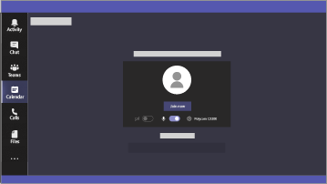
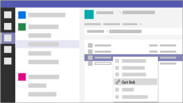

Microsoft 365 para campanhas
===========================

No mundo de hoje, manter os dados e as comunicações seguras é uma prioridade, especialmente para campanhas políticas, práticas médicas e legais, e muitos outros assuntos. O Microsoft 365 para campanhas possui um conjunto de recomendações elaboradas para ajudar a proteger você e seus dados. Esta biblioteca inclui ajuda para configurar e usar esse ambiente recomendado, mesmo que você não seja uma campanha.

> [!VIDEO https://www.microsoft.com/videoplayer/embed/RE3clbH] 

**O que é o Microsoft 365 para campanhas?** É uma configuração segura, que inclui o Microsoft 365 Business Premium, para que você possa:
- Contar com as ferramentas de colaboração e produtividade corporativas confiáveis, como Outlook, Word, Excel e outros produtos do Office 
- Proteger seus arquivos de trabalho em todos os seus dispositivos iOS, Android e Windows 10 com segurança de nível empresarial que é fácil de gerenciar 
- Aplicar proteção extra a contas de usuário e identidade 

Embora as campanhas de eleição federais nos Estados Unidos possam obter um preço especial para o Microsoft 365 Business Premium, qualquer organização com esse plano pode aproveitar essas orientações para aumentar a segurança e aprender a colaborar com segurança.

Esta lista inclui o seguinte:
- Guia de configuração prescritiva para aumentar a segurança.
- Ajuda para que os usuários configurem dispositivos para um acesso seguro.
- Diretrizes sobre como colaborar e compartilhar com segurança.

Para saber mais sobre o que está incluído, confira [Microsoft 365 Business Premium](https://www.microsoft.com/microsoft-365/business). 

Introdução
--------------------------

 **Siga estas etapas para iniciar:**  

- [Obtenha campanhas da Microsoft 365](get-microsoft-365-campaigns.md)
- [Saiba como seus usuários podem trabalhar com o Microsoft 365](m365-campaigns-users.md)
- [Configurar campanhas do Microsoft 365](microsoft-365-campaigns-setup-overview.md)

Soluções para sua campanha ou pequena empresa
--------------------------

Depois de configurar o ambiente seguro da Microsoft 365, você pode usar as seguintes soluções para trabalhar:

|               |               |
| ------------- | ------------- |
|  |  |
| **Crie equipes para colaboração** Torne um espaço para comunicação e colaboração com equipes específicas para funcionários importantes, todos os funcionários e parceiros ou fornecedores com o Microsoft Teams. [Crie uma equipe](create-teams-for-collaboration.md) | **Configurar reuniões online** Agendar uma reunião com áudio, vídeo e compartilhamento com o Microsoft Teams. [Configurar uma reunião](set-up-meetings.md) |
|  |  |
| **Criptografe ou rotule seus emails confidenciais** usar os rótulos de criptografia e confidencialidade para proteger emails que contenham informações confidenciais ou confidenciais. [Enviar email criptografado](send-encrypted-email.md) | **Crie um site de comunicações** Compartilhe eventos, mensagens, imagens e muito mais com a sua equipe em um site de comunicações interna criado com o Microsoft Office SharePoint Online. [Criar seu site](create-communications-site.md) |
|  | |
| **Compartilhar arquivos e vídeos** Salvar arquivos e vídeos na nuvem para que eles fiquem disponíveis para todas as pessoas adequadas. [Começar a compartilhar](share-files-and-videos.md) | |

