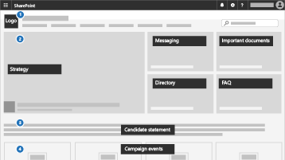

Microsoft 365 para empresas menores e campanhasMicrosoft 365 for smaller businesses and campaigns
===========================

Em nosso mundo atual, manter dados e comunicações seguras é uma prioridade, especialmente para práticas médicas e jurídicas, campanhas políticas e muitas outras empresas menores.In our current world, keeping data and communications secure is a priority, particularly for medical and legal practices, political campaigns, and many other smaller businesses. Esta solução fornece um conjunto de recomendações projetadas para ajudar a proteger você e seus dados.This solution provides a set of recommendations designed to help protect you and your data. Esta biblioteca inclui ajuda para configurar e usar este ambiente recomendado, independentemente do seu tipo de negócio.This library includes help for setting up and using this recommended environment, no matter your business type.

Essa configuração inclui as seguintes orientações para produtividade, colaboração, armazenamento de arquivos, email, dispositivos e identidade para proteger sua empresa:This configuration includes the following guidance for productivity, collaboration, file storage, email, devices, and identity to protect your business:

| Proteção paraProtection for | DescriçãoDescription | LinksLinks |
| ----- | ----- | ----- | ----- |
|EmailEmail | Use a autenticação multifatorial e a Proteção Avançada contra Phishing ATP e Links e Anexos Seguros ATP, e use email criptografado para informações confidenciais.Use multi-factor authentication, and ATP Advanced Phishing Protection, and ATP Safe Links and Safe Attachments, and use encrypted email for sensitive information.| [Configure a autenticação multifator](m365-campaigns-multifactor-authenication.md), [Proteja-se contra ataques de phishing](m365-campaigns-phishing-and-attacks.md), [Criptografe ou rotule seu email confidencial](send-encrypted-email.md)[Set up multi-factor authentication](m365-campaigns-multifactor-authenication.md), [Protect against phishing attacks](m365-campaigns-phishing-and-attacks.md), [Encrypt or label your sensitive email](send-encrypted-email.md) |
|iPhones e dispositivos AndroidiPhones and Android devices |Use a autenticação multifator, configure aplicativos móveis da Microsoft e exija um PINUse multi-factor authentication, and set up Microsoft mobile apps, and require a PIN | [Configure a autenticação multifator](m365-campaigns-multifactor-authenication.md), [Configure os dispositivos móveis](../business/set-up-mobile-devices.md?toc=/microsoft-365/campaigns/toc.json)[Set up multi-factor authentication](m365-campaigns-multifactor-authenication.md), [Set up mobile devices](../business/set-up-mobile-devices.md?toc=/microsoft-365/campaigns/toc.json)|
|Traga seus próprios dispositivos (BYOD) Macs e PCs com Windows 10Bring-your-own-devices (BYOD) Macs and Windows 10 PCs |Mantenha o Office atualizado, mantenha os sistemas operacionais atualizados e habilite os recursos de segurança.Keep Office up to date, keep operating systems updated, and enable security features. | [Proteja PCs e Macs com Windows 10 não gerenciadosProtect unmanaged Windows 10 PCs and Macs](m365-campaigns-protect-pcs-macs.md) |
|Armazenamento e compartilhamento de arquivos com segurançaStoring and sharing files securely | Compartilhe arquivos e vídeos do Microsoft Teams, OneDrive, SharePoint e Microsoft Stream e proteja dados confidenciais.Share files and videos from Microsoft Teams, OneDrive, SharePoint, and Microsoft Stream, and protect sensitive data.| [Compartilhe arquivos e vídeosShare files and videos](share-files-and-videos.md) |
|Dispositivos gerenciados do Windows 10Managed Windows 10 devices |Use dispositivos gerenciados para funcionários-chave e proteja esses dispositivos.Use managed devices for key staff and secure these devices. | [Configure dispositivos gerenciadosSet up managed devices](../business/set-up-windows-devices.md?toc=/microsoft-365/campaigns/toc.json) |

Uma configuração de segurança recomendada para Microsoft 365 Business PremiumA recommended security configuration for Microsoft 365 Business Premium
------------------------------------

Esta configuração segura recomendada para o Microsoft 365 Business Premium permite que você:This recommended secure configuration for Microsoft 365 Business Premium lets you:

- Contar com as ferramentas de colaboração e produtividade corporativas confiáveis, como o Outlook, o Word, o Excel e outros produtos do Office.Rely on trusted business productivity and collaboration tools, such as Outlook, Word, Excel, and other Office products.
- Proteger seus arquivos de trabalho em todos os seus dispositivos iOS, Android e Windows 10 com segurança de nível empresarial que é fácil de gerenciar.Protect your work files on all of your iOS, Android, and Windows 10 devices with enterprise-grade security that is simple to manage.
- Aplicar proteção extra a contas de usuário e identidade.Apply extra protection for user accounts and identity.

> [!VIDEO https://www.microsoft.com/videoplayer/embed/RE3clbH]

Embora as campanhas eleitorais federais e algumas estaduais nos Estados Unidos se qualifiquem para [preços especiais](get-microsoft-365-campaigns.md) para a oferta do Microsoft 365 for Campaigns do Microsoft 365 Business Premium, qualquer organização com o plano Business Premium pode aproveitar esta orientação para configurar segurança e saiba como colaborar com segurança.While federal and some state election campaigns in the United States qualify for [special pricing](get-microsoft-365-campaigns.md) for the Microsoft 365 for Campaigns offering of Microsoft 365 Business Premium, any organization with the Business Premium plan can take advantage of this guidance to configure increased security and learn how to collaborate securely.

Esta lista inclui o seguinte:This library includes the following:

- Guia de configuração prescritiva para aumentar a segurança.Prescriptive setup guidance for adding increased security.
- Ajuda para que os usuários configurem dispositivos para um acesso seguro.Help for users to setup devices for secure access.
- Diretrizes sobre como colaborar e compartilhar com segurança.Guidance on how to collaborate and share securely.

Para saber mais sobre o que está incluído, confira [Microsoft 365 Business Premium](https://www.microsoft.com/microsoft-365/business).For more information about what's included, see [Microsoft 365 Business Premium](https://www.microsoft.com/microsoft-365/business).

IntroduçãoGet started
--------------------------

Siga estas etapas para começar:Follow these steps to get started:

- Para campanhas: [Obtenha campanhas do Microsoft 365](get-microsoft-365-campaigns.md)For campaigns: [Get Microsoft 365 campaigns](get-microsoft-365-campaigns.md)
- Para qualquer empresa: [Saiba como seus usuários trabalharão com o Microsoft 365](m365-campaigns-users.md)For any business: [Learn how your users will work with Microsoft 365](m365-campaigns-users.md)
- Para qualquer empresa: [Configure o Microsoft 365](microsoft-365-campaigns-setup-overview.md)For any business: [Set up Microsoft 365](microsoft-365-campaigns-setup-overview.md)

Soluções para sua empresaSolutions for your business
--------------------------

Depois de configurar o ambiente seguro da Microsoft 365, você pode usar as seguintes soluções para trabalhar:After you set up your secure Microsoft 365 environment, you can use the following solutions to get working:

| Criar equipes de colaboraçãoCreate teams for collaboration | Configurar reuniões onlineSet up online meetings |
| ------------- | ------------- |
|  |  |
| Colabore com equipes de principais funcionários, de todos os funcionários e parceiros, ou de fornecedores.Collaborate with teams for key staff, all staff, and partners or vendors. [Criar uma equipeCreate your team](create-teams-for-collaboration.md) | Agende uma reunião com áudio, vídeo e compartilhamento com o Microsoft Teams.Schedule a meeting with audio, video, and sharing with Microsoft Teams. [Configurar uma reuniãoSet up a meeting](set-up-meetings.md) |

| Criptografe ou rotule emails confidenciaisEncrypt or label your sensitive email | Criar um site de comunicaçãoCreate a communications site |
| ------------- | ------------- |
|  |  |
| Use os rótulos de criptografia e sensibilidade para proteger emails que contenham informações confidenciais.Use encryption and sensitivity labels to protect email that contains confidential or sensitive information. [Enviar email criptografadoSend encrypted email](send-encrypted-email.md) | Compartilhe eventos, mensagens, imagens e muito mais com a sua equipe em um site de comunicações internas criado com o SharePoint.Share events, message, images, and more with your team in an internal communications site created with SharePoint. [Criar seu siteCreate your site](create-communications-site.md) |

| Compartilhar arquivos e vídeosShare files and videos |
| ------------- |
|  |
| Salve seus arquivos e vídeos na nuvem para que fiquem disponíveisSave your files and videos to the cloud so they're available  para todas as pessoas apropriadas.to all of the appropriate people. [Começar a compartilharStart sharing](share-files-and-videos.md) |
