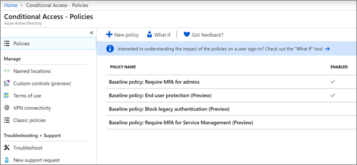

# Exigir autenticação multifator e configurar políticas de acesso condicionalRequire multi-factor authentication and set up conditional access policies

Você protege o acesso aos seus dados com a autenticação multifator e políticas de acesso condicional.You protect access to your data with multi-factor authentication and conditional access policies. Eles adicionam segurança adicional substancial.These add substantial additional security. A Microsoft fornece um conjunto de políticas de acesso condicional de linha de base que são recomendadas para todos os clientes.Microsoft provides a set of baseline conditional access policies that are recommended for all customers. As políticas de linha de base são um conjunto de políticas predefinidas que ajudam a proteger as organizações contra vários ataques comuns.Baseline policies are a set of predefined policies that help protect organizations against many common attacks. Esses ataques comuns podem incluir a irrigação de senha, a repetição e o phishing.These common attacks can include password spray, replay, and phishing.

Essas políticas exigem que administradores e usuários insiram uma segunda forma de autenticação (chamada de autenticação multifator, ou MFA) quando determinadas condições são atendidas.These policies require admins and users to enter a second form of authentication (called multi-factor authentication, or MFA) when certain conditions are met. Por exemplo, se um usuário em sua organização tentar entrar no Microsoft 365 de um país diferente ou de um dispositivo desconhecido, o logon poderá ser considerado arriscado.For example, if a user in your organization tries to sign in to Microsoft 365 from a different country or from an unknown device, the sign-in might be considered risky. O usuário deve fornecer uma forma extra de autenticação (como uma impressão digital ou um código) para provar sua identidade.The user must provide an extra form of authentication (such as a fingerprint or a code) to prove their identity. 

No momento, as políticas de linha de base incluem o seguinte:Currently, baseline policies include the following:
- Configurado no centro de administração do Microsoft 365:Set up in Microsoft 365 admin center:
    - **Exigir MFA para administradores** — requer autenticação multifator para as funções de administrador mais privilegiadas, incluindo administrador global.**Require MFA for admins** — Requires multi-factor authentication for the most privileged administrator roles, including global administrator.
    - **Proteção do usuário final** — requer autenticação multifator para usuários somente quando uma entrada é arriscada.**End user protection** — Requires multi-factor authentication for users only when a sign-in is risky. 
- Configurado no portal do Azure Active Directory:Set up in Azure Active Directory portal:
    - **Bloquear autenticação herdada** — aplicativos cliente mais antigos e alguns aplicativos novos não usam protocolos de autenticação mais recentes, mais seguros.**Block legacy authentication** — Older client apps and some new apps don't use newer, more secure, authentication protocols. Esses aplicativos antigos podem ignorar as políticas de acesso condicional e obter acesso não autorizado ao seu ambiente.These older apps can bypass conditional access policies and gain unauthorized access to your environment. Esta política bloqueia o acesso de clientes que não dão suporte ao acesso condicional.This policy blocks access from clients that don't support conditional access. 
    - **Requer MFA para gerenciamento de serviços** — requer a autenticação multifator para acessar ferramentas de gerenciamento, incluindo o portal do Azure (onde você configura as políticas de linha de base).**Require MFA for Service Management** — Requires multi-factor authentication for access to management tools, including Azure portal (where you configure baseline policies). 

A Microsoft recomenda que você habilite todas essas políticas de linha de base.Microsoft recommends you enable all of these baseline policies. Após a habilitação dessas políticas, os administradores e os usuários serão solicitados a registrar a autenticação multifator do Azure.After these policies are enabled, admins and users will be prompted to register for Azure Multi-Factor authentication.

Para obter mais informações sobre essas políticas, consulte [o que são políticas de linha de base](https://docs.microsoft.com/azure/active-directory/conditional-access/concept-baseline-protection)?For more information about these policies, see [What are baseline policies](https://docs.microsoft.com/azure/active-directory/conditional-access/concept-baseline-protection)?

## Exigir MFARequire MFA

Para exigir que todos os usuários entrem com uma segunda forma de ID:To require that all users sign in with a second form of ID:

1. Vá para o centro de administração <a href="https://go.microsoft.com/fwlink/p/?linkid=837890" target="_blank">https://admin.microsoft.com</a> em e escolha **configuração**.Go to the admin center at <a href="https://go.microsoft.com/fwlink/p/?linkid=837890" target="_blank">https://admin.microsoft.com</a> and choose **Setup**.

2. Na página configuração, escolha **Exibir** no cartão de **entrada tornar login** .On the Setup page, choose **View** in the **Make sign-in more secure** card.

    
3. Na página tornar o login mais seguro, escolha **introdução**.On the Make sign-in more secure page, choose **Get started**.
 
4. No painel de segurança reforçar a entrada, marque as caixas de seleção ao lado de **exigir autenticação multifator para administradores** e **exigir que os usuários se registrem para a autenticação multifator e bloquear o acesso se o risco for detectado**.On the Strengthen sign-in security pane, check the check boxes next to **Require multi-factor authentication for admins** and **Require users to register for multi-factor authentication and block access if risk is detected**.
    Certifique-se de excluir a conta de administrador de [emergência](m365-campaigns-protect-admin-accounts.md#create-an-emergency-admin-account) ou de "quebra-vidro" do requisito da MFA na caixa **localizar usuários** .Be sure to exclude the [emergency](m365-campaigns-protect-admin-accounts.md#create-an-emergency-admin-account) or "break-glass" admin account from the MFA requirement in the **Find users** box.
    
    

5. Escolha **criar política** na parte inferior da página.Choose **Create policy** on the bottom of the page.

## Configurar políticas de linha de baseSet up baseline policies

1. Vá para [portal do Azure](https://portal.azure.com)e navegue até **acesso condicional** **do Azure Active Directory** \> .Go to [Azure portal](https://portal.azure.com), and then navigate to **Azure Active Directory** \> **Conditional Access**.
    
    As políticas de linha de base estão listadas na página e você pode ver que exigir MFA para administradores e proteção do usuário final já está habilitada após a conclusão das etapas em [exigir MFA](#require-mfa).The baseline policies are listed on the page, and you can see that Require MFA for admins and End user protection are already enabled after you completed the steps in [require MFA](#require-mfa).

    
2. Consulte as seguintes instruções específicas para cada política:See the following specific instructions for each policy:

    - [Exigir MFA para administradoresRequire MFA for admins](https://docs.microsoft.com/en-us/azure/active-directory/conditional-access/howto-baseline-protect-administrators)

       
    -   [Exigir MFA para usuáriosRequire MFA for users](https://docs.microsoft.com/en-us/azure/active-directory/conditional-access/howto-baseline-protect-end-users)  
    - [Bloquear autenticação herdadaBlock legacy authentication](https://docs.microsoft.com/en-us/azure/active-directory/conditional-access/howto-baseline-protect-legacy-auth)
    - [Exigir MFA para gerenciamento de serviçosRequire MFA for service management](https://docs.microsoft.com/azure/active-directory/conditional-access/howto-baseline-protect-azure)

Você pode configurar políticas adicionais, como exigir aplicativos cliente aprovados.You can set up extra policies, such as requiring approved client apps. Consulte a [documentação de acesso condicional](https://docs.microsoft.com/azure/active-directory/conditional-access/) para obter mais informações.See the [Conditional Access Documentation](https://docs.microsoft.com/azure/active-directory/conditional-access/) for more information.
