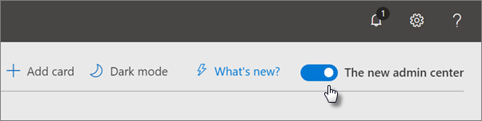
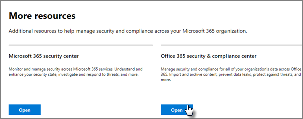
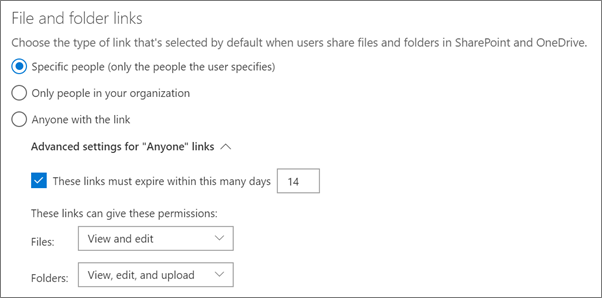
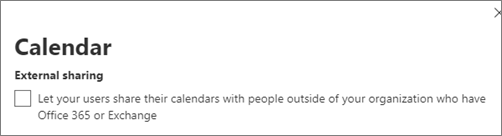

# Aumentar proteção contra ameaças

Este artigo ajuda você a aumentar a proteção em sua assinatura do Microsoft 365 para proteção contra phishing, malware e outras ameaças. Essas recomendações são apropriadas para organizações com uma maior necessidade de segurança, como campanhas políticas, escritórios de advocacia e clínicas de assistência médica. 

Antes de começar, verifique sua pontuação segura do Office 365. A pontuação segura do Office 365 analisa a segurança da sua organização do Office 365 com base em suas atividades regulares e configurações de segurança e atribui uma pontuação. Comece anotando sua pontuação atual. A realização das ações recomendadas neste artigo aumenta sua pontuação. O objetivo não é atingir a pontuação máxima, mas para estar ciente das oportunidades de proteger seu ambiente que não afete negativamente a produtividade dos seus usuários. 

Para obter mais informações, consulte [Microsoft Secure Score](https://docs.microsoft.com/office365/securitycompliance/microsoft-secure-score).

## Aumentar o nível de proteção contra malware no email

O ambiente do Office 365 ou do Microsoft 365 inclui proteção contra malware, mas você pode aumentar essa proteção, bloqueando anexos com tipos de arquivo comumente usados para malware. Para aumentar a proteção contra malware no email:
  
1. Acesse [https://protection.office.com](https://protection.office.com) e entre com suas credenciais de conta de administrador. 
    
2. No centro de conformidade com &amp; segurança do Office 365, no painel de navegação esquerdo, em **Gerenciamento de ameaças**, escolha **política** \> **anti-malware**.
    
3. Clique duas vezes na política padrão para editar a política em toda a empresa.
    
4. Clique em **configurações**.
    
5. Em **filtro tipos de anexo comuns**, selecione **ativado**. Os tipos de arquivo bloqueados são listados na janela diretamente abaixo desse controle.  Certifique-se de adicionar estes tipos de filetype:
   - Ade, ADP, Ani, Bas, bat, CHM, cmd, com, CPL, CRT, HLP, HT, HTA, inf, ins, ISP, Job, js, jse, lnk, o mdb, o MDE, o registro, o MSC, o (a) msp, o. exe, o, o, o VB, vbe, vbs,    Você pode adicionar ou excluir tipos de arquivo posteriormente, se necessário.
    
6. Clique em **Salvar.**
    
Para obter mais informações, consulte [proteção Antimalware](https://go.microsoft.com/fwlink/?linkid=2015692&amp;clcid=0x409).
  

## Proteger contra ransomware

O ransomware restringe o acesso aos dados criptografando arquivos ou bloqueando telas de computador. Em seguida, tenta extort dinheiro de vítimas solicitando "resgate", geralmente na forma de cryptocurrencies como Bitcoin, no Exchange para acessar os dados. 
  
Você pode se proteger contra o ransomware criando uma ou mais regras de fluxo de email para bloquear extensões de arquivo comumente usadas para ransomware (elas foram adicionadas na etapa [aumentar o nível de proteção contra malware no email](#raise-the-level-of-protection-against-malware-in-mail) ) ou para avisar os usuários que recebem esses anexos por email.

Além dos arquivos que você bloqueou na etapa anterior, também é recomendável criar uma regra para avisar os usuários antes de abrir os anexos de arquivo do Office que incluem macros. O ransomware pode ser oculto dentro de macros, portanto, avisar os usuários para não abrir esses arquivos de pessoas que não conhecem.

Para criar uma regra de transporte de emails:
  
1. Vá para o centro de administração <a href="https://go.microsoft.com/fwlink/p/?linkid=837890" target="_blank">https://admin.microsoft.com</a> em e escolha central de **Administração** \> do **Exchange**.
    
2. Na categoria **fluxo de emails** , clique em **regras**.
    
3. Clique **+** em e em **criar uma nova regra**.
    
4. Clique em **mais opções** na parte inferior da caixa de diálogo para ver o conjunto completo de opções. 
    
5. Aplicar as configurações da tabela a seguir para a regra. Deixe o restante das configurações no padrão, a menos que você queira alterá-las.
    
6. Clique em **Salvar**.
    
|**Configuração**|**Avisar os usuários antes de abrir anexos de arquivos do Office**||
|:-----|:-----|:-----|
|Nome    |Regra anti-ransomware: avisar os usuários     |
|Aplicar esta regra se. . .    |Qualquer anexo. . . correspondências de extensão de arquivo. . .    |
|Especificar palavras ou frases    |Adicione estes tipos de arquivos:    dotm, docm, xlsm, sltm, xla, xlam, XLL, pptm, potm, ppam, ppsm, sldm   |
|Faça o seguinte. . .    |Notificar o destinatário com uma mensagem    |
|Fornecer texto da mensagem    |Não abra esses tipos de arquivos de pessoas que você não sabe porque eles podem conter macros com código mal-intencionado.    |
   
Para saber mais, confira:
  
- [Como lidar com o ransomware](https://go.microsoft.com/fwlink/?linkid=2016501&amp;clcid=0x409)
    
- [Restaurar o OneDrive](https://support.office.com/article/fa231298-759d-41cf-bcd0-25ac53eb8a15.aspx)
    

## Parar o encaminhamento automático para email

Hackers que obtêm acesso à caixa de correio de um usuário podem roubar seus emails Configurando a caixa de correio para encaminhar emails automaticamente. Isso pode acontecer mesmo sem a conscientização do usuário. Você pode evitar que isso aconteça Configurando uma regra de fluxo de emails. 
  
Para criar uma regra de transporte de email, Assista [a este vídeo curto](https://support.office.com/article/f9d693ba-5c78-47c0-b156-8e461e062aa7) ou siga estas etapas:
  
1. No centro de administração do Microsoft 365, clique em **centrais** \> de administração do **Exchange**.
    
2. Na categoria **fluxo de emails** , clique em **regras**.
    
3. Clique **+** em e em **criar uma nova regra**.
    
4. Clique em **mais opções** na parte inferior da caixa de diálogo para ver o conjunto completo de opções. 
    
5. Aplicar as configurações na tabela a seguir. Deixe o restante das configurações no padrão, a menos que você queira alterá-las.
    
6. Clique em **Salvar**.
    
|**Configuração**|**Avisar os usuários antes de abrir anexos de arquivos do Office**|
|:-----|:-----|
|Nome    |Impedir o encaminhamento automático de emails para domínios externos    |
|Aplicar esta regra se...    |O remetente. . . é externo/interno. . . Dentro da organização    |
|Adicionar condição    |As propriedades da mensagem. . . inclua o tipo de mensagem. . . Avanço automático    |
|Faça o seguinte...    |Bloquear a mensagem. . . rejeitar a mensagem e incluir uma explicação.    |
|Fornecer texto da mensagem    |O encaminhamento automático de emails fora dessa organização é impedido por motivos de segurança.    |

## Proteger seu email contra ataques de phishing

Se você configurou um ou mais domínios personalizados para o seu ambiente do Office 365 ou do Microsoft 365, é possível configurar a proteção antiphishing dirigida. A proteção antiphishing da ATP, parte da proteção avançada contra ameaças do Office 365, pode ajudar a proteger sua organização contra ataques de phishing baseados em representação mal-intencionada e outros ataques de phishing. Se você não configurou um domínio personalizado, não é necessário fazer isso.
  
Recomendamos que você comece a usar essa proteção criando uma política para proteger seus usuários mais importantes e seu domínio personalizado. 

Para criar uma política anti-phishing do ATP, Assista a [este vídeo de treinamento curto](https://support.office.com/article/86c425e1-1686-430a-9151-f7176cce4f2c)ou conclua as seguintes etapas:
  
1. Acesse [https://protection.office.com](https://protection.office.com). 
    
2. No centro de conformidade com &amp; segurança do Office 365, no painel de navegação esquerdo, em **Gerenciamento de ameaças**, escolha **política**.
    
3. Na página **política** , escolha o **anti-phishing ATP**.
    
4. Na página **anti-phishing** , selecione **+ criar**. Um assistente é iniciado que orienta você na definição da política anti-phishing.
    
5. Especifique o nome, a descrição e as configurações da política, conforme recomendado na tabela abaixo. Para obter mais informações, consulte [saiba mais sobre opções de política de anti-phishing do ATP](https://docs.microsoft.com/microsoft-365/security/office-365-security/set-up-anti-phishing-policies). 
    
6. Após revisar as configurações, escolha **criar esta política** ou **salvar**, conforme apropriado.
    

|**Configuração ou opção** |**Configuração recomendada**  |
|:-----|:-----|
|Nome    |O domínio e a equipe de campanha mais valiosa    |
|Descrição    |Garantir que a equipe mais importante e nosso domínio não estão sendo representados.    |
|Adicionar usuários para proteger    |Selecione **+ Adicionar uma condição, o destinatário é**. Digite nomes de usuário ou insira o endereço de email do candidato, o gerente de campanha e outros membros importantes da equipe. Você pode adicionar até 20 endereços internos e externos que você deseja proteger da representação.    |
|Adicionar domínios para proteger    |Selecione **+ Adicionar uma condição, o domínio do destinatário é**. Insira o domínio personalizado associado à sua assinatura do Microsoft 365, se você tiver definido um. Você pode inserir mais de um domínio.    |
|Escolher ações    |Se o email for enviado por um usuário representado: escolha **redirecionar mensagem para outro endereço de email**e digite o endereço de email do administrador de segurança; por exemplo, *AnaMaria @contoso. com*.          Se o email for enviado por um domínio representado: escolher **mensagem de quarentena**.    |
|Inteligência de caixa de correio    |Por padrão, a inteligência de caixa de correio é selecionada quando você cria uma nova política anti-phishing. Deixe esta configuração **em** para obter os melhores resultados.    |
|Adicionar domínios e remetentes confiáveis    |Aqui você pode adicionar seu próprio domínio ou qualquer outro domínio confiável.    |
|Aplicado a    |Selecione **o domínio do destinatário**. Em **qualquer um dos seguintes**, selecione **escolher**. Selecione **+ Adicionar**. Marque a caixa de seleção ao lado do nome do domínio, por exemplo, *contoso. com *, na lista e selecione **Adicionar**. Selecione **concluído**.    |
   
Para obter mais informações, consulte [set up Office 365 ATP anti-phishing Policies](https://docs.microsoft.com/microsoft-365/security/office-365-security/set-up-anti-phishing-policies).
  
## Proteção contra anexos mal-intencionados, arquivos e links com a proteção avançada contra ameaças (ATP)

Primeiro, verifique se a nova visualização do centro de <a href="https://go.microsoft.com/fwlink/p/?linkid=837890" target="_blank">https://admin.microsoft.com</a> administração está ativada no centro de administração. Ative a alternância ao lado do texto **o novo centro de administração**.

   

Se você ainda não vir a página de **instalação** com cartões no seu locatário, consulte como concluir essas etapas no centro de conformidade &amp; de segurança do Office 365. Confira [set up ATP Safe Attachments no centro de conformidade de & de segurança](#set-up-atp-safe-attachments-in-the-security--compliance-center) e [Configurar links de ATP seguros no centro de conformidade de & de segurança](#set-up-atp-safe-links-in-the-security--compliance-center).

1.  No painel de navegação esquerdo, escolha **configuração**.
2. Na página **configuração** , escolha **Exibir** no cartão **aumentar a proteção contra ameaças avançadas** .  
     

3. Na página **aumentar a proteção contra ameaças avançadas** , escolha **introdução**.
4. No painel que é aberto, marque as caixas de seleção ao lado de **links e anexos em email**, **examinar arquivos no SharePoint, no onedrive e no Microsoft Teams**e **examinar links no Office Desktop e aplicativos do Office Online** em **itens de varredura de conteúdo mal-intencionado**.

      - Em **links e anexos em email**, digite todos os usuários ou os usuários específicos cujo email você deseja verificar.

    
5. Escolha **criar políticas** para ativar os anexos seguros ATP e links seguros de ATP.

### Configurar anexos seguros de ATP no centro de conformidade de & de segurança

Pessoas costumam enviar, receber e compartilhar anexos, como documentos, apresentações, planilhas e muito mais. Nem sempre é fácil dizer se um anexo é seguro ou mal-intencionado apenas olhando uma mensagem de email. O Office 365 proteção avançada contra ameaças inclui proteção de anexo seguro de ATP, mas essa proteção não é ativada por padrão. Recomendamos que você crie uma nova regra para começar a usar essa proteção. Esta proteção estende-se aos arquivos no SharePoint, no OneDrive e no Microsoft Teams.
  
Para criar uma política de anexo seguro ATP, Assista a [este breve vídeo](https://support.office.com/article/e7e68934-23dc-4b9c-b714-e82e27a8f8a5)ou conclua as seguintes etapas:
  
1. Acesse [https://protection.office.com](https://protection.office.com) e entre com sua conta de administrador. 
    
2. No centro de conformidade com &amp; segurança do Office 365, no painel de navegação esquerdo, em **Gerenciamento de ameaças**, escolha **política**.
    
3. Na página política, escolha **anexos seguros de ATP**.
    
4. Na página de anexos seguros, aplique essa proteção amplamente marcando a caixa de seleção **ativar a ATP para SharePoint, onedrive e Microsoft Teams** . 
    
5. Selecione **+** para criar uma nova política. 
    
6. Aplicar as configurações na tabela a seguir. 
    
7. Depois de revisar as configurações, escolha **criar esta política** ou **salvar**, conforme apropriado.
    

|**Configuração ou opção**|**Configuração recomendada**  |
|:-----|:-----|
|Nome    |Bloquear emails atuais e futuros com malware detectado.    |
|Descrição    |Bloquear emails e anexos atuais e futuros com malware detectado.    |
|Salvar anexos resposta desconhecida de malware    |Selecione **Bloquear – bloquear emails e anexos atuais e futuros com malware detectado**.    |
|Redirecionar o anexo na detecção    |Habilitar o redirecionamento (Selecione esta caixa) Insira a conta de administrador ou uma configuração de caixa de correio para quarentena.          Aplica a seleção acima se a verificação de malware por anexos expira ou quando ocorre um erro (Selecione esta caixa).    |
|Aplicado a    |O domínio do destinatário é. . . Selecione seu domínio.    |
   
Para obter mais informações, consulte [set up Office 365 ATP anti-phishing Policies](https://docs.microsoft.com/microsoft-365/security/office-365-security/set-up-anti-phishing-policies).
  
### Configurar links de ATP seguros no centro de conformidade e segurança &

Os hackers às vezes ocultam sites mal-intencionados em links em email ou outros arquivos. Os links seguros de ATP do Office 365 (links seguros de ATP), parte da proteção avançada contra ameaças do Office 365, podem ajudar a proteger sua organização fornecendo a verificação de tempo de clique de endereços Web (URLs) em mensagens de email e documentos do Office. A proteção é definida por meio das políticas de links seguros de ATP.
  
Recomendamos que você faça o seguinte:
  
- Modificar a política padrão para aumentar a proteção.
    
- Adicione uma nova política direcionada a todos os destinatários em seu domínio.
    
Para configurar links de ATP seguros, Assista a [este vídeo de treinamento curto](https://support.office.com/article/61492713-53c2-47da-a6e7-fa97479e97fa)ou conclua as seguintes etapas:
  
1. Acesse [https://protection.office.com](https://protection.office.com) e entre com sua conta de administrador. 
    
2. No centro de conformidade com &amp; segurança do Office 365, no painel de navegação esquerdo, em **Gerenciamento de ameaças**, escolha **política**.
    
3. Na página política, escolha **links seguros de ATP**.
    
Para modificar a política padrão:
  
1. Na página de links seguros, em **políticas que se aplicam a toda a organização**, selecione a política **padrão** . 
    
2. Em **configurações que se aplicam ao conteúdo exceto email**, selecione **Office 365 ProPlus, Office para IOS e Android**.
    
3. Clique em **Salvar**. 
    
Para criar uma nova política direcionada para todos os destinatários em seu domínio:
  
1. Na página de links seguros, em **políticas que se aplicam a toda a organização**, clique **+** em para criar uma nova política. 
    
2. Aplicar as configurações listadas na tabela a seguir.
    
3. Clique em **Salvar**. 

|**Configuração ou opção**|**Configuração recomendada**  |
|:-----|:-----|
|Nome    |Política de links seguros para todos os destinatários no domínio    |
|Selecione a ação para URLs possivelmente mal-intencionadas desconhecidas em mensagens    |Selecione as **URLs que serão reconfiguradas e verificadas em relação a uma lista de links mal-intencionados conhecidos quando o usuário clicar no link**.    |
|Usar anexos seguros para examinar Conteúdo baixável    |Selecione essa caixa.    |
|Aplicado a    |O domínio do destinatário é. . . Selecione seu domínio.    |
   
Para obter mais informações, consulte [Office 365 ATP Safe links](https://go.microsoft.com/fwlink/?linkid=2016138&amp;clcid=0x409).
  
## Ativar o log de auditoria unificada

Depois de ativar a pesquisa de log de auditoria no centro &amp; de conformidade de segurança, você pode manter o administrador e outras atividades do usuário no log e pesquisá-lo. 

Você deve receber a função de logs de auditoria no Exchange Online para ativar ou desativar a pesquisa de log de auditoria em sua assinatura do Microsoft 365 Business. Por padrão, essa função é atribuída aos grupos de função gerenciamento de conformidade e gerenciamento da organização na página permissões no centro de administração do Exchange. Os administradores globais no Microsoft 365 são membros desse grupo por padrão.

1. Para ativar a pesquisa de log de auditoria, vá para o centro de administração <a href="https://go.microsoft.com/fwlink/p/?linkid=837890" target="_blank">https://admin.microsoft.com</a> em e, em seguida, escolha **conformidade** em **centros de administração** no painel de navegação esquerdo. 
2. Na página de **conformidade do Microsoft 365** , escolha **mais recursos**e, em seguida, **abra** no cartão centro de ** &amp; segurança do Office 365** .

    
3. Na página segurança e conformidade, escolha **Pesquisar** e, em seguida, **pesquisa log de auditoria**.
1. Na parte superior da página **pesquisa de log de auditoria** , escolha **ativar a auditoria**.

Após o recurso ser ativado, você pode pesquisar arquivos, pastas e muitas atividades. Para obter mais informações, consulte [Search the Audit Log](https://docs.microsoft.com/office365/securitycompliance/search-the-audit-log-in-security-and-compliance).

## Ajustar configurações de compartilhamento anônimo para arquivos e pastas do SharePoint e do OneDrive

(altere o padrão de validade do link anônimo para 14 dias, altere o tipo de compartilhamento padrão para "pessoas específicas") Para alterar as configurações de compartilhamento do OneDrive e do SharePoint:
1. Vá para o centro de administração <a href="https://go.microsoft.com/fwlink/p/?linkid=837890" target="_blank">https://admin.microsoft.com</a> em e escolha **SharePoint** em **centros de administração** no painel de navegação esquerdo. 
2. No centro de administração do SharePoint, vá para **compartilhamento**de **políticas** \> .
3. Na página **compartilhamento** , em **links de arquivo e pasta**, selecione **pessoas específicas**e, em **Configurações avançadas para links "qualquer pessoa"**, selecione **estes links devem expirar dentro de vários dias**e digite 14 (ou outro número de dias em que você deseja restringir o tempo de vida do link).

    

## Alertas de atividade

Você pode usar os alertas de atividade para rastrear as atividades de administrador e de usuário e detectar incidentes de prevenção contra perda de dados e malware em sua organização. Sua assinatura inclui um conjunto de políticas padrão, mas você também pode criar itens personalizados. Para obter mais informações, consulte [políticas de alerta](https://docs.microsoft.com/office365/securitycompliance/alert-policies). Por exemplo, se você armazenar um arquivo importante no SharePoint que você não deseja que todos compartilhem externamente, você pode criar uma notificação que o alertará se alguém o compartilhar.

A figura a seguir mostra as políticas padrão incluídas no Microsoft 365 Business.   
    

## Desabilitar ou gerenciar o compartilhamento de calendário

Você pode impedir que as pessoas em sua organização compartilhem seus calendários ou também pode gerenciar o que eles podem compartilhar. Por exemplo, você pode restringir o compartilhamento somente para horários disponíveis/ocupados.

1. Vá para o centro de administração <a href="https://go.microsoft.com/fwlink/p/?linkid=837890" target="_blank">https://admin.microsoft.com</a> em e escolha **configurações** \> de **Serviços & suplementos**.
2. Na página **serviços & suplementos** , escolha **calendário**e escolha se as pessoas em sua organização podem compartilhar seus calendários com pessoas de fora que tenham o Office 365 ou Exchange, ou com qualquer pessoa. 
    Se você escolher a opção compartilhar com qualquer pessoa, você pode decidir também compartilhar apenas informações de disponibilidade.

3. Escolha **salvar alterações** na parte inferior da página.

    A figura a seguir mostra o compartilhamento de calendários não permitido.   
    

    A figura a seguir mostra as configurações quando o compartilhamento de calendário é permitido com um link de email com apenas informações de disponibilidade.

   

Se os usuários tiverem permissão para compartilhar seus calendários, confira [estas instruções](https://support.office.com/article/7ecef8ae-139c-40d9-bae2-a23977ee58d5) sobre como compartilhar do Outlook na Web.
